# 卖片的“福利姬”，竟然盯上了“皮卡丘”？！

> 原文：[`mp.weixin.qq.com/s?__biz=MzIyMDYwMTk0Mw==&mid=2247543187&idx=1&sn=5a5e07d01554b2b358e635c3ade97ccc&chksm=97cbe2aba0bc6bbda6b26381ae7da404ab73b0af3ba87d85aeeb122f424ae18941dd839f444d&scene=27#wechat_redirect`](http://mp.weixin.qq.com/s?__biz=MzIyMDYwMTk0Mw==&mid=2247543187&idx=1&sn=5a5e07d01554b2b358e635c3ade97ccc&chksm=97cbe2aba0bc6bbda6b26381ae7da404ab73b0af3ba87d85aeeb122f424ae18941dd839f444d&scene=27#wechat_redirect)

要不都说，

**“卖片儿的都比你勤奋，你还有什么借口不努力”**

**无所不用其极**这句话，简直就像是为他们量身定制一般。 

无论哪个平台，哪款 App，

只要有人的地方，除了有江湖，还会有卖片儿的。

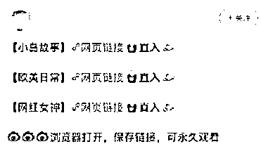

这些卖片儿的算是把人的某些方面的欲望，是摸的透透的。 

早期网络监管不严，他们就直接在平台上发毛片儿，

**那个时期也是 LSP 们最幸福的一段时光，**因为只要你关注一个这种人的微博，

你就会从他的关注列表、粉丝列表、微博点赞等等地方，发现无数个同类型的账号。

或许你都没时间看片“干活”，只关注账号这一晚就过去了。

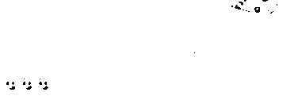

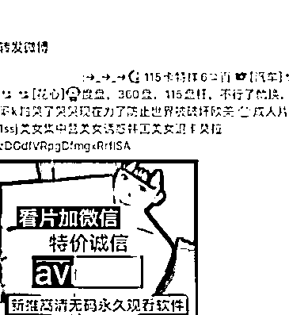

但也不乏一些运气较差的 LSP，

关注了一宿此类型的账号，想着第二天睡醒狠狠的来一下子。

可不成想，一夜之间，关注的账号全都被封了。

后来，各个平台的监管力度上来之后，

这些人不敢直接发毛片儿了，开始在评论中做起了文章。

当时的微博，只要一上热门，

必将被这些卖片儿大队的人攻陷，最终成为了他们牟利的温床

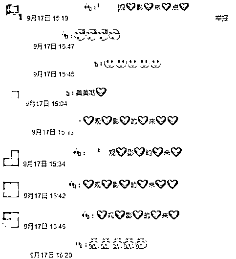

再后来，为了阻止这些人，

评论开启了筛选+陌生人以及刚关注的人无法评论的功能， 

这才暂时的控制住了局面！

为什么说暂时呢？

**因为卖片儿一族，是打不死的！**

他们开始转变思路，研究战术。 

你有张良计，我有过墙梯！

不让发毛片是吧，不让评论是吧？

那我正常做一个美女博主，在座的各位没有意见吧？！

于是乎，一些性感暴露的女孩照片，遍布平台。 

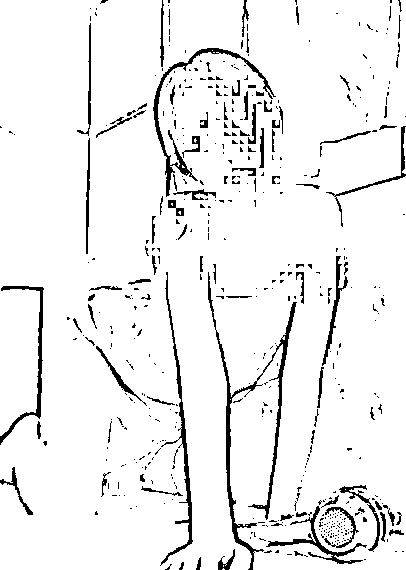

除了一部分真正热爱分享照片的女孩儿外，其他的全都是大老爷们！

在网络上搜刮各种美女照片，

吸引 LSP，最终达成卖片儿目的。

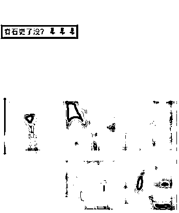

这个现象不止存在于微博，某音也有过。

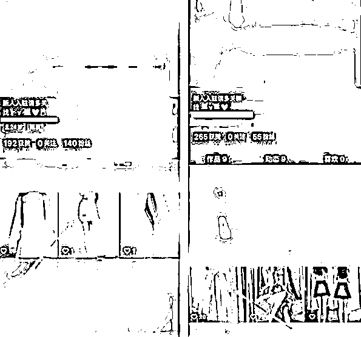

最终把你引入微信 QQ 等社交软件，完成买卖交易。 

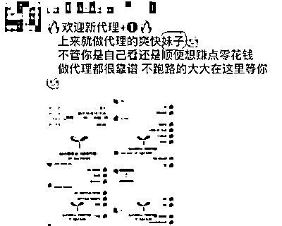

除了卖片儿的，

还有一种最为直接，最为大胆的情况就是，**直接卖屁股**。 

不是贬低，但却实有这类女孩存在。 

通过各种社交平台，发布性感的照片视频宣传自己，

吸引老色批后，完成交易。

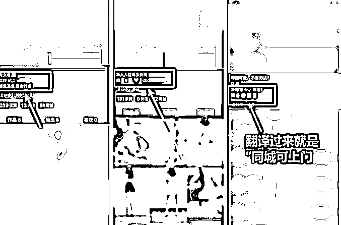

比如**“全国可飞（她们喜欢用飞机的图标代替）”，同城上门**，

甚至有的根本什么都不用标明，发几张色色的图 LSP 们就心领神会了。

添加了联系方式之后，就开始了漫长的“杀价选品”！

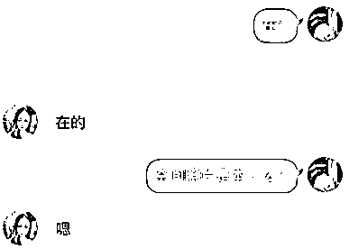

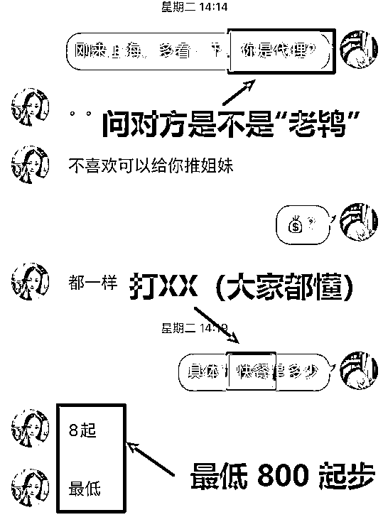

这不最近，在推特上，又新兴起了一种拉皮条的方式。 

只要对上暗号，就可以深入的探讨接下来的事情。

**“Do you like my pokemon？”**

这句话喜欢动画《神奇宝贝》的人应该不陌生吧？ 

翻译过来就是：**你喜欢我的宝可梦吗？**

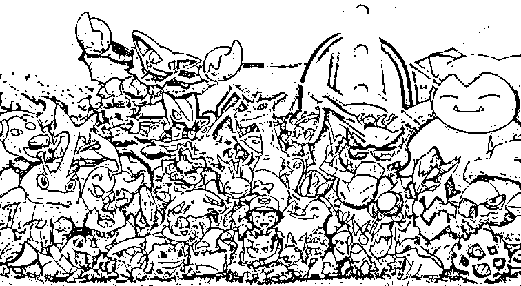

这句看起来就是“梦宝们”简单问候的一句话， 

却成为了那**些卖片儿、卖身的人的流量密码**。

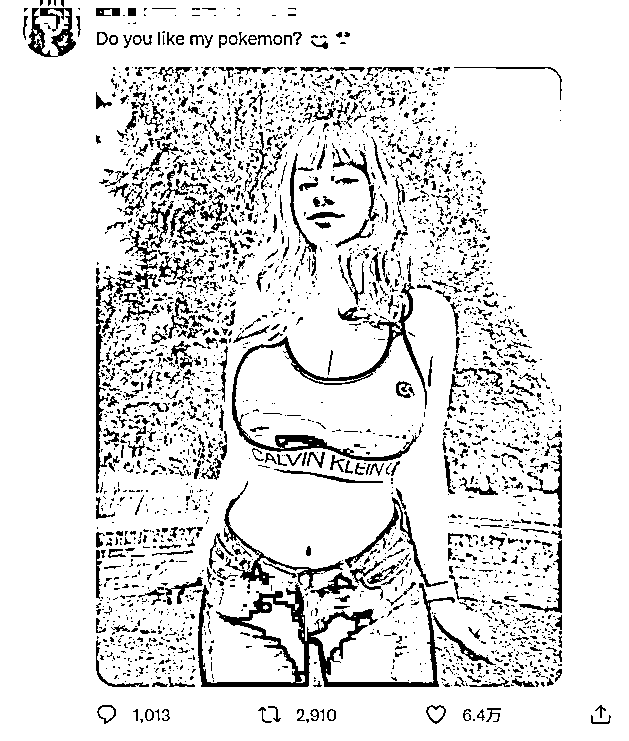

甚至在平台上，

只要你刚输入一个 Do，下面立马就会把这句话给你匹配出来。

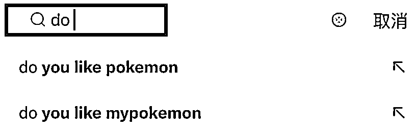

而搜索结果，绝大部分都是香艳的美女。 

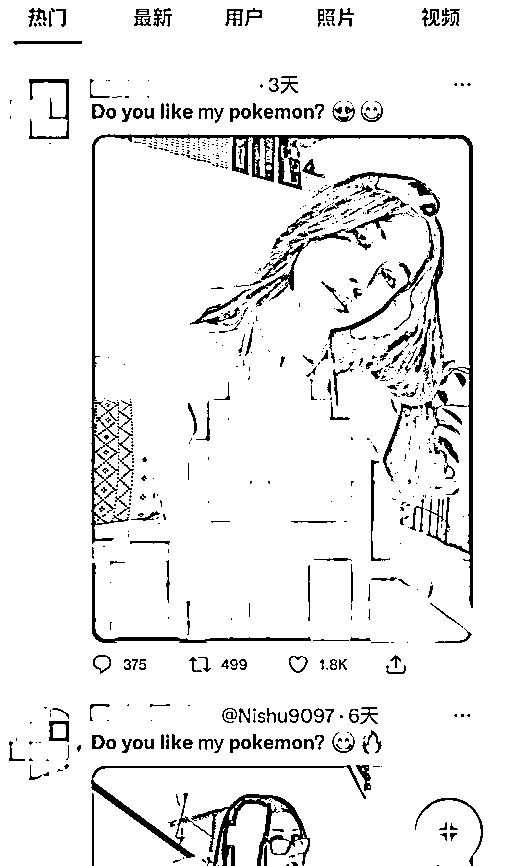

之所以出现这种情况，

一是“宝可梦”本身就是一个热词，只要内容好，一蹭一个准；

二是或许因为，宝可梦（Pokémon）一词，

本身就是由“Pocket Monster”合成演变来的，

自带的就有**“藏起来的怪物”**意思，现在被这些擦边球网红拿来当暗号，一语双关。

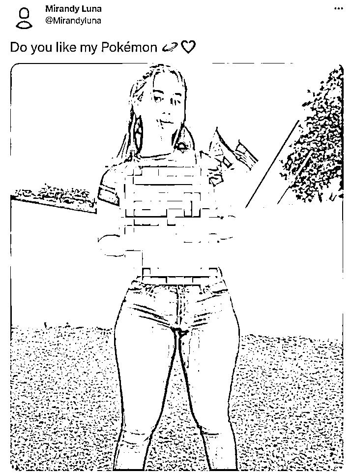

除了一部分的“跟风”之外， 

大部分女孩发这些，都是为了“求财”！

**“想看我的私密照吗？拿钱”**

**“想和我约会吧？你有多少钱”**

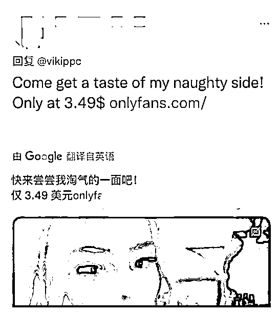

很快，**“Do you like my pokemon？” **的搜索结果，就被这些“女菩萨”的推送文占满了。

这哪还了得， 

万一小孩子看到这些，内心得遭受多大的创伤？！

这些伤害让尸哥一个人承受就够了，希望她们能及时收手，不要误人子弟！

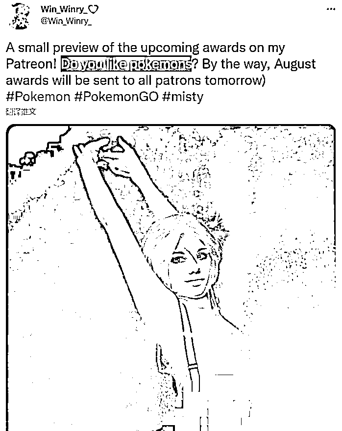

后来推特上的一些正义之士也展开了行动， 

纷纷在此种推文下留言，

我不喜欢之类的话，希望以此把这些福利姬们驱逐出“推”。

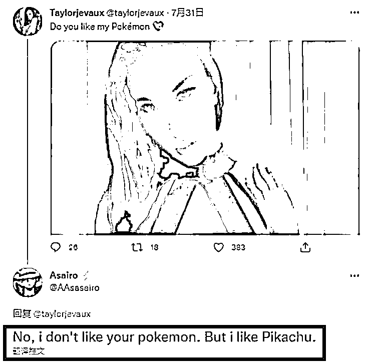

还有些人开始使用战术了，以毒攻毒， 

或许是希望通过精神污染，让这些“福利姬”们知难而退吧......

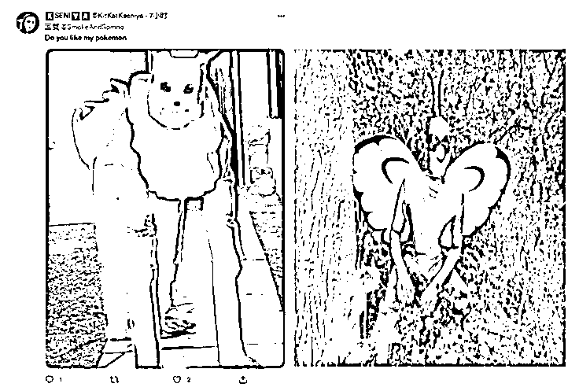

...... 

墙内的你们是幸运的，是安全的。

可别胡乱出去，外面的世界你们真的把持不住。

待尸哥再出去看看，现在的战况如何。

如果有什么危险，我愿替我的所有粉丝承担！

用我 10 秒阳寿，换大家无病无灾。

**就让 Do you 来的更猛烈些吧！**

来源：不惑先生

欢迎关注灰产圈社群服务号

