# 80 后竟然被称为“家中老人”了？网友激动：能办退休了吗？

> 原文：[`mp.weixin.qq.com/s?__biz=MzIyMDYwMTk0Mw==&mid=2247543187&idx=6&sn=33373d3fe94af0555ccecb3027fc0489&chksm=97cbe2aba0bc6bbd6f45a6aa73252987f0995929da1b30b1e3c6d06a32240c0ad2388a86ee09&scene=27#wechat_redirect`](http://mp.weixin.qq.com/s?__biz=MzIyMDYwMTk0Mw==&mid=2247543187&idx=6&sn=33373d3fe94af0555ccecb3027fc0489&chksm=97cbe2aba0bc6bbd6f45a6aa73252987f0995929da1b30b1e3c6d06a32240c0ad2388a86ee09&scene=27#wechat_redirect)

猝不及防间

脊梁竟然也算**老人**了😢😭😥……

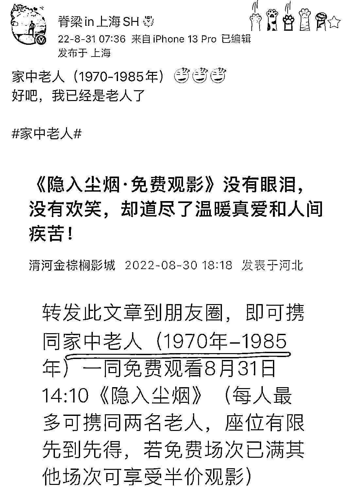

好吧。。。

老实说还没做好心理准备

怎么就变家中老人了？？

那我们父母那辈的

不会该叫古人了吧？

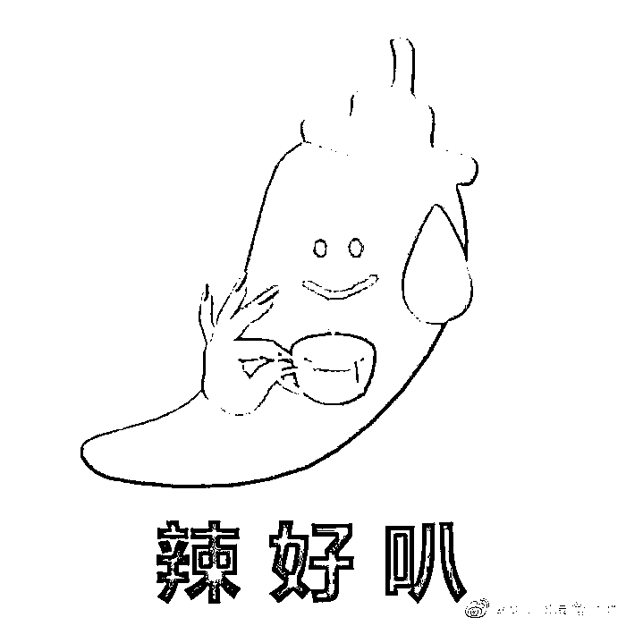

生活中碰到这种情况

确实内心复杂啊

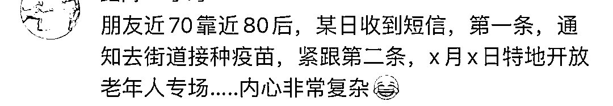

这次的关于老人年龄的划分

是出自近日河北一影城的推文

由于划分范围过于新潮

立马引发网友热议

怎么讲呢

乍一看有点刺目扎心

但换个角度想想就乐观了

1970~1985 的网友表示

其实挺愿意当老人的哈

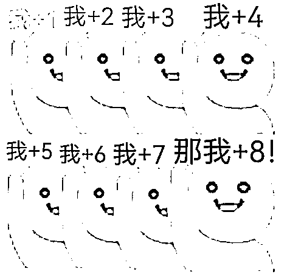

什么？我是老人？

那是不是可以**退休**了呀！

对了啥时候可**免费坐公交领鸡蛋**？

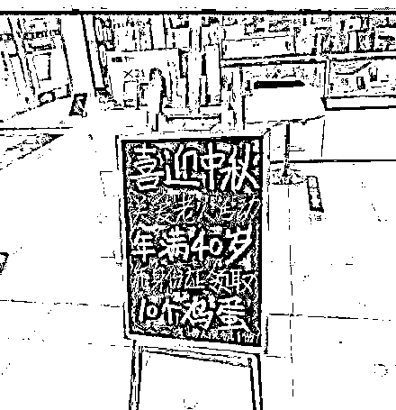

总之请速速安排老人待遇！！

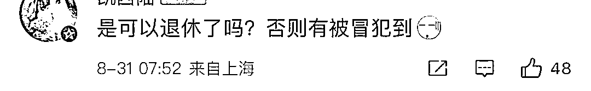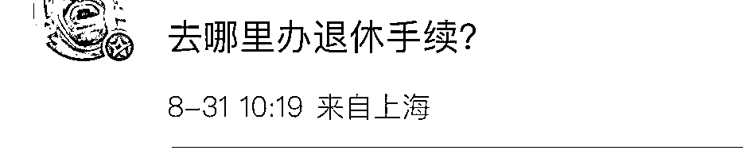

没想到哈哈哈哈哈

95 前的网友都争先恐后当老人

关于引发热议的年龄划分

影城工作工作人员解释：

“有调侃之意

本意是想让年轻人带父母看。”

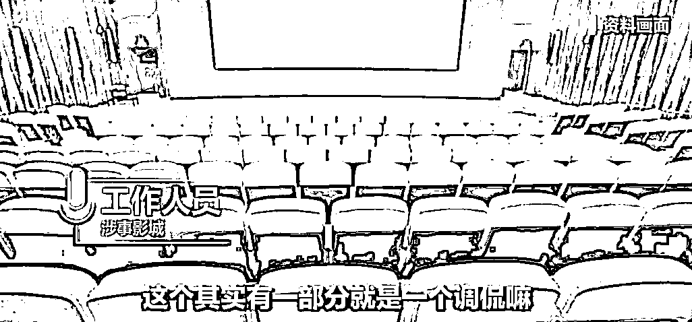

目前

引发热议的原文章已经被删除

取而代之的是

8 月 31 日发布的新版文章

“1970-1985 的家中老人”

修改为

**“1950-1985 年的家人”**

⬇️ ⬇️ ⬇️

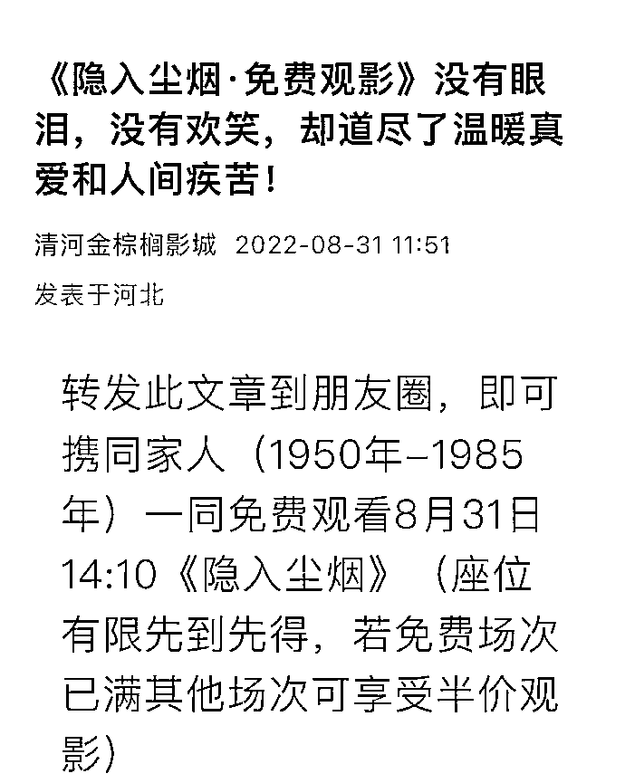

记得以前也发生过类似的

有关年龄划分的沙雕新闻

2017 年 四川凉山某体育局

举办中老年足球赛的通知上称

凡是 1982 年之前出生的同志

均可报名参加

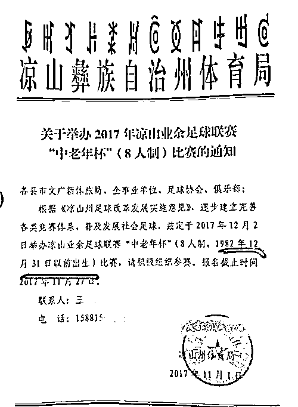

那会 90 后青年人纷纷表示很慌…

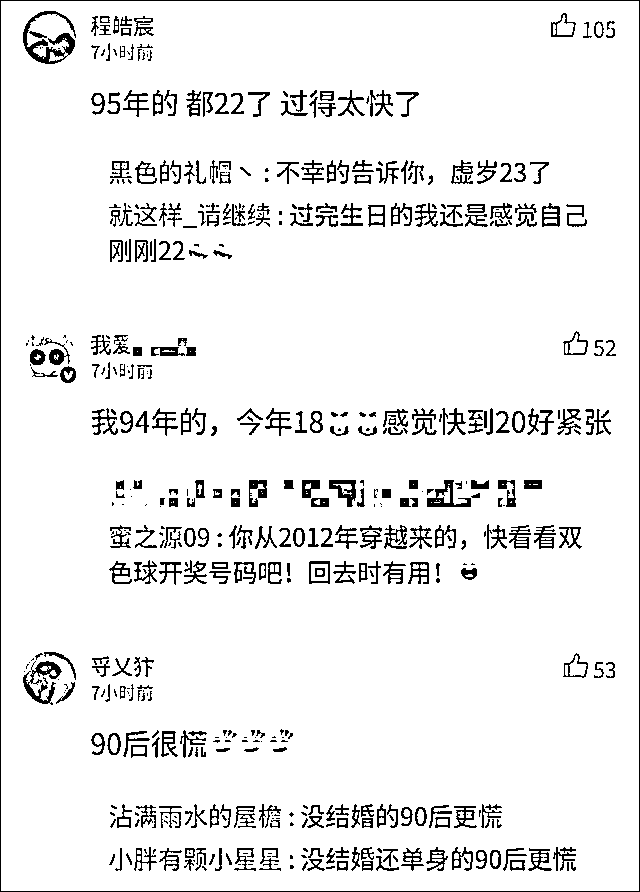

以下两个年龄划分

依旧是 2017 年的热议话题

“88 年的中年女子”

▼

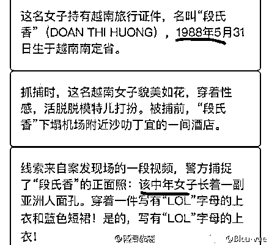

“赵雷母亲 34 岁老来得子”

▼

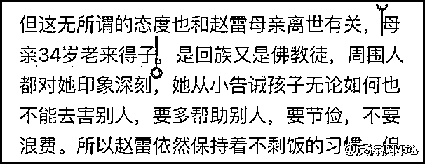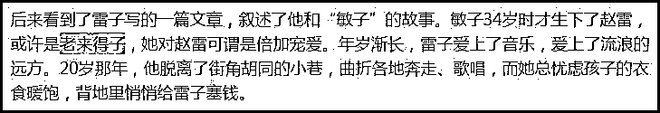

网友有点懵：

老来得子是这么用的吗？

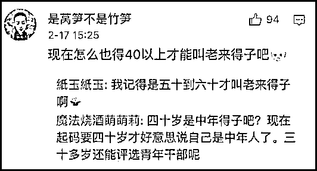

所以。。。话说回来

**1970 年～1985 年出生的**

**到底算“老人”还是“青年”？**

据我国《老年人权益保障法》

其中第 2 条规定

老年人的年龄起点标准是 60 周岁

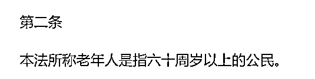

根据我国《中长期青年发展规划

（2016-2025 年）》中所指

**青年是 14—35 周岁**

《中国共产主义青年团章程》规定

可以加入中国共青团的年龄标准

为 14 周岁以上 28 周岁以下

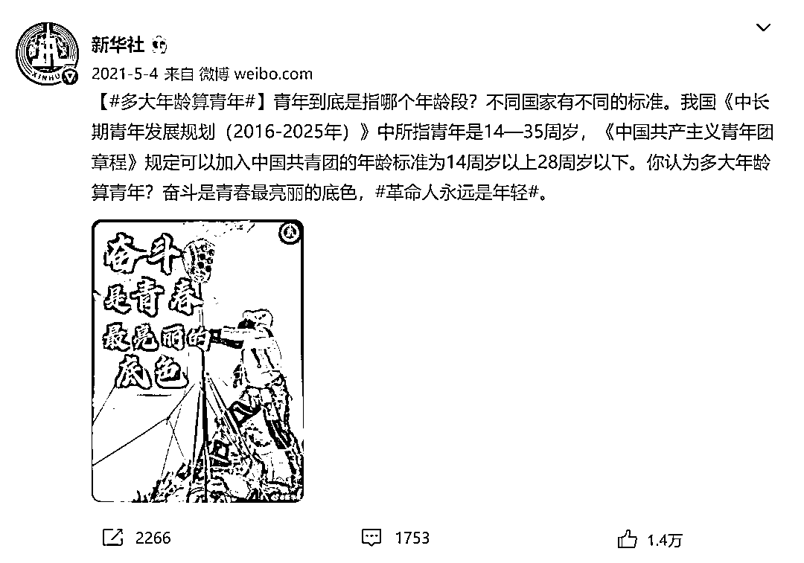

不禁想到以前刷到过的

这张通知截图里提到的

育龄青年的范围...

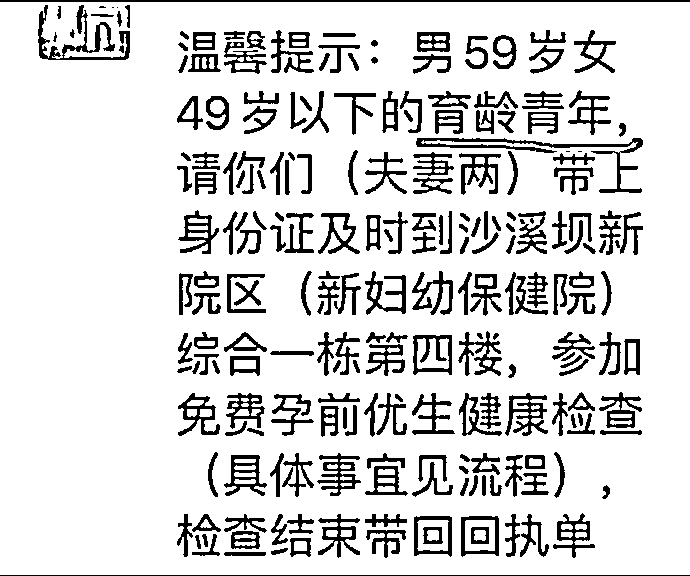

还是**算我是老人吧！**

老人挺好的！

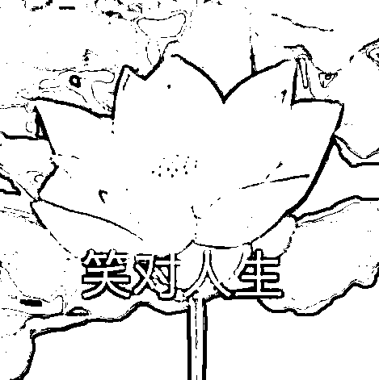来源：脊梁 in 上海 SH

欢迎关注灰产圈社群服务号

