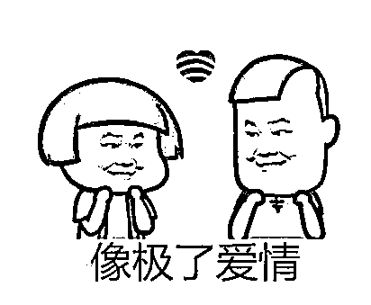
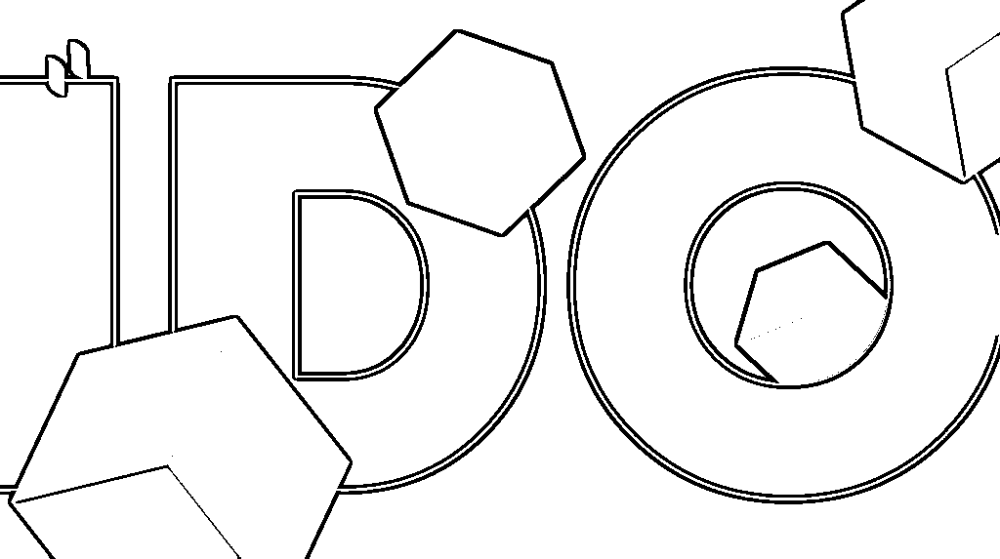
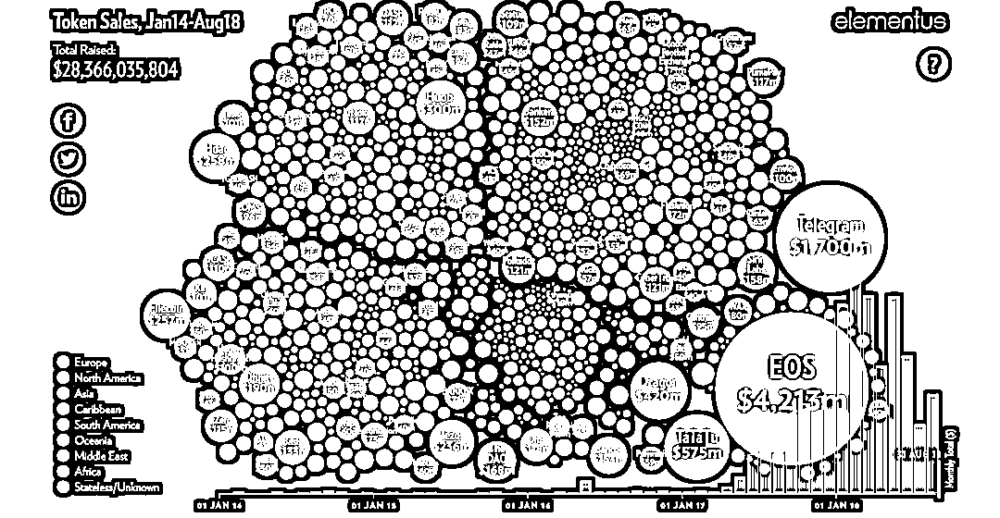
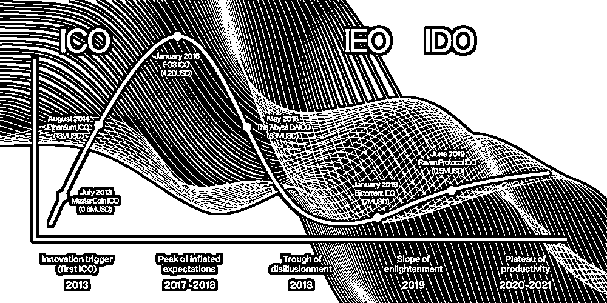
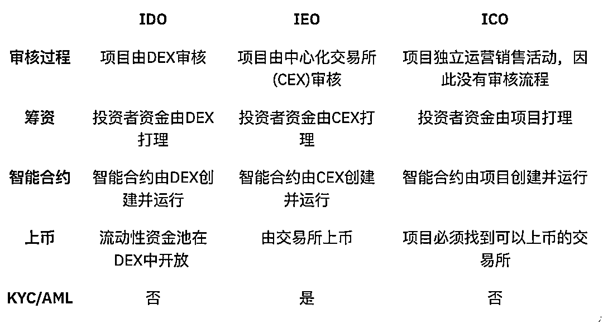
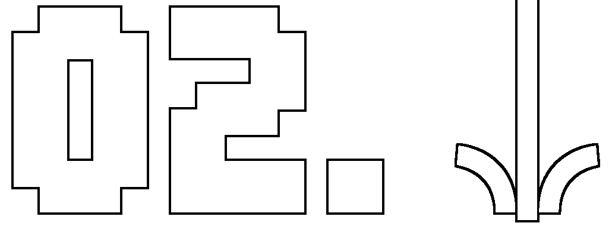
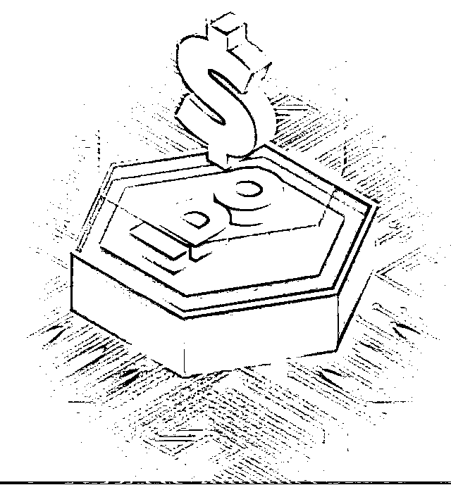
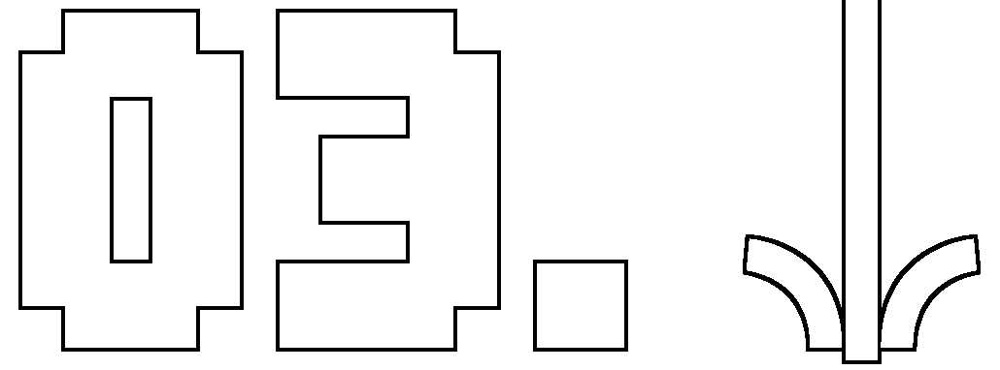

# IDO：暴富新阵地还是骗局新外衣？弄清这些真相，别再被割韭菜了！

> 原文：[`mp.weixin.qq.com/s?__biz=MzIyMDYwMTk0Mw==&mid=2247543187&idx=7&sn=cc647f6437b34e33b0386025e5ba11d0&chksm=97cbe2aba0bc6bbd93a6806d801ba7ff0f96c86782062143938c3bd391ff19de5deeaf5d2c8c&scene=27#wechat_redirect`](http://mp.weixin.qq.com/s?__biz=MzIyMDYwMTk0Mw==&mid=2247543187&idx=7&sn=cc647f6437b34e33b0386025e5ba11d0&chksm=97cbe2aba0bc6bbd93a6806d801ba7ff0f96c86782062143938c3bd391ff19de5deeaf5d2c8c&scene=27#wechat_redirect)

前不久，女神突然给我发了条消息，就三个字母：IDO。

难道女神是在对我深情告白？激动地心，颤抖的手，赶忙回消息一探究竟。

“就 IDO 呀，听说很火呀，跟 ICO 有啥区别？可以参与吗？”

“哦，哈哈哈，I-D-O 呀，这个我知道呀，给你详细讲讲……” 

虽然我期待的爱情故事无疾而终了，但是该普及的知识还是得普及，而且最近也有不少人咨询七星锤 IDO 究竟是怎么回事。

在加密货币行业中，ICO 想必大家都已经耳熟能详了，那么 IDO 又是什么呢？是否是骗局？可能会有哪些风险？又可能会涉及到哪些犯罪？跟随今天的分享来了解下吧！

**IDO 的前世今生**

IDO 的全称为 Initial DEX Offering （去中心化交易所上的首次发售），**是指在去中心化交易所（DEX）上推出加密货币**。**在 IDO 中，区块链项目在 DEX 上首次公开发行代币，以从散户投资者那里筹集资金。**究其根本，IDO 本质上还是一种筹集资金的方式。

想要深入透彻了解 IDO，得从 ICO 说起。

**①什么是 ICO？**

ICO 全称 Inital Coin Offering，代币的首次发行，是一种加密货币项目通常使用的融资机制。其概念是从股票市场 IPO 衍生过来的。

ICO 项目想要成功，就必须要有足够的参与者，因此项目方会借助各种渠道进行项目宣传，以吸引更多参与者进来。一个 ICO 项目参与者最看重的是该项目未来发展以及代币发行后价格升值带来的潜在收益。项目能否成功具有很大的偶然性。

**②ICO 的起源与发展**

**2013 年出现了第一个 ICO 项目**——Mastercoin（现更名万事达币 OMNI），曾在 Bitcointalk 论坛上众筹成功筹资 4740 枚 BTC。

**2014 年历史上第二个 ICO 项目**——Nextcoin 面市，这是第一个完全 POS 区块链，曾筹资 21BTC，它的市值一度高达 1 亿美元。

**2013 年至 2014 年间启动的 ICO 项目中最成功的就是 Ethereum（以太坊 ETH**），当时筹措资金超过 1800 万美元。目前以太坊也是除比特币以外市值最高的加密数字货币。以太坊之后，ICO 也正式崛起。

**时间来到 2017 年，这一年 ICO 的概念大火**，加密货币社区中，热衷于赚快钱的玩家开始转向一级市场，参与各种火热的 ICO 代币发行。

据相关数据统计，仅 2017 年，就有 875 个项目通过 ICO 筹集了超过 60 亿美元的资金。而在 2018 年仍有有 1253 个项目方通过 ICO 筹集了大约 80 亿美元。

图片来源于网络：2017~2018 年的热门 ICO 项目

由于市场的火热，2017-2018 年间，欺诈者利用投资热潮，发行了很多虚假 ICO 项目，据彭博社于 2018 年 7 月发布的研究报告指出，大约 78% 的 ICO 项目在交易前就被识别出骗局。 而据悉 10 个最臭名昭著的 ICO 骗局，就诈骗了投资者 6.874 亿美元。

同时，一些国家和地区也看到了 ICO 的危害，加强了对 ICO 的监管。例如我国，2017 年 9 月 4 日，中国人民银行等七部门联合发布《关于防范代币发行融资风险的公告》，宣布将 ICO 定位为非法金融活动”，即明确禁止任何代币发行融资行为。 

而加密货币投资者们也逐渐发现其诸如：不受监管、没有投资者验证和保护、项目不成熟很难发展起来、缺乏透明度、代币价格变动大等诸多致命缺陷，**2018 年下半年开始 ICO 的热度开始逐渐降温。**

**③****ICO 的演变**

在 ICO 的热度降温后，很多人开始对 ICO 的模式、机制进行研究和改进。一些其他利用发行代币筹集资金的方式开始兴起。

**STO/ETO**：证券代币发行/股票代币发行，就是投资者可以以加密货币来筹资，而获得的回报是该公司的实际所有权（例如证券、股票等），简单来说，就是" 链下 "的公司可以在" 链上 "发行他们的证券/股票，或者发行一部分证券/股票。

**IFO**：全称 Initial Fork Offerings，首次分叉发行，指通过分叉比特币等主流加密货币生成新的代币。

**IMO**：全称 Initial Miner Offerings，首次矿机发行，指首次通过售卖硬件/矿机来发行代币。

**DAICO**：DAICO 是以太坊创始人 V 神对于 ICO 的改进，是将 DAO（去中心化自治组织）的优势和 ICO 的固定机制结合。简单来说，就是 DAO 版的 ICO。

**IMO**：全称 Initial Miner Offerings，首次矿机发行，指首次通过售卖硬件/矿机来发行代币。

**IEO**：Initial Exchange Offerings，首次中心化交易所发行，指在中心化交易所发行代币；代币跳过 ICO 这步，直接上线交易所。

**在上述 ICO 的替代方案中，IEO 是发展最好的，也是最成功的**。但是 IEO 有一个致命的缺点，那就是不符合区块链的去中心化精神，交易所可以决定批准哪些项目并按照特权收取手续费。

因此，随着 DeFi（去中心化金融）市场的兴起，大量的去中心化交易所（DEX）也应运而生，通过 DEX 完成实现 IEO 的 IDO 就诞生了。

图片来源：Ruben Merre 

**④****IDO 的兴起**

第一个推出 IDO 项目的去中心化交易所（DEX）是构建在币安智能链上的 Raven Protocal （中文译名：乌鸦），于 2019 年 6 月上市，销售的代币是交易所的平台币 RAVEN。

随着越来越多的平台推出 IDO 功能，IDO 逐渐替代 ICO，成为近两年的加密货币市场中最热门的板块之一。

**⑤IDO 与 ICO、IEO 的区别**

IDO 与 ICO 和 IEO 最大的区别在于，IDO 可以直接由代币项目自主执行，并在去中心化交易所（DEX）上自由的上市。

另外，IDO 是通过开放代币交易对的流动性池，例如 ETH/USDT，而不是订单簿，在 DEX 上推出项目代币。这意味着价格只会在代币被买入或卖出以及流动性池中代币比例发生变化的情况下才会发生变化。

图片来源于网络

**IDO 是如何运作的？**

IDO 通过去中心化交易所(DEX)推动代币销售。加密货币项目向 DEX 提供代币，用户通过平台投入资金，DEX 完成最后的分发和划转。这些过程通过区块链中的智能合约自动操作。

IDO 的运作规则和阶段取决于运营方 DEX，但也有一套通用方法： **①项目经去中心化交易所(DEX)完成审查后，项目方可在该 DEX 开展 IDO**。项目方以固定价格供应代币，用户锁定资金来换取代币。投资者稍后将在代币生成活动(TGE)中收到代币。 **②IDO 通常会有一份投资者白名单**。投资者可能需要完成营销任务才能加入其中，或者仅需提供钱包地址。 **③筹集到的部分资金用于创建该项目代币的流动性资金池**。其余资金留给团队。投资者可在 TGE 之后交易代币。提供的流动性通常会锁定一段时间。

**④在 TGE 阶段，代币划转给用户，流动性资金池开放交易。**

以上模式属于典型的 IDO，IDO 也在演变，代币产品一直在变化。例如，越来越流行的 Initial Farm Offering（也就是通过质押某特定加密货币，然后获得购买将要发行的新代币的资格）。这种模式下，投资者必须首先在去中心化金融(DeFi)流动性资金池中质押，以赚取流动性资金池的代币，而不是直接锁定代币。

另外还有链游类 IDO，想要参与游戏，就需用主流币通过去中心化交易所兑换游戏代币，换取游戏代币后，就可以用来购买游戏道具，参与游戏。游戏获得的奖励代币又可以在去中心化交易所上兑换成其他币，或者参与其他活动，获得收益。 

**IDO 有哪些风险？**

**①劣质项目**

去中心化交易所上的项目尽职调查可能会有些欠缺，一些声名狼藉的项目可以通过 IDO 的方式发放代币，比通过大型合规交易所进行 IEO 要容易许多。如果对项目了解不清楚的投资者购买了这些劣质、虚假项目的代币，可能会血本无归。

**②项目方跑路**

DeFi 上项目方跑路的事情时有发生，因此 IDO 也不例外。诈骗者只需在 DEX 上创建一个令牌，并将其与以太坊等主流加密货币配对。此后，一旦投资者将他们的 ETH 等主流币换成项目方发行的新代币，项目方就会耗尽 DEX 流动性资金池跑路。这会将新代币的价格推向零，给投资者留下了几乎毫无价值的项目代币。

**③黑客攻击**

从前面的内容，我们已经知道，IDO 是创建在 DeFi 生态中，而 DeFi 是黑客攻击的重灾区。黑客可能会利用智能合约中的漏洞，发动攻击盗走项目资金。

**④洗钱风险**

犯罪团伙可能会利用其将脏款洗白，犯罪分子将脏款兑换成项目的新代币，混淆脏款资金链路，达到洗白脏款的目的（更多 DeFi 洗钱手法可戳这里了解：[接收了 69%的链上非法资金，DeFi 是如何洗钱的？](http://mp.weixin.qq.com/s?__biz=MzIyMDYwMTk0Mw==&mid=2247541169&idx=8&sn=28ed53ac1fea62d6096557de11ec30be&chksm=97cbea89a0bc639fdf4843c567aa879cb455fc10eb419f99964e668fdd91dbf9d48e274e4a37&scene=21#wechat_redirect)）。

**⑤价格欺诈**

持有大量代币的投资者，可以操纵代币价格，因为在 IDO 中购买代币没有限制。另外，机器人已被多次用于操纵价格行为，使用这些机器人操作手段可以以牺牲其他投资者为代价，为少数人带来巨大的收益。

**⑥虚假钓鱼欺诈**

不法分子可能会利用投资者对 IDO 的热情大肆宣传炒作项目，同时创建虚假网站或购买链接，项目可能根本就不存在。一旦投资者点击链接，或者进入诈骗网站进行交易，损失就难以挽回了。

**⑦缺乏实名认证，损失资金难追回**

因为去中心化交易所缺乏身份信息确认，所以一旦被骗或者币被盗，将很难进行资金追踪。

**无论是 ICO 还是 IDO，大部分项目的本质都是通过发行代币进行资金**筹集**。在我国，这是一种未经批准非法公开融资的行为，涉嫌非法发售代币票券、非法发行证券以及非法集资、金融诈骗、传销、洗钱等违法犯罪活动。** 

**代币发行融资与交易存在多重风险，包括虚假资产风险、经营失败风险、投资炒作风险等，投资者须自行承担投资风险，希望广大投资者谨防上当受骗。**

如果再遇到那些被吹嘘的天花乱坠的各式花样 IDO 项目时，别再被“躺着赚钱”、“财富密码”、“百倍收益”、“创新玩法”等宣传噱头蛊惑，认清真相，远离风险，避免财产损失。

以上就是本次关于 IDO 的分享。

来源：七星实验室

欢迎关注灰产圈社群服务号

