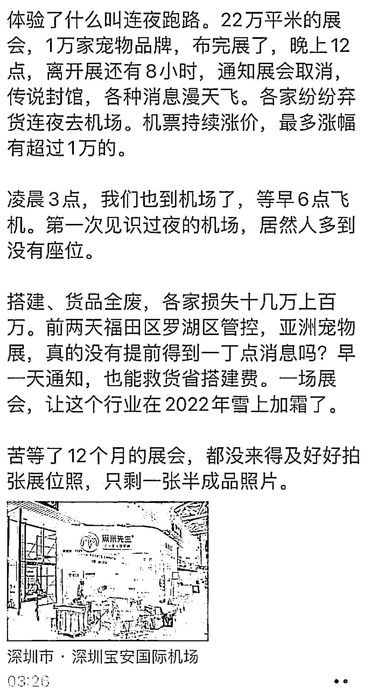
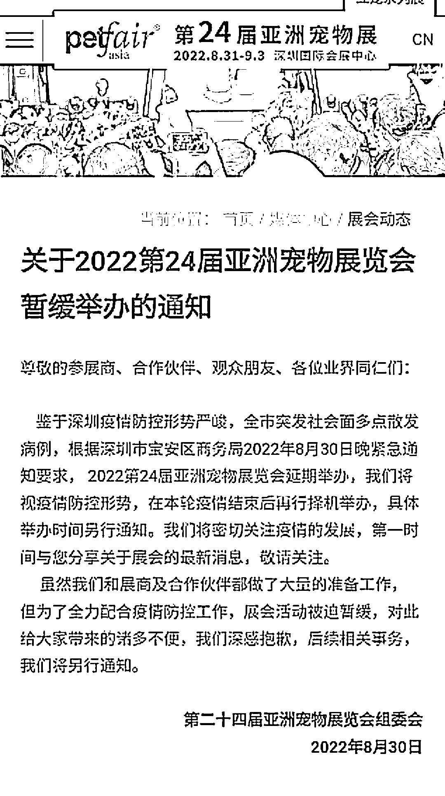
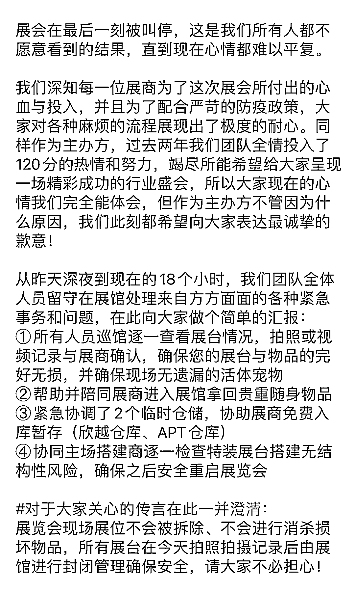
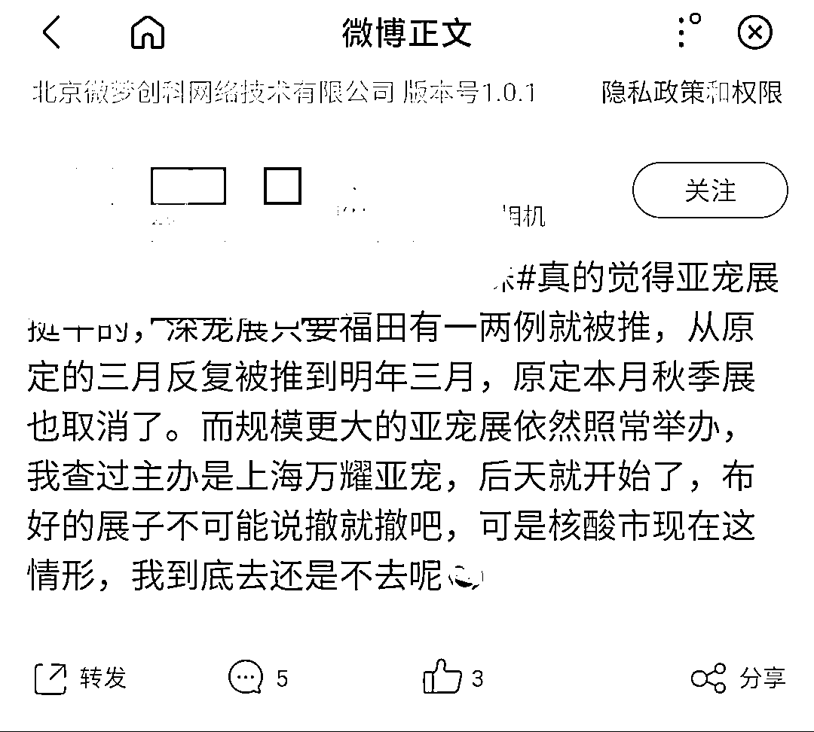
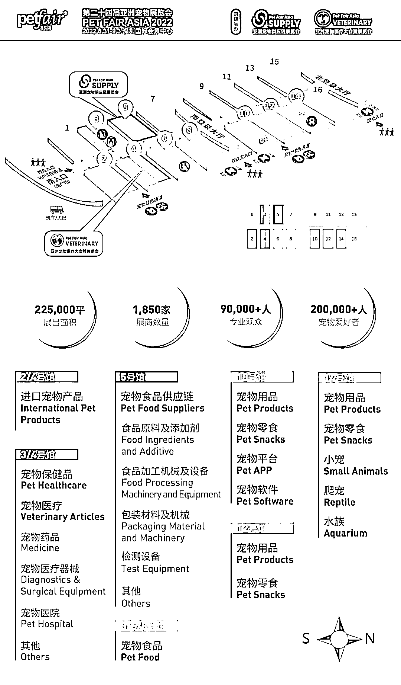
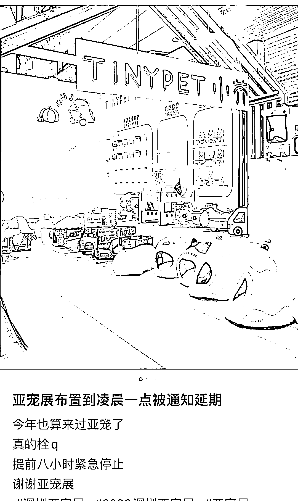
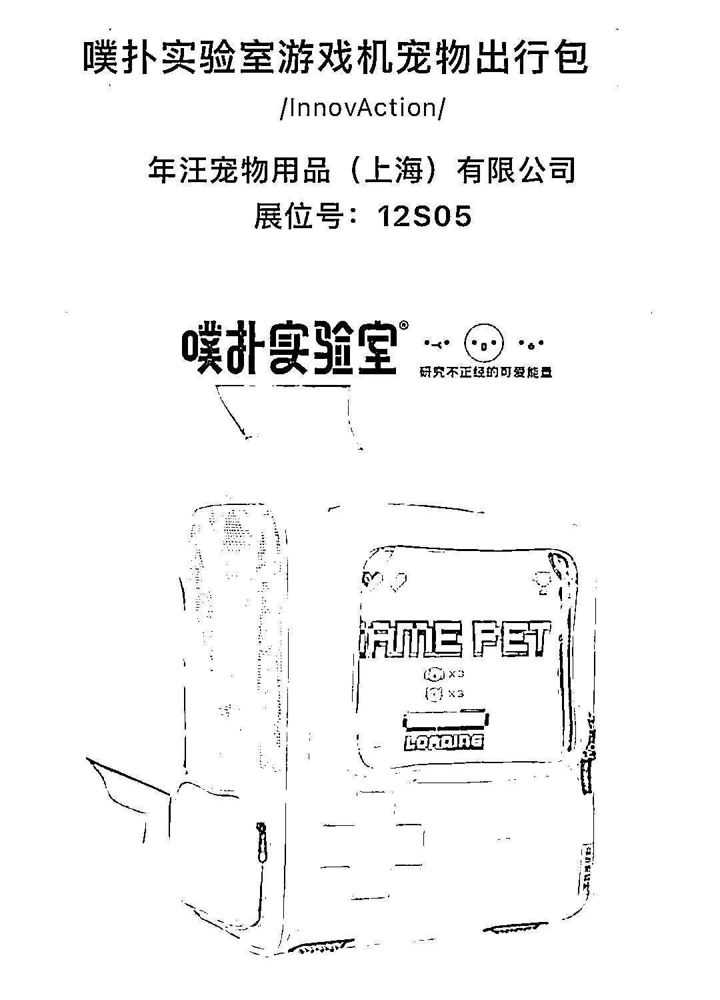

# 亚宠展再延期，上万宠物品牌经历“惊魂一夜”

> 原文：[`mp.weixin.qq.com/s?__biz=MzIyMDYwMTk0Mw==&mid=2247543187&idx=8&sn=8f069ae1573c44bd76a7e85b40b27a9c&chksm=97cbe2aba0bc6bbd727c8843afc92382be5a7aec1d6e15a98b3b8ac5a3d5bc2295382c4b4ea1&scene=27#wechat_redirect`](http://mp.weixin.qq.com/s?__biz=MzIyMDYwMTk0Mw==&mid=2247543187&idx=8&sn=8f069ae1573c44bd76a7e85b40b27a9c&chksm=97cbe2aba0bc6bbd727c8843afc92382be5a7aec1d6e15a98b3b8ac5a3d5bc2295382c4b4ea1&scene=27#wechat_redirect)

今天，亚洲宠物展览会（以下称：亚宠展）延期的消息被业内广泛讨论。宠物鲜粮品牌黑米先生联合创始人周梦诗的一张朋友圈截图在业内被大量转发。

<shape type="#_x0000_t75" filled="f"><imagedata title="4564483571661960205350"></imagedata></shape>

里面提到了她在深圳亚宠展的遭遇：临开展还有 8 个小时，被通知展会临时取消；苦等了 12 个月的展会，都没来得及好好给布好的展位拍张照，就只剩下一张展位半成品照片；凌晨 12 点通知取消，传言要封馆封货，各大参展商连夜弃货去机场。

来源：亚宠官网截图

跟她类似遭遇的宠物品牌方还有很多，小红书上也不断有人发布关于今年亚宠展遭遇的笔记。某宠物粮品牌创始人表示，团队十几个人为了呈现展台最好效果，最后几乎累到虚脱，虽然只呈现到昨晚 23 点，疫情好转后一定惊艳全场。

不过，仔细分析下来，此次亚宠展的罪魁祸首并不是疫情，而是主办方的沟通不到位。

来源：亚宠官网截图

在延期通知发布将近十几个小时后，亚宠展主办方才给出善后方案：

1、搭建好的展位原地不动，全馆封锁不进不出，已经重点做好现场物料封存。

2、主办方将帮助并陪同展商进入展馆拿回贵重随身物品。

3、将与深圳市政府保持沟通，制定重启预案，初步预判为 2-3 周之后进行二次开展。如有其他情况会第一时间通知参展商。

一家宠物品牌代工厂创始人表示：“我们主要针对 B 端客户，也没有带货，损失还好，宠物品牌方们损失比较多。如果主办方之前没打包票，能够将展览延期一下，或者在谣言四起的时候能出来澄清一下，又或者提前准备好应急备用方案，可能宠物品牌的损失都能减少一些。大家的情绪也不会这么大。”

那么，问题来了，亚宠展为何在疫情形势严峻的情况下，“逆势而行”？

**距离开展前 8 小时，亚宠展被取消**

8 月 29 日，司徒桑（昵称）在社交平台上发布了一条带状态，提到亚宠展挺牛的，深宠展只要福田有一两例就被推迟，从原定三月反复被推到明年三月，原定本月秋季展也被取消了。而规模更大的亚宠展览依然照常举办，后天就开始了，布好的展台不可能说撤就撤吧。可核酸是现在这个情形，到底去还是不去呢？

来源：微博截图

当时这条状态下面有用户留言，别去了，我怕去了回不来；还有人说，已经退了酒店，这个不延期真是太坑了。

实际上，在正式收到延期通知之前，很多参展商都感受到疫情的严峻，不断有人在朋友圈发，亚宠展倒计时 1 天，小红书预热已经到位，希望别有疫情，能顺利开展。“前天（29 号）我们去问主办方，他们说没问题。”周梦诗表示。

但就在 8 月 30 日晚上，距离展览正式开始 8 小时前，策展方毫无征兆地宣布，因疫情原因，亚宠展因疫情原因延期。参展商群体一片混乱，大多数人撇下参展货品和站台，立马返回原办公地。

驱车十几个小时提前来参展的小何对剁椒 TMT 表示：“昨天凌晨我在亚宠的朋友告诉我展会延期了，但是他们上午还在收尾款呢，这太突然了。”至于参展的初衷小何表示自己本来是想借着亚宠打通自己创业的供应链，顺便多认识一些品牌积累资源为以后做宠物贸易铺路。

个人来参展的损失和品牌相比不算什么，亚宠展这一办一延期之间，参展商们，尤其是宠物品牌方们，损失不小。“我们十几万的货还在展馆里面。目前主办方说是延期，没有说直接取消。”

除了货以外，参展商们参加亚宠展的费用主要包括几部分。参展费（按照亚宠展规定的站台面积标准不一。一个 28 平米左右的中性展台大概需要 3.2 万）、货品运输费用、搭建费用、差旅费。

“像我们这种营销公司没有货品，不用搭建站台，就几个人的小团队过来学习，差旅也需要 3 万左右，还不包括这次改签机票和酒店的差价。”一家营销公司的联合创始人表示。

按照亚宠展官方宣布的消息，此次展览有 1800 多家公司和 10000 多个品牌参加。按照最低的标准算，一家公司损失 3 万，整体损失也有 5400 万。

也有一些适应能力较强的品牌方，在主办方宣布延期之后，果断买好机票直接撤退。“亚宠确实准备了很久，但是就品牌的长期发展来说，这次延期不会对我们品牌的大盘造成影响，所以我们还比较平静，亚宠也不是第一次延期了。”

来源：亚宠公众号截图

对于延期是否有费用赔偿，各品牌负责人都还在等通知。不过，有相关律师表示，因为受疫情影响而出现延期的活动，在双方赔偿问题上可能会趋于互相免责。

值得一提的是，亚宠还有较强的排他性，参加其他展会的品牌如果来亚宠需要多花 10%的入场费用的，并且还不能优先选择展出位置。而延期之后品牌退出也是要自身承担费用的，去年就是这样。有去年参加亚宠的一品牌对剁椒 TMT 表示，“现在参加亚宠风险太大，去年交了钱一直延期，我们退出被扣了 35%的费用。”

**亚宠展背后策展公司为何“逆势而行”？**

在上述营销公司联合创始人看来，亚宠展其实是属于“逆势而行”。“就在亚宠展举办的场馆，26 号之前还有很多其他展览，但是 26 号之后，其他展览就都取消了，只剩下亚宠展了。”

来源：小红书截图

那么，亚宠展览背后的策展方为何执意举办？

在亚宠展的官网发现，其主办方公司名为上海万耀企龙展览有限公司，是国内最早的会展企业之一，同时，也是欧洲荷兰皇家展览集团（Jaarbeurs）的亚洲分部。也就是说，这是一家具有外资背景的策展公司。

原本亚宠展每年 8 月举行。作为一个拥有 20 多年历史的大型线下展会，亚宠展览是国内宠物品牌不可缺席的盛会。根据第三方机构预计到 2023 年，中国宠物行业市场规模将达到 5928 亿元。这都让亚宠展在过去越办越红火，并成为上海万耀企龙展览公司的重要收入来源。

但自从疫情之后，亚宠展也是几经推迟，原本定于去年举办的亚宠展被取消。而不开展会，公司就少了这块收益。

而昨天公布取消的除了亚宠之外，还有同一时间段万耀企龙旗下的 2022 亚洲 3D 打印·增材制造展览会、中国国际地面材料及铺装技术展览会、亚洲门窗遮阳展·亚洲家居装饰展·亚洲内装工业化展等相关展会活动。

一些品牌方已经在纠结是不是要及时止损停止参会，如果失去信任之后，再加上多数品牌相继退出，万耀企龙的阵痛还是挺大的。

另外，作为品牌方来说，参加今年的亚宠展很多也是“箭在弦上，不得不发”。

一方面，当然也是因为销量。一般而言，参加线下展会的参展商都会带着实物参展，货品成交量可圈可点。而且，整个产业链的公司都有参展，既有品牌需要的上游代理加工厂，也有网红主播选货，还有各种营销公司，以及 C 端的人，当场谈合作，效率非常高。

来源：亚宠公众号截图

各品牌方还将在展会上推出各种活动折扣，力度堪比双 11。消费者小赵对剁椒 TMT 表示：“我是去撸羊毛的，为自家猫咪主子进货，带了一个 24 寸的箱子。”

另一方面，更重要的是，今年的参展费在去年就已经付过了。

“这次的亚宠展是原定去年 8 月在上海举办的，去年就已经交费了，后来延期到了今年 8 月在深圳举办。如果不接受顺延一年，主办方退款要扣除 35%的费用。像我们场地不算太大还好，有些展区比较大，光参展费可能就要几十万。”周梦诗表示。

目前，在小红书上，各品牌也纷纷推出了弥补线下展会延期的线上新品预售活动，甚至一些粉丝已经开始“激情下单”。不过，下一次的亚宠展，还有多少品牌在，这个问题并不是很好回答。

**话题互动**

****你怎么看下次亚宠展？****

**来源：剁椒 TMT******

**欢迎关注灰产圈社群服务号**

****

****