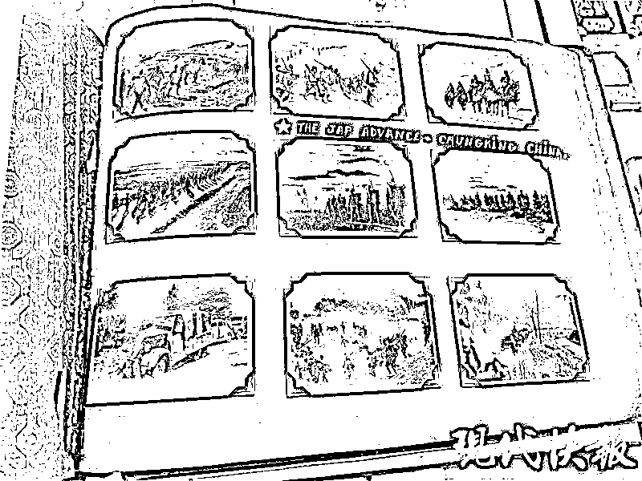

# 美国网友回应疑似南京大屠杀照片：不会交给日本政府！

> 原文：[`mp.weixin.qq.com/s?__biz=MzIyMDYwMTk0Mw==&mid=2247543239&idx=1&sn=a0870518987ca780d41d92db57306e73&chksm=97cbe2ffa0bc6be9b2e07a84b6091fd0ef45001ff007aba8b29705c9395622e3b4522e73a9a9&scene=27#wechat_redirect`](http://mp.weixin.qq.com/s?__biz=MzIyMDYwMTk0Mw==&mid=2247543239&idx=1&sn=a0870518987ca780d41d92db57306e73&chksm=97cbe2ffa0bc6be9b2e07a84b6091fd0ef45001ff007aba8b29705c9395622e3b4522e73a9a9&scene=27#wechat_redirect)

**9 月 1 日，**“国外网友发现南京大屠杀彩照”**的消息引发网友大量关注。**

据媒体报道，近日，明尼阿波利斯的一位典当店老板（埃文·凯尔）收到一本要求寄售的二战时期相册，里面全是一位驻扎在东南亚的士兵拍摄的二战时期东南亚和中国的照片，**包括 30 多张南京大屠杀日军恶行的彩色照片**。

埃文·凯尔放出很多摄影师随行日军的日常照，其中一页写着【The advance - Chungking China（进攻重庆）】。

埃文·凯尔并不希望

这本相册被卖给私人收藏家

**而是希望被保****存在博物馆**

不少网友致电

@侵华日军南京大屠杀遇难同胞纪念馆

电话被打爆

侵华日军南京大屠杀遇难同胞纪念馆

通过官方微博表示

**已经关注到这条信息**

**目前正设法联系对方**

**核实相关信息**

侵华日军南京大屠杀遇难同胞纪念馆表示，馆方对文物收藏有很严格的程序，专业鉴定是其中很重要的步骤。馆方每年都会开展相关文物征集、文物捐赠工作，目前最重要的是联系到视频中的外国人士核实信息。后续工作如何展开，将基于核实过的具体内容研究决定。

**更多细节披露！**

“我想让博物馆来接手这些照片，而不是某个私人买家，因为它们是无价之宝。我知道这样做是对的。”北京时间 9 月 2 日凌晨 1 点，在美国明尼苏达州的典当店老板埃文 · 凯尔接受记者采访时，表达了他目前最大的愿望。

**记者：你是怎么得到这本相册的？能向我们分享更多细节吗？**

**埃文·凯尔：**我在美国明尼苏达州有一家店，做金银制品贸易生意，其中包含收藏品。我是一个社交媒体人，我在 YouTube 上有自己的频道，其中一个项目就是购买别人想要转手的物件。

几周前，一位顾客找到我，告诉我他有这本二战时期的相册，想和我分享，看我能不能帮他们找到买家，我说好的没问题。

我之前就经常经手老照片的生意，但是在我周一（北京时间 8 月 30 日）拿到这些照片之前，我根本没有想象到我将会看到什么，我拿到之后打开它仔细阅读。这是一本内容很丰富的书，里面有成百上千张拍得非常好的照片。这些人在这里，我想他们可能是驻扎在东南亚也有中国，看起来他们大约是 1937 年或 1938 年初到这些地方的。

照片前面的部分是一些生活场景，应该是在日本人引发战争之前，后面的部分是在南京或上海，照片展现出的是到处都是被处决的人、被斩首的人、被折磨的人，还有大街上的尸体。我看到之后真的是非常愤怒，这样的照片有 30 张左右，其中有很多日本军队骑马训练的照片，真的是令人难以置信的照片。我看到后就知道这些照片描绘的是什么场景了，因为我在学校主修日本研究，我的教授告诉我，当时发生的事情只有非常非常少的照片留存下来。然后我就想知道卖家是否知道这些照片有多罕见，因为这些照片非常的直白。

所以……是的，我呆了几天。我不确定我要做什么，但是几天之后我录制了这个视频。因为我想让博物馆来接手这些照片，而不是某个私人买家，因为它们是无价之宝。所以，我想能找到一个合适的博物馆，让它受到关注的唯一方法就是制作这个视频来发声，但是我没有想到这件事会变得像现在这样影响力巨大。

**记者：周一（北京时间 8 月 30 日）你拿到这本摄影集，你周三（北京时间 9 月 1 日）录制了这个视频是因为什么？**

**埃文·凯尔：**因为我知道这可能会引起很大的反响，会引发很多争议。很多人会向我提出大量的问题。我不太确定该怎么做，所以我不得不考虑一下。我也失眠了两晚，这也让我很困扰。而且我也不是一个容易被左右的人，我自己认真思考要做什么以及如何去做，我不想任何人影响我的决定。所以我等了两天才公布出来，我也很高兴我这么做了。

**记者：你说你想把这本书给博物馆，那么你有没有尝试过联系一些研究所或者博物馆？**

**埃文·凯尔：**我一个半小时前刚进了我的店，我才发现这件事情成了一个爆炸性的事情。从今天凌晨 3 点开始，就有很多人在联系我，我要和很多人沟通，我想我今天有很多事要做。我会通过这些渠道联系一个合适的博物馆，但我必须说我从未遇到过这样的事情，虽然我一直在社交媒体上活跃了很多年。

**记者：你了解侵华日军南京大屠杀遇难同胞纪念馆吗？**

**埃文·凯尔：**我知道的，可能之前他们已经联系上我了。其实在你之前我接听了 7 个电话，其中 3 个都是来自中国的，老实说我有点不知所措了。

但是我知道这样做是对的，因为这个东西不应该为私人所有，我现在也把照片全部备份了，并把它放到了一个安全的地方。我正在寻找一个能够鉴定其真实性的人，但我相信这些照片都是真实的。我是一个和旧物件打交道的人，我没有理由觉得这个人给我的东西是假的。

卖家并没有告诉我获得相册的时候有哪些令人难忘的记忆，这是他父亲的所有物。他父亲曾当过 30 年兵，他父亲喜欢拍照并一一记录下来。他曾经为一个失去丈夫的老妇人打工，是那位老妇人的丈夫拍的照。老妇人把相册给他作为报酬，然后这本相册就一直在卖家家里保存了近 30 年，卖家并没有意识到这是什么，然后他就给我了，我看了一眼就知道大概是什么了。

**记者：30 张照片全都是关于南京大屠杀的吗？是否包括其他地方的照片呢？**

**埃文·凯尔：**这些照片确实不全是关于南京大屠杀的，它包括上海和整个东南亚，而且大部分照片是风景照，感觉那个人一直在拍那里的风景。

**记者：听说你要把这些更新到 YouTube 上面？**

**埃文·凯尔：**我想下周我应该会在 YouTube 更新相关视频，在抖音和其他平台我也会保持更新的。

北京时间今天上午 8 点左右

埃文·凯尔再次发布视频

称他收到很多评论

有些网友甚至不知道这段历史

此外

**相册主人也赞同**

**“博物馆是这本相册的唯一归宿”**

埃文·凯尔称

**不会将相册交给日本政府**

来源：北京青年报、现代快报、新民晚报

欢迎关注灰产圈社群服务号

