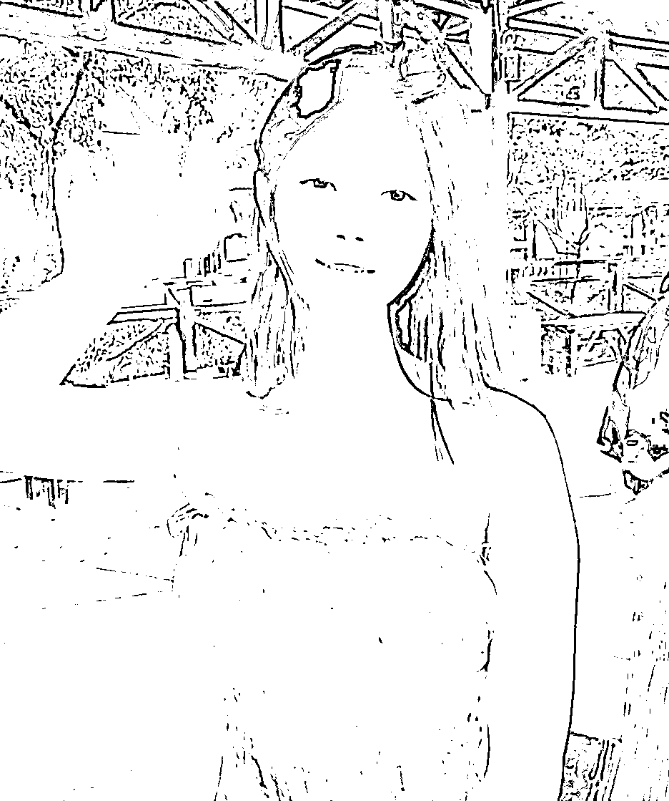
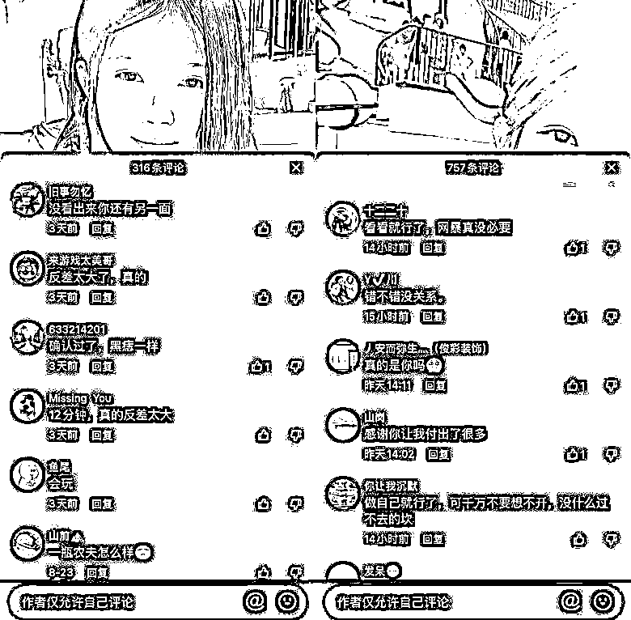

# 清纯女网红甜甜佳竟然是“反差婊”？前男友曝光 12 分钟私密视频···

> 原文：[`mp.weixin.qq.com/s?__biz=MzIyMDYwMTk0Mw==&mid=2247543239&idx=2&sn=621cf281078b813908349912557439fb&chksm=97cbe2ffa0bc6be923598f3c753198e8cd5a66db177ea1be45581111af269c5a5196dceb668c&scene=27#wechat_redirect`](http://mp.weixin.qq.com/s?__biz=MzIyMDYwMTk0Mw==&mid=2247543239&idx=2&sn=621cf281078b813908349912557439fb&chksm=97cbe2ffa0bc6be923598f3c753198e8cd5a66db177ea1be45581111af269c5a5196dceb668c&scene=27#wechat_redirect)

相信不少网友都吃过女生遇人不淑的瓜，比如之前“狗头萝莉”因为前男友的爆料声名大噪。

[`mp.weixin.qq.com/mp/readtemplate?t=pages/video_player_tmpl&action=mpvideo&auto=0&vid=wxv_2554074755176497153`](https://mp.weixin.qq.com/mp/readtemplate?t=pages/video_player_tmpl&action=mpvideo&auto=0&vid=wxv_2554074755176497153)

这种事情，大部分都是分手后的感情问题导致。

所以，即使面对亲近之人的请求，也不要因一时冲动而答应拍私密照、视频。

毕竟世上变数太多，能陪你走到最后的未必是眼前人。

裸照被公布的后果，轻则让人抑郁，重则轻生，无人能从中幸免。

对于心怀不轨的人而言，一旦分手，曾经留下的私密视频和照片，都将成为他手中的把柄。

可坏就坏在，你用自己的信任，换来的却是对方的背叛和威逼利诱。

最近又一位在读研究生的高学历女网红“甜甜佳”，疑似被其前男友曝光约 12 分钟的私密视频引发热议。 

据小编调查，这位网红的评论区聚集了不少吃瓜网友，并且还有不少恶语相向的言论，女主目前已经关闭了评论区。

可以说是整个评论区基本都在求事件的视频。

对于网络上的节奏，女主“甜甜佳”也在自己的账号说明中进行了澄清，并且删除了一些个人视频作品。

她表示自己总算是见识到某些男人的坏了，自己都快被网络暴力逼哭了，希望网友们嘴下留德，她只是在做自己。

虽然女主表示“倒立”的并非是她，但是不少网友都笃定网络上流传的视频的确是她本人。

也不知道是什么情况，此次事件让女主“甜甜佳”的账号涨粉数万，目前已经临近 20 万的粉丝，并且还在持续增长中。

有吃瓜群众直言女主身上的痣是改变不了的，她身上的痣和视频是在同一个地方，不得不说网友们看得可是真仔细。看完以后，真的五味杂谈，那么甜美的还是个研究生，居然反差那么大。

其中也有一些网友认为这只是“流量密码”而已，因为在不法分子为了传播某些视频，总是喜欢安上一些“女网红”的噱头。

而在昨天，甜甜佳再次更新社交账号严正声明，**称本不打算进行回应，但现在舆论被有心人煽动愈演愈烈**。

要求还在传播视频的人即刻删撤并停止传播，自己将通过法律手段追究具有严重侵权情节的相关主体之法律责任。

网络是一把双刃剑，利用得当会让我们感受到科学技术带来的幸福感，非法使用可能会使我们陷入违法的境地。因此在这里温馨提醒大家：我们在使用社交平台的时候，网络并非法外之地，一定要注意谨言慎行！

如果看到这篇文章，请你转发给自己的朋友、闺蜜、孩子。

只有了解恶的逻辑与环节，才能更好地保护自己，留住这个世界最纯真的美好。

最后，小编再次奉劝大家，**理性恰瓜别造谣，网络不是法外之地**

来源：吃瓜六花，大 R 说安全 作者：六花

欢迎关注灰产圈社群服务号

