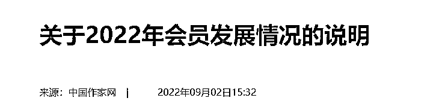
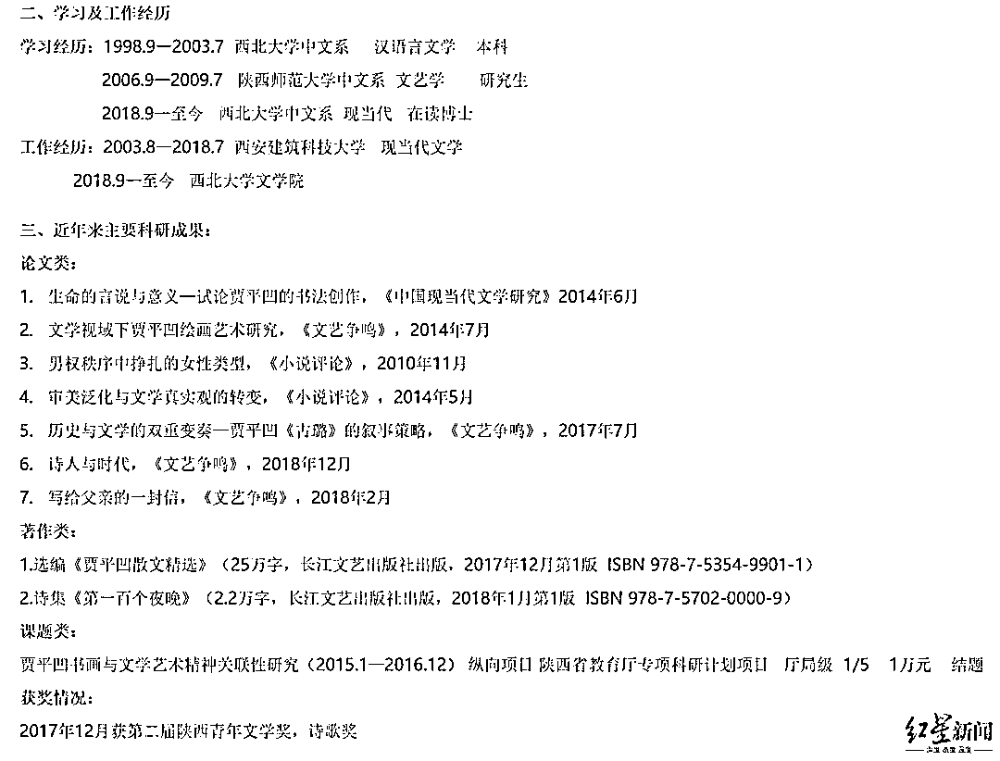
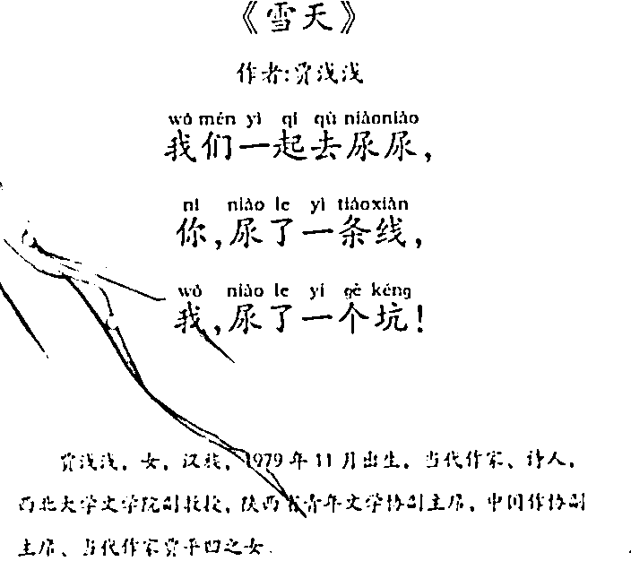
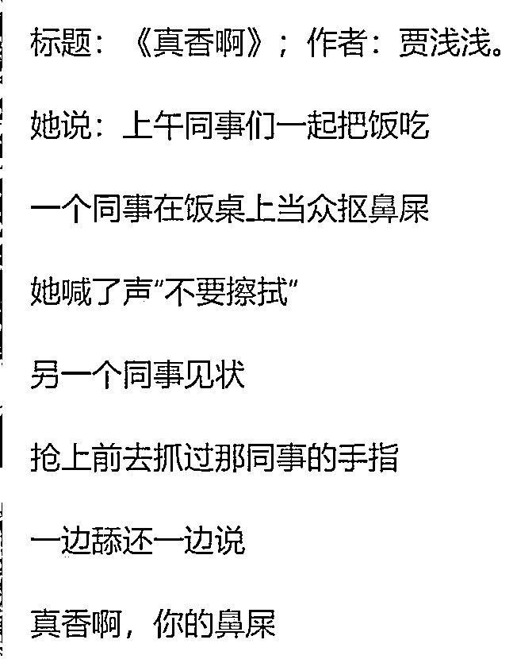
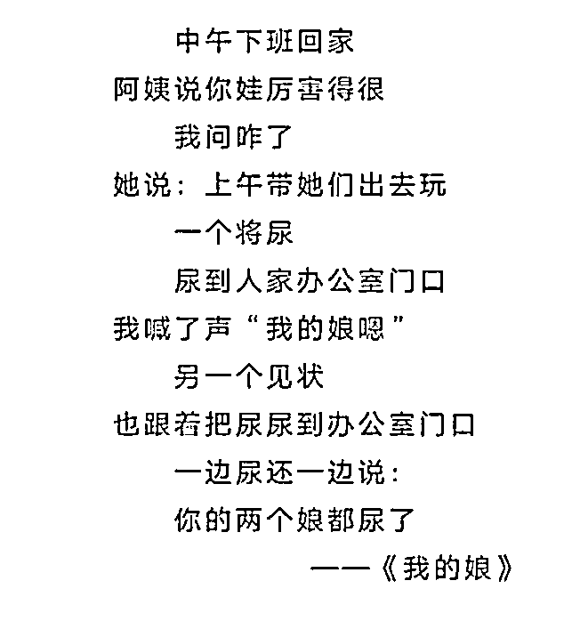
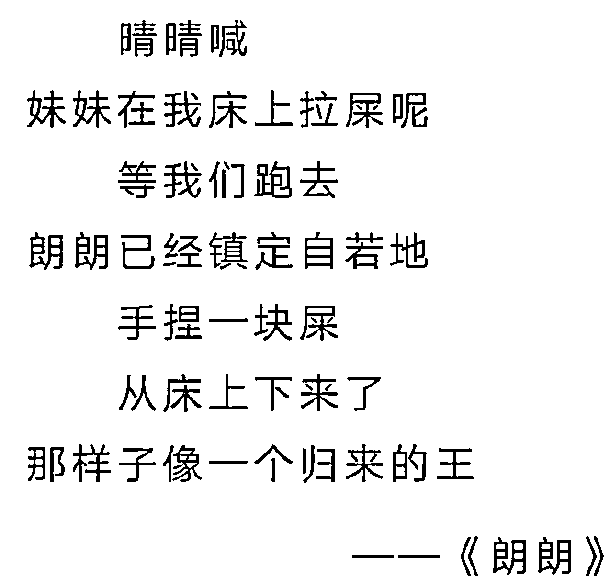
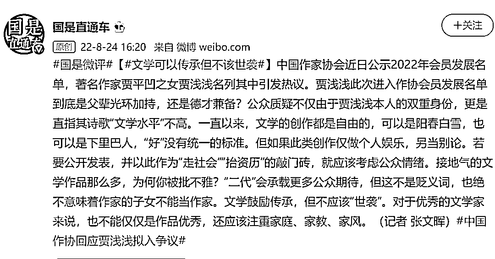

# 中国作协定了：贾浅浅，没入选！有同行称她“有才情”：庄子早就讲过“道在屎溺间”

> 原文：[`mp.weixin.qq.com/s?__biz=MzIyMDYwMTk0Mw==&mid=2247543239&idx=3&sn=a78e5a8e16298d75792fc56652e01b20&chksm=97cbe2ffa0bc6be941173db5421b0da5aa3cb1175ceeb6627069fd5bd96c530a2428a1c4b592&scene=27#wechat_redirect`](http://mp.weixin.qq.com/s?__biz=MzIyMDYwMTk0Mw==&mid=2247543239&idx=3&sn=a78e5a8e16298d75792fc56652e01b20&chksm=97cbe2ffa0bc6be941173db5421b0da5aa3cb1175ceeb6627069fd5bd96c530a2428a1c4b592&scene=27#wechat_redirect)

中国作协原副主席、著名作家贾平凹之女贾浅浅拟入中国作协所引发的争议，有了结果。

[`v.qq.com/iframe/preview.html?width=500&height=375&auto=0&vid=x3354pezvt9`](https://v.qq.com/iframe/preview.html?width=500&height=375&auto=0&vid=x3354pezvt9)

中国作家网 9 月 2 日消息：中国作协书记处认真听取各方意见后，研究决定不将贾浅浅列入 2022 年新会员名单。

贾浅浅，图据西北大学官网（红星新闻）

# **作协回应：**

# **不将贾浅浅列入新会员名单**

9 月 2 日，中国作家网发布《关于 2022 年会员发展情况的说明》，全文如下：

根据中国作家协会章程和入会办法要求，个人提出入会申请，应由省级作协等团体会员单位推荐，中央和国家机关的申请者应由两名个人会员推荐。对于从事文学创作的申请者，应符合下列申请条件之一：在中国大陆公开出版独立创作的文学作品不少于 3 部；在全国公开发行的文学期刊或报纸，发表作品不少于 15 万字，并在中国大陆公开出版独立创作的文学作品不少于 1 部；在全国公开发行的文学期刊或报纸，发表作品不少于 30 万字。会员发展申请审批程序包括网上填写申请、团体会员单位同意推荐、专家咨询、书记处同意公示、书记处审批公布等环节。

2022 年共有 2211 人符合入会申请条件。中国作协组织专家咨询评议，经投票产生推荐入会名单。8 月 16 日，中国作协书记处同意将名单予以公示，征询社会意见。

名单公示后，引起广泛关注。其中，贾浅浅引发争议。**中国作协书记处认真听取各方意见后，研究决定不将贾浅浅列入 2022 年新会员名单**。

今年，中国作协吸收了一批优秀的作家、评论家、文学编辑、文学组织工作者入会。其中，45 岁以下 332 人，新文学群体 228 人，基层作家和文学工作者的比例超过 70%。

感谢社会各界对中国作协工作的关心，对作家队伍和文学事业的支持。今后，我们将继续广泛听取社会意见，进一步做好会员发展工作。

据红星新闻，此前，中国作协创作联络部会员工作处工作人员曾针对此事回应称包括贾浅浅在内的 944 名拟发展会员，均是按照程序进行评审上报。对于网友质疑的问题，将会记录核实。

“公示结束之后，我们将会把公示期收到的情况，以及核实的情况再次上报到书记处，书记处开会确认之后才会公布（正式）名单，一般就是在几天内。”该工作人员称。

# **诗歌被指“屎尿屁”“回车体”**

公开资料显示，贾浅浅出生于 1979 年 11 月，现为西北大学文学院副教授，现当代文学专业在读博士，著名作家贾平凹之女。2018 年初，贾浅浅出版个人自选诗集《第一百个夜晚》。2020 年 3 月，出版诗歌集《椰子里的内陆湖》。

据西北大学官网的师资介绍，**其近年来个人的主要科研成果中有多篇论文及课题项目与其父亲的作品研究相关**。另曾获陕西省青年文学奖，诗歌奖。

贾浅浅个人履历及作品，图据西北大学官网

据红星新闻，关于对贾浅浅的质疑，2021 年初，一篇名为《唐小林：贾浅浅爆红，突显诗坛乱象》的文章爆红，作者唐小林批评贾浅浅诗歌是“回车键分行写作”，“这种白开水似的‘浅浅体’诗歌，**最显著的特点就是把无聊当有趣，把废话分成行**——仿佛是一路狂按回车键的产物”，由此引发网友对贾浅浅本人的质疑。

贾浅浅部分诗歌作品 图片来源：九派新闻视频截图 

贾浅浅部分诗歌作品 图片来源：网络

据大河报，贾浅浅的几首被指“屎尿屁”“回车体”的诗歌，遭到了一波又一波网友的嘲讽，甚至有网友开始了模仿创作，如网友“fang”:我/本来/不会作诗/因为学会用回车/所以/学会了/作诗。

# ****也有同行“仗义执言”：她很有才情****

中国现代文学研究会会员荣光启是在这次争议中鲜有发声的专业人士。他表示：**贾浅浅在诗歌造诣方面是够资格进入中国作家协会的**，大部分国人对诗歌的理解还停留在古代，对新诗的了解不够深刻，网友以偏概全，贾浅浅是有很多好作品的。

“就她的诗歌（水平）而言，**她应该是比普通的中国作协会员应该是要高一些的**。”荣光启说，“大家对她的意见仅仅是因为她的父亲是贾平凹，就像我们讨厌富二代一样，她是文二代。我们都会想当然的认为，她之所以加入中国作协、之所以有名、之所以在大学当教授什么的，都是因为她的父亲。（这件事）跟他的父亲没有直接关系。”

对于贾浅浅的诗，诗人、北京大学中文系教授臧棣表示：“**我觉得她是一个有才情的诗人。也是一个有发展前景的诗人**。”同时，对于屎尿是否能入诗，臧棣也给出了自己的看法：“当然。我的立场是，**在现代诗的强力面前，一切皆可入诗**。不要小瞧屎尿。庄子早讲过的，‘道在屎溺间’。所以，从大的立场讲，如果说我们的文学还有面对人生的真相人性的真相，那么，屎尿怎么就不能入诗呢？**将屎尿跟诗歌对立起来，在现代审美的逻辑自恰上，完全不成立**。”

诗人、中国社会科学院外国文学研究所学者戴潍娜介绍自己开会时见过贾浅浅，但没有交流，回忆其发言很真诚。“因为这个热点，才去读了一点她的诗，发现并不都是（被评论的那几首）那样子的，**她也写过一些语感很好的诗**。单揪住几行不放，这就跟郑爽事件里六小时的录音只放出几分钟是一种性质。但大众集体快感就是这样，抓住一个兴奋点，无限放大。”戴潍娜表示，“这是诗歌在这个时代的悲剧。你会发现，诗坛上真正好的诗，有力量的诗，或者哪怕就是贾浅浅个人最高水准的诗，是没有机会传播出去的。而最刺眼的东西会被无限放大，成为一个网络兴奋剂，成为能把所有人都吸 high 了的大瓜。我们这个社会没有耐心去读一行好诗，但一首烂诗，大家都饶有兴趣去踩一踩。”

对此，中新社国是直通车评论称：贾浅浅此次进入作协会员发展名单到底是父辈光环加持，还是德才兼备？公众质疑不仅由于贾浅浅本人的双重身份，更是直指其诗歌“文学水平”不高。

一直以来，文学的创作都是自由的，可以是阳春白雪，也可以是下里巴人，“好”没有统一的标准。但如果此类创作仅做个人娱乐，另当别论。若要公开发表，并以此作为“走社会”“抬资历”的敲门砖，就应该考虑公众情绪。**接地气的文学作品那么多，为何你被批不雅？**

“二代”会承载更多公众期待，但这不是贬义词，也绝不意味着作家的子女不能当作家。**文学鼓励传承，但不应该“世袭”**。对于优秀的文学家来说，也不能仅仅是作品优秀，还应该注重家庭、家教、家风。

延伸阅读:

[贾浅浅高考 200 多分，却上 211（她的诗曝光，震惊了网友）](http://mp.weixin.qq.com/s?__biz=MzIyMDYwMTk0Mw==&mid=2247542844&idx=1&sn=01887b794b4ec74a3abe16daf31cdd1c&chksm=97cbe304a0bc6a12ecf89d4eeb70ff29ebb15140970c966e8289958a33b6e4be8d330c189ef0&scene=21#wechat_redirect)

[贾浅浅的第一篇文章是如何发表的](http://mp.weixin.qq.com/s?__biz=MzIyMDYwMTk0Mw==&mid=2247542883&idx=4&sn=fec19002e47c3df2ea77150251fcb37f&chksm=97cbe35ba0bc6a4d71eeaeb2b5be5fcda8a1a14c4edc4e126033cf642f23b5407c6928ce8e90&scene=21#wechat_redirect)

来源：每日经济新闻综合自中国作家网、红星新闻、大河报、中新社-国是直通车、公开资料等

欢迎关注灰产圈社群服务号

