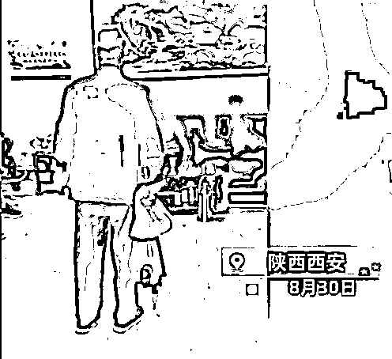
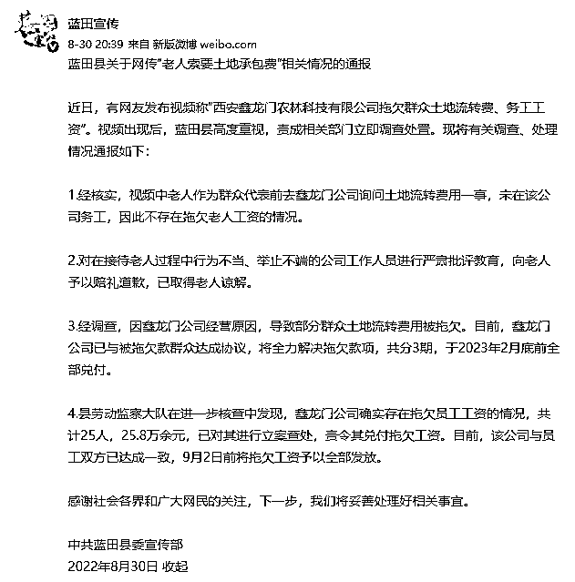
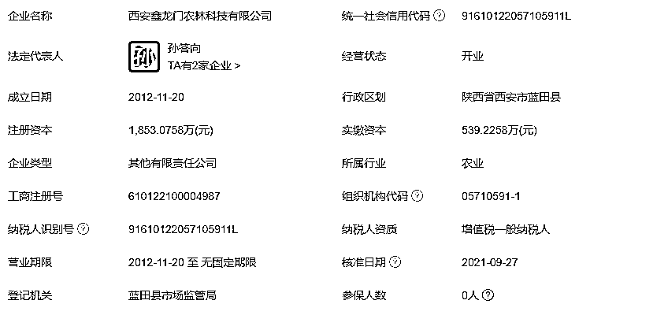
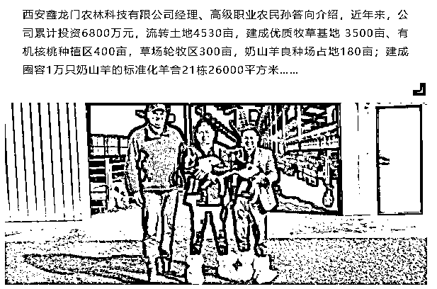
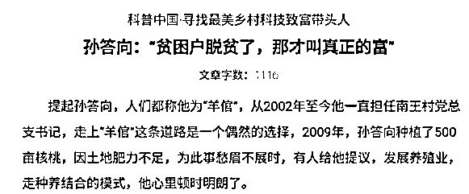
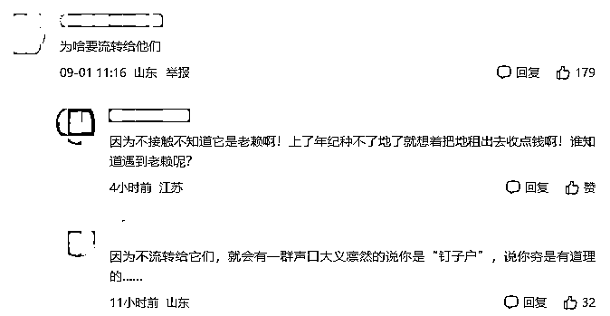
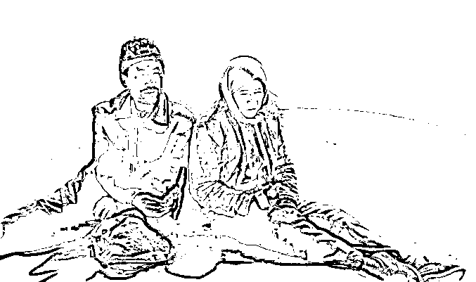

# 老人索要土地流转费遭群嘲，双新双创明星公司何以至此？

> 原文：[`mp.weixin.qq.com/s?__biz=MzIyMDYwMTk0Mw==&mid=2247543239&idx=6&sn=b11c71c55c121e2cb77e9f5189d03337&chksm=97cbe2ffa0bc6be9076f91243e02bec8fdf214ff34f7a9c4cd7f432dd74cb99e0fc217a0bd2d&scene=27#wechat_redirect`](http://mp.weixin.qq.com/s?__biz=MzIyMDYwMTk0Mw==&mid=2247543239&idx=6&sn=b11c71c55c121e2cb77e9f5189d03337&chksm=97cbe2ffa0bc6be9076f91243e02bec8fdf214ff34f7a9c4cd7f432dd74cb99e0fc217a0bd2d&scene=27#wechat_redirect)

最近看了一个视频。

一位风烛残年的老人站在一间房里的正中央，周围的人坐在“老板椅”上喝茶大笑。

老人卑微颤抖地讨要土地承包费，老板们明明都是欠款人，表情却高高在上戏谑得像是在看猴。

#**老人索要土地承包费被群嘲**#，嘲弄的是所有人的心。

<mpvideosnap class="js_uneditable custom_select_card channels_iframe videosnap_video_iframe" data-pluginname="videosnap" data-id="export/UzFfAgtgekIEAQAAAAAAVKs1ESdMHwAAAAstQy6ubaLX4KHWvLEZgBPE2aNsHGUbbN6CzNPgMItYutpBiMX-HGS42IELV4PC" data-url="https://findermp.video.qq.com/251/20304/stodownload?encfilekey=S7s6ianIic0ia4PicKJSfB8EjyjpQibPUAXolO1C2wYxyAF3G2Z7sIr44CCOENSdOPLUH9tAjAefDZ5t8epsZq9d1bz9Wmk8Hib21EtkSdhAtsC4DibjVFE8g81uw&amp;adaptivelytrans=0&amp;bizid=1023&amp;dotrans=0&amp;hy=SH&amp;idx=1&amp;m=&amp;scene=0&amp;token=AxricY7RBHdW7mr8lNHlp0P1ewAibpgnaZibpNDdpS5XAcRoTH6jfvMcHnXWRic3aVq6oWLPycQcXWU" data-headimgurl="http://wx.qlogo.cn/finderhead/ibq4aVwOt6HNqrr8OD3sCviaytF3B8TqCwHicxsuIanAJo/0" data-username="v2_060000231003b20faec8c6e48a1acbd3ce04ef33b077a1e41d0d3794ed88ea537878dbe65910@finder" data-nickname="灰产圈+" data-desc="西安鑫龙门农林科技有限公司违约拖欠农民土地流转费，并长期拖欠农民工资！！

视频中可以看出老人在索要工资时几名年轻小伙嘻嘻哈哈，满脸不屑…老人气的手都发抖了，希望当地的劳动执法监察大队出面解决[微笑]

最新情况更新:有网友咨询该公司人员，人员回应不牵扯农民工资问题，是在笑脸相迎，反而农民工的举动帮了我，等待发酵升级，并晒出一张“还款计划”

目前所知情况就这么多，坐等官方通报！！！ @灰产圈+ #土地流转" data-nonceid="8841682512818678805" data-type="video" data-width="1920" data-height="1080"></mpvideosnap>

***01***

***视频曝光引众怒***

如果不是互联网信息流的飞速扩散，我们可能很难想象生活中还有这样的画面。

8 月 30 日一段短视频引发众人关注：有网友称“西安鑫龙门农林科技有限公司拖欠群众土地流转费、务工工资”，一位**老人上门恳求结算，遭现场多名人员哄堂大笑**，气得老人手发抖。

老人恳求得卑微、衣服上沾满了泥土、还有提着布袋子气得颤抖的手；

另一面是满座人员的哄堂大笑、端茶品茗的悠闲姿态、房里还有一幅“坚决打赢扫黑除恶攻坚战”的宣传画。

一幕幕都形成了强烈的对比，究竟是哪位大师的春秋笔墨手法能拍出这样直戳心窝子的画面？

——原来是现实生活。

网友们怒批这帮人已经不知道礼义廉耻不知尊老爱幼，他们已经将最基本的尊重与礼貌都忘了一干二净。

如果面前站的是他们的父亲，他们也会这样大肆嘲笑吗？

他们作为负债人，有什么资格悠哉游哉地发笑？

又在笑什么？是笑老人不知天高地厚胆敢来要属于自己的钱？还是笑自己“手握钱权”？

8 月 30 日，蓝田县委宣传部通报调查处理情况：**已责令相关企业分期支付群众被拖欠的土地流转费用，及时发放拖欠的员工工资，并向老人赔礼道歉。**

这条好像大祸临头不得不选择息事宁人做法的通报，也挺让人无奈。

***02***

***老有所依竟成笑话？***

此则官方回应中可以梳理出几个重点：

1、收到舆论后才开始处理

2、该承包公司已经拖欠 2 年没有给承包

3、**明年二月份才能全部兑付**

被拖欠的都只是普普通通的农民，他们为了这点钱辗转反侧夜不能寐，你说明年二月一定兑付。

可他们肚子会等几个月才饿，疾病会等几个月才来，学费能等几个月再交，还是房贷可以等几个月吗？

tm 的，越想越觉得臭不要脸。

到底这公司是什么来头能这么牛这么拽？

爱企查显示，这个西安鑫龙门农林科技有限公司成立于 2012 年，位于陕西省西安市，是一家以从事畜牧业为主的企业。企业注册资本 1853 万人民币。法定代表人为孙答向。

经营范围为牛、羊养殖、销售；鲜奶销售等。

风险信息显示，该公司曾因口头约定承包合同完工后未支付工程款被起诉，并被法院判赔 6.6 万元。

注意，在网上扒这个公司老底时，发现**鑫龙门公司还曾被誉为“双新双创明星”**。

有文章称蓝田县是陕西省政府确定的 10 个奶山羊养殖基地县之一。位于蓝田县的西安市农业产业化龙头企业——西安鑫龙门农林科技有限公司以奶山羊良种育繁推为依托，**带领群众共同致富**，成为当地的双新双创明星。

企业宣传的报道里明晃晃地写着：鑫龙门公司 2015 年开始建设陕西省鑫龙门现代农业园，以奶山羊养殖为依托，带领群众共同致富，在 5 年的发展过程中，累计投资 6800 万元，流转土地 4530 亩，逐渐摸索出“种植+养殖+加工+销售+互联网+”的三产融合经营模式。

**2019 年，有 67 户贫困家庭从鑫龙门公司获得分红，每户 1000 元；带动贫困户就业 15 人，带动贫困家庭 129 户。**

或许这段数据曾经是真的，但现在西安鑫龙门农林科技有限公司拖欠群众土地流转费涉嫌违法摆在眼前，面对上门维权老人一阵群嘲哄笑，把老人气得瑟瑟发抖更是态度嚣张、性质恶劣、令人发指。

人民日报评论此事问他“于心何忍”，众多媒体质问他“底气”何来？

土地是农民的命根子，土地流转本意是想让双方互惠互利，在这过程中，却侵犯处于弱势一方的农民，他们的合法权益谁来维护？

如何监督涉农企业的经营行为？又如何从根本上维护土地流转的合法合规合理？

眼下，蓝田县的土地流转费拖欠问题暂且有了个说法，那其他那么多乡村呢？

今日求告无门利用网络舆论把心酸都说尽才得以暂解，明天又将有多少同样的苦难暴露出来？

那些守着农村土地却被拖欠的老人是不是都要以此为模板才有出头之日？如果没有引起轩然大波，如果没有拍下视频，如果对方以更强硬的手段把这些事都掩埋起来呢？ 

***03***

***不要让舆论成为求助者最后的手段***

命运不够仁慈，现实还要落井下石。

虽然不是一样的剧情，但索要土地流转费的老人让我想到了最近看的《隐入尘烟》，两个人的形象很接近。

电影的主人公贵英常年在哥哥嫂子家过着被人嫌弃的生活，住在风吹雨淋的木棚，气虚体寒，一条腿还瘸了，干不了重体力活；且患有尿路疾病，不分时间场合都会小便失禁，处于生活的底层。

于是将他介绍给同样处于社会底层的大龄单身汉马有铁，有铁是村里“最穷的人”，只是守着一头驴过日子。

两个苦命的人都是家里人的“负担”，被“安排”在一起。

两人互相心疼互相关心，互相给对方活下去的希望，真诚且坦然，但生活没有善待两人，他们的死亡来自每一个人的重击。

正如电影中的一句话：“**金钱流向了不缺钱的人，爱也流向了不缺爱的人，苦难也都流向了能吃苦的人**”！

有人在苦难中坚韧不拔，有人还对苦难者重拳出击。

我们为电影里的有铁贵英心酸流泪，为现实视频里的老人愤怒不平。

我们谈论法律，谈论权益，偏偏不敢谈论‘穷人的权益’。

最后，小呸仍是那句话：不能事事寄希望于舆论，舆论讨公道的次数多了，正常的维权渠道就无效了。

如果什么事情都要靠曝光、靠舆论来施展压力，那真的很可悲……

来源：黑白呸

欢迎关注灰产圈社群服务号

