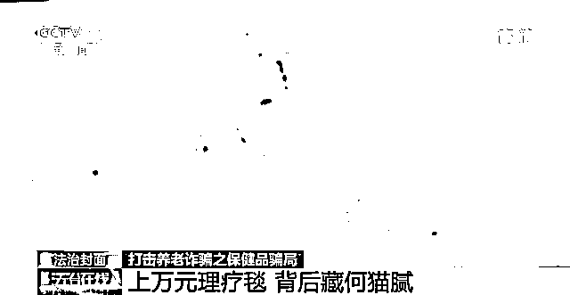
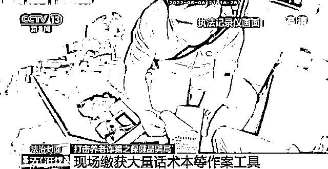
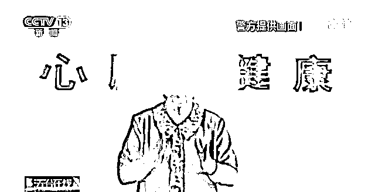

# 上万元理疗毛毯背后，藏了何种猫腻？

> 原文：[`mp.weixin.qq.com/s?__biz=MzIyMDYwMTk0Mw==&mid=2247543239&idx=7&sn=41013f6a2297cb6a1aa786190496d57b&chksm=97cbe2ffa0bc6be95898da47f47c2a780e7100686ef6a44524f5c75f649c054cff7371fbbb8c&scene=27#wechat_redirect`](http://mp.weixin.qq.com/s?__biz=MzIyMDYwMTk0Mw==&mid=2247543239&idx=7&sn=41013f6a2297cb6a1aa786190496d57b&chksm=97cbe2ffa0bc6be95898da47f47c2a780e7100686ef6a44524f5c75f649c054cff7371fbbb8c&scene=27#wechat_redirect)

近日，深圳警方破获一起天价保健品诈骗案件，家住深圳的刘女士在当地一家养生馆上了一堂免费的养生课，就花一万多元买下了一条理疗毛毯。

**上万元理疗毯 背后藏何猫腻？**

[`mp.weixin.qq.com/mp/readtemplate?t=pages/video_player_tmpl&action=mpvideo&auto=0&vid=wxv_2487727110493552643`](https://mp.weixin.qq.com/mp/readtemplate?t=pages/video_player_tmpl&action=mpvideo&auto=0&vid=wxv_2487727110493552643)

据刘女士回忆，当时她听朋友说，在这家店听养生课有免费的鸡蛋领，于是她抱着试一试的心态就去了这家养生会馆。

没想到店里的老人非常多，业务员也十分热情，不仅给他们介绍了一些基本的养生常识，而且还为每个人都做了免费体检，这让在场的老人们都很开心，现场的气氛也非常热闹。

现场做完体检后，体检报告很快就出来了。这个免费的体检报告显示，刘女士身体存在一些健康问题，需要好好调理。之后，业务员热心地向她介绍了店里的特效理疗产品，一万多元的理疗毛毯，称这条毛毯对调理刘女士的身体有奇效。

此外，业务员还告诉刘女士，在购买了产品后她可以成为店里的会员，以后就有资格经常来店里领取鸡蛋、米面等礼品。在业务员热情的推荐下，刘女士头脑一热，就买下了这条一万多元的理疗毛毯。

诈骗分子一通忽悠，不仅能把普通的毛毯包装成具有神奇疗效的理疗毯。同样，普通的食品饮品也会被诈骗团伙包装成能够治病的神药。

更令人气愤的是，只要老人购买一次，团伙就利用各种手段让老人不停买下去，甚至还编造出耸人听闻的理由进行恐吓。

**套路解析******0****1****

******为了能够成功实施诈骗，这些不法分子往往会采取循序渐进的方式进行作案，一步一步将老人带进诈骗陷阱。******

******0****2******

********为了获取老人的信任，不法分子首先会打着免费赠送礼品、免费体检、免费旅游等幌子，博得老人的好感，然后再通过嘘寒问暖等手段进一步拉近与老人的关系。********

********0****3********

**********最终以关心老人的身体健康为由，通过虚假宣传、夸大疗效的方式，向老年人高价销售保健品。**********

****************

**********警方提醒：**********

********要识破此类保健品骗局其实并不难，首先要警惕各种以免费为名的保健品推销活动，不轻信、不购买；其次要养成正确的就医看病习惯，不要相信所谓专家的夸张宣传和神奇疗效，更不要相信有包治百病的灵丹妙药。********

********在很多保健产品诈骗中，骗子会对老人关怀备至，嘘寒问暖。子女要更多和父母沟通交流，关心陪伴才是最好的“保健品”。********

********不法分子利用老年人********

********信息闭塞、认知较弱等特点********

********炒作概念，虚假宣传，设置陷阱********

********骗取老年人钱财********

********“养老”诈骗还有哪些套路呢？********

**********#常见养老诈骗套路#********************0****1**********************提供虚假养老服务************

********此类违法犯罪主要表现为利用上门照料、机构托管、提供床位等形式，通过诱骗中老年人签订合同、缴纳会费、购买养老床位、预交养老服务费用等手段，非法占有他人钱财，涉嫌合同诈骗、普通诈骗。********

**********0****2**********************投资虚假养老项目************

********此类违法犯罪主要表现为以投资养老保险项目、投资开办养老院、购买养老公寓、入股养生基地、售后定期返点、高额分红等方式，涉嫌诱骗中老年人参与非法集资或非法吸收公众存款。********

**********0****3**********************销售虚假养老产品************

********此类违法犯罪主要表现为通过提供免费旅游观光、情感陪护、虚假宣传等手段，采取商品回购、寄存代售、消费返利、会议营销、养生讲座等方式，诱骗中老年人购买价格虚高的保健品或者假冒伪劣产品，涉嫌销售假冒伪劣商品和普通诈骗。********

**********0****4************************虚假宣称以房养老**************

********此类违法犯罪主要表现为通过养老形式讲解和推介，诱骗老年人形成房屋产权“倒按揭”消费理念，与中老年人非法签订房产抵押担保的借贷合同或相关协议，诱骗中老年人将抵押房屋获得的资金购买其推介的所谓理财产品，从而进行诈骗或者非法集资。********

**********0****5**************************虚假代办养老保险****************

********此类违法犯罪主要表现为银行、保险机构的工作人员虚构或夸大保险项目收益，隐瞒保险理赔真实程序，设置陷阱，诱导消费，涉嫌合同诈骗；有则冒充银行、保险机构工作人员以代办“提前退休”“养老保险”等由，收取中老年人的材料费、好处费，以非法占有为目的诈骗受害人交纳的保险金。********

**********0****6****************************开展虚假养老帮扶******************

********此类违法犯罪主要表现为假借义务诊疗、心理关爱、直播陪护、慈善捐助志愿者服务、组织文化活动等形式获得中老年人的信任后，以多种形式对中老年人实施诈骗。********

**********0****7****************************** “投资理财”骗局********************

****“投资理财”骗局受害人以老年人居多，通过赠送小礼物等，吸引老年人目光，接着以开推介会、知识讲座等方式，虚构些高端大气上档次的投资项目，编造虚假文件，利用老年人信息闭塞的特点骗取信任，随后以高利息、高回报、低风险为诱饵来使得老年人投资，甚至以拉人头投资可以享受提前返利等形式诱骗老年人加大投入或者拉人投资，进行非法集资，最后用老年人投资的钱进行部分返利后潜逃。****

******0****8**************************“低价旅游”骗局********************

“低价旅游“骗局，骗子往往利用老年人外出游玩的热情及节俭的生活习惯，以不合理的低价甚至免费组织旅游活动，吸引老年人参加组团，随后，在旅游过程中安排各种购物环节，将商品以远高于市场价格卖给老年人进行牟利。

**0****9********************“黄昏恋”骗局******************

“黄昏恋”骗局其实就是“杀猪盘”骗局的一种，主要针对独身老人，通过网络发展成为网恋后，通过编造各种理由索要钱财，随后拉黑对方，完成诈骗。

**10****冒充公检法骗局**

诈骗分子冒充公安、检察院、法院等工作人员，伪造“红头文件”，利用老年人法律意识低和恐慌心理，称要执行逮捕，须缴纳保障金自证清白。

**警方提醒**

**虽然这些骗局形式多样**

**但其实都有着相似的套路**

**都是利用了老年人关注健康**

**渴望被关注等心理特点**

**让老年人一步步落入圈套**

**要主动向家中老人**

**科普各类常见的套路和骗局**

**提醒他们小心陌生人**

**谨防被骗**

**发现被骗要第一时间报警**

**来源：央视新闻，利箭在出击**

****

**欢迎关注灰产圈社群服务号**

****

****