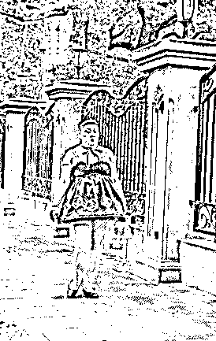
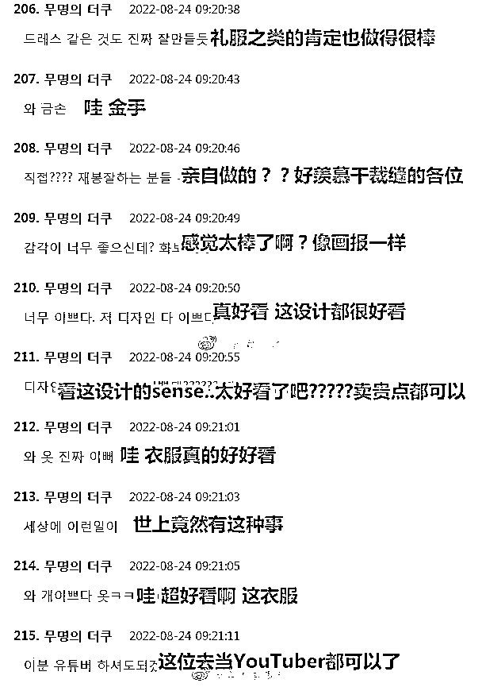

# 火出外网的上海“安福路小公主”的故事：即便经历苦难，也要坚持热爱

> 原文：[`mp.weixin.qq.com/s?__biz=MzIyMDYwMTk0Mw==&mid=2247543306&idx=3&sn=c0147d0bbb35a593daaf911221edf87a&chksm=97cbe132a0bc68249b6e58709fd72d531de1f02ee8a404751079333d43ba3e37c3231bdec2b8&scene=27#wechat_redirect`](http://mp.weixin.qq.com/s?__biz=MzIyMDYwMTk0Mw==&mid=2247543306&idx=3&sn=c0147d0bbb35a593daaf911221edf87a&chksm=97cbe132a0bc68249b6e58709fd72d531de1f02ee8a404751079333d43ba3e37c3231bdec2b8&scene=27#wechat_redirect)

不知道大家有没有听过

**“安福路小公主”**

就算没有听说过

也一定对她的照片有点印象

头戴小皇冠、身穿洛丽塔 

但却留着寸头造型

这位独特造型的阿姨

就是“安福路小公主”啦

她经常在人来人往的安福路上走动

因其奇特的造型

以及每天都会换各种各样的 lo 裙

这位阿姨逐渐成为了安福路的宝藏之一 

各路街拍达人都会蹲点安福路

只为了拍到她的照片

久而久之

阿姨逐渐在网络上走红

并被网友们亲切地称为

“安福路小公主”

安福路小公主如此坚持自我的个性

还是相当讨人喜欢的

而且小公主也一点也没有网红架子

对谁都是一副爱答不理的样子

却也不怎么排斥别人拿手机拍她

别人在路上和她打招呼

“阿姐侬好。”

小公主还会开玩笑地回：

**“叫我阿姐组撒？叫阿妹！”**

[`mp.weixin.qq.com/mp/readtemplate?t=pages/video_player_tmpl&action=mpvideo&auto=0&vid=wxv_2559845786281525248`](https://mp.weixin.qq.com/mp/readtemplate?t=pages/video_player_tmpl&action=mpvideo&auto=0&vid=wxv_2559845786281525248)

不过人红是非多

在我们喜欢她坚持自我

不在乎他人看法的个性时

也有不少人对她嗤之以鼻

觉得她形象奇特，博人眼球

emmm……这些人发言前 

恐怕从来没有试着去了解过

安福路小公主吧？

**穿 lo 是爱好，却意外走红   **

**提到“安福路小公主”的走红**

**就不得不提到**怪咖老李****

**全网首个拍“小公主”的摄影师**

**也是系列视频数量最多、热度最高的博主**

********

**△ 本推文采用图片多数为老李拍摄，如侵立删**

**他与安福路小公主的故事**

**还得从去年的十月说起**

**那时在安福路扫街的老李**

**被小公主的穿搭吸引**

**于是便开始拍摄她的照片**

**老李说，因为安福路是著名的网红街拍街**

**所以大部分被拍摄的年轻人**

**都是乐意被拍摄的**

**但那个时候的小公主却不是这样**

**她会很警惕地问老李：**

****“你为什么要拍我？你拍我干嘛？”****

****

**到了今年一月时**

**老李第一次把小公主的照片发在了小红书上**

**出乎意料地在小红书上爆火**

**小公主一下子就出了圈**

**随之而来的是网友热议**

**有人觉得她坚持自我值得学习**

**有人觉得她扮丑影响市容**

**当然，出圈后**

**当然引来不少摄影师**

**慕名到安福路上蹲点**

**只为能拍到小公主的照片**

****

**关于安福路小公主的争议点也很明显**

**无非是“她为什么要这么打扮？”**

**“她不会觉得自己丑吗？”**

****

**而这些问题的答案**

**比大家想象的都要简单**

****因为喜欢****

****

**小公主从以前开始就很喜欢甜美风的 lo 裙**

**不仅喜欢打扮，更喜欢逛街**

**出门基本靠步行**

**每天活动的范围也只集中在**

**人民广场、南京西路、静安寺商圈**

****

**出乎意料的是** 

**小公主虽然喜欢购物**

**却不会网购**

**因为她根本**不用智能手机****

****于是每次买裙子****

****她都会去线下店里亲自挑选****

****买回家后再自改成适合自己的尺码**** 

********

****关于日常生活中的小公主本人****

****其实也只是一个普通人****

****除了爱打扮爱逛街以外，还喜欢吃甜食****

****每次逛街都会见她手里拿着一杯奶茶****

****不会做饭，经常从外面买饭带回家吃****

****因为今年上海疫情的缘故****

****还难为小公主自己学会了做菜****

********

****因为不用智能手机****

****小公主的生活很简单****

****平时也只用老式手机和亲近的人打打电话****

****最上心的事还得是出门前的打扮****

****自从拍她的人越来越多了以后****

****小公主也开始在意自己上不上镜了****

****小包常备补妆工具****

****一看有人拍她，立马拿出粉饼开始补妆****

********

****说起来一夜成名****

****对不少人而言都是梦寐以求的事****

****但从最初到现在****

****小公主本人却从未对此表现过任何兴趣****

****比起这些，她更在乎自己在镜头里美不美**** 

****这一年来，小公主身上唯一发生的改变**** 

****只有对自己会被拍摄这件事没有这么反感了****

****前段时间，有个摄影师正面拍她时****

****她还会提醒一句：****

****“小心后面的车。”****

********

****从年初爆火到现在**** 

****虽然收获了不少的热度与关注****

****但安福路小公主本人****

****至今都没在任何社交平台上有账号****

****也一次都没有主动出现在媒体的镜头面前****

****尽管网上对她议论纷纷****

****但小公主还是那个小公主****

****我行我素、丝毫不在意他人目光的小公主****

********

******饱受争议的小公主 乐观坚强的一枝花 ******

******尽管网上对她褒贬不一****** 

******却无法阻挡小公主越来越火的势头******

******甚至已经火到了外网******

************

******只是网上的键盘侠却从来不会放过任何人******

******将小公主从性别到穿着到这样穿的理由******

******都全部指点了一遍******

******讲话要多难听有多难听******

************

******不知道这些人******

******是出于嫉妒还是别的什么原因******

******才会对一个素不相识的普通人如此恶言相向******

************

******键盘侠们绝对不会知道******

******小公主如今的寸头造型、臃肿的身材******

******都是因为她曾经生过的一场大病******

******病魔让她的秀发全部掉光******

******而身材也因为吃药的激素而不断发胖******

************

******一位在附近住了十多年的店主说：******

******“打我搬来起，见到她一直都是这么穿的。”******

************

******从来不是为了博眼球或是别的什么****** 

********小公主一直都只是********

******在坚持自己热爱的事情而已******

****不在乎他人的看法****

****不在乎他人的评价****

****只在乎自己喜不喜欢****

****随性的看得键盘侠们气得牙痒痒****

****却也自由的看得他人羡慕至极****

****不用智能手机对小公主而言可能是件好事****

****希望她继续在这个纷繁复杂的世界做她自己****

****做安福路上出淤泥而不染的“一枝花”****

********

 ****来源：脊梁 in 上海 SH****

********

****欢迎关注灰产圈社群服务号****

********

********