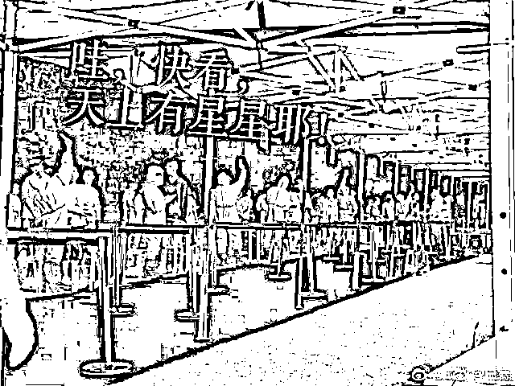
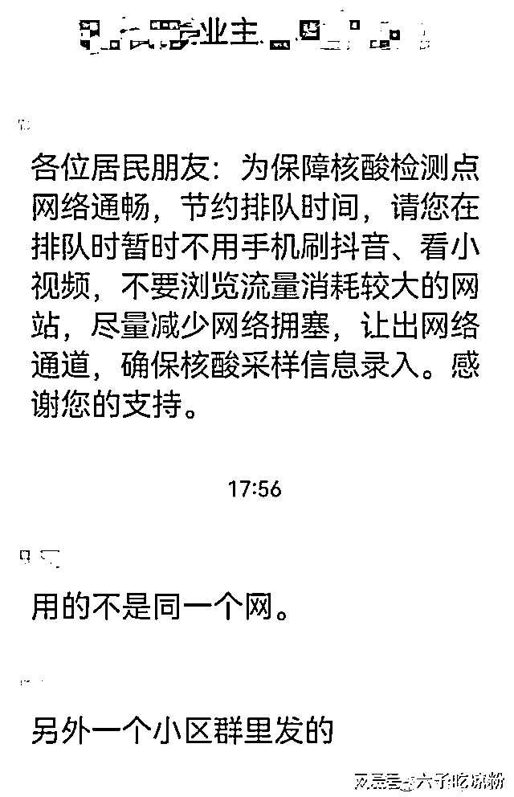
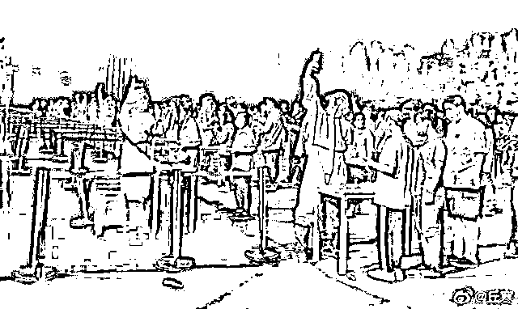
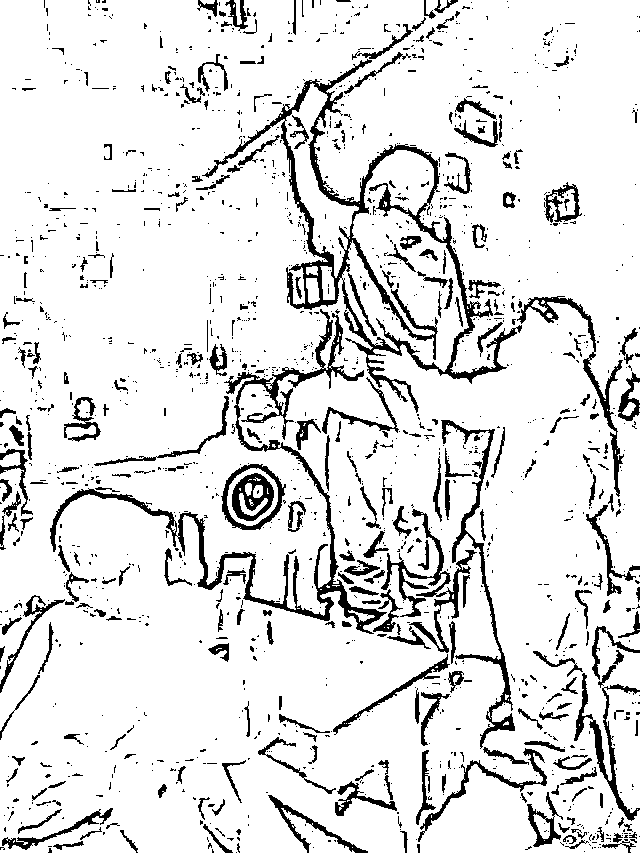
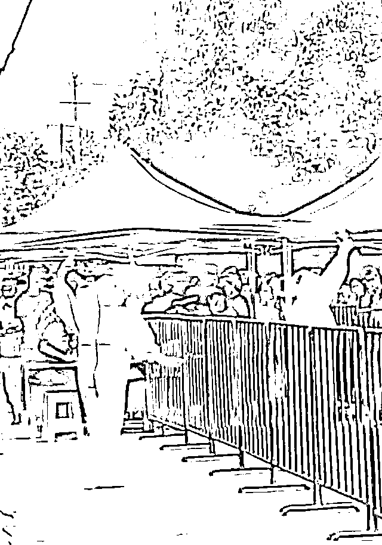
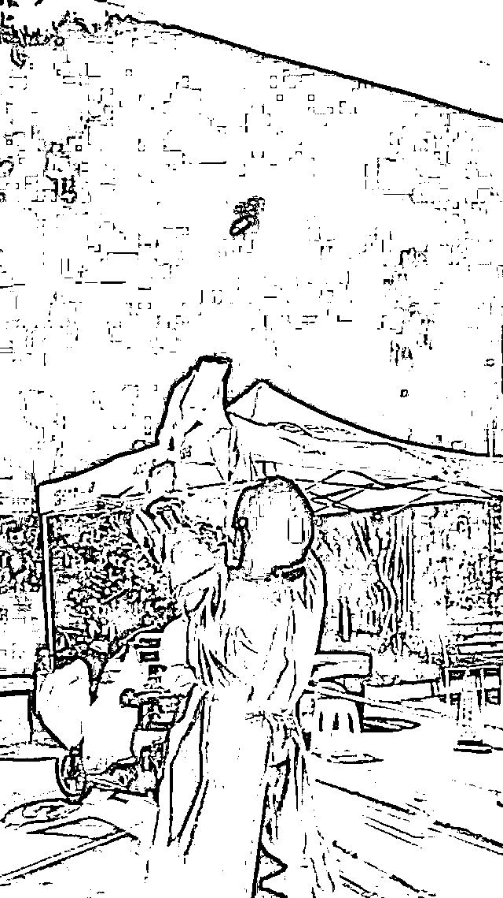
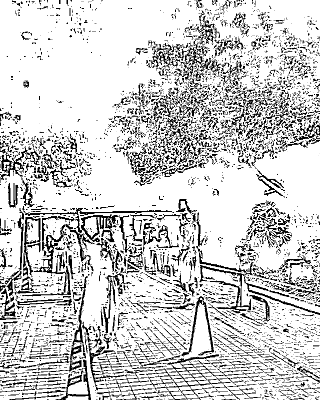
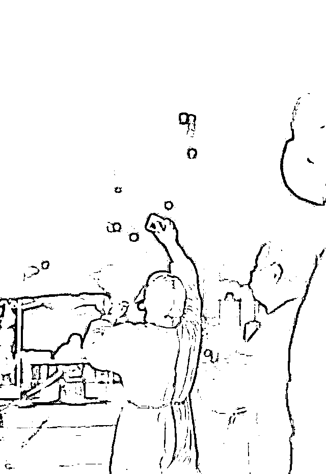
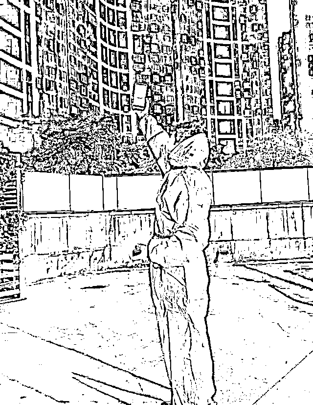
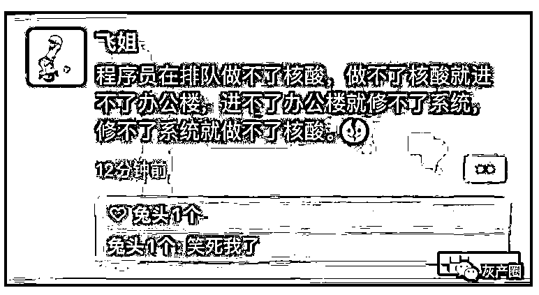

# 昨夜的成都核酸系统，不经意间造就了无数世界新闻摄影大奖

> 原文：[`mp.weixin.qq.com/s?__biz=MzIyMDYwMTk0Mw==&mid=2247543306&idx=4&sn=a2c956bc228527e1cfa6244d0a38695f&chksm=97cbe132a0bc68243e35179627e04330861f242f5227f443dc2ecf88790aafb95d8370ba9853&scene=27#wechat_redirect`](http://mp.weixin.qq.com/s?__biz=MzIyMDYwMTk0Mw==&mid=2247543306&idx=4&sn=a2c956bc228527e1cfa6244d0a38695f&chksm=97cbe132a0bc68243e35179627e04330861f242f5227f443dc2ecf88790aafb95d8370ba9853&scene=27#wechat_redirect)

疫情之下，像成都这样 2100 万人口的大城市，核酸系统哪怕崩溃一小会，也会让成千上万的居民被迫“罚站”。更何况，这一次，成都的核酸系统崩的还不仅仅是一小会...

昨日，根据网上网友们的爆料，成都核酸系统频繁发生崩溃的现象，为了能成功做上核酸早点回家，无论是“捅人”的还是“被捅”的，都可谓是无所不用其极，想尽了办法。

网传就有部分社区出了主意：“排队测核酸的时候，不刷抖音、不看小视频、不浏览流量消耗大的网站。”把足够多的手机信号，让路给核酸系统！

更加经典的是，由于核酸系统录入困难，为了寻找更佳的“信号角度”，不少人将手机举的高高的，这一幕幕被其他居民拍下，不经意间这些照片的构图竟与拿过世界新闻摄影大奖（荷赛奖）一等奖的作品几乎一模一样。

2014 年 2 月 14 日 21:00，美国摄影师 John Stanmeyer 凭借作品《信号》获得年度图片奖和当代热点类单幅一等奖。

还有人为此打趣道：8 年了，看来人类在寻找信号这件事上，没有一点点进步...

附：2022 年世界新闻摄影大赛成都赛区部分参赛作品：

延伸阅读：

**成都核酸检测系统又又又又又崩溃，“吹牛”不到一个月就惨遭打脸？**

近日，很多成都市民在社交软件上发布消息称：成都核酸检测系统崩溃。“前几天已经崩过了，今天又崩了”、“去了两个检测点，都因为系统崩溃做不了”。还有市民表示：“昨天晚上已经恢复了正常，崩溃只是那一时，因为人太多了。”

真是因为人多吗？难道没有应急预案？这些市民关心的问题，其实在不到一个月之前的媒体报道中，四川省核酸检测系统可是被当作正面报道的，因为他们扛住了成都 7·15 和 7·20 两轮关联疫情的冲击。

四川省核酸检测系统由技术服务中心承建，于 2021 年 1 月 27 日上线并使用至今。在今年 8 月 10 号，曾有媒体记者进入四川省大数据技术服务中心采访。

据当时的报道称：“早晚 8：00-9：00 是核酸高峰期，技术人员会重点保障系统的平稳运行，加强整个系统的状态监控，比如 CPU、数据库、网络宽带，有没有黑客攻击安全防护等各个指标的监测。” 相关技术人员还对记者介绍：“我们全面组织技术力量，明确细化分工，实现 24 小时全天候无缝监测。同时，对“采样、送检、检测、上传、查询”全链路进行限流、排队等措施，有效缓解系统的瞬时冲击压力，保障全省核酸检测系统平稳运行。”此外，当时的新闻报道中，技术人员还透露：省核酸检测系统将进行迭代更新，时间大概需要一个月左右，预计国庆节前后完成。

然而，没等到国庆节的到来，甚至距离那次采访结束不到一个月的时间，系统就崩溃了。

来源：小萝卜资讯 ，喻言亭阁

欢迎关注灰产圈社群服务号

