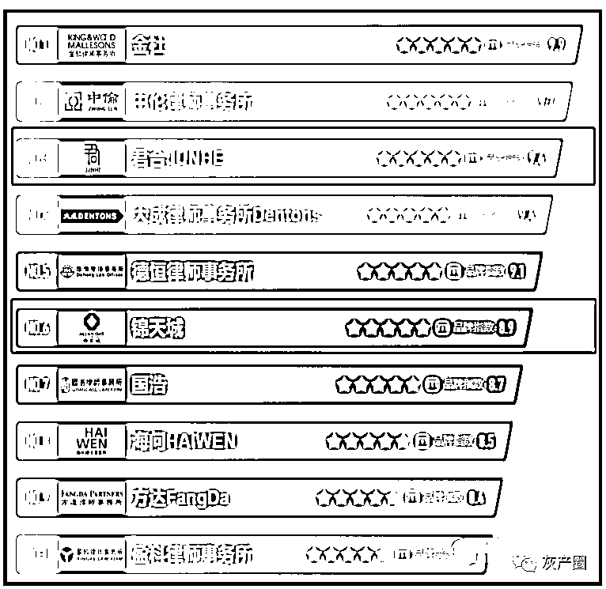
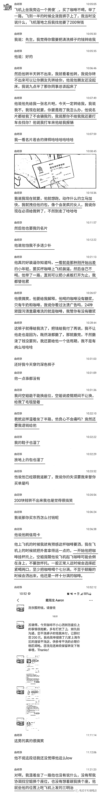
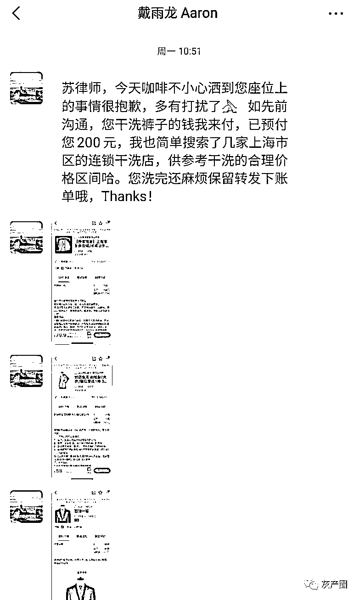
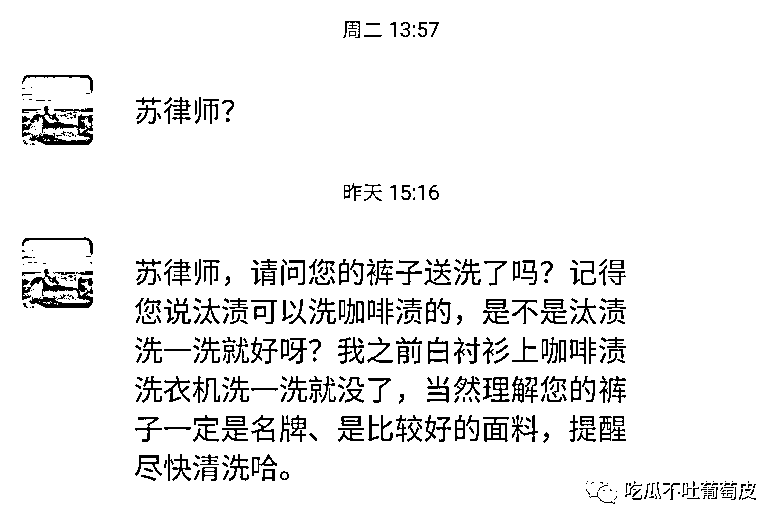
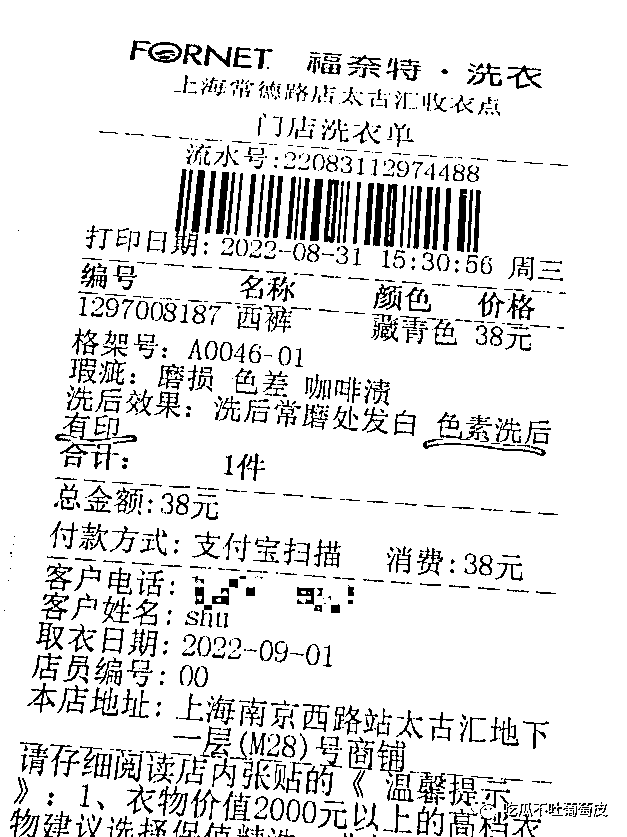
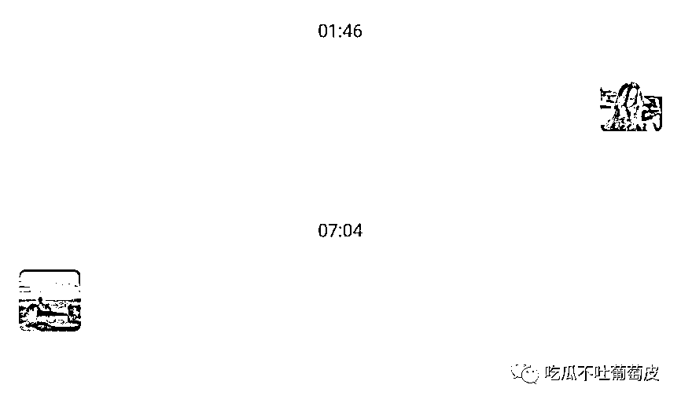

# 知名律所女律师“湿身”事件

> 原文：[`mp.weixin.qq.com/s?__biz=MzIyMDYwMTk0Mw==&mid=2247543306&idx=5&sn=fb55b68e8fe443c7a24988d7e2c83899&chksm=97cbe132a0bc68248d42460e6c7625fe93a22fc9f70782c657469992e1563c0f1feec5b42371&scene=27#wechat_redirect`](http://mp.weixin.qq.com/s?__biz=MzIyMDYwMTk0Mw==&mid=2247543306&idx=5&sn=fb55b68e8fe443c7a24988d7e2c83899&chksm=97cbe132a0bc68248d42460e6c7625fe93a22fc9f70782c657469992e1563c0f1feec5b42371&scene=27#wechat_redirect)

今天在瓜群里吃了个非常有意思的瓜，一位知名律所锦天城（十大律所 top6）的苏律师和另一位红圈所君合（十大律所 top3）的戴律师在同一航班，虽然是同行但两人素不相识，戴律师不小心把咖啡洒到了苏律师身上，然后苏律师半湿着身子，十分窘迫。 

这期间戴律师态度冷漠，无任何歉意。苏律师要求戴律师赔偿，最终戴律师给苏律师转账 200 元，并要求其洗衣后多退少补。 

两位律师最终就 200 元洗衣费（后修正为 32 元，进行了多退少补）的问题达成了一致，**但因双方颜值不足没能演变为浪漫邂逅，反而导致了互联网文艺复兴。**

事件详情请先看苏律师的吐槽聊天记录。

事后，戴律师多次联系苏律师要求提供洗衣发票，并进行退款，苏律师如数转款。

最后的最后，苏律师气不过，写了两页字近 1600 字的情况说明，发至戴律师所在律所，控诉戴律师的行为。 

* * *

尊敬的蔡婧律师、胡敏之老师及见此邮件的其他君合老师：

见信好！我是锦天城执业律师苏袁灵，发此邮件系因贵所并购六组实习律师戴雨龙在处理其一过失中的方式方法实在有违我心中对贵所的一贯景仰及对贵所律师的一贯尊重，故特此反映相关情况，与贵所沟通下我心中所想。具体如下：

**关于背景事实**

2022 年 8 月 29 日晨，我搭乘东航 MU5395 航班赴郑州出差，戴律师是我左侧邻座。飞行中戴律师一直手持一杯咖啡（拿铁），不喝，满的，直至空姐开始派发餐食后，将咖啡放置在小桌板上。**戴律师在准备用餐的过程中，把咖啡从左侧全泼在我的裤子、鞋子及放置在脚下的包上**，而戴律师本人很幸运地躲过了。

我被泼咖啡后，戴律师没有提出过和我换座位，也没有请空姐帮我换座位，我只得自己联系空姐，但**空姐表示疫情期间无法调位，我只能半身湿着飞到郑州。**

降落后，戴律师也未主动提出赔偿或其他补偿方式，我终于忍不住问他是否应该把清洗裤子的钱转我，戴律师操作手机后表示转不出钱，并提出让我先将裤子送洗，后续采取实报实销的方式向我转账。我便询问他平时如何购物，他表示均刷信用卡，并向我出示名片，表示日后再转。我实在无法相信，要求他当场转，他倒腾半天后向我转了 200 元，并也索要了我的名片，要求我凭洗衣票据多退少补。

别过后不久，戴律师发来微信，推荐连锁洗衣店，让我参考合理价格区间，并让我注意转发洗衣单据。

后面两日，戴律师每日催问洗衣进展，并有诸如“当然理解您的裤子一定是名牌、是比较好的面料”的无关表述。

8 月 31 日，我将裤子送洗，花费 38 元，洗衣单据标注洗后效果为“色素洗后有印”。然后，我将 162 元退还戴律师。

**关于我的想法**

首先我确认戴律师无论在过失发生还是过失处理上都无违法违规之处，但是否合法合规就是一个高尚的人、一个脱离了低级趣味的人呢？我想并不尽然。具体如下：

1\. 过失泼我咖啡反映了戴律师缺乏风险防范意识，并让我对其是否能够全面把握及控制工作中的交易风险产生怀疑。满杯咖啡、并不平稳的飞机、局促拥挤的经济舱、空姐的友善提醒，这些因素理应让戴律师从登机就意识到，如果实在要一展手握咖啡登机的商务格调，至少喝到个七分满避免泼洒，但戴律师没有预见或者已经预见但轻信能够避免，其风险防范意识由此可见一斑。

2\. 怠于处理自己过失造成的后果反映了戴律师缺乏基本的涵养，也不符合“君子之合”这一君合创始人及合伙人共同的理念。无论是泼我咖啡后不主动帮忙调座，还是降落后想一走了之，都展现了戴律师以自我为中心、发生问题后三十六计走为上计的为人处世风格，其实在难称“君子”，实在与“君合之道”相去甚远。

3\. 戴律师无钱转账处处信用卡的说辞有辱君合薪金待遇。戴律师执着于手握咖啡登机，勇于发名片证明身份，却连 200 元都无法转出，并声称处处刷信用卡，实在有辱君合享誉业界的薪金待遇。

4\. 戴律师催促洗衣、催要洗衣票据、催讨剩余费用，既反映了戴律师以钱为大的价值观，也反映了戴律师刻板教条的争议解决思路。戴律师应该是无法想象我是怎么穿着饱含牛奶和咖啡的裤子鞋子坐了半程飞机再开了一下午股东大会再飞回上海，在戴律师眼中，他的风度不重要、人品不重要，我的难受不重要、难堪不重要，唯一重要的是他只愿意为我洗衣买单并且这个买单已经足以弥补他的全部过失且他不能承受再多，甚至他愿意再降一点身份和格局，用轻佻的语气激将我。另外，从律师工作层面，这也反映了戴律师面对此类矛盾，唯一的技巧就是严守证据规则，只承担对方已经发生的能够证明的损失，而无所谓矛盾是否因此激化，这同样让人对戴律师是否适合从事并购律师工作、代表客户有技巧地促成交易打上一个大大的问号。

**关于我的诉求**

本次沟通如上，我无其他诉求，谨望贵所提醒戴律师注意学习君合文化，时刻牢记自己为君合人，切莫再出现如此低级失误。

感谢各位聆听。祝好！

* * *

瓜姐没看信之前觉得两个都是奇葩，看完 1600 字的信觉得苏律师好专业一个小事也写得这么详细逻辑满分……应该是能为客户争取最大权益的好律师，以牙还牙，以眼还眼。你是君子，我自宽容自待。你是小人，我又何必君子？难道要吃哑巴亏？反击难道不应该？就只能自认倒霉？偏不，不惯这臭毛病，估计戴律师在律所“社死”了！

来源：吃瓜不吐葡萄皮

欢迎关注灰产圈社群服务号

