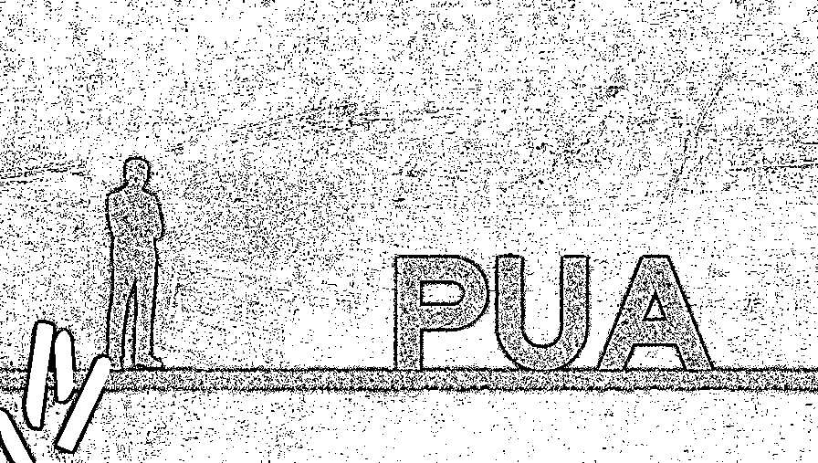
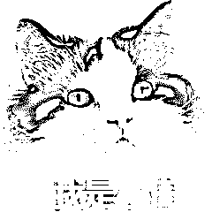

# 一女子入职后被 pua 成老板私人保姆，，没工资倒贴数万元还称“自愿跟随 15 年”？

> 原文：[`mp.weixin.qq.com/s?__biz=MzIyMDYwMTk0Mw==&mid=2247543306&idx=6&sn=c2076d06273c7a9bdf52da2fccd54530&chksm=97cbe132a0bc68244173571fb9bcc090ec8ecfce4a7c861a62fdb2e58a9e568357e881c5e03a&scene=27#wechat_redirect`](http://mp.weixin.qq.com/s?__biz=MzIyMDYwMTk0Mw==&mid=2247543306&idx=6&sn=c2076d06273c7a9bdf52da2fccd54530&chksm=97cbe132a0bc68244173571fb9bcc090ec8ecfce4a7c861a62fdb2e58a9e568357e881c5e03a&scene=27#wechat_redirect)

**本以为可以跟随一位“有实力”的老板工作，**

**不料却变成了他的私人保姆。**

等到警察把老板带走时，

王女士才知道，

所谓的“老板”周某不过是个骗子，

对方用一套极为精巧的

pua（网络上对“精神控制”的代称）话术，

让她乖乖听话。

近日，**上海市松江区人民检察院**

**依法以诈骗罪对周某提起公诉**。

**女子应聘公司却成私人保姆**

2021 年 7 月，王女士通过抖音认识了周某，对方邀请她到公司里做兼职。交谈中，周某表示手里有几个大项目，还出示了手机里跟别人的合照照片，说这些都是大人物，跟着自己就能挣大钱了。**见周某谈吐不凡，还开着豪车，王女士觉得他确实是个很有实力的大老板，便答应去周某的公司工作**。

在正式入职前，周某突然拿出一纸协议，上面写着王女士必须服从管理，不可泄露周某公司和个人机密，如造成损失要赔偿 100 万元。更过分的是，**协议上还写明，王女士系自愿跟随周某 15 年。**尽管这份协议明显有问题，但周某强调，只有签了这个，他才能相信王女士，才能带她进入这个圈子，结识很多大人物。这个拙劣的“话术”竟让王女士深信不疑，她不仅签了协议，还另外写下誓词表示对周某的忠诚与服从。

没多久，周某便陆续以过桥走账、周转资金短缺为由向王女士借钱，并许诺很快就能还钱，还有高额利息。起初，“打工人”王女士并不同意，但周某一边在精神上打压王女士，拿出协议和誓词要求她服从。一边又用利益诱惑，表示自己的项目估值几个亿，有众多房产和车子，根本不会在乎这几个小钱，只有自己吃肉，王女士才可以跟着喝汤。

这套 pua（网络上对“精神控制”的代称）话术成功控制了王女士，手头并不宽裕的她甚至跑去银行借贷，**陆陆续续借了 30 余万元交给周某**。“**这才是和我干大事的人该有的样子。**”得到周某的肯定，王女士更加干劲十足。

**2021 年 8 月，周某要求王女士成为自己的保姆，每月工资 8000 元。**王女士答应了，尽心尽力地买菜、接送小孩、打扫卫生、代送客户礼品，**但她不仅没收到工资，还垫付了几个月的开销共计 3 万余元。**此时，王女士仍然抱着跟着周某就能见大世面的念头。直到 2021 年 12 月，周某被警方带走时，她才如梦方醒，意识到自己遭遇了诈骗。

**另有女子轻信“大人物”被骗 160 万**

报案的是另一位受害人何女士。2019 年 4 月，何女士在画展上结识了周某。当时，周某主动找何女士合影，并添加了微信。之后的聊天中，周某自称是做汽车节能高科技产品，朋友圈里经常表现出励志上进的工作状态，生活中也很有情趣，时不时下厨做饭。见对方事业有成又风度翩翩，何女士对周某好感度倍增。相识两个月后，两人确立了恋爱关系。

很快，周某就开始找何女士借钱。做汽车的他，却签下了一笔 3000 万元的红酒订单，因为销量不佳，需要借钱租仓库存放卖不出去的红酒。何女士起初不愿借钱，但架不住周某软磨硬泡，还带着她实地看了一家仓库。想着两人已是恋人，总是怀疑男友也不好，何女士便没有继续核实，把钱借给了周某。

之后，周某带何女士见了“干妈”，称“干妈”是个大人物，给自己的项目投了很多钱。这让何女士逐渐相信，周某确实是个能干大事的人。于是，投项目、买车、帮忙“捞人”，每次周某要钱，何女士都会尽量满足。

**在吹嘘自己的同时，周某还通过“卖惨”来实现情感操纵。**在女友面前，周某经常表现出身体不好的样子，甚至还将咳血视频发给何女士，以激发她的同情心。为了掩盖自己骗取钱财的事实，周某还叮嘱何女士要向家人隐瞒借钱一事，免得何女士一家看不起他，不许他们结婚。

**不知不觉间，何女士已经向周某转账 160 余万元，却迟迟不见周某还钱，终于报案。**到案后，周某供述，他口中的“大人物”和“大项目”都是虚构的，诈骗来的钱财早已被他挥霍一空。检察官审查后认为，**周某虚构事实，隐瞒真相，诈骗被害人 200 余万元，数额特别巨大，遂以诈骗罪对周某提起公诉**。

今天小编给大家科普拒绝 PUA 的方法！

① 坚定信念，肯定自我价值

反 PUA，必须要做到坚定信念，坚信自己绝对不是一文不值，坚定自己是有价值的，值得被爱的，更是值得尊重的。

只有坚定信念，才不会轻易被别人的评价左右，毕竟我们活着是为了自己，不是为了男/女朋友，更不是为了领导。 

② 设定边界，告诉他人这是不可侵犯的 

人一定要有边界感，这种边界感不仅是指不冒犯他人，更是要告诉别人自己是有不可触碰的底线的。

不论是恋人还是领导，都必须尊重你的边界，因为人与人之间是平等的，我们理应互相尊重。

  ③ 学会疏导自己的情绪

找到一种合理的方式，把自己的负面情绪发泄出去。可以和身边的朋友沟通，吐槽自己遇到的烦心事，很多时候，说出来就是解决问题的开端。

在尝试述说一件事情的时候，你会对整件事有全新的认知，也就不会陷入无限死循环。

 ④ 敢于说不，及时向外界寻求帮助

当意识到自己遭遇 PUA 的时候，一定要勇敢的说不，并将自己的情况与朋友或亲人交流，避免陷入 PUA 施暴者一人提供的语境描述中，这有助于坚定自己的信念。

**谨记：**

**保护好自己**

**以及**

**不伤害他人的前提下**

**请多多顾及自己的感受**

如果你有反 PUA 的方法

不妨留言分享给大家哦

反 PUA 从咱做起

如果你也曾经陷入亲密关系困境 

或在生活中经历着「自我 PUA」

可以拨打**12355 热线**

**按下**1 号键****

**我们有专业又耐心的心理咨询师**

**和情感咨询专家**

**免费解答你的疑问**

**陪你一起度过那些忐忑的时刻**

**来源：大 R 说安全，常说诈骗**

****

**欢迎关注灰产圈社群服务号**

****

****