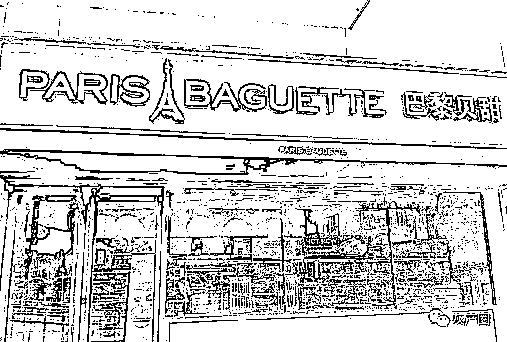
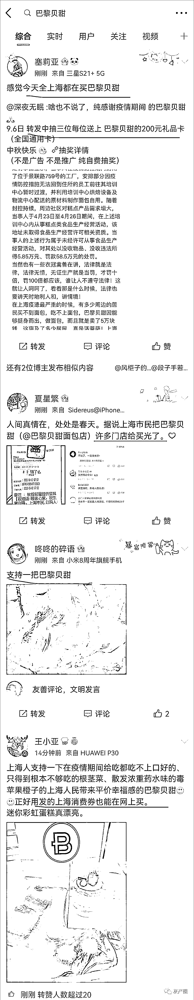
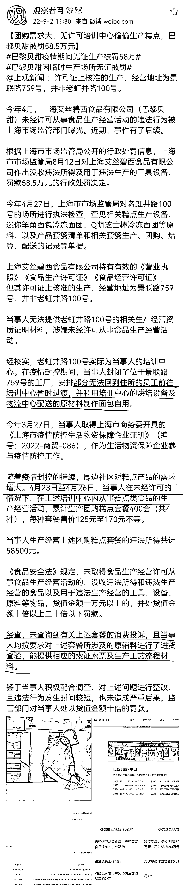

# 上海药监局处罚巴黎贝甜，很多人为什么疯狂购买支持巴黎贝甜

> 原文：[`mp.weixin.qq.com/s?__biz=MzIyMDYwMTk0Mw==&mid=2247543306&idx=7&sn=8db568638707911ac398119448feb21b&chksm=97cbe132a0bc6824a03204f1c864723fa7f0e308703487b2beac6549e3e9a2284cd510d4e130&scene=27#wechat_redirect`](http://mp.weixin.qq.com/s?__biz=MzIyMDYwMTk0Mw==&mid=2247543306&idx=7&sn=8db568638707911ac398119448feb21b&chksm=97cbe132a0bc6824a03204f1c864723fa7f0e308703487b2beac6549e3e9a2284cd510d4e130&scene=27#wechat_redirect)

 在这之前，很多人可能不知道巴黎贝甜是做什么的？

巴黎贝甜是一家高端点心连锁品牌，在一线城市可能有人略有耳闻，但品牌知名度还是很有限，为啥一下名声大噪了呢？ 

前几天，这家蛋糕店被罚了，原因是疫情期间涉嫌违规经营，被罚 58 万。并且这一处罚受到网友的同情。

很多人都在以自己行动疯狂购买支持巴黎贝甜：

巴黎贝甜为什么被罚？

在上海封控期间，巴黎贝甜的工厂封闭了，部分员工暂住培训中心。培训中心有烘焙设备，这些员工便自己烤面包吃，后来又卖了一些给上海断粮断炊的人。

上海市监局认为培训中心没有取得食品生产经营许可相关资质，便罚了 58 万。

上海疫情，有多少人挨饿，有多少人赚黑心钱，情况大家都知道，

这家蛋糕店，愿意站出来生产，救人于水火，没有功劳也有苦劳。

在老百姓眼里是良心企业，心里心存感激，在当官眼里，却违法了，以后遇到类似情况，谁还敢冒险生产救急老百姓？ 

对这样的企业，老百姓心存感激。对这样的企业，为什么要处罚？

也有人说，对巴黎贝甜的处罚有法可依。

可是，如果要说严格执法的话，那疫情期间，各路团长加价销售物质几乎是公开的秘密，都处罚了吗？

疫情期间，发国难财的大有人在，都处罚了吗？

天地之间有杆秤，大秤砣就是那老百姓，虽然你的处罚貌似有法可依，但功过是非老百姓心里有数。

法国启蒙思想家卢梭说，“一切法律中最重要的法律，既不是刻在大理石上，也不是刻在铜表上，而是铭刻在人民的内心里。”

巴黎贝甜这次被罚款 58 万巨款，貌似输了亏大了。但从长远看，输的是政府的信誉，药监局用一次不得民心的处罚，让巴黎贝甜这家走高端路线阳春白雪的蛋糕店，家喻户晓深入人心。

【知识链接】韩国顶级烘焙品牌

巴黎贝甜（Paris Baguette）是韩国艾丝碧西属下的品牌，主要经营法式面包、新鲜三明治、美味蛋糕、纯正咖啡。1988 年，许英寅在韩国开设第一家正宗法式面包店 Paris Baguette。

“巴黎贝甜在韩国不是高端面包，而是大众面包，未来在中国也将走大众路线”。但目前在中国市场，巴黎贝甜确实被认为是贵族面包。“即使价格昂贵，巴黎贝甜的口碑仍好于盈利，营业能力远比不上韩国市场”文赏准坦言。

刚刚进入北京市场的 85 度 C，以更低廉的价格出售时尚的面包，使李根福感到了压力。他掌管着除了前台外的所有后厨大权。他亲自去 85 度 C 买来面包回来分析。实际上，李根福技长最主要的研究方式还是竞争店调查，“只要听说哪家面包卖得好就立刻买回来品尝研究。”“中国人的口味重，喜欢在面包上加入肠类，蒜蓉，肉松，蓝莓等”，针对中国人的消费习惯，研发中心扩大的面包种类，发明出了调理面包吸引更多的中国客人的眼光。

巴黎贝甜把法国面包卖到中国来，绝不仅是看中了那些在华的 “海归”和海外人士，未来的目标客户群还是中国的“土著”居民。现在在一些商区的面包店里，入口处的法式面包已经被调理面包占据，这正是洋面包“土著化”的一个表现。

来源：喻言亭阁

欢迎关注灰产圈社群服务号

