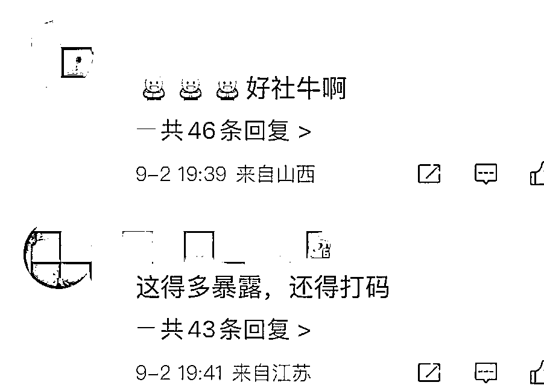
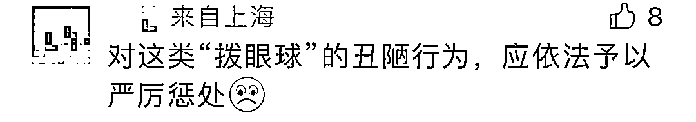
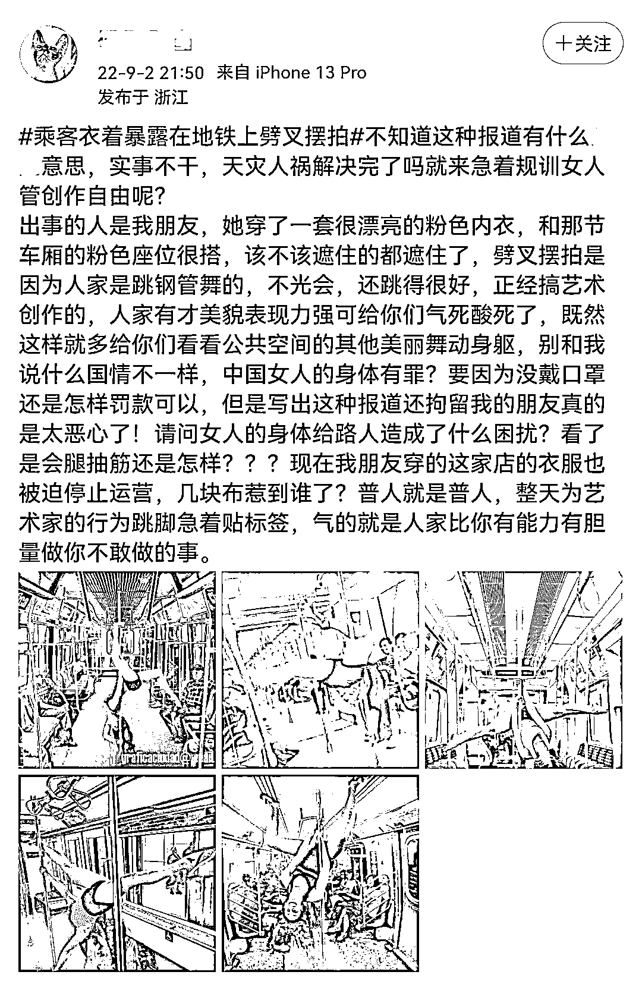
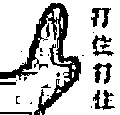

# 地铁里只穿内衣“劈叉”的兔女郎，让我尬到去世

> 原文：[`mp.weixin.qq.com/s?__biz=MzIyMDYwMTk0Mw==&mid=2247543353&idx=1&sn=d3d939643f4a5b3989db83508915703d&chksm=97cbe101a0bc681708d1ac1711c41283fc00948c617a1a0095648abbbfc5e4191c0af1271a90&scene=27#wechat_redirect`](http://mp.weixin.qq.com/s?__biz=MzIyMDYwMTk0Mw==&mid=2247543353&idx=1&sn=d3d939643f4a5b3989db83508915703d&chksm=97cbe101a0bc681708d1ac1711c41283fc00948c617a1a0095648abbbfc5e4191c0af1271a90&scene=27#wechat_redirect)

这两天，在上海地铁 6 号线车厢内，**一段****女子衣着暴露供他人拍照的视频**，在网上广为流传。女子不仅仅衣着遮盖部位较少，而**且头戴兔女郎装饰，****以地铁扶手杆为“钢管”跳舞。**用各种极度凸显人体曲线的姿势进行拍摄，**时不时做出还劈叉等动作，**还有同伴在一旁为激情猛拍。其他乘客尴尬的要死，眼睛都不知该往哪看。带孩子的家长纷纷捂住孩子的眼睛往别的车想走....**视频：**

[`mp.weixin.qq.com/mp/readtemplate?t=pages/video_player_tmpl&action=mpvideo&auto=0&vid=wxv_2559604544377421825`](https://mp.weixin.qq.com/mp/readtemplate?t=pages/video_player_tmpl&action=mpvideo&auto=0&vid=wxv_2559604544377421825)

相关话题也迅速登上同城**热搜榜第一 **网友们看了这一幕后，纷纷表示：**“低级趣味”**更有网友直言，对于这样不知廉耻的行为，直接报警带走。对于如此不雅的行为，警方重拳出击。昨天下午，上海市公安局城市轨道和公交总队通过官方微博@轨交夭夭零 发布消息称，

# **涉事 3 人被行拘！**

原来这三人是在**拍内衣广告...**本来以为事情到这就结束了， 结果昨天冒出来个人，把话题又又又扯到了“穿衣自由的问题上”。然后居然有些网友，开始赞同上述说法。 表示“拍摄者”没碍别人事， 没影响别人的利益....说这话的人，应该不是杠精键盘侠就是 LSP， 杠精咱就不说了，说啥都杠，LSP 觉得可能影响他们“观影”了吧但大部分网友还是很清醒的！**穿衣自由不反对，但是要有尺度！**还记得前两年一次上海漫展上，一名穿着 JK 制服的女孩正趴在地上摆姿势吗？突然，视频外突然传来一个女声。**“你有病吧，你来漫展搞这种动作，有必要吗？保安在哪里啊……麻烦你认真做动作好吗，不要再给 JK 抹黑了谢谢你。”**听到声音，正在面对着镜头摆姿势的女孩当场愣住，疑惑地指了指自己，意思是：**你说的是我吗？**原来，在漫展上一名穿着 JK 裙的女孩，趴在地上，周围围了一圈摄影师在拍照。JK 裙比较短，于是，周围的摄影师就有人放低了镜头，把角度对准了女孩的裙底……

最后，视频中出声的女孩看不下去了并出言制止。

她认为，趴在地上的女孩「姿势不雅」，既破坏了漫展规则，同时也给 JK 圈抹了黑。一石激起千层浪，舆论开始倾向于视频拍摄女生这边，很多网友认为这样拍摄的姿势实属有「性暗示」、擦边球的可能。对于很多漫展爱好者来说，小众文化就是被这种「性暗示」败坏了名声。特别是穿 JK 的女孩们，JK 在他们眼中就是高中生的制服，和色情是根本擦不到边去的。出于这样的看法，看着视频拍摄女生出格的姿势，网友们纷纷对当事女孩进行谴责和批评。没有一个普通人能够接受全网的批评与暴力，很快当事女孩开始出来澄清与回应。她表示，自己穿了安全裤，但没能注意在公众场合摆出的姿势是否合理，她要为此向广大网友致歉。原本以为当事女孩已经道歉，事件就这样结束了。**女孩不管是否故意，公共场合，有些姿势确实不雅；摄影师故意压低镜头，拍女孩裙底，行为的确人渣。**但这一次，事情却显得有些不一样，随着视频的发酵，在网上迅速掀起了骂战。因为就在女孩这边道歉之后，随即有网友扒出了视频拍摄者的「恶臭言论」：这样的诋毁于污蔑让这件事情再一次进入了高潮，很多网友开始拿着这件事情在分析各方的对错。一边是解释情况，说明自己其实是穿了安全裤的，因为疏忽才被偷拍。一边是同为女性，看见另一个女生被猥琐男「偷拍」，上来就是「空口鉴鸡」。两相对比，情况突然就变复杂了起来。有人说 JK 女生不应该道歉的，也有人说 JK 女生不该做这些动作的。有说这个拍视频的女生是嫉妒别人，才大大咧咧把视频传到网上。但也有说这视频女主是正道之光，保护了漫展环境。人都穿安全裤了还要被偷拍、荡妇羞辱，不摆明了就是**限制穿衣自由**？而且，这和看见裙子短就说人骚，偷瞄到别人走光就开始荡妇羞辱的「牌坊精」有啥区别？于是，上一秒还因为在漫展上「姿势不雅」「破坏 JK 圈生态」被指责的女孩，被「穿衣自由」几个字打上标签之后迅速成了无辜受害者。支持女孩的声音水涨船高，他们一边认为拍摄视频的人不够「女权」，一边高呼「还我自由」「女孩子对女孩子的恶意不要这么大」……**画风变化之快，让人适应不过来。**不是……我寻思刚才不是还在说女孩在公共场合姿势不雅吗？咋这么一会就扯上这些了？而且，被扣上「没有穿衣自由」的女孩就真的只是「受害者」没有一点错么？先说穿衣自由。一开始，人们倡议穿衣自由，大意是：就问：在「上海漫展」这一事件中，女孩的「穿衣自由」被人限制了吗？这里要打一个大大的问号。因为你首先要搞清楚几个问题。

**首先，有没有人说她：不能穿短裙？**

**其次，有没有人说她：穿 JK 不能来漫展？**

**再次，有没有人说她：穿成这样不可以被拍照？！**

可以确定的是，以上几个问题的答案都是否定的。女孩穿着这一身 JK 进了漫展，并且很受欢迎，在被呵斥并制止之前，已经拍了两个多小时的照。直到她因为「累了」第二次趴在地上摆姿势，并且被拍摄视频的女孩发现「姿势不雅」，而且还有男摄影师拍摄她的裙底时，才出现了开头的这一幕。看到这里，和「穿衣自由」有关系吗？好像并不吧。再说女孩所说的「不知情」和「偷拍」问题。按照女孩的说法，当时她并不是故意摆所谓的「不雅姿势」拍照。更没有想到会有拍摄者绕到身后去拍摄。然而呢……在现场拍摄中，女孩是有看向身后的。这种情况下再扯什么「穿衣自由」可说不过去了。现代人在公共场所是有行为边界的，穿衣自由也不代表不分场合，什么动作都能做。再说了，安全裤是为了防止不小心走光的，并不意味着你穿了安全裤就可以随便撩裙子，而且别说安全裤，就算穿棉裤也不合适。当然，这并不是说，这件事都是女孩的错，事件中的另外两方拍摄者就无辜了。张嘴闭嘴说其他女生是鸡，嘴臭。恨不得抱着照相机在地板上挖个坑钻进去，费尽心思只为拍人家的底裤、走光照片，下贱。****
总之，**一个扯穿衣自由当遮羞布，一个拿漫展当献丑台，一个嘴上说公平正义实际却人身攻击……**整件事情里，和稀泥的几方完全该各打五十大板，谁也逃不脱。

“穿衣自由”的确是很进步的观念，

在没有违背法律道德、没有妨碍他人的原则下

无论男女，穿衣都可以自由一些，随性一些，不必动辄上纲上线，应该互相包容。

但是任何自由都是有限度、有尺度的。

来源：不惑先生

欢迎关注灰产圈社群服务号

