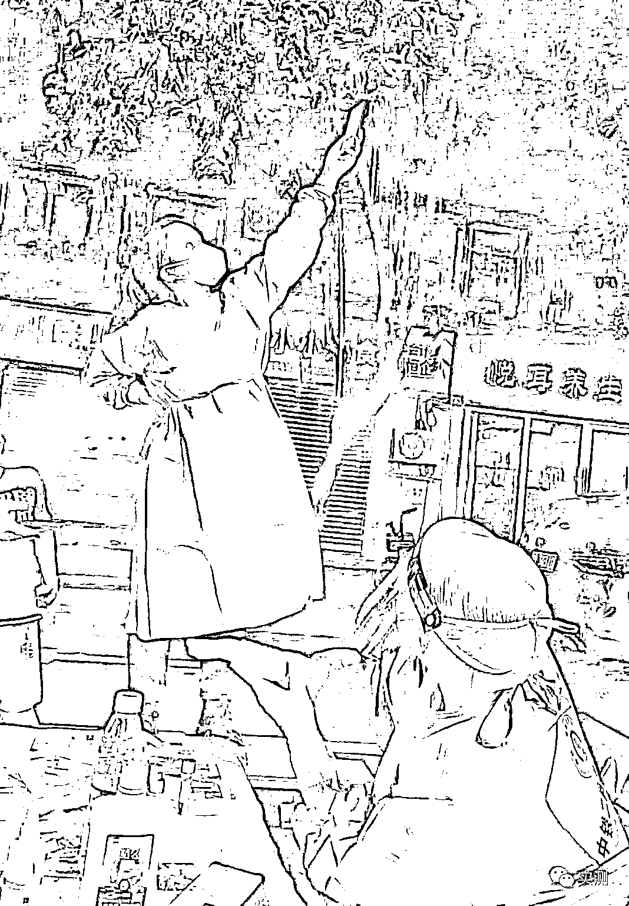

# 成都核酸检测系统瘫痪后，东软发出丧事喜办的邀功声明，还有人微博上替东软喊冤

> 原文：[`mp.weixin.qq.com/s?__biz=MzIyMDYwMTk0Mw==&mid=2247543353&idx=2&sn=12f66f2e4da0d6092fb0d129afbfe962&chksm=97cbe101a0bc6817e681d4027d57c4e2494205ee9e3e1c57457b4c0f1e1199da977fb5f08d01&scene=27#wechat_redirect`](http://mp.weixin.qq.com/s?__biz=MzIyMDYwMTk0Mw==&mid=2247543353&idx=2&sn=12f66f2e4da0d6092fb0d129afbfe962&chksm=97cbe101a0bc6817e681d4027d57c4e2494205ee9e3e1c57457b4c0f1e1199da977fb5f08d01&scene=27#wechat_redirect)

9 月 2 日，成都核酸检测系统接近崩溃，全城骂声一片。

而后，于 9 月 3 日下午 15 时许，东软集团官微发表了一篇丧事喜办的邀功声明。

> 在多个大型城市的实战中，东软的软件都经受住了考验，并在短期与其他系统、硬件、网络环境磨合后达到稳定运行，目前在 120 多个城市协助抗击疫情。东软核酸检测系统在上海经受住了平均每小时超过 600 万人次的峰值考验，在北京经受住了平均每天超过 2000 万人次的压力考验。东软也因在抗击新冠疫情中的突出贡献，多次收到国务院疫情联防联控小组以及各级政府的感谢信和表扬。
> 
> 东软集团会继续负责前行、不辱使命，与各地相关部门一起努力，顺利而光荣地完成国家和人民交给我们的任务。
> 
> 公众号：东软集团[声明](https://mp.weixin.qq.com/s/RoTRKu22jqmnAHmFKCY0iw)

特别注意到，该声明发表于辽宁，后面还会提到。

下午 17 时，一个微博昵称叫“沈阳午评”的，在沈阳超话下面发了一篇有关成都东软这件事的评论，还打了标签#沈阳新鲜事#，也是发表于辽宁，毕竟沈阳就是辽宁的省会。

被问候后还选择了与成都网友硬刚，叫嚣着“有能力，你们成都别用（东软的核酸检测系统）”。

见过苹果、科兴那样不要脸的，今天也见识了东软如此不要脸的。

临近二十大，东软给闹出这出，还好意思提“顺利而光荣地完成国家和人民交给我们的任务”？

来源：实测

欢迎关注灰产圈社群服务号

