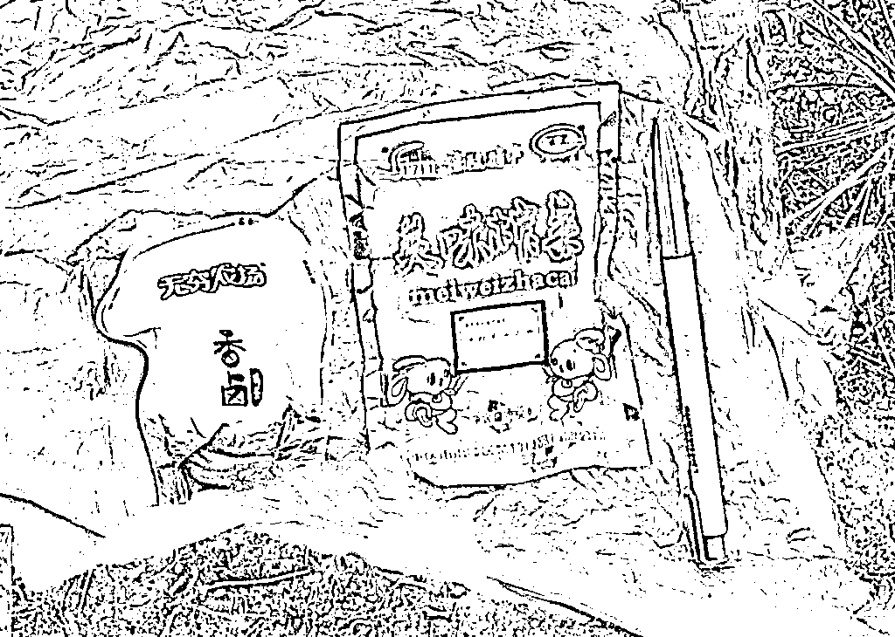
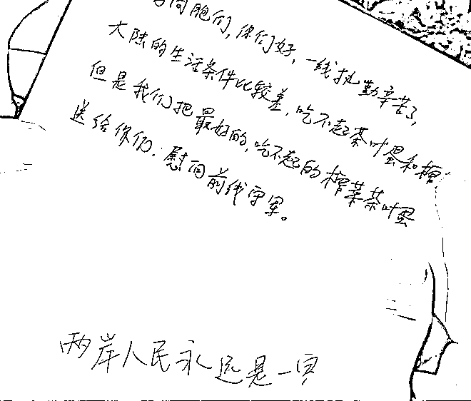
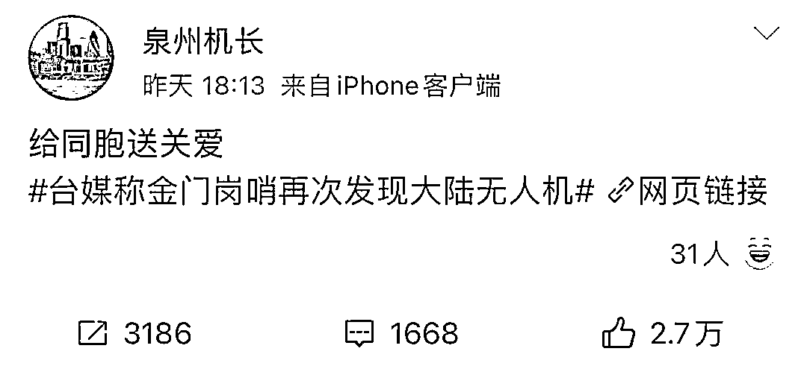
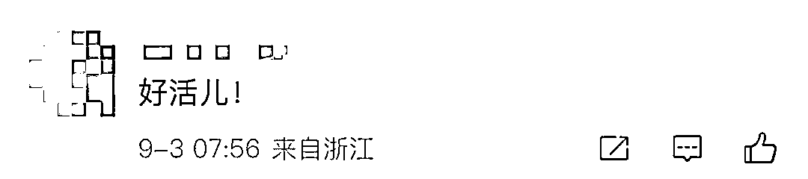
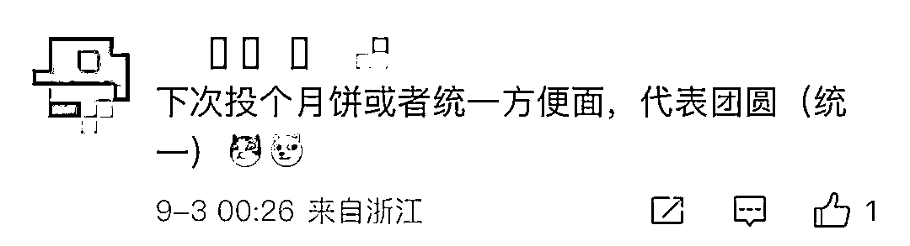

# 大陆无人机向台湾投下了“榨蛋”！

> 原文：[`mp.weixin.qq.com/s?__biz=MzIyMDYwMTk0Mw==&mid=2247543353&idx=3&sn=fc580797c6e0ba12cdce2ca82899e492&chksm=97cbe101a0bc681770cd3e356b144656c2f50b33375b49635b948e7a02b6f63f39b300aaa0d9&scene=27#wechat_redirect`](http://mp.weixin.qq.com/s?__biz=MzIyMDYwMTk0Mw==&mid=2247543353&idx=3&sn=fc580797c6e0ba12cdce2ca82899e492&chksm=97cbe101a0bc681770cd3e356b144656c2f50b33375b49635b948e7a02b6f63f39b300aaa0d9&scene=27#wechat_redirect)

据台湾“中时新闻网”报道，台“金门防卫指挥部”表示，9 月 2 日下午，“守军”在贵山海滩附近巡查时，发现了用垃圾袋包裹的食品：一颗茶叶蛋和一包涪陵榨菜。 

台军方称，这两样食品疑似由无人机投掷。

来源：台湾“中时新闻网”

包裹中还附有一张字条，上面写着：

台湾同胞，你们好！一线执勤辛苦了！大陆的生活条件比较差，吃不起茶叶蛋和榨菜，但是我们把最好的，吃不起的茶叶蛋和榨菜，都送给你们，慰问前线守军。两岸人民永远是一家。 

**** 

2 日，有网友发布微博，介绍了自己从厦门操作无人机的过程。并配文：给同胞送关爱。

此事引发台媒关注，有网友认为，空投的茶叶蛋、榨菜似在嘲讽此前台湾电视节目中说大陆人吃不起茶叶蛋和榨菜的事情。

也有网友怀疑，榨菜、茶叶蛋合起来，莫不是……榨（炸）蛋（弹）？！

来源：喻言亭阁

欢迎关注灰产圈社群服务号

