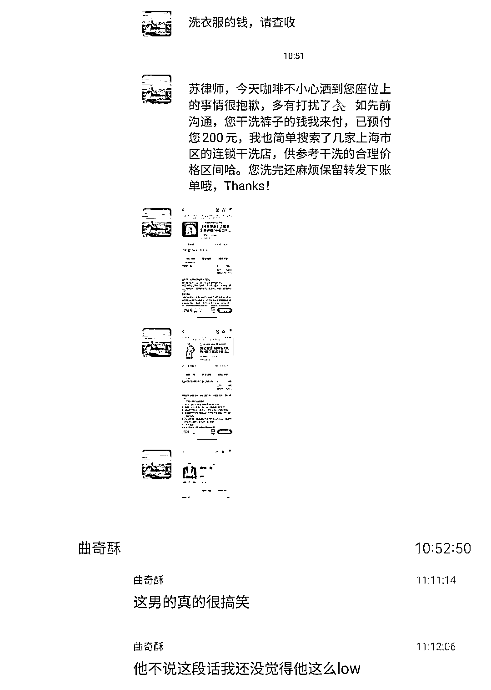

# 昨日微博热搜第四位：红圈律所年轻律师被辞退后自杀

> 原文：[`mp.weixin.qq.com/s?__biz=MzIyMDYwMTk0Mw==&mid=2247543353&idx=6&sn=a737658abbeb2d8e4174d43e7ee5e847&chksm=97cbe101a0bc6817e7f17d0f899859ad0e2d0f5ff27557e691cf38c561c45bd760de78bbd3af&scene=27#wechat_redirect`](http://mp.weixin.qq.com/s?__biz=MzIyMDYwMTk0Mw==&mid=2247543353&idx=6&sn=a737658abbeb2d8e4174d43e7ee5e847&chksm=97cbe101a0bc6817e7f17d0f899859ad0e2d0f5ff27557e691cf38c561c45bd760de78bbd3af&scene=27#wechat_redirect)

因被红圈律所辞退，一位本科毕业于人民大学、法律硕士 2017 年毕业于清华大学法学院的年轻男孩子，于 8 月 31 日自杀； 

在飞机上咖啡不慎泼洒到邻座女同行后，另一红圈律所年轻男孩，为 200 块钱“预付赔偿”，运用法律能力与被泼女同行撕扯不休，被投诉到律所……

红圈律所，年轻法律人心目中牛逼的象征。而以上，则是外人看不到的另一种真实状态。 

**发稿前，自杀律师生前所在律所，作为话题词登上微博热榜第四位。这应该是律师行业在微博热搜登上的历史最高位置。**

1 被辞退后想不开，年轻律师选择自杀

因工作失误被辞退后想不开，选择离开人世的年轻男律师，来自北京市朝阳区的一家知名红圈律所。

这是国内首家给应届生起薪能达到 3 万的律所。而根据 2022 年 1 月 1 日起这家律所实施的新方案，7 年级授薪律师年薪可达 102 万元。

但是，网上有一些其他声音——

此事轰动律师行业。网友纷纷评论——**@用户 6385961823：**第一条微博，为了这个悲惨的行业。红圈所中兜兜转转待过差不多一半，看过太多恶心的团队，听过太多悲哀的故事，然而不知为何，时至今日依然没有引起任何相关部门的重视，仍然没有任何自上而下或自下而上的行业整顿。月薪高么，从应届生的角度讲是挺高的，然而时薪高么，还不如刷碗端盘子的暑期工赚得多。可架不住作为法学生的最佳对口岗位，一届届毕业生依然趋之若鹜。行业内流传两句话，劝人学法千刀万剐，如果不是穷谁来当律师。看到这个帖子，第一反应是为这个孩子悲伤，第二反应是这个行业整顿的突破口可能到了。且不论这家律所是否算得上“最佳雇主”，这个行业普遍的 pua 和极度压榨，需引起业内业外的重点关注。本人目前已上岸，但也不确定何时会再滑回河里。希望再踏入这个让我又爱又恨的行业时，能看到它崭新的面貌，不要辜负法学人的社会责任感和法学生的憧憬和敬仰。文笔不好，多多见谅。 **@呆若木鸡蛋灌饼：**这个事，让我有个想吐很久的槽趁最近离职没人管得了我来发泄一下。据我观察（极其主观，意见不同就是你对）：在圈所和外所工作/实习的人是奴性最强的一批人。

人们只看到大厂、企业加班狼性文化、996 和职场 pua，没人关注律所，尤其是 top 的律所 pua 盛行，那都不是狼性文化，可以说是奴性文化，什么 996 在 007 和高强度精神压力之下都是渣渣。

不谈实习期那微薄的勉强够吃饱饭多加个鸡腿的钱都不够的实习工资，就说加班。众多周知，律所加班是永远没有加班费的，老板说句辛苦了就是给你脸了。

律所加班分三个档次：十二点之前、十二点之后和通宵。能在十二点之前下班的，已经比较幸福了，至少还可以睡个七八个小时第二天再来上班。ipo 或者经常有急活的领域，扔给你一堆材料问就是明天之前要，你还只能点头哈腰说：好的我尽快。最终结果就是你一个人通宵做到大天亮。

我身边的在律所实习的朋友曾经加班的经历包括但不限于：

1.前一天从北京飞上海做访谈，凌晨两点回来的飞机落地，人还没出机场，senior 电话就来了，让早上七点再去一趟杭州。什么？你说这五个小时去哪里？我管你，毕竟 senior 只记得派活完全不记得给你安排酒店。2.加上周末，已经连续加班六天，但在第五天下午五点半又收到一千多份材料需要进行核对，明天上班之前就要，遂在办公室加班到天亮。赶在八点半把材料发给合伙人，最终收获合伙人一个“ok”3.连续加了半个月班，平均每天睡五个小时，所以导致有一天早上起床头晕眼花被车撞到了，去医院之后才想起来给合伙人请假，合伙人没有任何回复，只好看完医生马上回所里上班，得到秘书反馈：“迟到半天，合伙人说扣半天工资。”有些企业还会假惺惺说一下人文关怀，这在一些律所的团队里简直就是屁。

毕竟他们可以做出：一个团队加上两个实习生，共十二个人，跟着大部队去海底捞吃饭，服务员亲切提问：噢是提前预定十人座的那个吗？端午节发粽子，合伙人、律师的都不一样，按位次排序，实习生？你就看着吧，毕竟你已经物理上不算一个人了。

你说为什么不反抗？

我也百思不得其解，明明能进这些所的平均也是五院四系本硕及以上了，多的是清北人复 +t7llm/jd 的人才，而且做的工作就是为权利而斗争，但偏偏自己的劳动权益不敢保障，不敢反抗。给我的感觉就是，只要你进来了，每个人都在这种环境中逐渐被同化、彻底变成冷血机器，最后成为资本家的打手和武器。

2 为 200 块钱与女同行喋喋不休，被投诉

相对于自杀事件，近期发生在另一家红圈所的另外一件事，小的不能再小了。但近期也刷爆法律人朋友圈。

上海某律所年轻女律师，8 月 29 日坐飞机出差时与北京某红圈律所并购六组一位实习男律师邻座。后者的咖啡不慎洒到了前者裙子上。按照上海女律师的说法，后面发生的事，有点尬——

最终，年轻女律师将裤子送洗，花费 38 元，微信发送洗衣单据后，将 162 元退还男实习律师。然后，给男实习律师所在律所写了一封投诉邮件，称该男实习律师“勇于发名片，却连 200 元都无法转出，并声称处处刷信用卡，实在有辱某律所享誉业界的薪金待遇”。

撇开人品、情商这类不说，**我认为，这位红圈所的所谓“实习律师”，很可能，工资减去在北京的生活支出，这 200 块钱对他来说确实真的并非小数**。否则，为了 200 块钱，尬成如此，又是何必！

最后，以一位微博网友的评论作为结语——

来源：改变 de 力量，景来律师

欢迎关注灰产圈社群服务号

