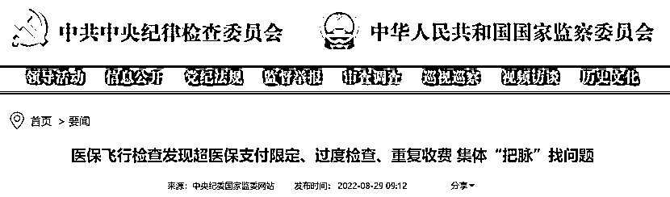

# 中纪委揭露大量医院造假细节！

> 原文：[`mp.weixin.qq.com/s?__biz=MzIyMDYwMTk0Mw==&mid=2247543353&idx=7&sn=6dda2da2eeaf3060a6ab07c7e89fde08&chksm=97cbe101a0bc68170e13d0eb509a5edf8241731dc1e0def0b4c2fa59e1424e6c737177090c4d&scene=27#wechat_redirect`](http://mp.weixin.qq.com/s?__biz=MzIyMDYwMTk0Mw==&mid=2247543353&idx=7&sn=6dda2da2eeaf3060a6ab07c7e89fde08&chksm=97cbe101a0bc68170e13d0eb509a5edf8241731dc1e0def0b4c2fa59e1424e6c737177090c4d&scene=27#wechat_redirect)

## 

## 

## 

## 

8 月 29 日，中央纪委国家监委网站再次发文，透露“心内组”“骨科组”“集采组”等医保飞检成员在检查过程中发现的具体问题。**此轮医保飞检倒查两年半，一周内，中纪委已连发两篇刊文，追踪飞检进展。**

文章显示，8 月 26 日晚，云南省昆明医科大学第二附属医院会议室灯火通明，国家医保飞行检查组各小组代表逐一汇报检查中发现的问题。自飞行检查组入驻以来，集中研讨会已连开 3 天。

心内组代表指出：“尿沉渣定量检查通常适用于泌尿科、肾病科、产科及肾脏病变患者，但该院所有科室入院患者均做了该项检查，部分患者无指征，涉嫌过度检查，涉及 112334 人次、疑似违规金额 2246740 元……”

据悉，心内组发现的疑似问题主要包括：尿沉渣定量等无指征检查，Ⅰ级护理未降低护理级别，重复收取复杂手术特殊刀使用费，DRG 分组高靠诊断等，组代表将当日检查小结投放到大屏幕上，涉及人次、金额与政策依据一目了然。

骨科组发现：**存在对甲沟炎患者使用全身麻醉**、半髋关节置换术收取全髋关节置换术费用等问题。

除大数据筛查出的共性问题外，骨科组翻阅 300 余份病历，发现一系列个性问题：“比如病案号 90456015 的患者，其手术记录显示使用同种异体骨 2 盒，但记账与标签均显示为 3 盒，存在明显出入，涉及疑似违规金额 3740 元。”

综合组发现：**根据云南省药品目录规定，‘龙珠软膏’、‘银杏叶片’、‘碳酸钙 D3’等药品限门诊使用，但该院部分住院患者也使用了这些药品，并进行医保结算。**此外，综合组注意到该院 1100 余名参保人员，办理出院后一天内又因同一疾病重新办理入院，疑似存在分解住院问题。

“这个问题涉及金额较大，还要稳妥把握，确保有据可依。”“可以再与院方沟通，做好进一步排查。”其他代表纷纷提出建议。

政策组、集采组、财务组代表汇报的内容涉及：医疗价格自查走过场，部分医护人员对医保基金使用监督管理条例和医保政策知晓率不高；涉嫌违规使用未中选药品及违规线下采购；**疑似存在药品拼支使用**…… 

接连爆出大案，飞检倒查两年半

赛柏蓝器械关注到，此次飞检中，骨科、心内科高值耗材成为重点检查对象。

几天前，中纪委曾发文透露飞检细节，骨科手术耗材的数量、规格，复杂手术特殊刀使用费等都被一一核对。检查组成员看费用清单、看病案首页、看手术记录、看耗材标签，在对比中查找漏洞、发现疑点。

中纪委最新发文中也透露，发现骨科耗材手术数目和记账数目不匹配、心内科复杂手术特殊刀使用费重复收取等问题。

今年上半年，骨科接连爆出骗保问题。

2022 年 4 月，国家医保局通报，2017 年 1 月—2020 年 9 月期间，华中科技大学同济医学院附属同济医院存在串换、虚记骨科高值医用耗材问题，骗取医保基金支付 2000 余万元。此外，还发现其他医疗行为涉嫌违规使用医保基金 9107.41 万元。

2022 年 1 月，北京市医保局通报，北京前海股骨头医院以欺诈、伪造证明材料或者其他手段骗取社会保险基金支出，被处罚款约 1.42 亿元。

5 月 31 日，国家医保局、财政部、国家卫健委、国家中医药局四部门联合发布《关于开展 2022 年度医疗保障基金飞行检查工作的通知》，决定在全国范围内组织开展 2022 年度医疗保障基金飞行检查。

此轮飞检倒查两年半，检查时间范围为 2020 年 1 月 1 日以来。 

对定点医疗机构血液透析、高值医用耗材（骨科、心内科）等领域纳入医疗保障基金支付范围的医疗服务行为和医疗费用，医保经办机构服务协议履行及费用审核与结算支付，以及通过伪造医学相关资料、虚构医药服务项目等方式骗取医保基金行为进行检查。

针对定点医疗机构检查。包括基金使用内部管理情况，财务管理情况，病历相关资料管理情况，药品和医用耗材购销存管理情况，和分解住院、挂床住院、违反诊疗规范、违规收费（包括违规收取新冠病毒核酸和抗原检测费用）、串换项目、违规采购线下药品、未按要求采购和使用国家组织集采中选产品等行为。

症结在哪？ 

高值耗材虚记、串换使用问题频出，但调查难度并不小。

医保研究学者姜跃杰对赛柏蓝器械分析：在骨科诊疗当中，串换、虚记高值耗材的问题频繁暴露，比如患者使用了 4 个耗材，最后记录却显示 6 个；耗材价格是 1000 元，但记录上写的是 2000 元；住院记录里面登记的厂家品牌和患者实际植入的完全不是同一个等等。

另有研究者指出，因为有些耗材是植入到体内的，手术一旦结束也不能取出来，很难有证据，所以会产生一些违法空间。这类问题的举报人通常可能有耗材供应商、医院内部医护等知情者。

据报道，去年河南六院的骨科骗保问题，即是被科室成员与器械商联合举报。国家医保局也透露，同济医院骗保问题是收到了举报线索。

除医保检查颗粒度变细外，国家层面越来越重视社会力量的监督作用。

7 月 5 日，国家医保局发布《关于<违法违规使用医疗保障基金举报奖励办法（征求意见稿）>公开征求意见的公告》。其中，将举报奖励的范围从欺诈骗保行为扩展到所有违法违规使用医保基金的行为，并提高了奖励的标准。

多重监管之下，医疗利益链条上的更多隐秘环节，也将被一一斩断。

       来源：医学咖啡屋，喻言亭阁

欢迎关注灰产圈社群服务号

