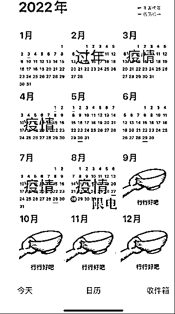

# 疫情、高温、限电、山火、地震，2022 川渝太难了！

> 原文：[`mp.weixin.qq.com/s?__biz=MzIyMDYwMTk0Mw==&mid=2247543412&idx=1&sn=2fa27e5341be33567604fd6cd29e4a7b&chksm=97cbe14ca0bc685a1ce78f87e2aff37caa0edca886e07e017938d513ab6a3750327691d6e4d6&scene=27#wechat_redirect`](http://mp.weixin.qq.com/s?__biz=MzIyMDYwMTk0Mw==&mid=2247543412&idx=1&sn=2fa27e5341be33567604fd6cd29e4a7b&chksm=97cbe14ca0bc685a1ce78f87e2aff37caa0edca886e07e017938d513ab6a3750327691d6e4d6&scene=27#wechat_redirect)

**今天突发，就在刚刚，四川****甘孜州泸定县发生了 6.8 级地震，震****源深度 16 千米。**

地震发生后，泸定县城市民纷纷出门到空旷处避震。

多地震感明显，成都、重庆等地震感强烈。 

2022 年的四川，重庆真的好难啊！ 

**先是高温。**

今年四川、重庆的热度甚至成功超过了有火焰山之称的吐鲁番。

全国最热的三个城市，都在四川。

有四川网友拍摄的视频中，一只狗被地面烫得来回换脚；还有网友调侃，外面拌了一份凉菜，拿回家感觉吃上了冒菜。

也有重庆网友放上图片调侃，小龙虾放在地上一会儿都烤熟了。

甚至，有重庆网友说，天气炎热到窗户玻璃都炸了！

嘉陵江的水都晒干了，大佛的脚都露出了水面！ 

然而，这还不算完。

**四川泸州，突发山火。 **

**重庆 9 个区域，接连发生山火。**

火光冲天！ 

这样的高温天气，导致四川、重庆人民的用电量激增！

于是出现了又一个严峻的问题：

**缺电！限电！**

但是高温的天气导致长江水量不足，四川和重庆人民依赖的水电，又不得不减产。

高温-需要用电-水量减少-发不出电，川渝陷入到了巨大的困难之中。

以至于四川和重庆人民不得不抱着冰块儿降温。 

**万般无奈之下，当地只好采取限电措施！**

往昔繁华的商场变得黯淡无比，那氛围居然有点像是：

末日丧尸片！

往日里灯火辉煌现代气派的城市，也变得毫无颜色可言。 

**而恼人的疫情，也过来添乱。**

最近几天，四川疫情防控形势也骤然紧张起来！

病例活动轨迹涉及全市 22 个区县的公共场所，包括：住家小区、培训机构、学校、车站、餐馆、菜市场、商超、游乐园等。

此次疫情传播速度快、隐匿传播多、病例活动分散、风险场所广泛、全市疫情形势异常复杂严峻。

有不少城市都已经采取了紧急措施，全体紧急做核酸。 

9 月 1 日 18 时起，成都全体居民原则居家。

非必要不离蓉。

双流机场、天府机场取消 70%左右的航班。

摆在大家面前的，是一场攻坚克难的防疫硬仗！

而且没有退路可言！ 

昔日繁华的城市，陷入了沉默。 

空空城市里，只有高温下的人们戴着口罩，排着长队做核酸。 

天气炎热，疫情防控工作难上加难！ 

甚至已经有志愿者热晕在工作一线！

有人形容四川、重庆人这段时间好难。 

过完年之后，真的没有消停几天！ 

不是疫情，就是高温，然后又是山火，又是限电！

有人用一张图概括了四川和重庆人民的心酸： 

眼前是核酸，周围是限电，然后远处是山火。 

也有人调侃，四川重庆人太难了。

疫情让人居家，地震让人下楼。

真是：左右为难！

四川、重庆，有多少普通人的生活，真的是举步维艰？

高温、疫情、限电、山火、地震……

四川和成都，今年拿到了一手很难的牌。

但关关难过关关过！ 

再难，再苦，再累，坚信川渝人民终究会战胜困难，夺取最后的胜利！ 

我始终相信：

**阴霾，始终无法遮住蓝天！**

**纵使黑夜吞噬了一切，太阳还可以重新回来。**

川渝加油！ 

中国加油！

来源：新洞察 作者：猫二侠

欢迎关注灰产圈社群服务号

