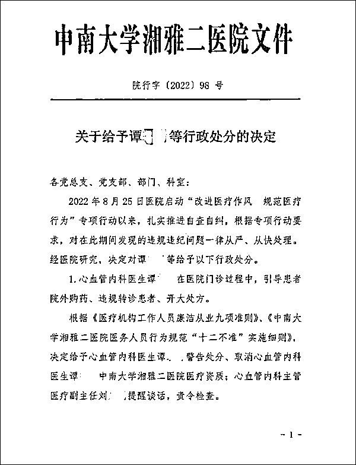
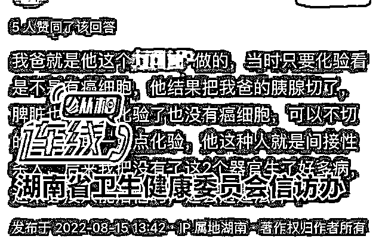
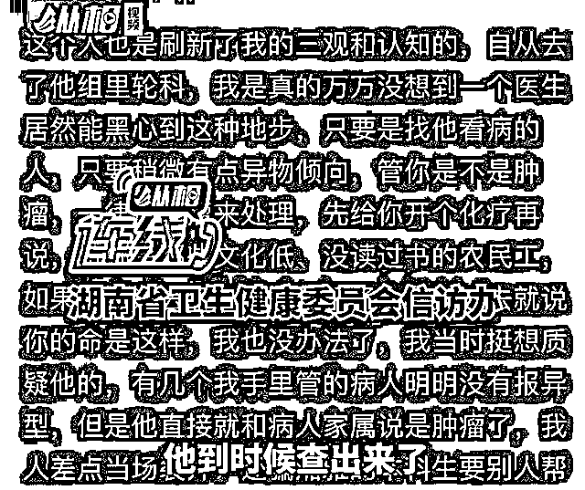
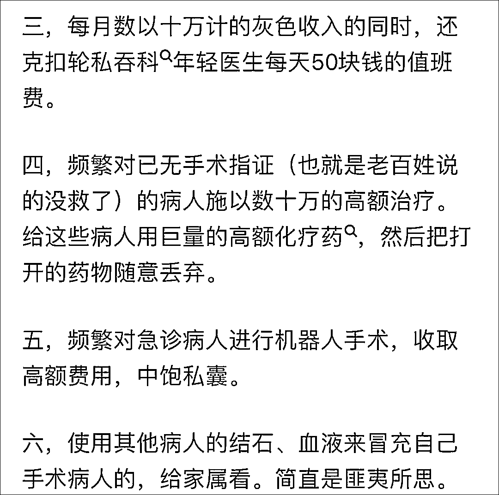
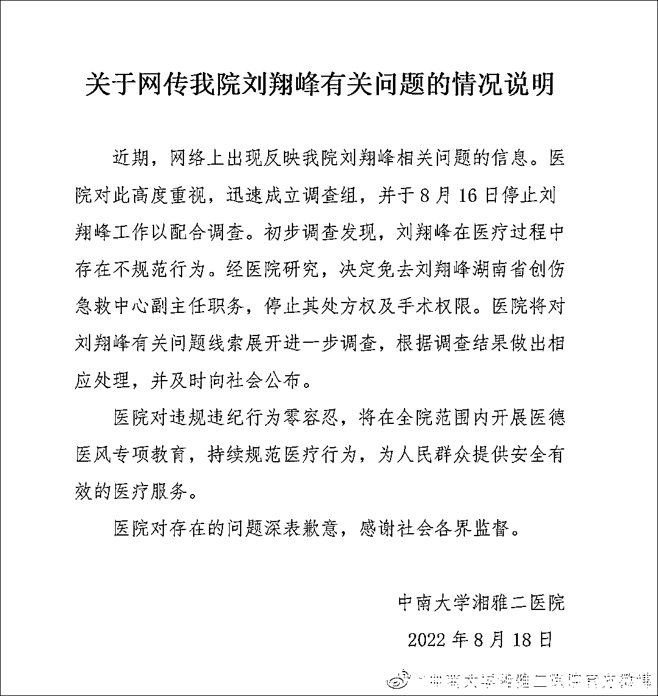

# "黑心医生"刷屏后，又有 15 人被查

> 原文：[`mp.weixin.qq.com/s?__biz=MzIyMDYwMTk0Mw==&mid=2247543412&idx=3&sn=5439b9c2303be0cfd05c9e81aaa0fdcc&chksm=97cbe14ca0bc685a34e075f91d0224d50eec0f6cac8a10fc1ee99136dce7132054be6d242464&scene=27#wechat_redirect`](http://mp.weixin.qq.com/s?__biz=MzIyMDYwMTk0Mw==&mid=2247543412&idx=3&sn=5439b9c2303be0cfd05c9e81aaa0fdcc&chksm=97cbe14ca0bc685a34e075f91d0224d50eec0f6cac8a10fc1ee99136dce7132054be6d242464&scene=27#wechat_redirect)

近日，上游新闻记者从接近湘雅二医院人士处获悉，9 月 2 日，中南大学湘雅二医院内部下发文件，**决定对该院心血管内科医生谭某某、产科医生朱某某等 15 名工作人员给予诸如取消该院医疗资质等处分。**9 月 5 日下午，湘雅二医院门诊办工作人员介绍，谭某某、朱某某在整个 9 月份已无门诊，“具体情况不清楚”。

湘雅二医院的处罚决定。 图片来源/知情者供图

上游新闻记者获取的中南大学湘雅二医院编号为院行字（2022）98 号《关于给予谭某某等行政处分的决定》（以下简称《决定》）文件提到，2022 年 8 月 25 日医院启动“改进医疗作风、规范医疗行为”专项行动以来，扎实推进自查自纠，根据专项行动要求，对在此期间发现的违规违纪问题一律从严、从快查处。

《决定》称，心血管内科医生谭某某在医院门诊过程中，引导患者院外购药，违规转诊患者、开大处方。根据《医疗机构工作人员廉洁从业九项准则》《中南大学湘雅二医院医院医务工作人员行为规范“十二不准”实施细则》，决定给予谭某某警告处分、取消谭某某中南大学湘雅二医院医疗资质；心血管内科主管医疗副主任刘某某提醒谈话，责令检查。

《决定》提到，产科医生朱某某多点执业，在医院门诊过程中介绍患者外院就诊和检查。根据《医疗机构工作人员廉洁从业九项准则》《中南大学湘雅二医院医院医务工作人员行为规范“十二不准”实施细则》，决定取消朱某某中南大学湘雅二医院医疗资质；妇产科副主任、产科副主任（主持工作）黄某提醒谈话，责令检查。

上游新闻记者从长沙某妇产医院官网《专家风采》一栏了解到，朱某某曾任中南大学湘雅二医院妇产科主任，毕业于中南大学湘雅医学院，一直留校在湘雅二医院妇产科从事临床、科研和教学工作近 50 余年。长沙某妇产医院康先生介绍，朱教授有时星期一坐诊、有时星期三坐诊。

此外，《决定》还提到感染科、血液内科、外科楼药房等多名医疗工作人员存在违规行为，并给予提醒谈话、责令检查等处分。

“有听说过此事，但这个《决定》没有公开。”一名湘雅三医院心血管医生告诉上游新闻记者，早年曾与谭某某开过几次会，“印象是老实、不爱说话。”湘雅二医院网上挂号资料介绍，此次被处分的谭某某、朱某某均系该院主任医生。

9 月 5 日下午，上游新闻记者多次致电中南大学党委宣传部主要负责人电话，对方称正在开会挂断电话，随后记者发去短信希望进行采访，截至发稿未获回复。

此前有网友爆料称，中南大学湘雅二医院医生刘翔峰存在医疗作风问题。

“只要稍微有点异物倾向，不管是不是肿瘤，一律按肿瘤处理，先做化疗。再比如，机器人做不完全性肠梗阻，开进去找不到梗阻段，就把正常肠管切下来给家属看。”

8 月 18 日，中南大学湘雅二医院官方微博发布《关于网传我院刘翔峰有关问题的情况说明》。

“近期，网络上出现反映我院刘翔峰相关问题的信息。医院对此高度重视，迅速成立调查组，并于 8 月 16 日停止刘翔峰工作以配合调查。初步调查发现，刘翔峰在医疗过程中存在不规范行为。经医院研究，决定免去刘翔峰湖南省创伤急救中心副主任职务，停止其处方权及手术权限。医院将对刘翔峰有关问题线索展开进一步调查，根据调查结果做出相应处理，并及时向社会公布。”

“医院对违规违纪行为零容忍，将在全院范围内开展医德医风专项教育，持续规范医疗行为，为人民群众提供安全有效的医疗服务。

医院对存在的问题深表歉意，感谢社会各界监督。”

据顶端新闻·河南商报 8 月 23 日报道，刘翔峰本人回应称，“如果有任何问题，请直接联系我们医院的宣传部门。”

多位内部人士表示，网上盛传的一些信息基本是真实的，只是没有那么夸张。

一名曾在刘翔峰手下轮岗实习的湘雅二医院内部人士称，刘翔峰在很多化疗病人没有明确指征情况下，便给他们多开药，而且大多时候手术都是别的医生在做，刘翔峰上台不久就匆匆离去。刘翔峰不管什么手术都会开具一堆自费耗材，对于癌症晚期没有手术指征的病人，也会做腹腔开关，平白增加病人痛苦。

此外，顶端新闻·河南商报记者从一位曾经在中南大学湘雅二医院任职多年的医生处了解到，他在该医院工作期间，听说过一些关于刘翔峰的事情，包括网上爆料出来的信息。“很多都是院内众所周知的事情。”

“刘的口碑在湘雅不太好，听说是有靠山，很多有正义感的医护都无可奈何。”这名医生说。

湘雅二医院一名在职医护人员告诉顶端新闻·河南商报记者，网上关于刘翔峰的流言，很多都存在类似情况，但信息有些夸张。

“那是他的个人行为，而且目前已经在调查了。”该医护人员表示，湘雅二医院大部分医生是值得信任的，大家不会也不愿意去“冒天下之大不韪”。

8 月 22 日，中南大学湘雅二医院相关工作人员向顶端新闻·河南商报记者表示，医院关注到此事后，立即停止刘翔峰医生的工作，并让其配合调查。

经过初步调查后发现，刘翔峰在医疗过程中存在不规范的行为。

随后医院研究决定，免去刘翔峰湖南省创伤急救中心副主任职务，停止其处方权和手术权限。

顶端新闻·河南商报记者了解到，作为监管部门的湖南省卫健委，已经联合中南大学成立调查组，针对此事进行调查。

“一旦有结果，将及时向社会公布。”湖南省卫健委工作人员对顶端新闻·河南商报记者说。

来源：观察者网综合上游新闻、顶端新闻报道

欢迎关注灰产圈社群服务号

