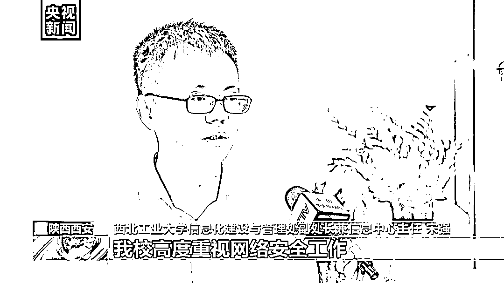
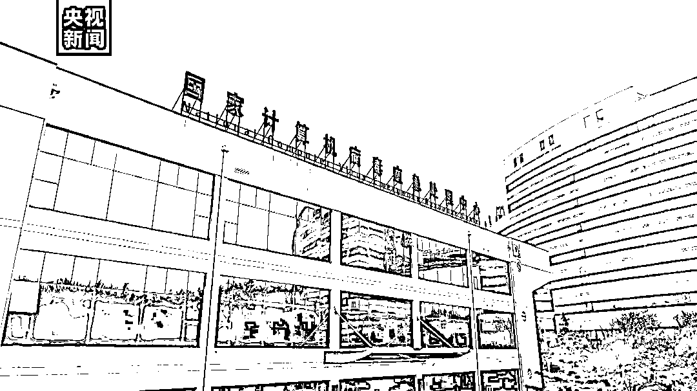
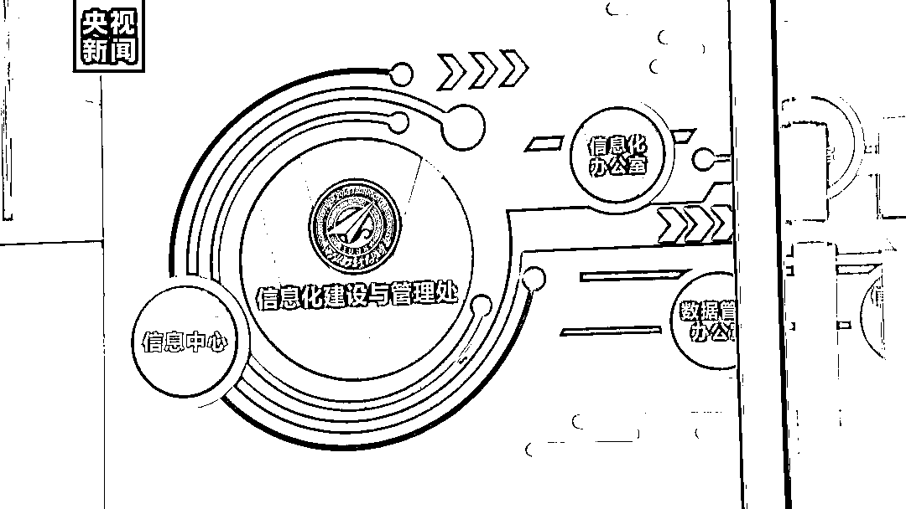
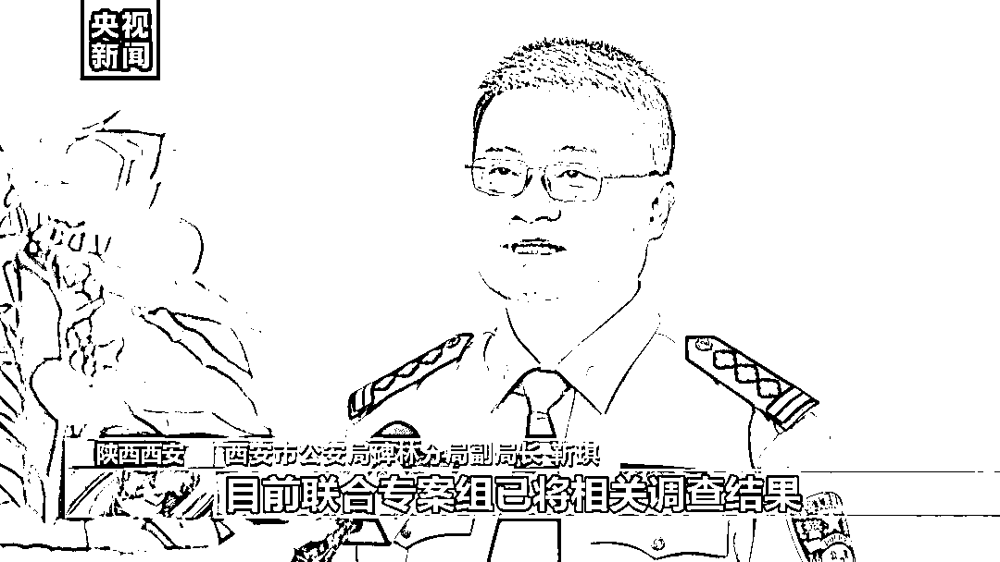

# 西北工业大学遭境外网络攻击，黑手被揪出：美国国家安全局！

> 原文：[`mp.weixin.qq.com/s?__biz=MzIyMDYwMTk0Mw==&mid=2247543412&idx=4&sn=ae519023490ac6db83c225e85acd158f&chksm=97cbe14ca0bc685a908c25851fd41377be05054f6c8c29c87eec3b2a39d77694e2bdf82e2d57&scene=27#wechat_redirect`](http://mp.weixin.qq.com/s?__biz=MzIyMDYwMTk0Mw==&mid=2247543412&idx=4&sn=ae519023490ac6db83c225e85acd158f&chksm=97cbe14ca0bc685a908c25851fd41377be05054f6c8c29c87eec3b2a39d77694e2bdf82e2d57&scene=27#wechat_redirect)

今天（5 日），国家计算机病毒应急处理中心和 360 公司分别发布了关于西北工业大学遭受境外网络攻击的调查报告。调查中，国家计算机病毒应急处理中心和 360 公司联合组成技术团队，全程参与了此案的技术分析工作。技术团队先后从西北工业大学的多个信息系统和上网终端中提取到了多款木马样本，综合使用国内现有数据资源和分析手段，并得到了欧洲、南亚部分国家合作伙伴的通力支持，全面还原了相关攻击事件的总体概貌、技术特征、攻击武器、攻击路径和攻击源头，**初步判明相关攻击活动****源自美国国家安全局（NSA）“特定入侵行动办公室”（Office of Tailored Access Operation，简称 TAO）。**

[`v.qq.com/iframe/preview.html?width=500&height=375&auto=0&vid=p3355w16l5i`](https://v.qq.com/iframe/preview.html?width=500&height=375&auto=0&vid=p3355w16l5i)

今年 4 月，西安市公安机关接到一起网络攻击的报警，西北工业大学的信息系统发现遭受网络攻击的痕迹。

**西北工业大学信息化建设与管理处副处长兼信息中心主任 宋强：**近期我校系统发现木马程序，企图非法获取权限，这给我们学校的正常工作和生活秩序造成了重大的风险隐患。我校高度重视网络安全工作， 已将该情况报警。

西安市公安机关对此高度重视，立即组织警力与网络安全技术专家成立联合专案组对此案进行立案侦查。国家计算机病毒应急处理中心和 360 公司联合组成技术团队，全程参与了此案的技术分析工作。技术团队先后从西北工业大学的多个信息系统和上网终端中提取到了多款木马样本，综合使用国内现有数据资源和分析手段，并得到了欧洲、南亚部分国家合作伙伴的通力支持，全面还原了相关攻击事件的总体概貌、技术特征、攻击武器、攻击路径和攻击源头，初步判明相关攻击活动源自美国国家安全局（NSA）“特定入侵行动办公室”（Office of Tailored Access Operation，简称 TAO）。

本次调查还发现，在近年里，美国国家安全局（NSA）下属特定入侵行动办公室（TAO）对中国国内的网络目标实施了上万次的恶意网络攻击，控制了数以万计的网络设备，包括：网络服务器、上网终端、网络交换机、电话交换机、路由器、防火墙等，窃取了超过 140GB 的高价值数据。

联合技术团队经过复杂的技术分析与溯源，还原了西北工业大学遭受网络攻击的过程和被窃取的文件，掌握了**美国国家安全局（NSA）下属的特定入侵行动办公室（TAO）对中国信息网络实施网络攻击和数据窃密的相关证据，涉及在美国国内对中国直接发起网络攻击的人员 13 名，以及美国国家安全局（NSA）通过掩护公司为构建网络攻击环境而与美国电信运营商签订的合同 60 余份、电子文件 170 余份。**

****

******西安市公安局碑林分局副局长 靳琪：**目前，联合专案组已将相关调查结果上报国家有关部门。****

****此次遭受攻击的西北工业大学位于陕西西安，隶属于工业和信息化部，是一所多科性、研究型、开放式大学。****

 ****[`v.qq.com/iframe/preview.html?width=500&height=375&auto=0&vid=n3355e0juou`](https://v.qq.com/iframe/preview.html?width=500&height=375&auto=0&vid=n3355e0juou)**** ****来源：央视新闻，澎湃新闻************

****欢迎关注灰产圈社群服务号****

********

********