# 烹食大白鲨、“水母雪兔子”煮泡面，如何刹住猎奇式吃播？

> 原文：[`mp.weixin.qq.com/s?__biz=MzIyMDYwMTk0Mw==&mid=2247543412&idx=6&sn=e9876849819eb573418a318c6edd9a90&chksm=97cbe14ca0bc685a083099fc22ec22a4db4dd39270a0f19b59da2805aa48c6be856cbe548062&scene=27#wechat_redirect`](http://mp.weixin.qq.com/s?__biz=MzIyMDYwMTk0Mw==&mid=2247543412&idx=6&sn=e9876849819eb573418a318c6edd9a90&chksm=97cbe14ca0bc685a083099fc22ec22a4db4dd39270a0f19b59da2805aa48c6be856cbe548062&scene=27#wechat_redirect)

近年来，吃播文化兴起。在短视频平台上，经常能看到有博主发布各类美食吃播的视频，这些短视频让人们见识了不同地区的特色美食，也传播了美食文化。然而，一些美食主播为了吸引点击量，竟然触碰法律红线，发布猎奇式吃播。

近期，某网红美食博主在自己的账号里发布了一条吃鲨鱼的视频。网友发现视频中的鲨鱼疑似国家二级保护野生动物——噬人鲨。

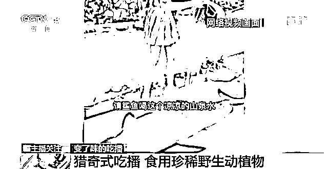

舆论发酵后，视频也引起相关部门的注意。经鉴定，视频中的鲨鱼确实是噬人鲨，目前该主播账号被封禁，相关人员已被警方控制。

**中国政法大学传播法研究中心副主任 朱巍：**第一个是《野生动物保护法》，我们国家的野生动物都是有法律规定的，不可以擅自去捕猎，包括去食用，这些都是违法行为。

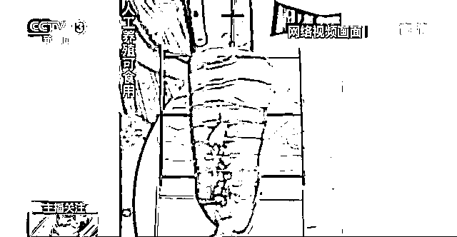

该段视频全程都在左上角标注“人工养殖可食用”，但专家指出，标注“人工养殖”并不能作为主播规避违法风险的凭仗。

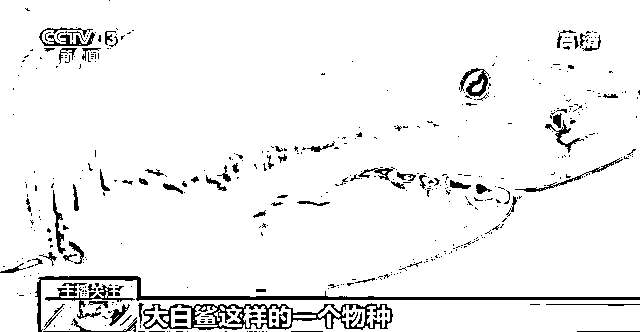

**中国政法大学传播法研究中心副主任 朱巍：**大白鲨这个物种，目前为止没有成功养殖的案例，所以即便标记了所谓的这种抗辩，实际上在科学领域中是不可能实现的，所以是一个虚假标记，也是不能够抗辩的。

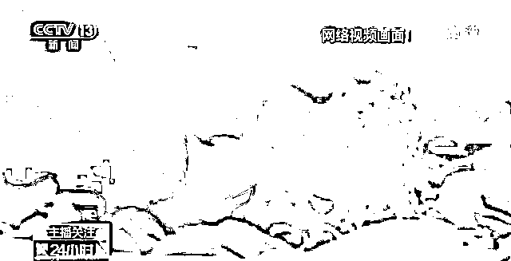

近年来，因发布猎奇吃播而触犯法律的情况时有发生。2020 年 7 月，拥有 300 余万粉丝的某美食博主在视频中采摘濒危植物“水母雪兔子”，并与泡面同煮而食。2021 年 5 月，一位主播因发布食用国家二级保护动物凤尾螺的视频，被警方依法刑事拘留。

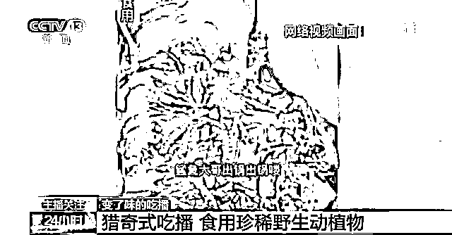

对此，专家指出，发布传播食用受保护野生动植物的视频，不但主播及相关人员要承担法律责任，涉事平台也有不可推卸的责任。

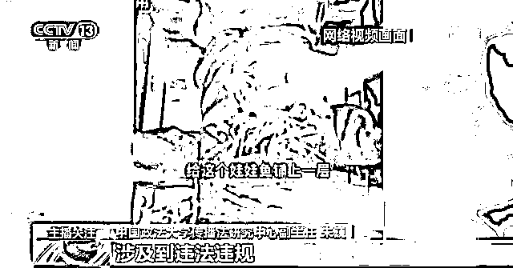

**中国政法大学传播法研究中心副主任 朱巍：**平台要承担的法律责任是多个层次的，在巡查过程中，如果发现主播发布的视频涉及违法违规，要及时地采取必要措施。如果没有采取必要措施，平台也要承担责任。

**猎奇式吃播****可能危及生命健康**

吃稀有野生动植物涉嫌违法，还有一些猎奇式吃播，吃不常见或者带有危险性的食材，会伤害主播的身体健康甚至生命安全，还会传递不正确的价值观，对他人与社会造成潜在的危险。

近期，一种名为鳄雀鳝的“怪鱼”在我国多地频频出现。它是世界上最凶猛的肉食性淡水鱼之一，能长到 2 米长、上百斤。它的卵有剧毒，误食危险，肉质粗糙，却有主播把它做成酸菜鱼。

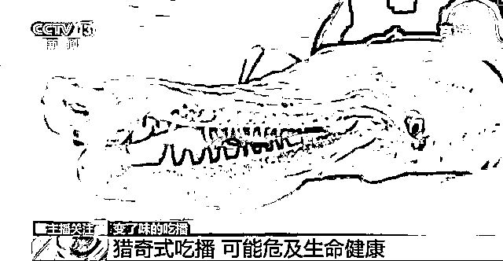

**南京江豚保护协会技术专员 丁兆宸：**雌性鳄雀鳝在繁殖期的时候，卵巢有剧毒，通过吃掉鳄雀鳝来控制它的想法是有危险的。

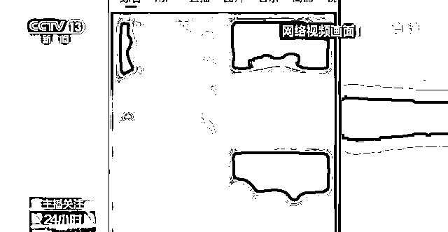

记者在短视频平台搜索“吃播”相关内容，发现将食材新奇性作为卖点的博主不在少数。许多博主还会把视频中最吸引眼球的食材作为视频封面图，并加上“百年一遇”“全网首吃”等极限形容词强调食材特殊，吸引用户点击观看。

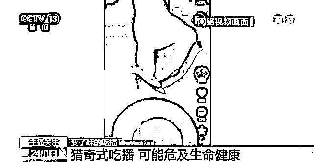

还有一些主播，以记录“乡村美食”为名，发布一些生吃活鱼、昆虫、野生菌等内容的视频，然而，此类“吃播”隐藏着极大的健康风险。以生吃肉类、鱼虾、昆虫类为例，存在着感染寄生虫的风险。而生吃野生菌则有可能引起中毒甚至死亡。专家也指出，发布传播此类吃播视频，同样违反相关的法律法规。

**中国政法大学传播法研究中心副主任 朱巍：**《网络主播行为规范》在里面有一个明确的规定，有可能引起他人的生理不适的视频，不适合在互联网传播，所以也可能被平台判定为违规视频。因为他的行为本身是一种危险行为，在观看主播的这些人之中，有一些人可能会去模仿。

**流量至上催生猎奇式吃播**

“吃播”的初衷是带网友“云享美食”。由于入门容易、变现快，吸引了越来越多的主播投身吃播。在激烈的竞争中，一些视频创作者为博流量，开始了猎奇式吃播。

吃播起初是主播一边直播吃饭一边与粉丝聊天互动。随着引入了粉丝打赏、直播带货、商家广告等机制，吃播逐渐成为一个新兴行业。

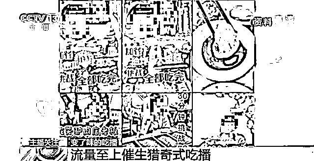

随着行业竞争越演越烈，一度出现了以夸张食量和吃相争夺流量的“大胃王”“暴饮暴食”式吃播，并催生出假吃、催吐等行业乱象。2021 年 4 月，《中华人民共和国反食品浪费法》正式颁行，严令禁止制作、发布、传播宣扬量大多吃、暴饮暴食等浪费食品的内容，否则监管部门将给予停业整顿、处一万元以上十万元以下罚款等行政处罚，并追究包括主播在内的相关人员和责任人员法律责任。“风靡一时”的大胃王吃播类视频被叫停。

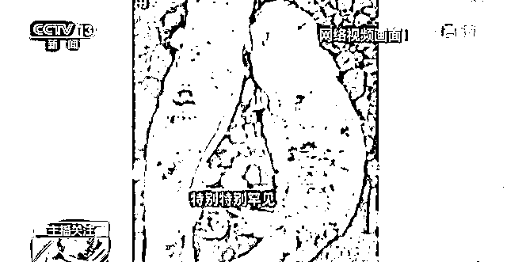

随后，一些主播开始利用大家猎奇心态制作吃稀有食材的视频。

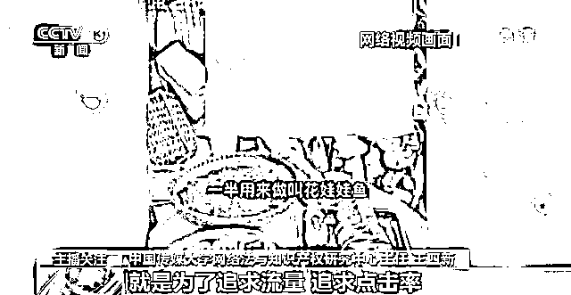

**中国传媒大学网络法与知识产权研究中心主任 王四新：**就是为了追求流量，追求点击率，获得更好的商业变现模式。你要去拓展你的路数，导致好多吃播播主在吃的方式上、吃的食材上去猎奇，去满足人们的这种好奇心，去不断铤而走险。

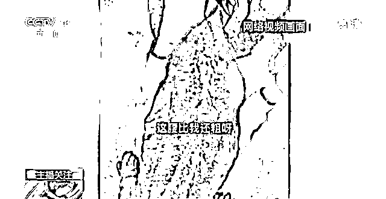

专家指出，猎奇式吃播不但对野生动物保护产生不良影响，还会危害短视频行业的健康发展。

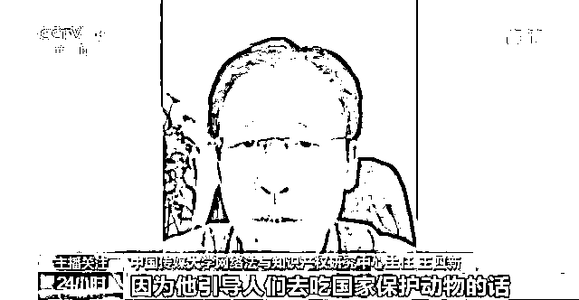

中国传媒大学网络法与知识产权研究中心主任 王四新：因为他引导人们去吃国家保护动物的话，势必会导致国家保护动物遭受更多人的捕猎，遭受更多濒临灭绝的危险，也会诱导人们形成不正确的吃东西的方式。

**多管齐下 刹住“吃奇”之风**

专家指出，要想有效治理猎奇式吃播，必须多管齐下，从立法、执法、守法三个层面建立立体的合规治理体系。

近年来，为促进网络直播行业规范健康发展，有关监管部门和行业协会相继发布了《互联网直播服务管理规定》《网络直播营销行为规范》等一系列规范性和指导性文件。今年 6 月，国家广播电视总局、文化和旅游部联合印发了《网络主播行为规范》，其中明确提到网络主播应当坚持健康的格调品位，自觉摒弃低俗、庸俗、媚俗等低级趣味，自觉反对流量至上、畸形审美等不良现象。

**中国政法大学传播法研究中心副主任 朱巍：**作为政府机构和监管部门来说，对这样的账号处理，不单纯是线上的处理。比如说线下相关的主播，涉事的 MCN 公司（网络表演经纪机构）也要承担相关的法律责任，它有一个连带关系。

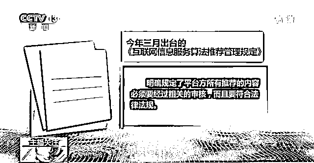

今年 3 月出台的《互联网信息服务算法推荐管理规定》，明确规定了平台方所有推荐的内容必须经过相关的审核，而且要符合法律法规。

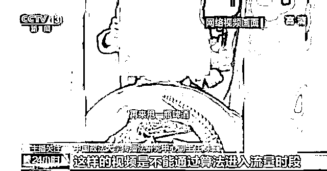

**中国政法大学传播法研究中心副主任 朱巍：**当有一些视频涉及猎奇的或者是容易引起模仿的危险行为的时候，有可能没有直接触犯法律，但非常有可能导致其他人的模仿。这样的视频是不能通过算法进入流量时段的。

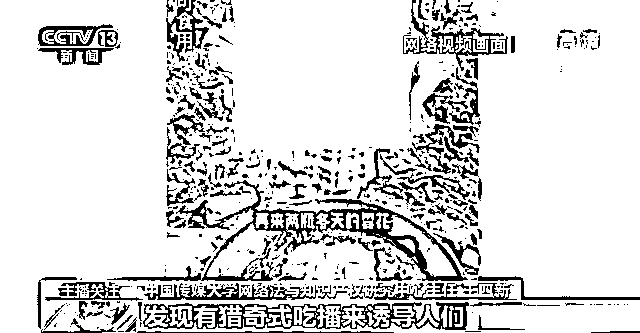

**中国传媒大学网络法与知识产权研究中心主任 王四新：**平台它的责任首先就是避免这一类猎奇式吃播行为在自己平台上形成一种氛围，发现有猎奇式直播来诱导人们去效仿的这种情况就应该立即采取措施，比如像账户冻结，或者没收非法所得，甚至严重的关停等等。

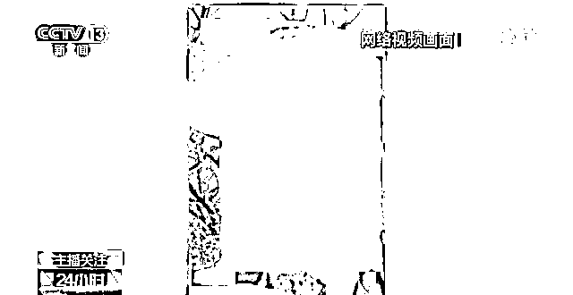

对于主播来说，进行美食分享直播和短视频拍摄时要明确法律底线。

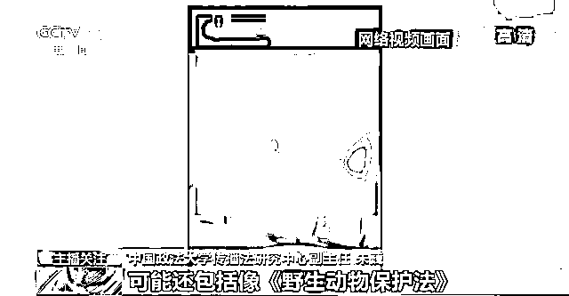

**中国政法大学传播法研究中心副主任 朱巍：**作为主播来讲，第一个你要了解相关的法律法规，不单纯是《互联网直播服务管理规定》《网络安全法》，可能还包括像《野生动物保护法》，包括《网络主播行为规范》，再包括《反食品浪费法》等等，你要在了解这些的基础之上，才能保障你的音视频合法合规。

来源：央视新闻，澎湃新闻

欢迎关注灰产圈社群服务号

