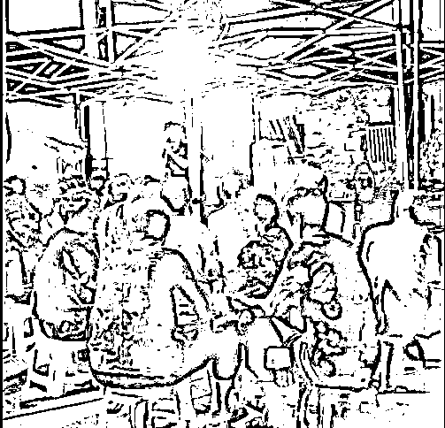
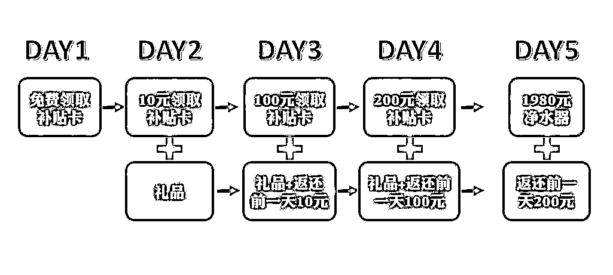
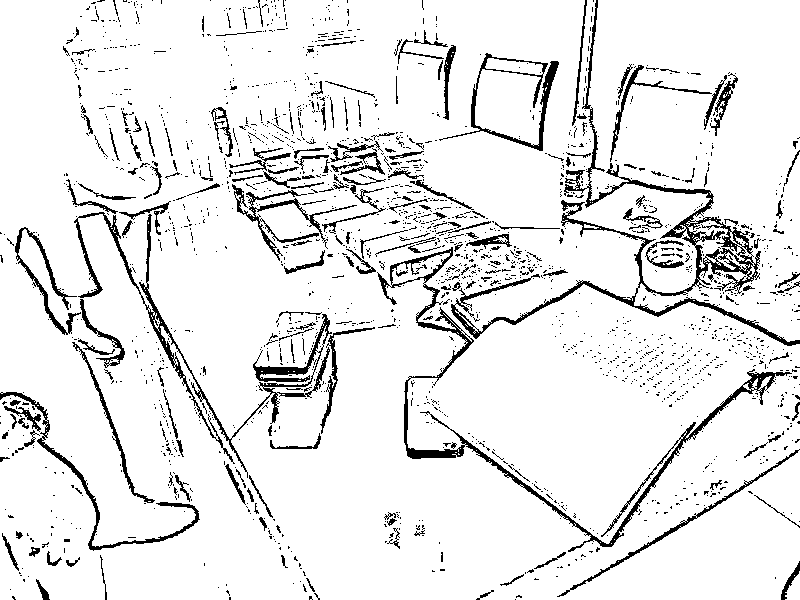

# 村儿里来了“热心人”，老年朋友“有福”了！

> 原文：[`mp.weixin.qq.com/s?__biz=MzIyMDYwMTk0Mw==&mid=2247543412&idx=7&sn=5b2afb4b3225987695c30f438b6b0e20&chksm=97cbe14ca0bc685abeeda60056b547c055d6bd08e869eed6a83b2e2d013d09f0e37726781410&scene=27#wechat_redirect`](http://mp.weixin.qq.com/s?__biz=MzIyMDYwMTk0Mw==&mid=2247543412&idx=7&sn=5b2afb4b3225987695c30f438b6b0e20&chksm=97cbe14ca0bc685abeeda60056b547c055d6bd08e869eed6a83b2e2d013d09f0e37726781410&scene=27#wechat_redirect)

“ 

炎炎盛夏，宁波一度冲上 40 度，宁波象山县东陈村的空地上却人头攒动，舞台正上演着热闹非凡的场景。

”

**村里来了“热心人”**

**只见，台上主持人激情四射地介绍着各类养生知识和补贴优惠活动，台下的“工作人员”则不断地向众多老年人免费发放鸡蛋、洗洁精等礼品。**

**更重的一份“大礼”，是专为老年人设计的“养生”净水器，号称能养生能治病，“只要 1980 元就能买到原价 5880 元的净水器”，付清后通过送礼品、发放水电费补贴等形式向其返款，“相当于免费领取”！**

****激动的心，颤抖的手，咱们今儿个大胆地走！****

**现场的老年人们听到这里，纷纷掏出钱包争相购买。他们却不知道，这里面的套路有多深！**

**第一天发放免费补贴卡，参加第二天的抽奖和礼品发放活动；第二天则需要支付 10 元参与，但是隔天就给返还；第三天需要支付 100 元参与，还是可以隔天返还。**

**就这样，支付金额虽不断上涨，但都是隔天返还，这令老年人的警惕心一下降低了许多。**

**到了第五天，就是支付 1980 元购买“打了大折”的净水器，然后返还前一天的钱。**

****

**免费领了小礼物，超低价买了“养生”净水器，免费听养生小知识，后面还有水电费补贴，这帮人真是“好”啊！几天下来，给村里的老年人们带来了不少的欢乐。**

****

**火热的推销会结束了，几天后，大家满心期待地安装上了“高端净水器”。然而，产品很快就出现了漏水、短路等故障，等再拨打售后电话时，根本无法接通，当时承诺的水电费补贴返款也毫无踪影！**

**这时，村里的老年人们才反应过来上当了，大家伙儿一合计，无奈地前往公安机关报案。**

****“热心人”火速落网****

****浙江宁波象山公安机关接到报案后，立即组织精干力量成立专案组，通过侦查，一个以程某为首的诈骗团伙逐渐浮出水面。****

****原来，该团伙分工明确，话术精湛，经常驻点农村开展为期多天的“健康讲座”，目标人群就是农村的老年人。****

****他们讲述着净水器的养生神奇，免费发放小礼物吸引老年人聚集后开设养生讲座，同时虚假宣传夸大其所推销商品的用途，通过先购买后全额返还的方式，来取得老年人的信任。****

****前面所有的铺垫都是为了最后一天能够高价将劣质商品卖出，此时许多已经没有防范心理的老年人便会上当受骗，再次出钱购买。****

****而骗子则会携款逃之夭夭，并在其他地方继续自己的骗局。目前涉案金额 20 余万元。****

********

****7 月 28 日，仅用了一个礼拜的时间，象山警方便将准备继续对农村老年人实施诈骗的团伙全部抓获。****

****目前，该团伙 18 名犯罪嫌疑人均已被依法采取刑事强制措施。****

 ****[`mp.weixin.qq.com/mp/readtemplate?t=pages/video_player_tmpl&action=mpvideo&auto=0&vid=wxv_2535655705199083521`](https://mp.weixin.qq.com/mp/readtemplate?t=pages/video_player_tmpl&action=mpvideo&auto=0&vid=wxv_2535655705199083521)**** 

******送给老年朋友几句话******

********不贪图便宜**——不轻信他人，牢记世上“没有免费的午餐”，打消“小钱赚大钱”“吃小亏赚大便宜”的念头。******

********不轻易动钱**——凡是要向陌生人或账号转钱的时候，一定找老伴、孩子或自己信得过的朋友，向他们征求意见，不能轻易拿钱出来。******

********警惕“各种讲座”**——所谓“健康讲座”“免费旅游”“免费茶话会”“免费参观”等活动，十有八九另有所图，不要盲目相信高额回报的宣传和所谓“公司实力”，防止陷入骗子的套路。******

********端正保健理念**——要从正规的渠道获取科学的保健知识，到正规的医疗机构就医，不轻信所谓的“知名专家”“祖传秘方”，不轻易购买所谓的“特效药”“进口药”，以防陷入骗局。******

******来源：公安部网安局，利箭在出击******

************

******欢迎关注灰产圈社群服务号******

************

************