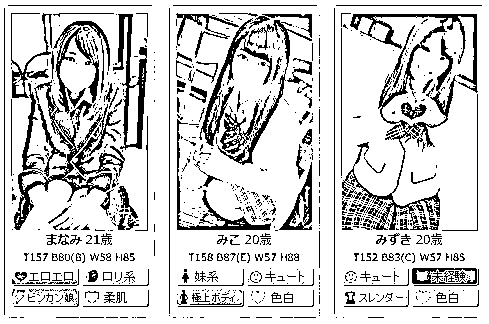
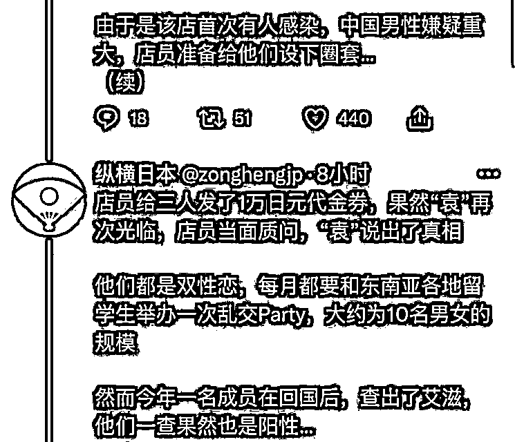

# 3 名中国留学生日本“风俗店”传播艾滋，或已感染 1000 人？网友：为国争光

> 原文：[`mp.weixin.qq.com/s?__biz=MzIyMDYwMTk0Mw==&mid=2247543444&idx=1&sn=45951c985e81aad2216ad7ebc3c1982c&chksm=97cbe1aca0bc68baae3bd92333e03421ee9d3265189b5a1a6b1218168e6bd6d2646c74babbef&scene=27#wechat_redirect`](http://mp.weixin.qq.com/s?__biz=MzIyMDYwMTk0Mw==&mid=2247543444&idx=1&sn=45951c985e81aad2216ad7ebc3c1982c&chksm=97cbe1aca0bc68baae3bd92333e03421ee9d3265189b5a1a6b1218168e6bd6d2646c74babbef&scene=27#wechat_redirect)

最近有 3 个在日本的中国留学生挺火，

据说**凭借 3 人之力，恐让上千日本人感染艾滋...？**

**这件事儿网络上的声音褒贬不一，有人觉得 3 人道德有问题；**

**也有人说，他们是为国争光......**

****根据日本“周刊现代”报道，日本东京池袋拉响“异常事态警报”——****某家 JK 风俗店出现 HIV 群聚性感染者。****

****据推测，****间接感染者合计将超过 1000 名以上****。****

**如果情报属实，那这将是日本除新冠疫情之外、遭遇的一次重大病毒感染危机。**

****

**而这一切的源头，竟是来自东京某私立高校的 3 名中国留学生。**

****

****“反正 1 年之后都要回国。国内没有风俗店，那就趁现在玩尽兴吧！感染 HIV 也就感染了吧，无所谓了。正好可以趁这个机会，把毒传给日本人，把他们一起拉进地狱！”****

**在这篇报道中，记载着上面这段来自中国留学生的话。**

****

**2022 年 1 月的一个夜晚，**风俗从业者**莲（化名），走进池袋附近一家情趣酒店 6 层的一个房间。**

**已经坐在房间沙发上的男子，穿着白色衬衫、戴着眼镜。**

**虽然推算起来，年龄应该和莲差不多，但是看上去很有钱的样子。**

****“您好！我叫莲。谢谢您今晚点了我。请问怎么称呼您呢？”****

**面对莲热情的开场白，这位男子显得有些冷漠。**

**他小声回答自己姓袁，并拿出 1 万 6000 日元，先给了莲。**

****

**接下来，莲就熟练地为袁姓男子脱去衣服、然后一起去洗澡。**

**过程中，袁姓男子一直很少说话，虽然莲一直秉持着特殊服务业者的热情，各种寒暄。**

**但她最后获取到的信息，也只有**“中国人、东京比较有名的私立大学、26 岁、研究生在读”**这些而已。**

**洗完澡之后，两人进入“本番”。**

****“看上去明明是很老实内向的人，一到了床上就像变了一个人一样，很疯狂。”**莲说。**

****“过了一会儿，他说想要有实际性动作。我就跟他讲，原则上我们店是不允许的。但是只要不和店里讲，也是可以的——无 T 的话是 5 万日元。”****

****

**袁姓男子二话不说去沙发的包里拿出 5 万日元给了莲。**

**之后袁姓男子又说想用口，莲觉得这是个有钱人，不想得罪，于是，虽然有些抗拒，但也照做了。**

****但后来，男子又让莲吸食自己的“液体”，**莲实在不想做，便拒绝了。**

**被拒绝的袁姓男子看上去有些不高兴，但也没再说什么。**

**结束之后，两个人什么话也没说，就在床上躺着。**

**直到 90 分钟的设定闹钟铃声响起，莲再次带着男子入浴，并准备结束这次服务。**

**分开的时候，莲依旧是非常热情地和男子道别，而男子也依然是冷冷的，点点头就离开了。** 

****

**（图片与当事人无关）**

****从那以后，这个袁姓男子就经常“指名”莲。****

**虽然过程中，总会让莲觉得不适，但毕竟对方给钱从不含糊，所以莲也渐渐不以为然了。**

**几个月后，莲开始觉得身体状态有些不对劲--**淋巴结肿大、间歇性发烧。****

**当时正是日本第七波疫情抬头的时候，所以莲还以为自己感染了新冠。然而检测结果却都是阴性。**

**于是，莲就买了些简单的退烧药，待症状消失后，也没太在意。**

**然而，一切并没有那么简单。**

****

**7 月，在店面全体员工接受性病相关体检的时候，莲被检测出**HIV 感染**。**同时，另外 2 名同事也检测出阳性！**** 

**“原来那些类似感冒的症状，就是 HIV 感染的初期症状。”莲说。**

****

**一旦感染 HIV，免疫细胞就会受到破坏。**

**如果不及时吃药、接受治疗，那么 HIV 病毒便会在体内不断繁殖，并在约 10 年左右的发展期后，演变成艾滋病（AIDS，后天性免疫不全症候群）。**

**如果病征逐渐严重的话，人体免疫力将急转直下，并引发重度肺炎或皮肤病等各种连带病状。**

**目前，医学界还没有出现完全根除 HIV 病毒的治疗方式。**

****

**根据日本厚生劳动省提供的数据显示，**

**2020 年，**日本国内女性感染 HIV 病毒的人数仅有 38 人**，并呈现减少趋势。**

****

**在这样鲜少感染的背景下，**

**池袋风俗店“连带感染事件”将成为载入史册的**重大卫生安全事件**！**

****

**莲所在的 JK 风俗店店员表示：**

****“我们这一行，原则上确实是禁止实际性行为的。但是就算店内禁止，也是不可能不发生的。只要店员和客人达成一致、并且对店面保密，那我们也只能睁一只眼闭一只眼了。像这样持续和客人发生性关系的话，患上性病的危险系数也是很高的。”****

**虽然为了尽量避免性病传染，店面会每 3~4 个月进行一次全员体检。但以本次事件来看，3~4 个月的时间，已经足够 HIV 病毒大肆传播了。**

****“我们店从来没出现过 HIV 感染者，这是第一次，而且居然还是连着 3 个人，实在是有些可怕啊。”****

****

**（图片与当事人无关）**

**这些感染者都有一个共通点，她们和莲一样，是店里的“人气王”，且都在 1~4 月以每周一次的频率，接待了**来自中国的 3 名男性客人****，不仅都有性行为，她们还都被要求吸食客人的“液体”**，和莲的经历几乎一模一样。**

**然而，这 3 名客人在那之后便音讯全无，怎么都联络不到。** 

**几经周折，媒体记者和风俗店，利用 1 万日元的促销券，终于在 8 月，引出了袁姓男子的预约。**

****

**袁姓男子进店后，被早就“埋伏好”的记者抓了个正着，而接下来的这些回答，相信也会让屏幕前的你惊掉下巴。**

****

**袁姓男子自称是**双性恋**，并表示另外两个“常客”也一样。**

**在他们的留学生圈子里，会定期举办“多人运动”派对，男女加在一起，大概 10 人左右的规模。搜索关注“不惑先生”，一个让你睡不着觉的公众号。**

**然而，经常参会的一个成员，在回国后被确诊 HIV 阳性。听到这个消息的袁姓男子便也去做了检查，确诊阳性。**

****“虽然得了病也挺绝望的，但身体里的性欲不会就此消失。于是，就想着隐瞒自己的病情，去风俗店好好潇洒一下。今朝有酒今朝醉。”****

****

**经过一个中国人风俗店老板的介绍，袁姓男子和朋友开始瞄上了莲所在的 JK 风俗店。**

****在正式享乐前，他们还制定了计划——指定店里人气高的姑娘、也就是极可能快速将 HIV 传染给其他人的店员，“不使用避孕措施、增加体液接触机会”这些点，也都是他们提前想好的。****

**日本医疗管理研究所理事长上昌宏表示：**

**“风俗店是 HIV 病毒蔓延的极佳温床，这不仅体现在传播速度和传播范围上，还体现在‘不知情条件下’的长时间无意识传播。”** 

****

****莲和其他两位风俗从业者，在与袁姓男子一行接触后，已经过了半年的时间，且一直持续工作。****

****从频率上看，每周 3-5 次性行为、每天平均接待 5 位客人。****

****如果按照这样推算，单单她们几个人，在这期间“亲密接触”的关系人就有****1000 名以上****！****

**这还没有算次密接人数，也就是**客人的妻子、亲友**······**

****

****然而纵观整个事件，事情的真伪并不能够确定。****

**原因是，这家报道本次事件的杂志社，本来就是一个喜欢造谣的杂志社。**

**经常**骂中黑中**，以此手段谋取流量。**

****

**国内网友也表示不可思议，3 人感染 1000 人？**

**难道是直接注射艾滋病毒吗？**

****

**如果真的感染了 1000+人，这已经不仅仅是传播病毒了，这已经上升到了国家安全层面，国内的媒体不可能不说话。**

****

**还有些现身说法的网友，以自身的经历告诉大家，无 T 是不可能的。**

****

**但对于这名网友的说话，尸哥不敢苟同，或许他给的钱还不够多。**

**你给她一个“小目标”试试.....**

**整个事件让日本媒体说的就像小说一样，**3 个富二代，同时感染艾滋，然后进行灭国行动？....****

**电视剧都不敢这么拍！**

****

**而在国内的评论区中，也有一部分人选择了相信此事。**

**有人骂 3 人：**

****

**但大部分都在说，3 人是在曲线救国，为国争光。**

****

****

****

**大家伙的爱国之心，都能理解。**

**但如果这个事儿是真的..... 那这 3 个人在国内就不“玩”吗？**

****

**无论是在国外还是国内，如果事情是真的，真没必要去褒奖他们的所作所为。**

**无论在哪，这种行为就是不道德，甚至已构成犯罪。**

****

**整个事情的真伪还有待考证，**

**但如果落实，其实这将是一件影响咱们国人形象的恶事... **

**至于曲线救国过为国争光，咱们就开开玩笑说算了，千万别往心里去。** 

**至于真相，等等吧！**

**等不到，那就是假的。**

**来源：东京新青年，ID：tokyomen，不惑先生**

****

**欢迎关注灰产圈社群服务号**

****

****