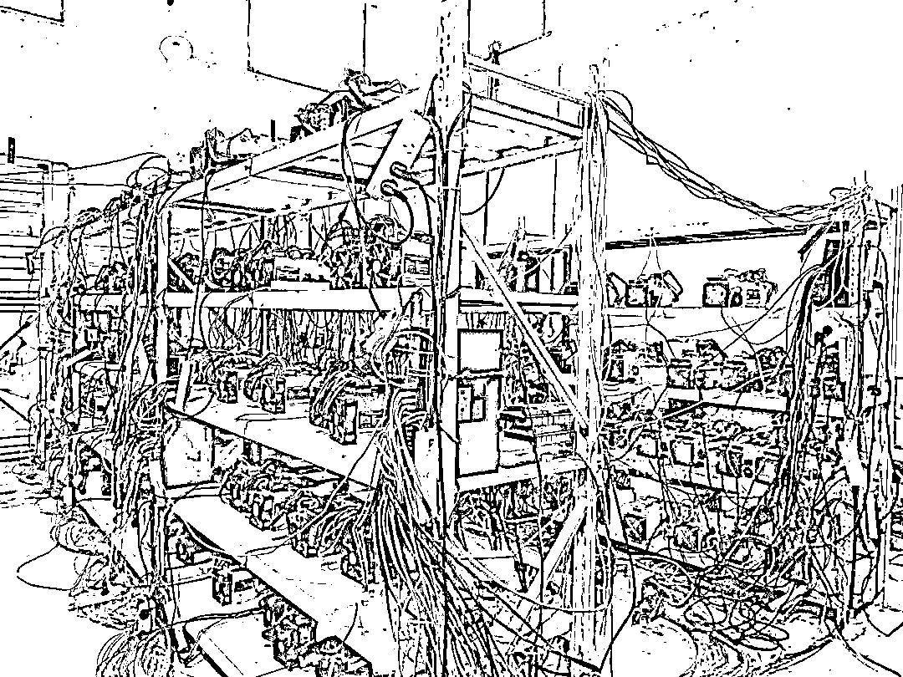
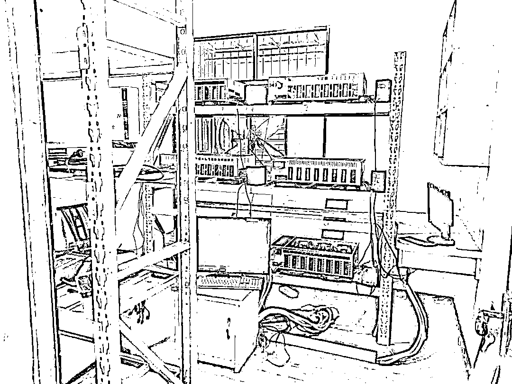
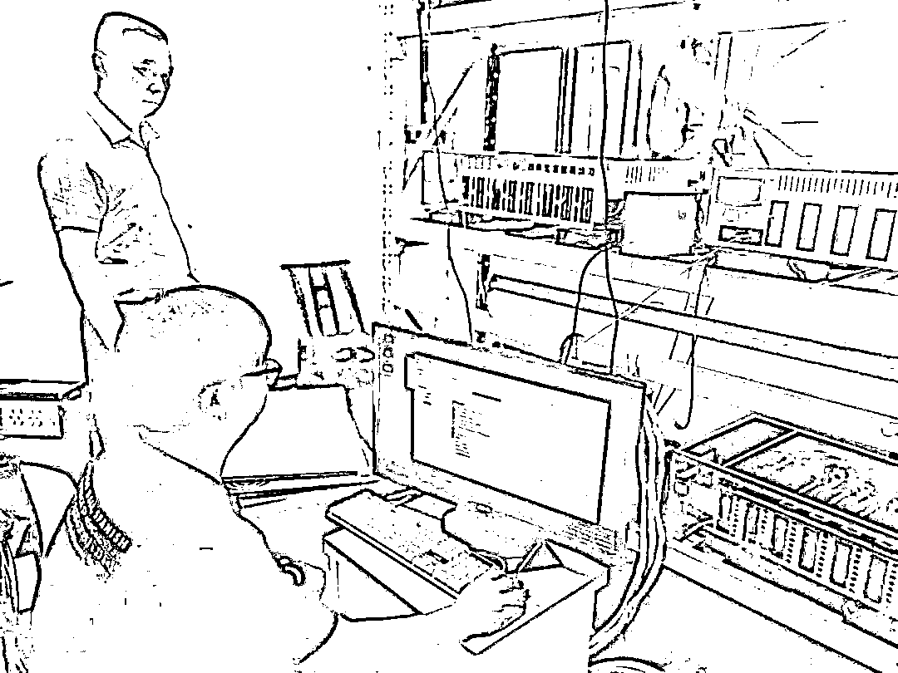
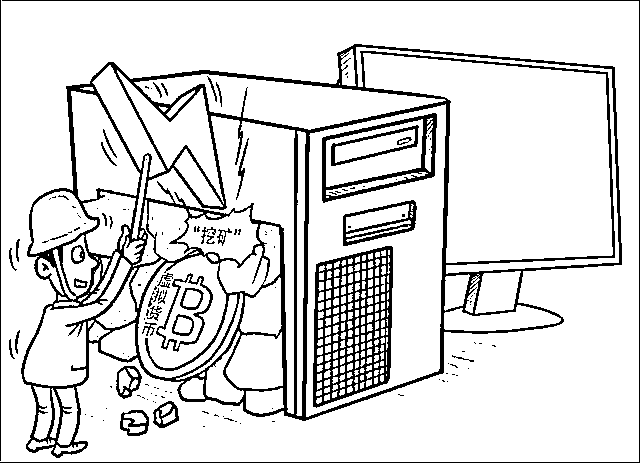
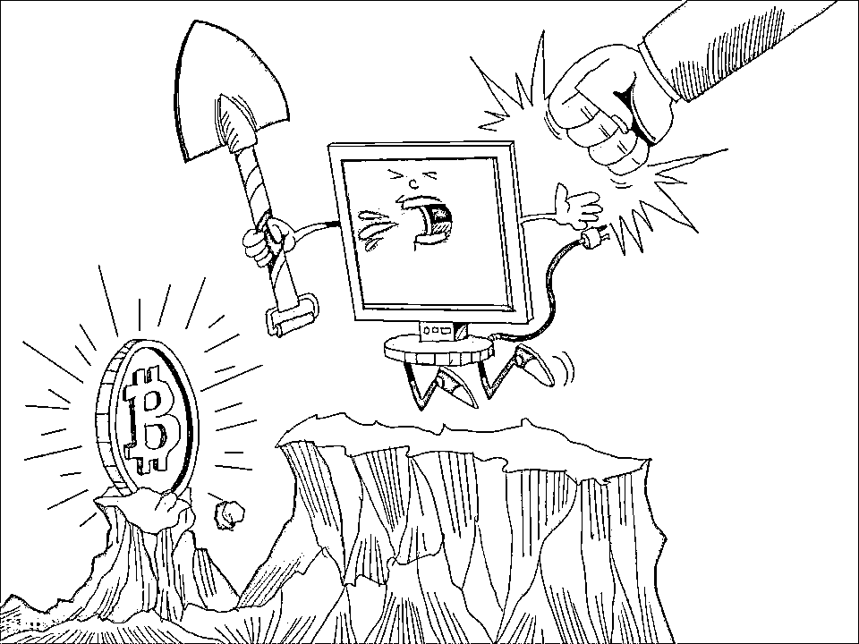

# 两虚拟币“挖矿”窝点被端，查获矿机 217 台！

> 原文：[`mp.weixin.qq.com/s?__biz=MzIyMDYwMTk0Mw==&mid=2247543444&idx=6&sn=9302de0405b29943e74abf67ce270f06&chksm=97cbe1aca0bc68ba7cf7352ce5df35fa9ef4a4dd1a135085cc4dd2dd455903a825459727ea99&scene=27#wechat_redirect`](http://mp.weixin.qq.com/s?__biz=MzIyMDYwMTk0Mw==&mid=2247543444&idx=6&sn=9302de0405b29943e74abf67ce270f06&chksm=97cbe1aca0bc68ba7cf7352ce5df35fa9ef4a4dd1a135085cc4dd2dd455903a825459727ea99&scene=27#wechat_redirect)

[`mp.weixin.qq.com/mp/readtemplate?t=pages/video_player_tmpl&action=mpvideo&auto=0&vid=wxv_2554088293467127809`](https://mp.weixin.qq.com/mp/readtemplate?t=pages/video_player_tmpl&action=mpvideo&auto=0&vid=wxv_2554088293467127809)

**近日**

**长阳警方经认真细致摸排核查**

**端掉两起从事虚拟币“挖矿”活动的窝点**

**查获“矿机”217 台**

8 月 19 日，长阳公安局联合县发改局、市场监督管理局、资丘镇政府，对资丘辖区可疑窝点进行上门核查，先后在某小型水电站查获两处“矿场”，共 211 台“矿机”。初步查明，2017 年以来，该电站负责人将厂房租赁给外地一男子从事虚拟币“挖矿”，以赚取电费差价。

8 月 22 日，长阳公安局按照上级指令，对龙舟坪镇某村一居民住所开展上门核查，当场查获“矿场”一处、6 台“矿机”。经审查，该居民自 2021 年 5 月以来，利用个体工商户执照虚构用电需求，诓骗国网供电公司为其供电“挖矿”。

对查获的两处“挖矿”窝点，‍核查专班当场责令相关人员拆除“矿机”、卸载“挖矿”软件、签订承诺书，并将核查结果同步报至市发改委会商研判，相关人员是否涉嫌其他违法犯罪，公安机关正在进一步调查中。

**币“挖矿”行为的危害**

****什么是“挖矿”****

**.jpg")** 

**虚拟货币“挖矿”活动是指“矿工”根据虚拟币系统设计者提供的开源软件，提供一定计算机运算力，通过复杂电脑数学运算，求得设计者想要得到的特定解的过程，求得特定解的“矿工”可以得到虚拟货币奖励，常见的有比特币、以太坊币、门罗币、EOS 币等。整个“挖矿”活动是通过专用“矿机”计算生产虚拟货币的过程，**其表现形式有以下几个方面：****

**❶ 伪装成数据中心的虚拟货币“挖矿”企业。**

**❷ 为从事虚拟货币“挖矿”活动企业提供场地租赁等服务的企业和个人。**

**❸ 通过非法手段获取电力供应，从事虚拟货币“挖矿”活动的企业。**

**❹ 以其他多种隐藏形式进行“挖矿”的企业、网吧等。**

**❺ 黑客向目标主机植入“挖矿”病毒，远程控制目标主机，大量消耗主机资源帮助“挖矿”。**

****虚拟货币“挖矿”行为的危害****

**** 

**虚拟货币发行和交易是区块链金融领域的重要应用，但依托区块链底层技术，具有匿名性、无准入门槛、无合法资金来源审查等特点。**其危害主要有以下几个方面：****

**❶ 扰乱经济金融正常秩序。虚拟货币炒作交易扰乱我国正常金融秩序，催生违法犯罪活动，虚拟货币成为洗钱、逃税、恐怖融资和跨境资金转移的通道，一定程度威胁了社会稳定和国家安全，扰乱经济金融正常秩序。**

**❷ 能源消耗量巨大。挖矿活动能耗和碳排放强度高，对我国实现能耗双控和碳达峰、碳中和目标带来较大影响，加大我国部分地区电力安全保供压力。**

**❸ 具有很大的网络安全风险。不法分子为了获取暴利，大量通过植入挖矿木马，控制受害者计算机进行虚拟货币“挖矿”，为自己牟利，对受害计算机及其网络安全构成严重威胁，国内挖矿木马攻击事件呈爆发式增长。尤其是针对政府、科研院所、学校、企业等重点单位，投射的“挖矿”木马。这些行为不仅影响相关网络终端设备运行，对其单位虚拟主机、局域网运行均造成了严重影响，极易造成数据泄露或感染病毒，严重影响工作、科研、教学、运营、管理工作正常开展。**

**❹ 极易成为犯罪工具。虚拟货币的账户匿名，外界无法知悉谁是其持有者，易成为非法转移资产、洗钱等违法犯罪活动的工具。**

****参与虚拟货币“挖矿”活动会触犯哪些法律****

****

**2021 年 9 月 24 日，中国人民银行等十部门发布**《关于进一步防范和处置虚拟货币交易炒作风险的通知》**，明确了虚拟货币相关业务活动**属于非法金融活动**，虚拟货币不具有与法定货币等同的法律地位，境外虚拟货币交易所通过互联网向我国境内居民提供服务同样属于非法金融活动等规定。同日，国家发改委等部门亦发布**《关于整治虚拟货币“挖矿”活动的通知》，****明确禁止以任何名义发展虚拟货币“挖矿”，**严禁新增项目投资建设，加快存量项目有序退出。**

**参与虚拟货币“挖矿”活动除了会违反《中华人民共和国民法典》《中华人民共和国循环经济促进法》《中华人民共和国节约能源法》等法律法规以外，**其衍生的刑事犯罪有以下几种：****

**❶ 组织领导传销犯罪。比特币等虚拟币的热度不断升温，价格也不断上涨，许多人想要通过“挖矿”来实现发家致富，挖矿的人也越来越多，但大多数人对挖矿的了解并不多，许多不法分子就利用这种信息不对称以“挖矿”或者“矿机”的概念来吸引一些人加入到他的组织，并发展一定层级，不断发展下线，实施组织、领导传销活动犯罪。**

**❷ 非法集资类犯罪。一些不法分子在没有任何资质的情况下，打着投资“挖矿”“虚拟货币”等旗号，以高额回报或保本付息为由，鼓动不具备专业知识的投资户购买不等份额，实施非法集资犯罪活动。**

**❸ 破坏计算机信息系统类犯罪。以比特币为例，比特币核心在于密钥，是区块链中认定用户持有比特币的凭证，一旦丢失密钥，虚拟币即成为“死币”，永远丢失。犯罪分子在明知他人持有比特币的情况下，往往会采取黑客手段远程破解电脑，盗窃他人合法持有的比特币密钥，实施破坏计算机信息系统类犯罪。**

**❹ 诈骗类犯罪。比特币的暴富效应如同漩涡，不断吸引不懂区块链技术的投资客加入，犯罪分子利用投资客的信息盲点，搭建境外平台承诺提供人民币、虚拟币互相兑换服务，收割一定“韭菜”后关停平台，套现离场;或者提供虚假的区块链虚拟货币与比特币或者人民币互相兑换，这种行为往往涉嫌诈骗。**

**来源：长阳公安，巴蜀反诈**

****

**欢迎关注灰产圈社群服务号**

****

****