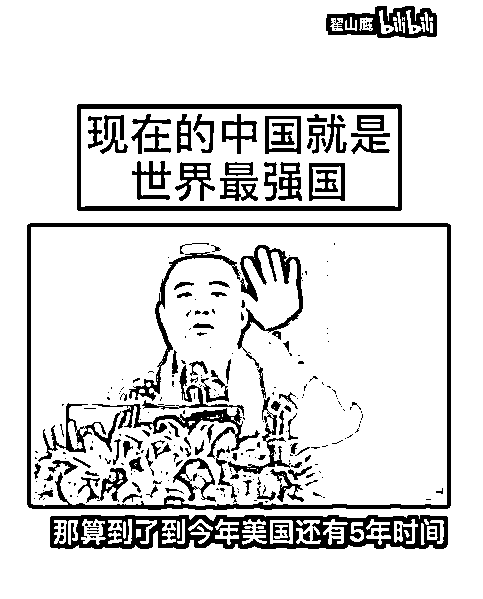
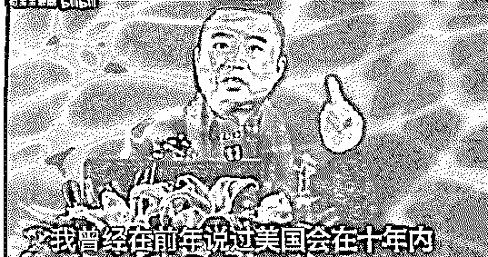
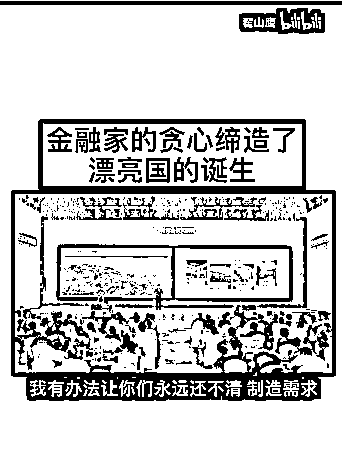

# 翟山鹰的视频把我看乐了

> 原文：[`mp.weixin.qq.com/s?__biz=MzIyMDYwMTk0Mw==&mid=2247543527&idx=1&sn=9450cb8ba3728578278cc8f2ce72f2df&chksm=97cbe1dfa0bc68c90b5be64e2ff4ed14652c9ecb5ac981cccd33b764daad7cac5d95eab7a130&scene=27#wechat_redirect`](http://mp.weixin.qq.com/s?__biz=MzIyMDYwMTk0Mw==&mid=2247543527&idx=1&sn=9450cb8ba3728578278cc8f2ce72f2df&chksm=97cbe1dfa0bc68c90b5be64e2ff4ed14652c9ecb5ac981cccd33b764daad7cac5d95eab7a130&scene=27#wechat_redirect)

前几天在网上冲浪，刷到了这么一则视频：

视频里一位有些发福的中年男子正慷慨激昂地演讲，表示中国是世界最强国，而美国就要崩溃了，同时开始给美国倒计时： 

而中国则是全球唯一希望。

但是不久后他跑到海外了，观点也发生了 180 度的大转弯。

开始说中国要完了，夸赞外国的月亮真圆。

说完了这些，他还承认自身是大骗子，自己用聪明去骗钱天经地义。

**因为被骗的人笨，所以活该被骗****。**

表情是笑嘻嘻的。

这个人“脑子瓦特”了吧，看到这里你可能会这么觉得。

网友们好奇的也就是，究竟是什么原因让一个“爱国者”，摇身一变成为“骂国者”呢？ 

**01.** 

翟山鹰为大众所知时，他身份是一名讲师。

他确实有能说会道的才能。 

从不阴阳怪气，而是直抒胸臆，但凡找到公开场合就说美国迟早崩溃。 

也不喊口号，而是讲逻辑。 

他表示，西方的法律在中国眼里就是个笑话。

说美国的底子里已经烂掉了。

美国害怕中国人的智慧，出于嫉妒，他们选择打压中国。

当然最精彩的莫过于他还给美国崩溃论下了一个期限，那就是 10 年。

翟老师立场坚定，等过了一段时间，他就说在 6 年内美国铁定崩溃；

翟老师记性也好，又过了一年，他扬言美国 5 年内一定会崩溃。

就是上文说过的事。

同时，他觉得外国阴暗面太多。 

比如犹太人势力很强大，他们会出罪恶的手段，打击报复他人。

**说完这一切，他要说的就是：中国最强！**

我们什么都是最好的，

就算是流水线工作，也能成为世界顶级。

不好的方面就是被外国人欺骗的，也终有一天会变好的。

而高潮就在这一个名为“生为中国人，亡为中国魂”的视频里，他说：

[`mp.weixin.qq.com/mp/readtemplate?t=pages/video_player_tmpl&action=mpvideo&auto=0&vid=wxv_2547310580832092160`](https://mp.weixin.qq.com/mp/readtemplate?t=pages/video_player_tmpl&action=mpvideo&auto=0&vid=wxv_2547310580832092160)

配合着慷慨激昂的音乐，如果没读过书，确实会听到心潮澎湃。

其实翟老师的业务范围一直很广，一会儿教授几千年的国学，一会儿推广去中心化的区块链，一会儿讲解全球金融格局……

既然如此，为什么在他事业如日中天时，放下区块链生意不做，而跳转到“爱国反美”生意上。

我们可以看看 B 站上他视频的播放量。

4 月的数据。 

6 月的数据。 

8 月的数据，明显有了“爱国流量”的加持。

可以说“爱国反美”的生意就是好做。

作为忽悠界的翘楚，翟老师自然不会错过这样的风口，他也只需要一天就能把自己正能量的形象突出出来。

从宏观叙事的角度来塑造自己的舆论形象，也能给自己的虚拟货币生意背书。

曾经，在“越是高明的骗局就越充满正能量”的视频里，翟山鹰提醒了很多人，厉害的骗子行骗的第一步是找超级厉害的律师。

没想到一语成谶了。

**02.** 

如果只是说一些让人激动的话，那倒也没啥。他的观点虽然煽动，但却都不是什么新东西，每天你在网上都能刷到类似的，或是更激进的观点。

说到底，这只是一种观点而已，怎么说是自己的自由。

但突然有一天，他就不更新了，然后换了国外的平台开始更新。

新的观点犹如泉涌，而且一反常态，猛烈抨击国内现状。

和之前中国最强，美国要完的观点掉到了过来。

中国也不再是“世界的希望”，转而变成科技命门都在美国手里。

他擅长往里面掺杂各种阴谋论。

潜台词是，自己掌握各种内幕，认识各种大人物，最后把一个谬误说得天花乱坠。

因为他的几分钟视频里，常常有一两个小故事与宏大叙事对应起来，显得接地气。

他突出的演说技巧，让他的视频在 YouTube 上也获得了不小的流量。

和之前唱衰美国、热捧中国的形象截然不同，但翟山鹰又一次信手拈来。 

现在在外网依然热度不减。

**03.**

看到这里你可能想问了，态度反差那么大的翟山鹰，凭什么有勇气能在异国他乡过好生活。

答案是他已经赚到盆满钵们了。

真正让他赚钱的既不是之前在我们社交媒体上的“反美言论”，也不是到了美国开始说的“反华”言论，而是金融以及虚拟货币。

在谈论国际大事以外，翟山鹰以金融专家自居，动不动就让大家不要上当，不要信金融机构，表示金融机构是世界上最邪恶的东西： 

但反手，他就把自己的东西卖给粉丝以及“合伙人”。

比如这个“BSC 云盒”，它在翟山鹰的平台上售价 88000 元。

挖出来的是空气币，随着信的人越来越少，收益也近乎归零。花了大价钱买了云盒的粉丝们很愤怒，去公司问。

为了安抚情绪，翟山鹰在直播中巧舌如簧地描绘未来，说以后万物相连靠的就是 BSC 云盒，等于说自己在造物联网。

又说，我们普华集团要上市，上市后购买积分的人员，可以额外享受上市公司的股权分红权益，等于说再画了一个大饼。

**不断的借口，让投资者不得不继续相信下去，但这些人只会被继续套牢。**

用户想兑换，数量是有限的。想兑换更多的 SEA，就得拉人进群，这个模式不用说就知道像什么了。

即便兑换到了 SEA，也要锁仓 1000 天才能完全释放。想要加速解锁，要么额外消耗 SEA，要么继续拉人进群……

套路一环又一环，通过 BSC 积分兑换 SEA 再套现非常难。

那为什么很多投资者深信不疑呢？

因为翟山鹰总能忽悠：

“一年可获利 10 倍，2 年能获利 100 倍，”

“BSC 项目已经被纳入'一带一路'国家工程” 

“收益倍数创历史新高，颠覆大众对既往财富活动想象”

后续也有各种新型规则出现，依然是让投资者很难挣脱出来。

有人甚至在翟山鹰的事业上投资了上千万，结果当然是血本无归。 

维权也很艰辛。

最后传闻，仅仅是云盒就一下子让他赚到了九位数，还不包括他开公司赚的钱，也不包括他出书讲课赚的钱。

只是当积分和 SEA 币的泡沫被捅破后，价格直线下降，炒作的帘布再也遮掩不住这起闹剧了。 

事后大家发现，SEA 币的发起者是翟老师公司的两位高管；

云盒只不过是会跑分的机顶盒，毫无区块链技术含量，为了显得庄重，特意给它加了铁片。

很多人投进翟山鹰公司的钱后来只兑现了几百块，这点钱，都不够付云盒的电费的。

而翟山鹰只会说一句：**与我无关，公司还倒欠我上亿元。**

也许翟山鹰不过是又一次尽了讲师的职责，因为他讲了道理： 

**金融从业者不能挣超过自己能力以外的钱，而翟山鹰能力超强，可以挣很多钱。**

**04.**

有意思的是，事情败露后，很多人依然把翟山鹰视作英雄。

他们深信翟山鹰的话，觉得他被罪恶势力所威胁。

这些试图把翟老师的诈骗行为圆过来的网友很多。

他的形象没有完全塌房。

甚至闹剧一出，头上的光圈更亮堂了。

比如，很多人把他看做真诚的人，或者说“真小人”。

把他比作当代鲁迅的也有。

可见，到了这一步，网友们对跑路的他的评价也并非 100%的差评。

那么为什么一些人认可这样明显劣迹斑斑的人呢？

因为一些刻意过度散布正能量的网络大 V 实在令人反感了。

天天不看事实看立场，不看事实看 ip，不看行为看屁股，最后比谁极端，比谁更“立场鲜明”。

这样逻辑下，擅长表演正能量的大 V 突出出来了，但他们是不是真的知行合一呢？

要只是他们个人问题倒也还好，可这有可能在虚拟网络上产生影响，并让人越来越不敢说话。

这也违背了互联网社交的初衷，反倒让高效和纯粹的信息交流有一些遥远。

慢慢地，说话要复杂点，好不被人攻击。

**也许我们只能在黑色幽默里寻找真话，只不过这样的交流成本挺大的。**

来源：雷叔说事 作者：仲纬

欢迎关注灰产圈社群服务号

