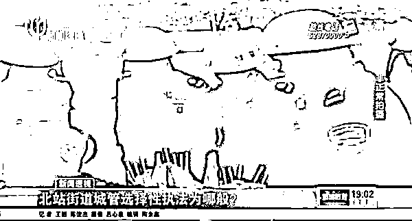

# 核酸采检棒虚标日期，道个歉就完事了？

> 原文：[`mp.weixin.qq.com/s?__biz=MzIyMDYwMTk0Mw==&mid=2247543527&idx=3&sn=30a4a117642e75bbf69009b3617b210a&chksm=97cbe1dfa0bc68c9187c4e65aa71cd52e70acb4ee9a91a922bcd40bf2d5377fbf2e06ff22bb5&scene=27#wechat_redirect`](http://mp.weixin.qq.com/s?__biz=MzIyMDYwMTk0Mw==&mid=2247543527&idx=3&sn=30a4a117642e75bbf69009b3617b210a&chksm=97cbe1dfa0bc68c9187c4e65aa71cd52e70acb4ee9a91a922bcd40bf2d5377fbf2e06ff22bb5&scene=27#wechat_redirect)

**9 月 6 日去做核酸，竟然遇到了生产日期为 9 月 9 日棉签。**

还有网友透露，核酸采样试管里发现了苍蝇。

这是眼下成都这几天发生的事儿。

跨时空的棉签，在网上迅速发酵，对此，生产公司广东固云医疗技术有限公司工作人员回应说：

该批采样棉签实际生产日期为 9 月 1 日，棉签质量没有问题，**是供应商印刷包装时搞错，**目前已经开始召回这一批棉签，将进行更换。

后来，厂家也像模像样地发了个公告。

‍

不过，这一行为丝毫没有影响到网友的群嘲：这极力挽尊的样子真让人恶心！

有成都网友跟帖：

> **“难怪哦，今天去做核酸，都不给我拿棉签了，是怕我看到生产日期啊。”**
> 
> **“整改：不得将采样拭子发放给非采样人员。”**
> 
> **“赚钱赚晕了？？赚到无所谓了？？让普通人陪跑？？说个印错了就算了？”**
> 
> **“真的不能让核酸企业赚钱了，最多只能让他们保本不亏，不然‍疫情会一直没完没了。”**
> 
> **“不用这么认真，大家都是差不多就行了，生意吗？”**
> 
> **“就一个生产日期印刷错误，都道歉了你们还想怎么样？人家一个公司一年多就能发展的那么好，你们是眼红！”**

‍

这个事儿让我很触动，那就是厂商在搞出生产日期的时候，竟然可以把锅甩给供应商的印刷。

这实在是百思不得其解。

厂商说，该批采检棒实际生产日期为「20220901」，失效日期为「20240831」。

然后印刷厂就印错成了「20220909」、失效日期为「20240908」。

我不知道这是怎么印错的，要说是一两个数字输入电脑的时候打错了，还情有可原，但这个数字差的也太明显了吧。

再次，包装厂一般都是不打印生产日期、批号、有效期的，人家只负责对于包装的图案设计和包装的样式。

**批号，日期往往是生产厂在生产完包装后，才用喷码机在上面打印的。**

所以，这里面到底是个什么情况，还真不好说。

无论如何，错了就是错了，尤其是核酸检测这种当下最最重要的事情，错了就应该追责、处罚。

但问题是，这件事除了厂商单方面召回，并道歉后，还没有什么处罚。

这合理吗？

作为比较，无相君找了一个公开案例作比较。

2020 年 1 月 24 日，漯河市郾城区的市民发现，自己在某大药房购买的一次性使用口罩，标注日期竟然为 2020 年 2 月 6 日。

于是一个电话就打到了当地的市场监督局。

经过调查发现，这家药店的口罩，就是从非法供应商那里低价购入的，后来药店就以每包 15 元的价格将口罩销售，总货值 22500 元。

当地监督部门认定，该店销售虚假标注生产日期的医疗器械，违反了《医疗器械监督管理条例》，并参照《河南省食品药品监督管理行政处罚裁量标准》，拟对该店作出改正违法行为：

**予以警告，并没收违法所得 22500 元，罚款 337500 元！**

也就是说，监管部门对其罚款了**15 倍**的销售额！

而且这不是乱罚，是有法可依的。

一般而言，如果消费者发现产品虚标日期，可以要求经营者赔偿货值金额 10-20 倍的赔偿。

销售货值金额一万元以上的，可以处以货值金额十倍以上二十倍以下罚款；情节严重的，甚至要吊销经营许可证。

核酸用的棉签和口罩一样，都属于医疗器械产品，不仅生产要进行备案，而且有严格的生产环境要求和质量监管标准。

**那么，对于这批虚标日期的采样棒，监管部门应该立即出手，依法处罚，岂能让相关涉事企业自罚三杯，一笑了之？**

世上的事，不患寡，就患不均。

这些日子，我们看到了小商贩卖 5 斤芹菜就被罚了 6.6 万元。

看到了上海某个面包店，在静态管理期间，因为没能在有资质的制造间生产面包，且平价出售了 5.8 万元的面包，就被罚了 58 万元。

看来，这里的执法是严的。

但是，怎么到了和生命安全、经济活动密切相关的核酸检测棒里，就松懈了呢？

**这说明，有时候我们的执法是存在弹性的。**

****

比如，一个小贩在没有资质的情况下在街头卖萝卜，这时候，工作人员可以有三个选择。

1.好心劝说，让其收拾摊子回家。

2.训斥一顿，逼其走人。

3.没收所有萝卜，带回局里，依法做出罚款。

这三个选项，工作人员是可以任意选择的，法律表现出了像橡皮筋一般的特性。

橡皮筋现象短时间内是无法根除的。

但法令如山，法贵公平。

**那些通过疫情发国难财的企业，就不应该查一查吗？**

但我希望我们的监管能做到综合考量，哪些企业应该重罚，哪些企业应该从轻？

很多事，老百姓都看在眼里。

有时候，往往一个小小的判决，就能收获人心，反之，也会寒了人心。

作者：无相君 来源：无相财经

欢迎关注灰产圈社群服务号

