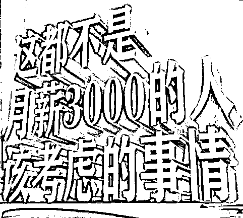

# 槽多无口！女子称自己车祸身亡后「得道成仙」，网恋 5 年骗男网友 486 万

> 原文：[`mp.weixin.qq.com/s?__biz=MzIyMDYwMTk0Mw==&mid=2247543527&idx=4&sn=011ac182416456a5907375a56f5e5259&chksm=97cbe1dfa0bc68c905fedf44768fa82e3be897ecea25ba21aa0880a04b1d52076f8feb2484bf&scene=27#wechat_redirect`](http://mp.weixin.qq.com/s?__biz=MzIyMDYwMTk0Mw==&mid=2247543527&idx=4&sn=011ac182416456a5907375a56f5e5259&chksm=97cbe1dfa0bc68c905fedf44768fa82e3be897ecea25ba21aa0880a04b1d52076f8feb2484bf&scene=27#wechat_redirect)

这又是一个人傻钱多的故事

而且是那种

如果拍成电影，编剧就会被骂死的剧情

这故事发生在广州

还得从 2017 年年底说起

那个时候

**王某与女网友叶某**确定恋爱关系

两个人从未在线下见过面

但王某大概是对这个叶某一往情深

因为王某对叶某

**是信任得不得了！**

在两个人确认关系之后不久

王某就收到叶某的消息说：

**我是叶某的家属，**

**叶某意外去世了！**

（其实是叶某本人假冒家属在骗王某）

**此处，王某信了**

再之后，叶某继续以自己家属的身份

告诉王某说：自己偶遇了

**一位和叶某长相名字都相同的女士**

并给了王某“这位新叶某”的联系方式

（其实是叶某本人 Again）

**此处，王某又信了**

之后

王某和新叶某就联系上了

王某还把对旧叶某的感情和思念

都寄托到了新叶某身上

而这个新叶某依旧是讲话不过脑

和王某说：**自己确实是“死过了”**

**但已经****“复活”并****“得道成仙”**

**此处，王某又信了！****且深信不疑！**

在王某信任的加持下

新叶某的网恋修行

是真的属于“修成正果”了哈哈哈哈哈救命

王某的深信不疑，是真的深信不疑

因为在 2018 年到 2022 年

这四年左右的时间里

总计向叶某转账**486 万**

**486 万！！！**

**是真的酸了！！！**

能相信没见过面的网恋网友

能相信长相和姓名都相同的人存在

能相信一个人可以“去世再复活”

能相信“得道成仙”的说法

能被网恋对象骗走 486 万

**这样的一个人**

**为什么能有这小五百万！！！**

或许叶某打一开始就告诉王某说

自己是秦始皇

也可能骗到钱的 

这 486 万的故事从 2017 年开始

直到 2022 年 4 月新叶某骗到手 486 万后

就把王某拉黑掉了

到这里，王某还没有意识到哪里不对

等到又过了 3 个月，到 2022 年 7 月

王某才意识到哪里有点不对，才报警

经审讯，

叶某对诈骗王某钱财的事实供认不讳。

目前，嫌疑人叶某已被刑拘，

案件在进一步侦办中。

有没有一种可能

叶某在骗了王某四年左右的时间之后

都已经骗腻了、骗够了

懒得再编胡话骗他的钱了

才拉黑掉了王某 

作为一个可能一辈子都挣不到 486 万的人

其实很想问问叶某

像王某这样的人傻钱多的大冤种目标客户

到底是从哪里找到的？

来源：脊梁 in 上海 SH，西部决策

欢迎关注灰产圈社群服务号

