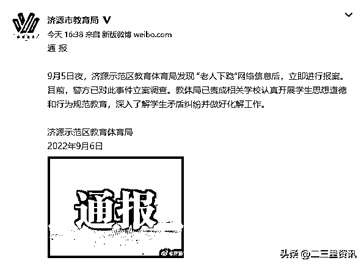
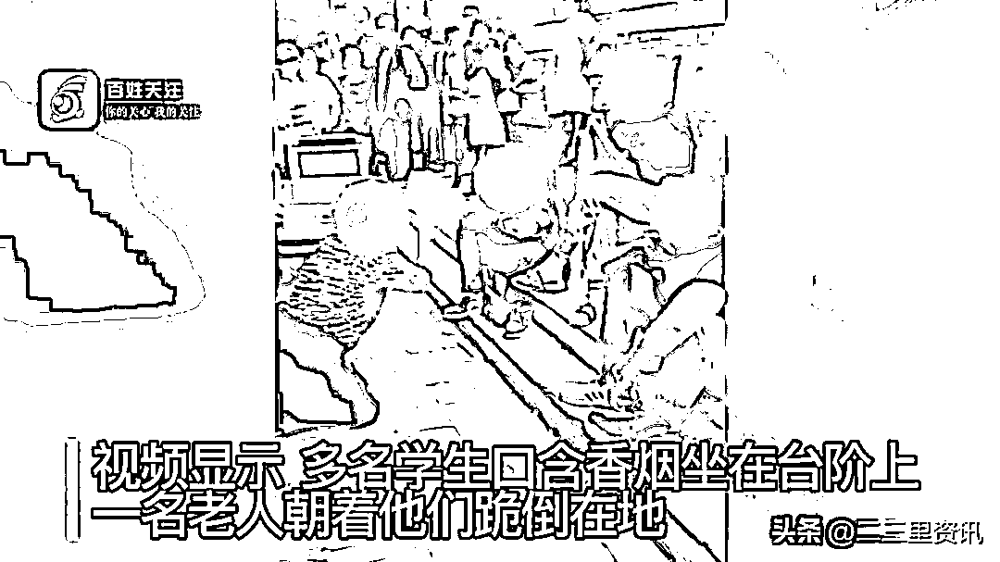
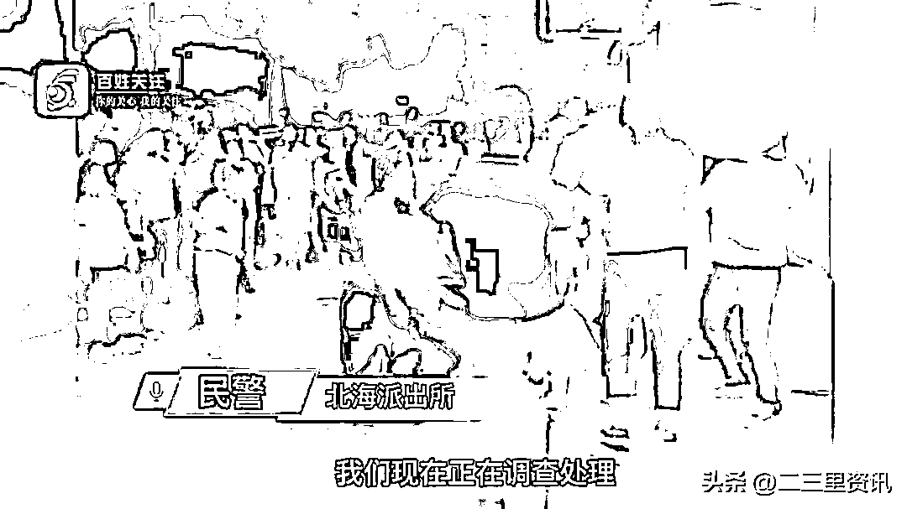
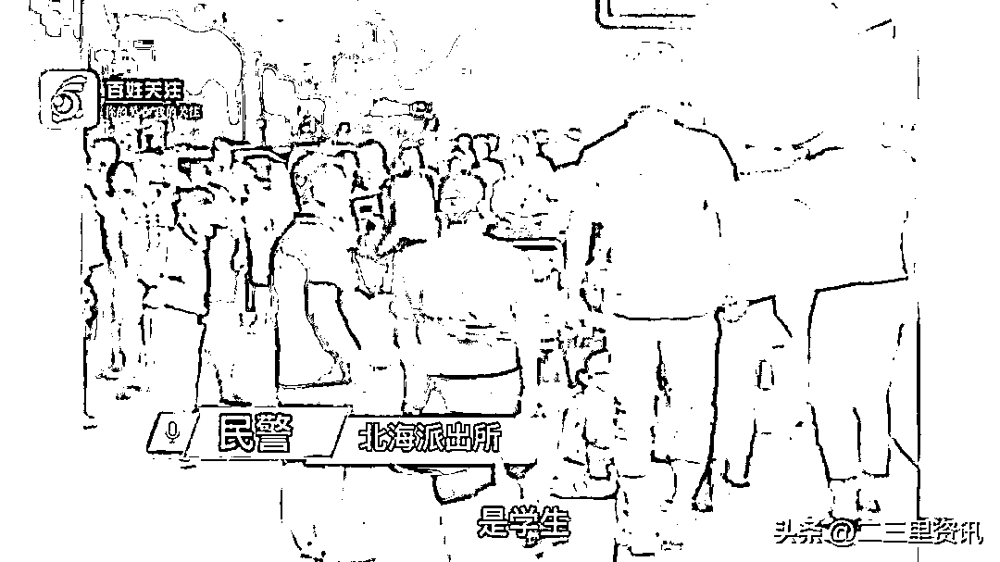

# 老人给多名学生下跪，替被霸凌的孙子求情

> 原文：[`mp.weixin.qq.com/s?__biz=MzIyMDYwMTk0Mw==&mid=2247543527&idx=5&sn=a132d87ab39e51d949861181fb3f0305&chksm=97cbe1dfa0bc68c97a0e9952ca77554b01bc07289caba21b02aeb701ea2f2a20fb0b67e601f2&scene=27#wechat_redirect`](http://mp.weixin.qq.com/s?__biz=MzIyMDYwMTk0Mw==&mid=2247543527&idx=5&sn=a132d87ab39e51d949861181fb3f0305&chksm=97cbe1dfa0bc68c97a0e9952ca77554b01bc07289caba21b02aeb701ea2f2a20fb0b67e601f2&scene=27#wechat_redirect)

9 月 6 日，河南济源示范区教育体育局通报，9 月 5 日夜，济源示范区教育体育局发现 “老人下跪”网络信息后，立即进行报案。

目前，警方已对此事件立案调查。教体局已责成相关学校认真开展学生思想道德和行为规范教育，深入了解学生矛盾纠纷并做好化解工作。

9 月 5 日，河南济源市北海中学附近，一老人向多名学生下跪引发关注。视频显示多名学生含着香烟坐在台阶上，老人跪在地上。期间，围观者指责其中一名学生并与其发生口角。目击者称老人的孙子被高年级的学生打了，不敢去上学，老人跪在地上替孙子向他们求情。6 日，北海中学回应称涉事学生非该校学生。济源市教育体育局回应称未接到相关投诉。北海派出所回应称他们接到报警，正在调查涉事学生。

韬哥短评：看下边的图吧，说明所有问题。 

来源：济源市教育局、百姓关注、侠客栈

欢迎关注灰产圈社群服务号

