# 实名举报遭辟谣，浅谈“190 万诈骗不予立案”里的孰是孰非

> 原文：[`mp.weixin.qq.com/s?__biz=MzIyMDYwMTk0Mw==&mid=2247543527&idx=6&sn=57865f2ca488c9d609c8ce94955938c8&chksm=97cbe1dfa0bc68c9050050138be7503877018ad665fc536c5b9d47e4e4ccab530204126ef29e&scene=27#wechat_redirect`](http://mp.weixin.qq.com/s?__biz=MzIyMDYwMTk0Mw==&mid=2247543527&idx=6&sn=57865f2ca488c9d609c8ce94955938c8&chksm=97cbe1dfa0bc68c9050050138be7503877018ad665fc536c5b9d47e4e4ccab530204126ef29e&scene=27#wechat_redirect)

“坐标南京，实名举报 190 万诈骗不予立案！”

这句话一出马上吸引了众多网友的“摇旗呐喊”，没过多久警方回应“辟谣”。

这件事到底是警方不作为还是舆论倒逼？

今天小呸和大伙唠唠这里面的孰是孰非。

***01***

***举报：190 万诈骗却不予立案？***

微博网友吕先生，是一位手办模型店店主，但在生意往来之间出现了些问题。

**对方收了货款不发货，交易数额高达 190 万之多，报警了以后警方还不立案。**

这样不作为的举动伤透了吕先生的心，于是就有了网络实名举报的视频，并且艾特了一堆警方官方号，要求给一个说法。

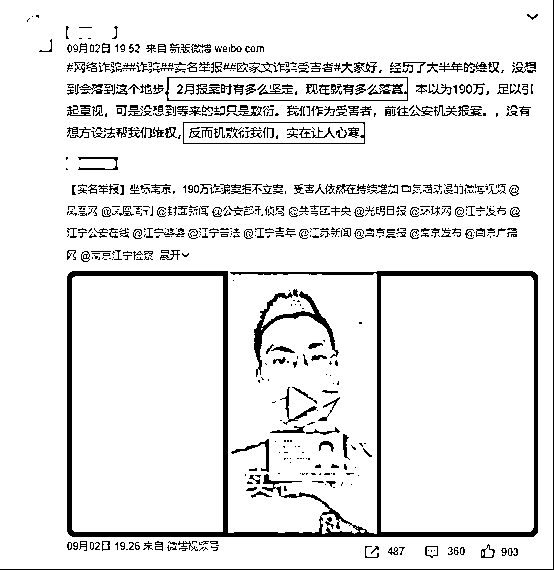

在一众热心网友的助力之下，这件事登上了热搜。

南京警方也很快回应了，“辟谣”二字将这事缓缓说来。

通报的内容十分长，小呸就简短地介绍一下来龙去脉，如果有兴趣可以去看看原博。

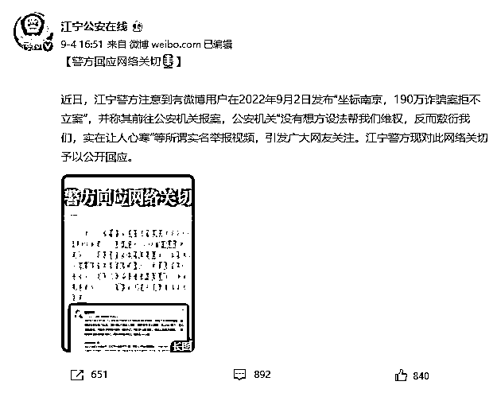

内容其一是**吕先生购买的货源低于市场价**，自称累计损失人民币 1906241 元，实际金额累计人民币 3922708 元。

其二是**吕先生之前已经在上海、成都两地向当地警方报警**。并且经上海警方调解，双方签订了退款赔偿协议。

协议显示，卖家欧某向吕先生退付订货款 3275800 元，赔偿违约金及预期收益 2155975 元，合计 5431775 元。

2021 年 11 月，欧某某先后多次共向吕某某退款 1369559.26 元。

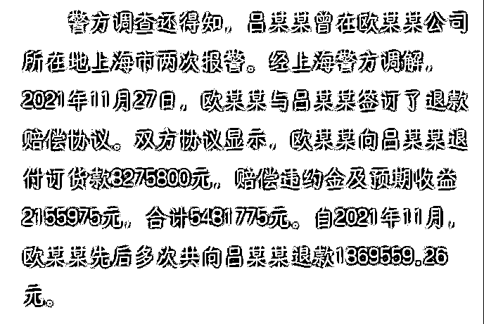

其三是**今年五月南京市江宁区人民法院已经对吕先生和欧某的买卖合同纠结立案**，不过因为吕先生没有按时交纳案件受理费而撤诉。

撤诉后吕先生要求江宁警方对其 2022 年 2 月 28 日的报案继续处理，今年 8 月 29 日吕先生告知警方“六月撤案了，可以处理了吧”，但实际上 8 月 27 日开始，吕先生就在网上发帖称“警察不立案，以后每天发视频怼公安”。

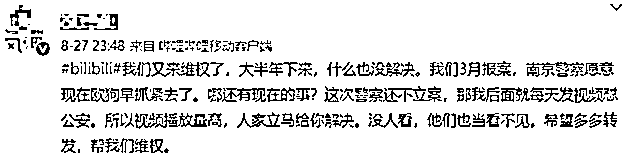

通报出来后大伙都懵了：这是经济纠纷没结果，让公安去当打手要债？

“又是一个瞎写小作文的利己主义者，真的会得小作文 ptsd！”

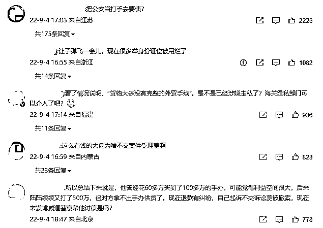

官方辟谣后，吕先生也立马接应：他仍旧对警方的声明不满意，认为自己并没有恶意抹黑警方，只因私人力量浅薄，激不起浪花，所以才求助网络。

***02***

***孰是孰非，谁看清了？***

吕先生在后续发文中，对自己的生意遭遇、报警后的方方面面经历都有了更详细的说明。

有人认为是吕先生**贪图“低于市场价”的便宜让自己栽了跟头不肯认，自己活该；**

也有人认为吕先生**确实遭遇了诈骗，骗子钻了漏洞被袒护了**，希望吕先生能带个好头一举将他拿下！

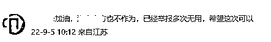

咋说捏，店主遭受经济损失，有压力的急切心情可以理解，**但就此事而言，这个案子警方处置其实没有什么的问题。**

首先，对比微博上双方发表的说法，吕先生称警方认为只是自己收不到货“怀疑”被诈骗，但他认为卖货方的欧某是实施了高买低卖的“庞氏诈骗”。

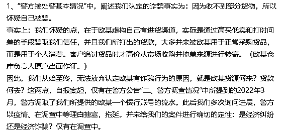

以吕先生这个案子为例，卖方欧某手办 1 万块进货，但以 5000 的金额卖给吕先生。

然后吕先生被吸引，继续在他这里进货，以此骗取更多的定金，用这些定金再去进货补空缺再骗定金，以此循环。

听起来**似乎是有诈骗的嫌疑，问题在于证据。**

这里必须要解释一下，区分诈骗和普通合同纠纷的一个重点就在于**人的主观状态**。

我们如何得知卖主是一开始就知道自己明明没有供货能力，仍旧以非法占有为目的去骗取“定金”，还是说是因为经营不善或是其他原因导致无法履行合同？

如果吕先生要论证对方是诈骗而不是一般的经济纠纷，就得论证这位“欧某”的主观状态。

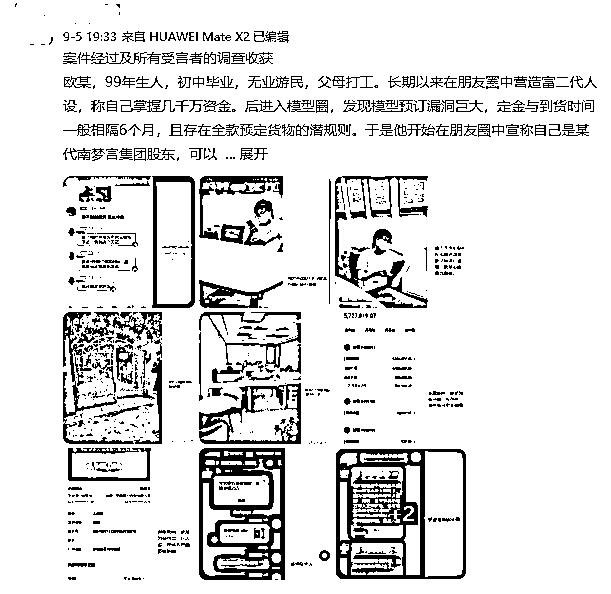

（吕先生后续的调查收获）

很多报案人的理由都是“我怀疑”、“我推断”，可“我怀疑”并不能成为实质证据。

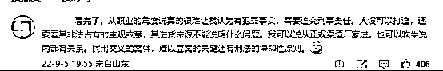

其次，关于立案的问题也颇有意思。

警方的通报中写道，**吕先生向南京警方报警之前，就已经提起了民事诉讼。**

按照吕先生的说法，自己一直在寻求公安帮助，首先找的是上海警方和成都警方，主要是因为**想要先保全资产为目的进行了民事诉讼**，并与欧某签订了协议。

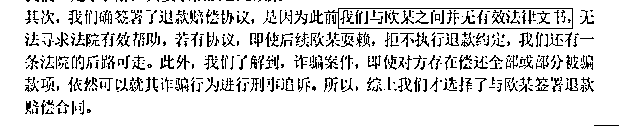

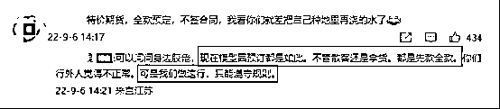

吕先生的想法很明了，想先稳住一波，再报诈骗案，理解理解。

事情进展到这里其实都没什么问题，但后续吕先生再度向南京警方报案时，却出现了一些，emmm，我称之为误解？

吕先生认为 24 小时南京警方应当告知他是否立案，但其实行政案件立案 24 小时，而刑事案件一般是 3-7 天，重大疑难案件则可以延长到 30 天。

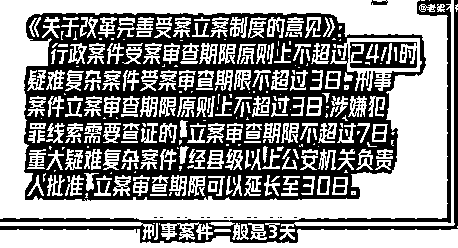

（@微博用户老梁不郁闷，下同）

所以其实吕先生其实有些着急了……

另外根据两高一部发布的《公安机关办理经济犯罪案件的若干规定》，南京警方当时没有办法立案。

**涉嫌经济犯罪的案件与人民法院正在审理或者作出生效裁判文书的民事案件，属于统一法律事实或者有牵连关系，只有三种情况可以立案，而吕先生的案件不在此列。**

并且其中明确规定了在侦察过程中，不得妨碍人民法院民事诉讼活动的正常进行。

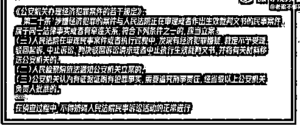

也就是说，法院那边不中止审理（或驳回），民警也没啥办法。

另外，这里面还有一条比较重要的信息。

吕先生在调查过程中想要**补充欧某仓库负责人程某的证词**（这位证人作证欧证涉嫌诈骗），**警方告知了**吕先生可以将新的材料一起交给法院，如果法院认为有犯罪的可能，会移交警方调查。

但是……如今这个后续，大伙应该明白了。

最后，当初吕先生最开始选择的是沐阳法院诉讼，当对方以“管辖异议”为由拖拉时间，疫情当下，大伙也都明白这环境，警方移交肯定受到了一定的影响，要以此说警方没有作为个人是不认同的。

所以江宁公安的辟谣没有问题。

如今这个局面，只能说，一方面是警方按照司法程序办事，一方面是吕先生焦急心切。

不过吕先生的事情还在调查拉扯，也有其他网友爆料“欧某”确实存在诈骗。

**如果想要切实有效地去解决这个事情，双方直接了当沟通可能会比发微博更有效。**

PS：其他“代购”类的受骗者也尽早报警啊喂！

***03***

***诈骗报警不立案怎么办？***

在往期的文中我们多次提及，一旦受骗，立即报警。

回复的留言有支持，也有很多消极的朋友。

他们既无奈又愤懑，确实“报警没有用”！他们不肯立案！没有回信！

哪怕吕先生的实名举报已经被辟谣，也有网友认为“他们平时一定也是互相推诿”。

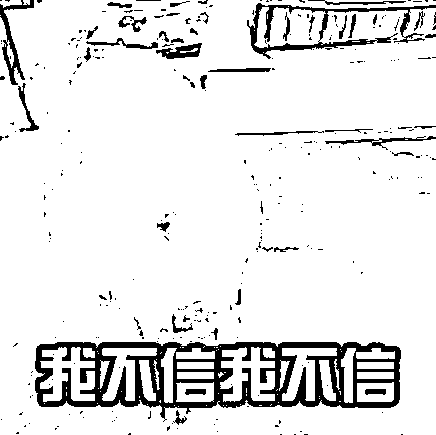

哎，谁也不敢打包票说全天下的警察真的都是好警察，绝对尽心尽力的那种！

这话太天真了，而且有种站着说话不腰疼的感觉。

那么，如果您**确实遭遇诈骗，警方也真的消极怠工不予回复，受害人有报案不成法律救济渠道**。

当刑事报案之后，公安机关会做一个报案笔录，请受害人一定要仔细阅读是否与自己所说的一致再签字摁手印，然后记得**向公安机关索要《受案回执单》**，通过《受案回执单》上的信息可以在公安局立案公开查询系统进行案件进展查询。

许多受害人没有拿到《受案回执单》就匆匆离去，最后导致后期维权困难。

拿到《受案回执单》后，不管公安机关立案还是不立案，均会给受害人通知，立案的给《立案告知书》，不立案的给《不予立案告知书》，并告知不立案的理由，此时受害人可以针对其理由，证据不足的补充证据，罪名不对的变更罪名。

实在不行还可以申请复议，督促公安机关立案侦查。

当然了，还是希望大家都用不上这个提示，不上当受骗，也不必焦急四处奔波。

来源：黑白呸

欢迎关注灰产圈社群服务号

