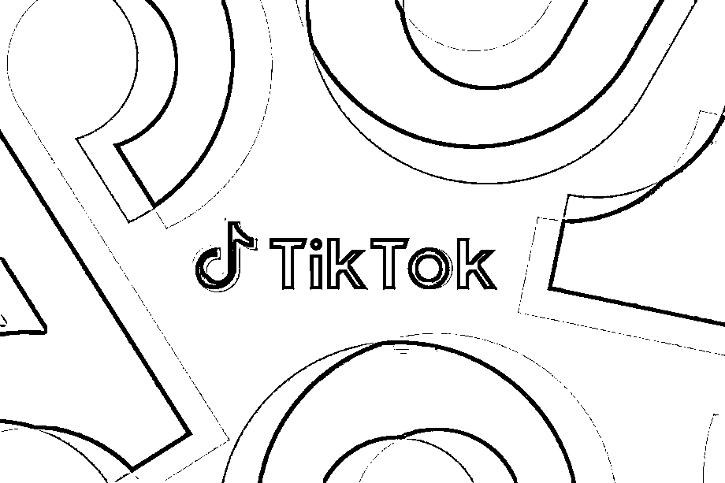
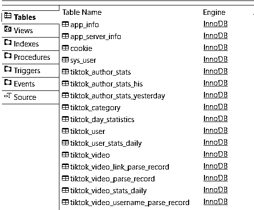
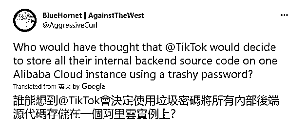
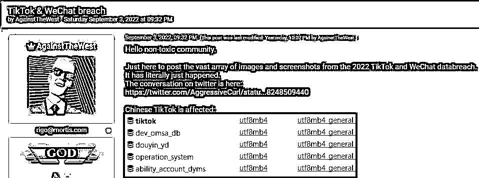
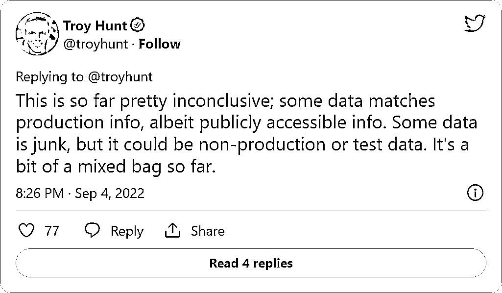
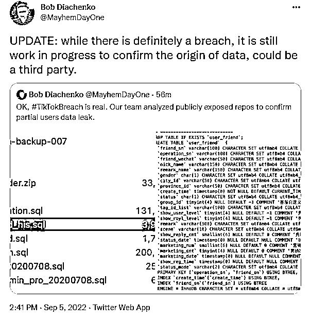

# 20.5 亿条数据泄露？TikTok 否认遭黑客攻击

> 原文：[`mp.weixin.qq.com/s?__biz=MzIyMDYwMTk0Mw==&mid=2247543527&idx=7&sn=650327707b4f06a79b1a390a46ac6923&chksm=97cbe1dfa0bc68c959e79b35991b66e38e99c1a9d2592ccdae7c9cefc31337d91d4622dc395a&scene=27#wechat_redirect`](http://mp.weixin.qq.com/s?__biz=MzIyMDYwMTk0Mw==&mid=2247543527&idx=7&sn=650327707b4f06a79b1a390a46ac6923&chksm=97cbe1dfa0bc68c959e79b35991b66e38e99c1a9d2592ccdae7c9cefc31337d91d4622dc395a&scene=27#wechat_redirect)

根据外网消息，某平台泄露了大量用户数据。 

**据 BleepingComputer 报道，TikTok 近日否认遭黑客入侵及源代码和用户数据被盗，黑客论坛泄露的 20.5 亿条数据与该公司“完全无关”。** 

上周五，一个名为“AgainstTheWest”的黑客组织在一个黑客论坛发帖声称已经入侵了 TikTok 和微信，并公布了一个 Tiktok 和微信的数据库屏幕截图，声称该数据库是在一个包含 TikTok 和微信用户数据的阿里云实例上访问的。

该黑客组织表示，该服务器在一个 790GB 的庞大数据库中保存了 20.5 亿条记录，其中包含用户数据、平台统计信息、软件代码、cookie、身份验证令牌、服务器信息等。

虽然该黑客组织的名字是“AgainstTheWest”（以下简称 ATW），但该组织声称只针对敌视西方利益的国家和公司。

网络安全研究员 CyberKnow 解释说：“不要让这个名字让你感到困惑，ATW 的目标是他们认为对西方社会构成威胁的国家，目前他们的目标是中国和俄罗斯，并计划在未来瞄准朝鲜、白俄罗斯和伊朗。”

**TikTok 否认被黑客入侵**

TikTok 告诉 BleepingComputer，该公司被黑客入侵的说法是错误的。此外，该公司表示，在黑客论坛上共享的源代码不是其平台的一部分。

“这是一个错误的说法——我们的安全团队调查了这一声明，并确定有问题的代码与 TikTok 的后端源代码完全无关，后者从未与微信数据合并。”-TikTok。

TikTok 还指出，泄露的用户数据不可能是直接抓取其平台造成的，因为它们有足够的安全保护措施来防止自动脚本收集用户信息。

BleepingComputer 也已联系微信，但截止发稿尚未收到回复。

虽然微信和 TikTok 都是中国公司，但它们并不属于同一家母公司，前者属于腾讯，后者属于字节跳动。因此，在单个数据库中同时看到两家企业的数据表明该数据库不属于其中任何一家公司。

最有可能的情况是，该未受保护的数据库是由第三方数据抓取工具或代理人创建的，从两种服务中抓取公共数据并将其保存到单个数据库中。但是考虑到严格的隐私保护法规，如此大规模的隐私数据云端暴露真实性存疑。

HaveIBeenPwned 创始人 Troy Hunt 发推文（下图）确认了某些数据（源代码）是有效的。但是 Hunt 表示已泄露的都是公开可访问代码，很可能是非生产环境或测试代码，目前没有任何证据表明 TikTok 存在内部系统漏洞。

此外，“数据库猎手”Bob Diachenko 发推文称已经验证了泄露的用户数据是真实的，但无法提供有关数据来源的任何具体结论：

参考原文链接：

*https://www.bleepingcomputer.com/news/security/tiktok-denies-security-breach-after-hackers-leak-user-data-source-code/*

来源：安联智库，大 R 说安全

欢迎关注灰产圈社群服务号

