# 贵阳静默，买不到菜，有人饿了 3 天！网友：上海的故事总归会轮一遍的

> 原文：[`mp.weixin.qq.com/s?__biz=MzIyMDYwMTk0Mw==&mid=2247543582&idx=1&sn=b472341f8a3a979aa9bce820c9ec9038&chksm=97cbe026a0bc6930fbcbb3c42ad55e7edaf54d12bb80d296de1a0fe3cf3c572afc7d63e8ef0a&scene=27#wechat_redirect`](http://mp.weixin.qq.com/s?__biz=MzIyMDYwMTk0Mw==&mid=2247543582&idx=1&sn=b472341f8a3a979aa9bce820c9ec9038&chksm=97cbe026a0bc6930fbcbb3c42ad55e7edaf54d12bb80d296de1a0fe3cf3c572afc7d63e8ef0a&scene=27#wechat_redirect)

最近，各地都发生了疫情，由于病毒变异传播更快，很多地方都采取了“封控”措施，有些地方做到防疫和民生的平衡。

但是，在贵阳，疫情发生后开启静默，首先就是野生动物园扛不住了。此事还上了热搜榜。

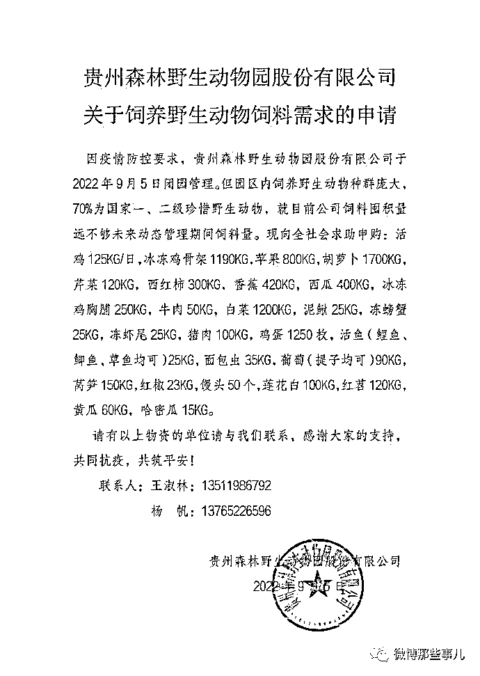

但是紧接着，就有很多人在微博发声，现在连吃饱都成了问题，引发大家关注。

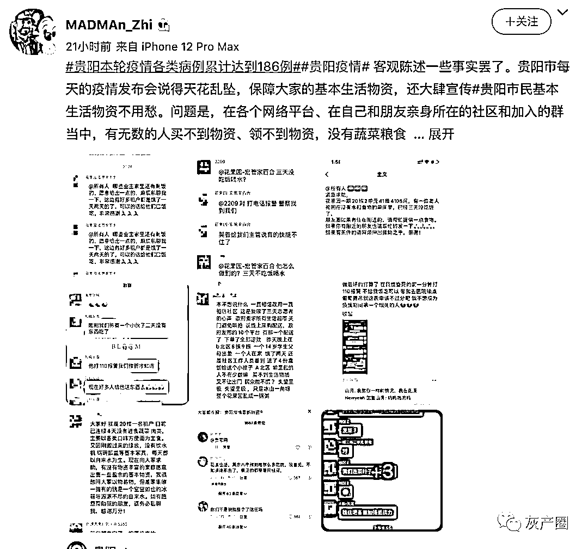

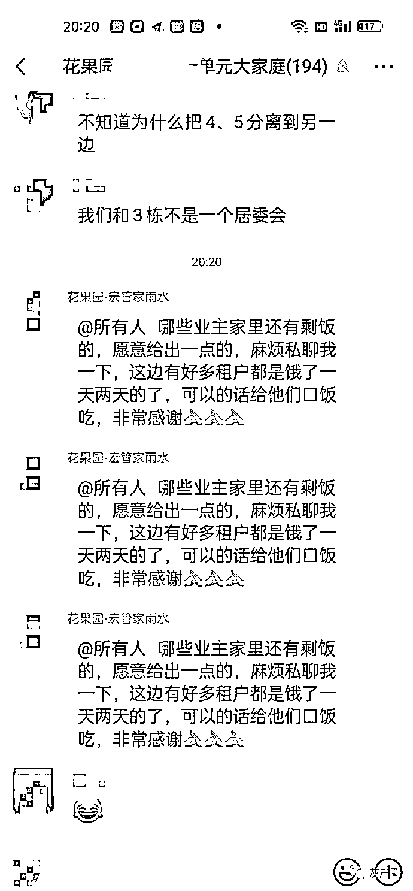

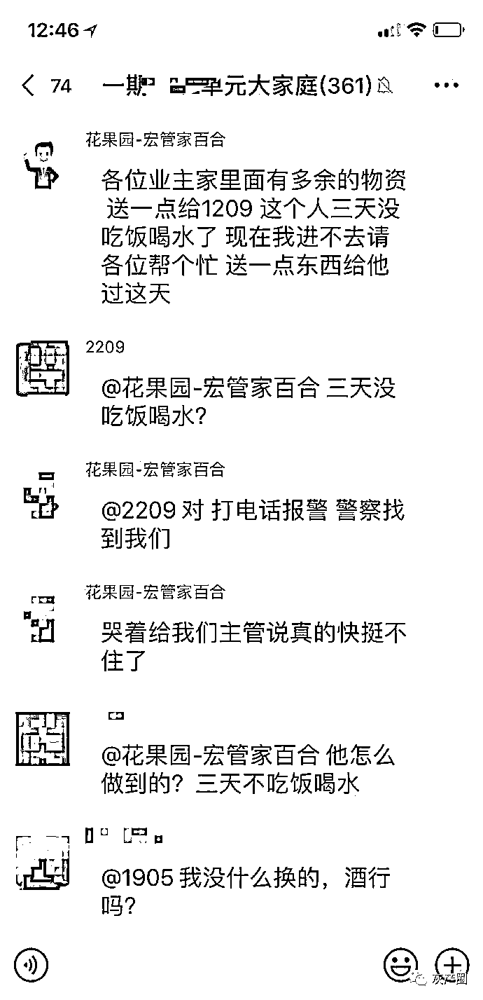

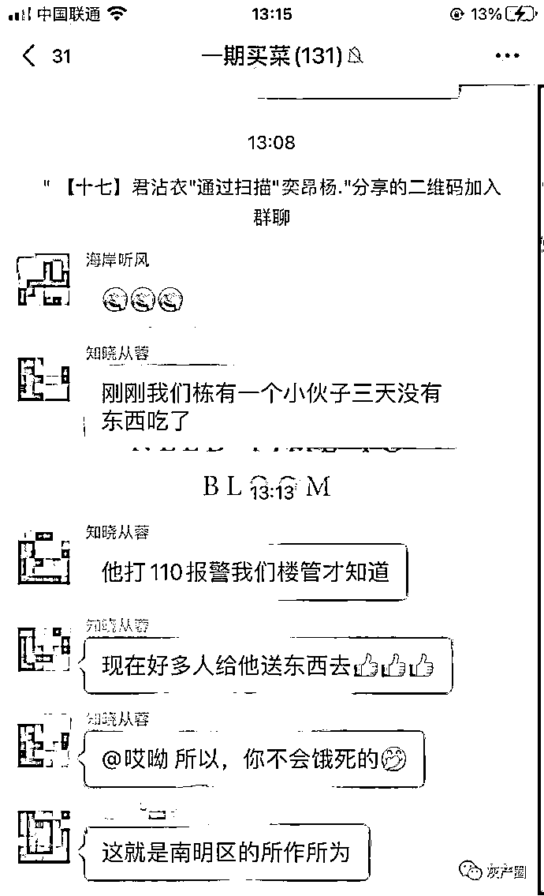

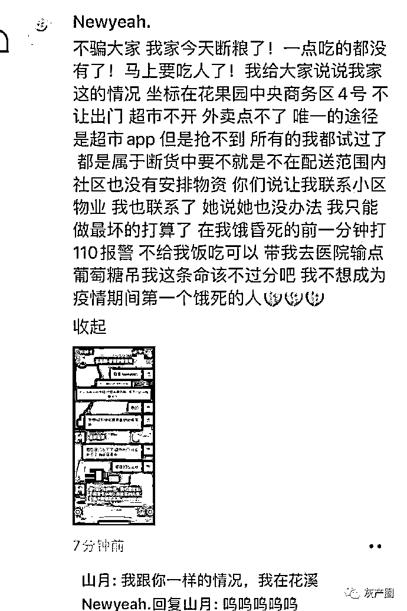

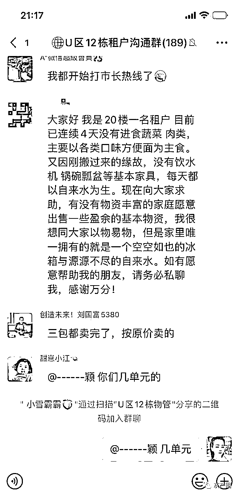

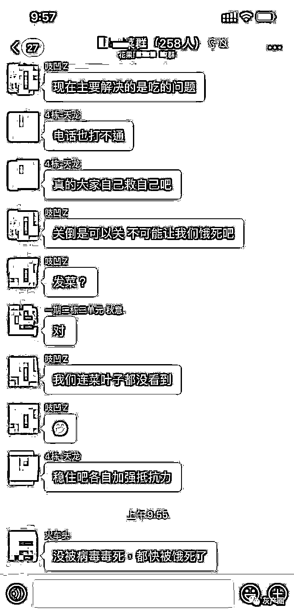

评论区当地网友都现身说法

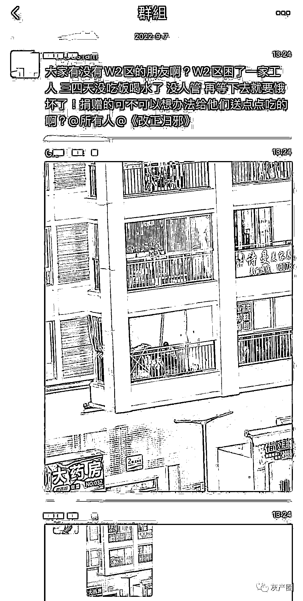

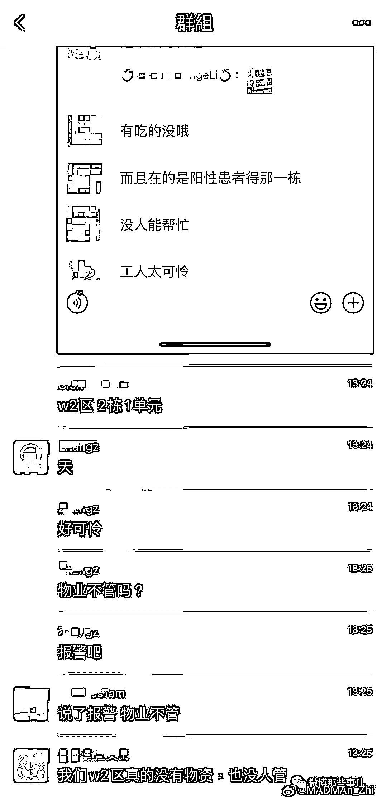

这个时候还要发扬国际精神？

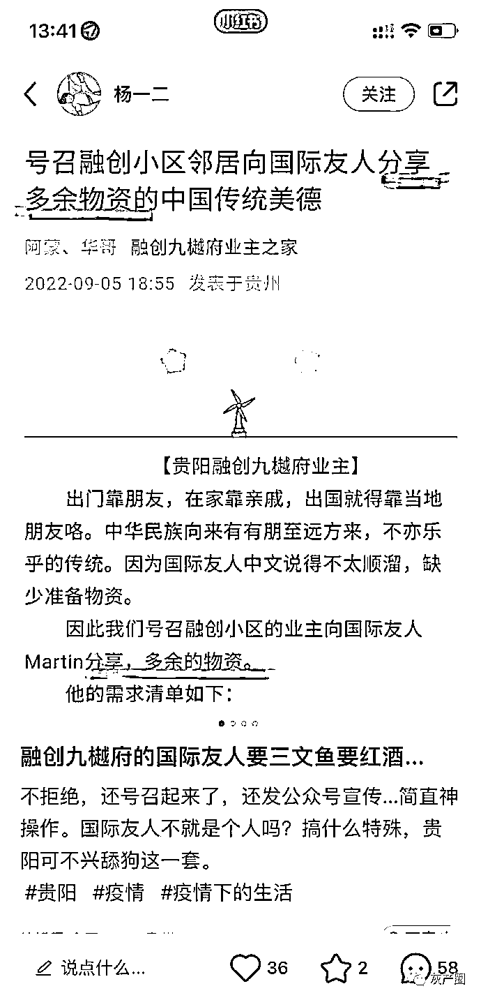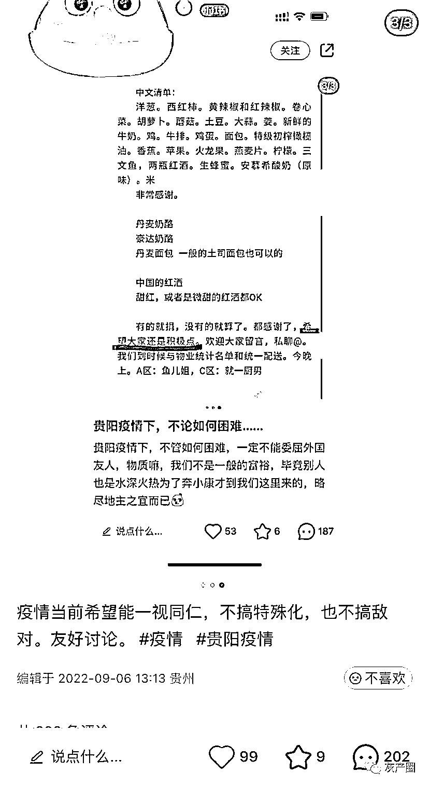

官方：贵阳将从 7 方面完善物资配送

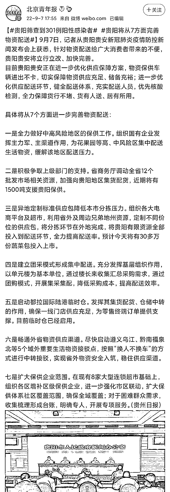

花果园还发了一封信致南明区花果园区域居民朋友的一封信，承认了存在的问题。

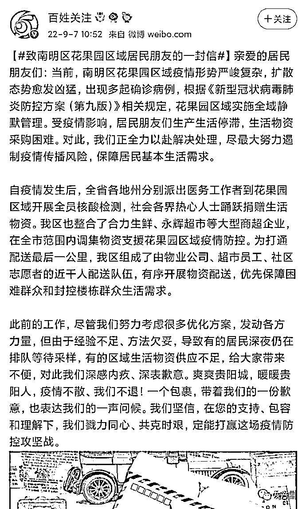

微博上确实有网友表示半夜收到了送的物资 

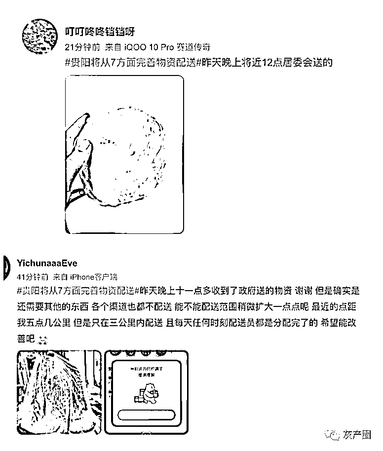

* * *

Junkrattt123:上海的故事总归会轮一遍的

玛莉蓓尔-花房:咱就是说，新冠都三年了，为啥还有人觉得不囤东西可以应对封城的

开水族馆的生物男: 贵阳只有一个物流园...然后疫情开始就发现园区工作人员🐏了...结果就瘫了...

来源：微博那些事儿

欢迎关注灰产圈社群服务号

