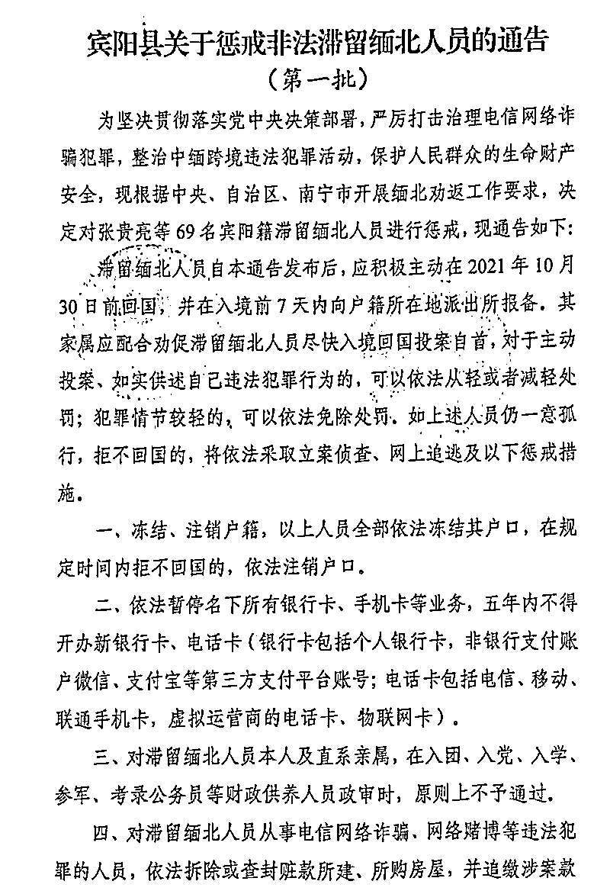

# 亲历者讲述：“我如何被骗到印度差点陷入电信诈骗团伙”

> 原文：[`mp.weixin.qq.com/s?__biz=MzIyMDYwMTk0Mw==&mid=2247543582&idx=6&sn=0bb252dfa8aa07b73d0c17e4d9cd7b15&chksm=97cbe026a0bc69309605e9eb5fb5ba1a4b38986ff81000839c59067c36d5a1c0fd295ecc4715&scene=27#wechat_redirect`](http://mp.weixin.qq.com/s?__biz=MzIyMDYwMTk0Mw==&mid=2247543582&idx=6&sn=0bb252dfa8aa07b73d0c17e4d9cd7b15&chksm=97cbe026a0bc69309605e9eb5fb5ba1a4b38986ff81000839c59067c36d5a1c0fd295ecc4715&scene=27#wechat_redirect)

多年之后，当王健（化名）在网络上看到被诱骗到缅北从事电信诈骗的人被殴打、拘禁，回不了国，真实感受到自己的幸运。

这段愚蠢、荒诞、窘迫又走运的经历发生在 2016 年。但故事的余波一直持续到新冠疫情之后。2021 年 10 月 18 日，广西壮族自治区宾阳县打击整治网络违法犯罪工作联席办公室发布了一份通告，决定对 69 名宾阳籍滞留缅北人员进行惩戒。惩戒的措施有数条，其中一条是冻结户口，若在规定时间内拒不回国，将注销户口。

这 69 名宾阳籍滞留缅北人员中，有一名男子叫韦世均。当地政府公示了其户籍地址在广西宾阳县思陇镇六高村委会谭罗村。

韦世均在 7 年前把自己的广西同乡王健骗到了印度，让其加入当地的电信诈骗团伙。南都记者采访了王健，他讲述了这段终生难忘的经历。

2021 年 10 月 18 日，宾阳县发布的一份通告。

宾阳籍非法滞留缅北人员韦世均。

**飞往孟买的机票**

2016 年 4 月 26 日，印度的时间早上 7 点，手机没电后与外界彻底隔绝的广西籍 30 岁青年王健拖着开裂的行李箱，站在眼前的这个居民区三层小楼前。

他和同行另 5 人于 25 日上午 9:55 从广州起飞，经香港转机，在印度时间深夜 12 点抵达孟买机场后，又连夜坐了将近 6 小时车，来到这个不知名的地方。

王健不知道自己是否还在孟买，还是在其他城市。

出发前两天，4 月 23 日，他才第一次知道自己要去的国家是印度，他一直以为自己要去新加坡。这是他第一次出国。

他不久前申领的崭新护照上第一次被贴上了签证页，来自印度，有效期半年，可多次入境，每次停留最多 90 天，禁止在印度境内受雇或工作。

王健注意到，和其他民居楼不一样，三层小楼的门外装着摄像头。走进小楼，看到客厅里拥挤地摆放着七八张可以折叠的四方桌，每台桌子上放着一台固定电话，其中一部分桌子上还搁着一台计算器。

目睹此景，王健终于认输一般告诉自己——真的上当受骗了。

**海外“招”工**

“搞的一团乱”，王健这样形容自己这大半年的生活状态。也许是感觉到生活的困窘，想要找到一条摆脱困苦的捷径，但却屡屡被“捷径”上的陷阱困得更深。

2014 年 7 月，他一次性在网络黑彩票平台就被骗了近一万元，被骗光了自己所有积蓄。其中，有几千元还是他从金融服务平台上贷的款。之后，催债电话隔三岔五打来，让他心烦意乱，两手空空，一时还没找到稳定工作，想还也还不上。反倒是自己温饱无着，还要四处借钱，各种碰壁。

王健萌生了去海外打工的想法，一来听说海外给的工资高，二来这样也可以“暂时避避风头”，他计划在海外把钱攒齐了一下子还清外债。

生于广西壮族自治区某市，“80 后”王健此前十多年过着漂泊不定的生活，中专辍学后就没有再读书，做过伐木工人，还在图文打印店干过印刷，打工漂泊的足迹覆盖了广州、深圳、福建很多地方。

2016 年 2 月，王健似乎还没有走出生活的泥潭。他在网上偶然看到一条私人发布的招聘信息——“年后公司缺人现在招聘新加坡出国务工”。招聘信息称，工资可达 200 元/天，招聘人数为 5 人，公司名称显示为“喜来坊有限公司”。

招聘广告还称，“不要求学历、也不要求工作经验，具体出发时间是 2016 年 3 月 10 日，来回费用公司一切报销，底薪 5000 元一月，外加提成，多劳多得，必须做满三个月方可辞职。”

王健当天就拨通了页面上的联系手机号码，电话里是一个名叫韦世均的男子。韦世均在电话里说，是去新加坡工厂里面上班，还说了公司的名字——一家名称里带着“浙江”的公司。

第二天，王健就和韦世均约在深圳南山区汽车站见了面。韦世均带他去拍了一寸证件照，拿走了他的护照，说是要赶快去办签证。

急需钱的王健希望越快出国越好。韦世均先拿了 500 元给王健，说：“这是生活费，先拿着用，顶几天。”

见面后，王健觉得哪里不对劲，就找到电话，给这家浙江的公司求证。该公司的业务员告诉他，该公司没有在海外设立分公司，这种招工很可能是骗子。已经警觉的王健又打给了新加坡广州总领馆，对方说国内去新加坡不可能办劳工签证的，要办也要通过新加坡劳工部才能办理，让他小心受骗。

王健讨回了自己的护照。 

**过海关的策略**

一个多月过去了，王健找了许久，还是没找到工作，每天只看钱像流水般流走，却没有看到收入，家里的矛盾越积越深，“很难熬那日子”，他说，有工作的人都盼着周末可以休息，没工作的人最怕的就是周末。

正是在这时，2016 年 4 月初，韦世均主动在微信上联系王健，问他“最近在做什么？有没有找到工作？”王健警觉的防线松动了——韦世均只要能够提供合法的工作机会就行，他愿意试一试。

得知此消息，韦世均称，自己第二天就从广西南宁来广州番禺找王健。他又一次拿走了王健的护照，通过快递以王健为寄件人，寄给了厦门市思明区一个地址，说是通过旅行社来代办签证，要等 10 天。

“我还是以为他只是一个包工头一样的介绍人，给各个工厂介绍工人，以为还要带我去新加坡，也没有多问。”王健说，韦世均给人感觉没有太多江湖气，更像是一个老实人，之前借给他 500 元也没有还，让他有些歉意。

这次见面韦世均又拿出 200 元给王健，王健已身无分文，出国之前最少还有十多天时间，既然决定出国务工，也不打算再找工作。他问韦世均可不可以多给他一些。韦世均称，自己也拿不了决定，要问上面的人。

半个月后的 4 月 23 日，韦世均通知王健，自己已经到了广州白云区人和镇的某酒店住下，让王健过去找他，准备出发。

当天王健拿到签证，发现是印度，就又问韦世均，怎么说好的又变了。韦世均就说新加坡不去了，工厂搬去印度了。一心以为是去工厂上班，心里一点准备也没有，王健也只是感觉心里窝火，既然签证下来了，也没有多问。

除了韦世均和王健外，还有另外一男二女 3 个湖北人也已经同日抵达白云区某酒店。此外，还有另一名广西籍的男子陈志彬（化名）则晚一日抵达。

24 日晚上，出发前的最后一晚，韦世均把大家召集到房间里开了一次行前会议。韦让众人注意，第二天出关时，大家要分开走，装成互不相识的人，避免引起怀疑，出了关再聚集，还说让大家尽量找男性边检员通道走。

**抵达孟买**

当时，王健心理上的抵触情绪还没有落实到行动。

上面为他们买了从广州白云机场起飞，经香港转机抵达孟买的机票。也许是为了让边检成功放行，行程单上也打印上了从孟买到香港的一程机票，回程机票的时间正好时隔整整 3 个月。此外，韦世均还在机场给每个人换了一些港币，放在口袋里，说是用来出关的时候以防不备，可以贿赂边检员。

出关没有遇到麻烦。

在飞机上，王健和三个湖北人中较小的女孩坐在一起。从她口中，王健得知，来自湖北的这三人也是经过一个名叫“巧艳”的人介绍。他们三人并不是第一次出国打工，之前去马来西亚的赌场做过荷官。

经过将近 20 个小时的行程，到达孟买的时候已经半夜 12 点，“外面一片漆黑”。几个人都不会英语，在求助航班空姐后，才填完入境单入境，取完行李，已经接近 26 日凌晨 1 点钟。王健花了几十元买的廉价行李箱已经被压坏了，箱子里还带着冬天穿的衣服、鞋子，他还带了针线包。

顺利出境之后，韦世均告诉王健，一会儿接机人会举写着“小苹果”的牌子，接机的有两个人，长相像印度人，同时也是司机，开两部商务车，一行 6 人分成了两车，先出来的王健和另一位来自广西的陈志彬先跟着一辆车走了，韦世均则和湖北三人坐第二辆车。

据王健从韦世均处了解到，光是租用这两部车就花了将近 3000 元。王健坐上车之后，却没有什么睡意，心里感到一丝不安，他仔细盘算着时间，想知道自己要去的地方距离孟买机场会有多远。行前，他有意识地去开通了国际漫游，但打开之后，却发现搜不到信号，无法与外界联系。

中途，先走的王健一车到高速路服务区休息，等后边的车。司机知道他们两个身上没有带卢比，还请他们喝了一杯热牛奶，吃了一个三明治。

等韦世均的车赶上来了，韦世均让大家一定要把手机卡拿出来，只关机还不行。到了之后，再买一个当地的电话卡。王健把拿出来的手机卡放进了鞋垫底下。

车一直把他们送到了一处独栋临街三层居民楼，这个地方既是他们的住处，也是他们将要工作的“车间”。

王健回忆，居民楼外边像是国内的城乡接合部，没有商铺，旁边有很多建筑工地，没有太多绿化，附近有一所学校，街上停着一辆小车。

到住处的地方，是早上 7 点钟，底楼客厅里摆放着七八张可以翻折的桌子，桌上摆放着电话，一些桌子上还搁着一台计算器。王健这才恍然大悟，他知道韦世均曾经欺骗了他至少两次，但没想到自己被骗来这里，是要搞电信诈骗。

**诈骗窝点的“头儿”**

刚过早晨 7 点，客厅里已经有人在上班。

原来，桌上的计算器是为模仿电信诈骗查询时敲击键盘发出的声音用。

“桌子并不大，大概 40cm*40cm 大小，键盘放不下”。除了七八张摆放着黑色电话机的桌子外，边上还有两张普通书桌上放着电脑台式机，一台用来看门外的视频监控；还有一台可以使用存放数据信息的软件。

底楼还有一个后厨和卫生间。窗户里面都焊着钢筋，墙上装着一台空调。

在这个窝点，底楼是工作区，二楼三楼则是宿舍。王健数了一下，在他们来到这儿之前，这儿就已经有 8 个人在此工作，清一色的男性，大都是 20 岁-30 岁之间的年纪，都不用真名，而用假名互称，“说话口音统统像闽台地区的”。

其中一个全身上下，两臂上都刺满了青色文身的人，微胖的身材，大约 170cm，75kg 的身材，是这里的“头儿”，这处窝点的最高负责人。

“头儿”给王健的第一感觉是温和，他让新来的“员工”先休息一下。于是带他们上楼。王健、陈志彬和韦世均三人分住在 2 楼的两间卧室里，床是上下铺，每一间房间有四五张双层床。二楼中间的走廊上，还放着三四部无绳电话机，旁边搁着一块白板，上面写着“上海市公安局电话”几个汉字，外加一串 021 打头的电话号码，可能是方便诈骗团伙电话行骗时用改号软件修改时查看使用。

湖北籍的一男两女上了三楼。此时已经完全明白情况的王健放下行李之后，上了三楼，跟三个湖北人说，“有点不对劲”，他和三人商量说：“一会儿如果他们送上来的水先不要喝，手机和护照也放在身上，不要交出去。三个湖北人也有不安，“感觉像传销组织”。

这时，“头儿”带着两个人上到三楼，果然拿来了一打瓶装水，让他们先把护照和手机交出来，说“这是我们这儿的规矩”。

不能不明不白地不能把护照交出去，王健问，”你们到底是做什么的？”三个湖北人也提要求，问“头儿”借电话，想在电话里跟介绍人巧艳问个清楚。

“头儿”也把电话借给了他们，不过是用网络 APP 电话打，而不是用手机号码，这是“公司”用的电话——号码随机显示，回拨过去却不能接通。

湖北人一直以为自己和当初去马来西亚一样，也是去赌场里面做荷官，帮中国游客投注。他们的联络人巧艳完全骗了他们。

打完电话，三个湖北人还在懊恼之中。韦世均和陈志彬也被叫到了三楼。“头儿”对他们说，“如果在国内就告诉你们，出来是做电信诈骗，相信你们也不会来了”。“他说得很直接，人感觉也不是坏人，很和善”，王健回忆。

“你们愿不愿意做？能不能接受？”，“头儿”问他们。

“这种事情我们做不来”，王健解释说，我现在有急事请别人帮忙，都很麻烦，我身边能够相信我的人也没有几个，“我想回去”。但对方没有轻易答应，而是选择了拖延。“头儿”说，先等一段时间再说，要问过上面，才能做决定。

王健心想，在这种环境下，往往会采用先礼后兵的办法。虽然这些人看起来比较和善，但还是不要激怒他们，不然吃苦的还是自己。

**冒充公安行骗**

离开了三楼，“头儿”又到二楼的房间里，和王健、韦世均、陈志彬三人继续谈。王健回忆，韦世均在房里亲口承认自己以前也做过电信诈骗，去的是越南。陈志彬则表示自己无所谓，不在乎。王健再次表达自己很排斥干这个。

“头儿”想让陈志彬和韦世均来说服王健，他还举例说湖北人的介绍人巧艳，第一次被骗过来的时候，也很排斥，做了一段时间赚到钱、拿到提成之后，回去之后过的比以前好多了。另一个戴着眼镜，身高约 1 米六，看上去就像一个还在读书的大学生一样男子也对王健说：做这个“会上瘾，会很刺激”，刚开始做，打电话都会结巴，做久了就不会了。

王健已经 20 多个小时没睡个踏实觉，早上到了窝点，心惊胆战的，有点疲惫，“头儿”就说先休息一下，韦世均和陈志彬搬去了二楼的另一个房间，留下王健一个人在房间里。他收拾了一下行李，没关门，王健躺下，把护照塞进自己的裤袋，把手机卡从鞋垫里拿出来，试着开了一下手机，还是没有信号。

睡了差不多两个小时后，王健被一个电话吵醒。

二楼的房间外的无绳电话响了，一个中等身材，大概 25 岁左右的男子跑去接了电话，刚才几人在房间里谈话的时候，韦世均也见过这人在屋外走动。

在这通电话里，他冒充上海市公安局的民警。

黑衣男子拿着无绳电话去了房间里，说出了对方的名字，也报出了对方的身份证号，说交通银行的信用卡涉及金融诈骗，开始现场表演。

“他表现出越说越生气的样子，生气得像发怒了一样”，王健回忆那副样子不禁要笑出来，“就像是要跳起来骂电话里上当的人”。黑衣男子还说，“我已经很生气了，你这个案子下午五点钟我就要移交给其他人去办理了”。王健特别记得这句话。

据王健了解，诈骗窝点有分工：一线会先冒充快递客服，获取个人信息，然后二线在冒充警官、法官或者检察官来行骗。国内媒体此前也报道过多起，以假冒顺丰客服的名义行骗的电信诈骗案件。一旦告诉诈骗分子姓名、身份等信息后，诈骗分子就会假借多种名义开始诈骗。

****

******“入职”培训******

****中午，一行人被叫醒到一楼厨房吃饭。吃的是简单的家常菜。王健心想，就算是要跑，也要吃饱了才能跑得动，又不敢吃太多。他看一些台湾人也在一起吃，就放下了戒备心。吃饭时，对方又让王健交出手机，其他人全部都把护照和手机都交出去。王健把手机交出去了，但护照一直都留在身上。****

****吃完后，“头儿”召集大家进行“入职培训”。****

****一上来，“头儿”又一次直接地向新“员工”坦白，“我们做的这个在你们大陆人眼里，用你们的话说，就是‘骗子’”。****

****接着，“头儿”介绍了工资的构成，分成两种情况，中国台湾籍的员工直接按提成来算，每一单都可以拿 6%的提成，比如“如果一个电话骗到一个老头的一万块钱，自己就可以拿 600 元”。****

****“你们中国大陆人有优势”，“头儿”说，光保底“工资”每个月就可以拿 5000 元，同样按 6%提成。如果一个月不够 5000 元的话，就按 5000 元来发，如果超出，就按照实际的提成后工资来发。每个月 10 号结算工资。****

****每个月的 10 号，所有人都可以打电话回家报平安。“这里的手机只有两部，由我们来保管，平时不能使用手机”，“头儿”对他们说。****

****培训一开始，还有自我介绍的环节，不过所有人用的都是假名字，明确说“做这一行不会用真名字，也不会让你知道”。****

****此外，还给每个人发了一份“话术单”，大概有 4 页。让每个人都背下来。老员工还对新人说，“看一天就能背下来了”。****

****王健没要，明确说这个事情做不了，还是坚持要回去。他还对“头儿”说，你们这种骗术不高明，可以去打（警方）电话问清楚。****

****“头儿”给王健的回答是——“我们不会给他挂断电话的机会，也不会让他有机会打电话到公安局去问。”****

****会后，“头儿”又把不愿合作的王健留下，还想进一步劝说，还说想让王健学电脑技术，给手机用户发送虚假信息，“做这个工资还会比接线员更高，保底有 10000 元一个月”。王健表示，考虑考虑。****

********

******出逃******

****上楼回到房间，王健并不慌乱，他把自己的毛巾从箱子里拿出来，晒干，又把自己的鞋子拿到房间外的阳台上去晒。这一天是个好天气，外面的太阳很大。****

****热得很，感觉有 40 度。随后，他又上了三楼，问三个湖北人什么意见。他们有点动摇了，说现在走也走不了了。王健告诉他们：我打算夜里要逃出去。****

****“我出去找警察，再回来找你们，如果到最后我们一起是被遣返回去，你们愿意吗？”“行”，湖北人中那个男子说。****

****王健趁几个台湾人出去超市买东西，就在屋里查看了一下居民楼内外的地形。大部分窗户都焊着铁杆，三楼顶上有一个晒台，上去的木门没有上锁，这是一个可以逃出去的出口；此外，二三楼的楼道里有一扇采光的玻璃窗，虽然不能打开，但也没有栏杆，只要敲碎了，就能够逃出去。要想出去最好的途径，是在他自己的房间里，房间的阳台外面有一棵棕榈树，和阳台挨着，顺着树干爬下去，也是最安全的办法。房间里这时还有另一个台湾人，已经睡着了。****

****下午差不多 4 点钟的时候，他下了一楼，看到只有之前的那个黑衣男子在看着电脑，王健和他聊了几句，一是想看看底楼的情况，关注一下摄像头的监控范围有多大，二来也想麻痹一下下面的人。****

****得知出去的那么多人还没有回来，二楼同屋的那个人又睡得很死。本打算晚上出去，现在才是最好的机会。他穿上鞋子，轻轻走到阳台上，翻出去，抱住棕榈树的树干就往下滑，对于农村长大的王健，爬树这事儿相当熟练。****

****王健避开摄像头，往公路相反的方向跑，转了一圈，跑出了一两公里，左看右看都是居民楼，没有看到警局。看到一些当地人，王健就上去用并不流利的英文问“Where is the police? I need them (their) help.”(哪里有警察？我需要他们帮助。)当地人可能觉得他有些怪，就说“No, No, No”。****

****王健问了两个之后，遇到一个把摩托车停在路边的当地男人，附近有一个学校，他可能在那里接孩子放学。王健还拿出护照，指着护照上的英文，想让对方帮忙带路，还把随身带着的所有钱都拿出来，有 10 元港币，有 20 元人民币。****

****他感觉到王健可能遇到了危难的事情，就带王健来到附近一个三轮车司机那，从自己口袋里掏出 50 元卢比给对方，没有拿王健的钱，让三轮车司机带王健去附近的警察局。“这是唯一帮助了我的当地的印度人。”王健说。****

****上了三轮车之后，走了一公里，就看到一辆警车，王健招手叫停了警车。随后王健跟着去了警察局。****

********

******回国******

****大约 20 分钟后，王健到了警局。这是一个很小的派出所，整个警局里面，也就只有五六个警察在。王健问警员借了一部手机，插上了自己藏在鞋垫下的手机卡，打通了运营商的客服电话，联系上中国驻印度使领馆的工作人员。工作人员得知王健已经到了警局，就给了他一个邮箱地址，让王健把事情的经过发一封邮件到邮箱。使领馆工作人员还在电话里请求当地的警员给王健提供一些帮助。****

****警员把王健带到了派出所里唯一有空调的一间办公室里，给他倒了杯水，开始询问了解情况。由于语言不同，双方难以沟通。****

****王健在派出所等待事情转机的时候，韦世均却来了。他欺骗警员说：王健是因为语言不通走丢了才来找警察，他可以把王健接回去。****

****王健犹豫了一下，也没有其他办法就跟着韦世均回去了。韦世均把王健带到了另外一个窝点，这次是一栋高层居民楼，其他人员也已经转移到这里。****

****“头儿”对王健说：“听说你留了一张电话卡。”他们让王健把电话卡交出来。王健估计，派出所里有人通风报信了，他们想要电话卡，一方面是了解王健到底跟使领馆说了什么，另一方面也是防备使领馆的工作人员再打来电话。****

****第二天，他们派了一辆车把王健等 5 个人都接走了，坐车到孟买机场，从孟买飞到了新德里，从新德里飞到香港。在香港，5 个人分散，买了飞往各自目的地的机票。****

****“他们可能知道我干不了诈骗，而且他们以为我报警就是为了省回国的机票钱。实际上我确实没有在国外的经验，当时确实不知道怎么办能回去。”王健说。****

****回到国内之后，王健还曾收到过中国驻印度使领馆的来电提醒。王健回电告诉对方，已经回国了。对方说，“回去了就好，以后要小心点，不要再上当了。”****

****王健猜测，诈骗团伙可能担心他已经将案情报告警方和领事馆，担心会被查出来后连窝端掉，不得已破财免灾，花钱将他们送回国内。多年之后，当他在网络上看到被诱骗到缅北从事电信诈骗的人被殴打、拘禁，回不了国，真实感受到自己的幸运。****

****六年时间过去了。王健现在有了一份工作，月收入三四千元，仍然过着不算稳定的生活。忙碌的工作之余，关于电信诈骗的新闻总能吸引他的关注。他在找工作，特别是去国外打工这件事情上变得更加谨慎。如果是那种要提前交钱或者是要前期参加所谓培训的工作，他都很警惕。****

****他在手机上设置了国外来电拒接。但偶尔，他也会接通电话，想起在印度的短暂荒诞的经历，忍不住在电话里试图探问用话术行骗的那些人是不是也在印度搞诈骗，对方当然不会回答。****

****来源：南方都市报 APP·察时局，采写：南都记者 吴斌 发自北京编辑：梁建忠****

********

****欢迎关注灰产圈社群服务号****

********

********