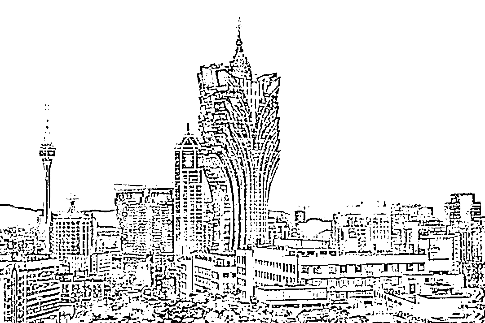
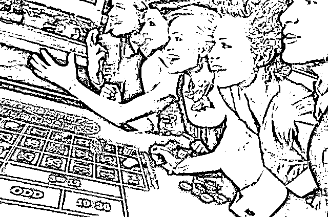

# 赌场如黑洞！回顾赌场的“潜规则”：不怕你赢钱，就怕你不玩

> 原文：[`mp.weixin.qq.com/s?__biz=MzIyMDYwMTk0Mw==&mid=2247543582&idx=7&sn=f51a365f8f5d44dd168cbd4f2aae9595&chksm=97cbe026a0bc6930a142da7cbf4f3ca5a77eb101ad57a2e945c269dbcb292a148c3846275e0e&scene=27#wechat_redirect`](http://mp.weixin.qq.com/s?__biz=MzIyMDYwMTk0Mw==&mid=2247543582&idx=7&sn=f51a365f8f5d44dd168cbd4f2aae9595&chksm=97cbe026a0bc6930a142da7cbf4f3ca5a77eb101ad57a2e945c269dbcb292a148c3846275e0e&scene=27#wechat_redirect)

1867 年，时任澳门总督柯达做出了一个惊人决定——开放澳门的赌博行业。

起初澳门也是禁赌的，但此时葡澳政府财政紧张，几乎年年都处于亏损的状态，论区域竞争力也完全不是香港上海的对手。

因此抱着破罐子破摔的打算，索性开放了赌场和烟馆，扩充税源。

事实上，当时澳门当局对开放赌博整体是呈悲观状态，他们比谁都清楚这不过是一种饮鸩止渴的方式，只不过此时的他们并没有太多的选择余地，甚至还悄悄增加了警卫力量，准备应对之后治安环境的恶化。 

然而令人没想到的是，这一政策的实施，不但挽救了危如累卵的澳门政府，而且也使得澳门也从一座普通的滨海小镇，变成了如今的繁华都会。

仅仅是第一年，赌博行业便为澳门政府赢得了二十万元的税收，自澳门回归时，更是余留了超过二十亿元的政府资产，其影响力更是一直持续到了今天。

如今的澳门是世界四大赌城之一，有人曾经将这里誉为亚洲拉斯维加斯，但其实在澳门名扬天下的时候，美国的拉斯维加斯还只是一片沙漠。

澳门位于广州省南部，这里毗邻香港，与台湾隔海相望，它的陆地面积只有 32.9 平方公里，人口至今也只有 68 万人。

可就是这样一座小城，它的是人均 GDP 却高达九万美元，世界排名第二，仅次于卢森堡，在亚洲更是排名第一。

澳门的繁荣一方面源于赌博行业合法化产生的对周边财富的虹吸效应，在周边城市全部禁赌的环境之下，澳门自然有着得天独厚的优势。

但我们要知道，澳门开放赌博行业正值十九世纪七十年代，此时世界上开放赌博和毒品的城市并不罕见，为什么偏偏只有澳门取得了如此成就呢？

除了地理优势以外，另一个不得不考虑的因素那就是澳门赌场独特的经营方式。

根据澳门官方数据统计，澳门平均每年接待四千万游客，其中将近一半都是回头客，事实上，早在一百年以前，澳门赌场就已经有着一套专业且完整的手段，可以最大限度的留住客人，并且榨取其财富。 

关于澳门赌场曾经有着这么一个故事，上世纪曾经有一名甘肃商人何志启，专门从事海外倒卖的行当，何志启的父亲是当时显赫一时的商业大鳄，只不过在一次父子两人外出马尼拉时，父亲意外去世只剩何志启一人归来。

在路过澳门时，何志启由于丧父之痛，便决定去消遣一番，释放一下压力。

可没曾想，何志启这一待就是整整两个月，在此期间他不但输光了全部家产，甚至还企图典当父亲的骨灰以此翻本，只可惜最终未遂。 

何志启并不是个例，事实上，这样的故事几乎每天都在澳门发生着，有人在这里赚的盆满钵满，有人在这里输得倾家荡产，而澳门的赌场却依旧巍然不动，这其中有着什么样的秘密，下面我们就来看看这些赌场都有哪些套路。

【生理上的诱导】 

澳门绝对是一个名副其实的不夜城，在这里游览、娱乐、购物、饮食，全都 24 小时不打烊，只是为了营造让游客尽情享乐，忘却时间的环境。

澳门赌博业占总 GDP 的百分之七十以上，贡献了将近三分之一的工作岗位，可以说，整座城市都是为了赌场而建立的。

无论是灯火通明的街道，还是歌舞升平的赌场，温暖的光芒总是吸引着一个又一个孤独的旅客。

走在澳门的街头，你会发现，无论身处何地，你都可以迅速的找到一间赌场，无论是酒店的一楼大厅，还是路边的商业中心，甚至是狭窄的小巷都会摆放几台老虎机。

来到这里的旅客从走下飞机和轮船，再到进入酒店的房间，这一路上必须会经过甚至穿过几家赌场。 

在热火朝天的气氛之下，人们会很容易受到感染，甚至一些原本没有赌钱计划的人，也会不自觉的驻足观看，最后加入其中。

在澳门赌场内部有话是这么说的，“不怕你赢，就怕你不玩”，赌场的主要目的在于千方百计的诱惑你参与赌博，赌场只要从每场赌博当中进行抽水便达成目的。

抽水能赚多少？就好比抽水最少的百家乐，一轮抽水百分之二点五，就算每次一百元，你都能保证不输不赢，那么等到四十轮下来，你已经白白送给赌场一百元了。

除此之外，在澳门赌场之内，往往会把空调的温度开得很低，但这并不意味着店家大方，在寒冷的温度之下，你的思维和肌肉会变慢，逐渐放松警惕，投入其中。 

其次，赌场的装饰风格通常偏向于暖色调，而街道则往往是冷色调，当人们路过时，看见如此鲜明的对比，这就会使得人们在其中会不由得放松，对其产生生理上的不自觉的依赖。

如果你选择进入赌场看看，那么你就会发现，想要从中走出来是一件并不容易的事儿，澳门赌场在布局上经过严格精巧的设计，赌场几乎处处都有入口，但进去以后，你很难找到出口标识，只能在其中不停打转。

【心理上的把握】 

然而，不管怎样，总会有一些自制力强大的人存在，就算他们莫名其妙地走进了赌场，但是无论如何都坚持不上桌。

这样的人，赌场老板会采取第二步，免费赠送筹码。

赌场的工作人员会不定期的向路过客人，免费送上一定数目的筹码，从几十元到上百元不等，这些筹码完全由客人自行处置，甚至可以选择直接将它们兑换现金。

为什么赌场会这么做呢？主要是因为赌场人员早就把客人的心理把握透了。

当客人拿着筹码想要兑换现金时，毫无疑问，事要从整个赌场穿过去的，手中握着一叠厚厚的筹码，走在一个个生龙活虎的赌客身边，人们很快就会意识到，自己手中的筹码，是无偿的。 

既然如此，与其将其兑换成一点点微薄的现金，倒不如亲自下场来碰碰运气，或许还能多赚一点，反正不是自己的钱，输掉了也不心疼，何乐而不为呢？

贪婪是人的一种本性，在巨大的利益诱惑之下，人们会不自知的产生兴奋，在经过几把不痛不痒的游戏以后，他们的神经也会跟着麻木，很容易就掉入陷阱。

因此这些筹码虽然是赌场免费发放，但大多数还是会被重新扔进赌桌。

而一旦赌客上了桌，再想下来是可就很难了，没等到这些筹码全部输掉，客人的赌欲也就会被勾起来了，进而掏出自己的钱来赌。

就算在这些筹码输完以后，掉头就走，但已经开了头，谁又能保证哪天手痒，再来花点小钱试试呢？

就这样，赌场成功地把这些意志坚定的客人拉下了水。

通常澳门大赌场旗下都有高档酒店，甚至还会安排一些旅游团，以极低的价格设计出包含机票酒店等一系列套餐，或者是送房间，或者是送优惠券，总之提供各种便利性低成本服务，目的只有一个那就是吸引游客前来。

而对于那些高规格客户，甚至还会有豪车接送，声色犬马，酒池肉林，只有你想不到，没有做不到的。 

以最优质的服务来使顾客满意，再顺水推舟地把赌场送到你面前，在这样的糖衣炮弹之下，很难有人能把握得住。

根据科学杂志《柳叶刀》上的一篇文章显示，人在赌博时，身体也会不断提供肾上激素和内啡肽，带来快感，即便是在输钱，也会大量分泌。

这种赌瘾一旦染上再想戒断，是十分困难的，更别说赢钱后带来的成倍快感，输钱并不可怕，可怕的是赢钱。 

赢了之后很少有人能够保持镇静，对于赌场而言，赢钱那就意味着客人会有极大概率再次光临，甚至直到把钱全部输光，也会借钱参与。

【规则上的绝对优势】 

很多人在提到赌场的套路时，总是会想联想到出千。

比如安插一些赌托，先给一些甜头，然后逐渐加码，通过千术来左右赌局的输赢，在赌博的过程当中不断煽风点火让你上头，最终，等到你红了眼在一举拿下，这个过程俗称杀猪盘。

但以上这些行为的本质，其实都是用出千的办法来牟取利益，通常只存在一些非法赌场出现，来对陌生游客进行欺诈，在正规赌场里这不过是一些最下三滥的东西。

严格意义上来讲，它已经不属于赌博，而是属于诈骗，如果有发生，先不提在赌客眼中声誉会受到影响，赌场负责人首先是要面对法律责任的。

因此，在澳门赌场里极少存在这样的骗局，不光如此，甚至一些暗箱操作、黑钱等手段也遭到澳门赌场明令禁止。几乎每一个赌场都强调公平公正公开，以此来打消赌徒的顾虑。 

作为一家专业且正规的赌场，他们最大的优势就是庄家身份，凭借这一层身份，不需要任何小动作，就能从中渔利。

在此举个简单的例子，三个骰子的买大小。

买大小指的是三个骰子点数之和的大小，从三到十为小，从十一到十八为大，买一赔一。

虽然看上去各有百分之五十的几率，但在实际上，还有另一种情况，豹子。如果出现“三个一，三个二……”这种三粒骰子点数相同的情况。 

就是出现了豹子，大小通吃，无论你买大买小都算输。当然你也可以选择买豹子，只不过赢得概率不高而已。

如果从数学期望的角度来分析，三个骰子统共会有二百一十六种结果，其中豹子有六种结果，大小各有一百零五种。

如果你选择买大小，那么赢的话就能获得双倍的钱，这个概率是 48.6%，因此它的数学期望是 2*105/216 = 0.972，也就是说你每次下注一百元，从概率学的角度上，你能拿回来的钱只有 97.2 元，剩下的 2.8 元就是庄家期望能赢的钱，如果你玩的次数越多，那么最终的结果会不断趋近。

如果你买的是豹子，那么就更亏了，数学期望只有 0.694。 

这时你就会发现，只要踏上赌桌，庄家总会有办法来抠掉你的一部分钱，赌场正是利用这种微弱的优势，让你在不经察觉，有输有赢的情况之下，慢慢的把钱输光。

就算你运气好，真的赢了钱，那么你的对手也会承担这部分庄家抽水。而庄家永远不会亏损。

赌博最常见也是必不可少的套路就是让你在不知不觉当中，自动上缴一部分钱，这笔钱可能还没到账，但玩的人多了自然跑不掉。

在澳门的赌场当中，最常见的游戏就是百家乐，百家乐有庄赢，闲赢和和棋三种结果。如果庄赢，那么将会抽水 5%，如果闲赢赔付 100 %，和赔付 800%。 

然而就是倚靠这小小的 5％，赌场就能够让你输得倾家荡产。这五个点貌似不起眼，但却是赌场赚钱的利器。

只要踏上牌桌，庄家赚钱的多少，就只跟玩家下注大小，你下得多，那么他就赚得多。为了增加收入，不少赌场都会设置最小投注额，拔高牌桌上的流水，进而提高收入。

最后，赌场最重要的不败之地，就是它的资金池优势了。就算赌场没有任何规则上的漏洞，在绝对公平的情况之下，它依然可以赢得你倾家荡产。

咱们假如参加赌博的只有庄闲两人，双方各有百分之五十的概率获胜，只有当其中一方的钱全部输干净才能结束，那你觉得哪一个人更容易成为最后的赢家呢？

答案是钱多的一方，因为如果双方庄家拥有一百元，闲家只有十元，每次赌五元的话，闲家需要连赢二十次才能获胜，而庄家只需要连赢两次便可，这就是庄家的资金池优势。

目前澳门最大的赌场有两百亿美元的资产，相当于如果按照这样的规则来进行，全中国只有排名前八的富豪的纸面获胜几率高于赌场。

所以庄家都是不怕你赢钱，只怕你不玩。

况且，庄家也根本不可能和你玩这样的五五开，只要设置一个规则，加上一点点几率变动，那么庄家就完全可以立于不败之地。

我们回望澳门的整个历史，就会发现，游客们往来熙熙攘攘，但澳门却越来越富，赌桌上赌徒灯红酒绿，但真正的赌王的称号却是开设赌场的何鸿燊。

赌场就如同一个黑洞，不断地吞噬着财富，壮大自己。

真正赢得胜利的方法很简单，那就是远离赌博。

来源：戒赌吧

欢迎关注灰产圈社群服务号

