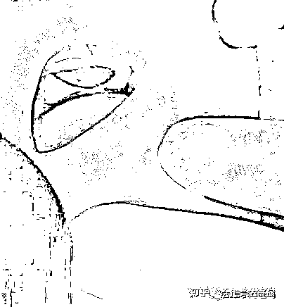

# 湘雅医院又出事了

> 原文：[`mp.weixin.qq.com/s?__biz=MzIyMDYwMTk0Mw==&mid=2247543633&idx=1&sn=d0b656969633748642fbd50ee42f1656&chksm=97cbe069a0bc697f827c0dafeeae16287e88585ad6a4ce2ec44dae313444458dc3487f9d42f0&scene=27#wechat_redirect`](http://mp.weixin.qq.com/s?__biz=MzIyMDYwMTk0Mw==&mid=2247543633&idx=1&sn=d0b656969633748642fbd50ee42f1656&chksm=97cbe069a0bc697f827c0dafeeae16287e88585ad6a4ce2ec44dae313444458dc3487f9d42f0&scene=27#wechat_redirect)

关注小号，谨防失联！

此文章是本人在网络看到，内容写的是一个长沙市民带小孩去看病的故事，他家里的小孩子吃了一个莲蓬里面的链子，那个莲子的皮黏在了嘴巴里面，也就你们接下来看到的图片了，哈哈哈哈，

他们一家人先去了长沙的儿童医院，又去了湘雅的医院，来回跑，湘雅的医生挂号 300 专家，湘雅名医临床诊断为右侧腭部肿块性质待查？先天性胚胎瘤待排？处理意见为住院手术治疗，肿瘤切除后再确定肿块性质。

这个时候他们一家人准备在湘雅交钱住院做手术了，结果没床位，又去了儿童医院，再去儿童医院检查的时候，这个黏在嘴巴的莲子的皮掉下来了，哈哈哈哈哈，屁事没有，

我一直搞不懂这类的事情太多太多，我们市民应该怎样维权，

他们的原文开始：原文作者网络 ID：一个好银

全天下父母，最大的心愿莫不过于孩子茁壮成长，其它所有，在健康面前，不值一提。这几天的大起大落，有如陷入万丈深渊的黑暗，仿佛一辈子那么长，心情久久难以平复。码文记录这几天被多个尤其是行业翘楚湘雅名医误诊的求医经历，感叹普通家庭求医路途的心酸、艰辛。

我是两个孩子的父亲。2022 年 8 月 25 日，我下班稍晚，爱人跟我说小宝（11 个月）口腔里有一黑色的坨，顾不得许多，几个大人强行将小孩嘴巴弄开，我伸手指进去，约 1cm x 1.5cm 大小一黑包块，质地硬，摸上去有纤维感。嘴巴里长个血泡、溃疡见多了，很正常，这么大的黑色硬包块，我一下子紧张起来，赶紧上网查。

一通百度，找到一张类似的图片，形状很像，但小孩的是黑色的，结合网上说黑色的可能是恶性肿瘤的几率更高，又搜到“口腔黑色素瘤”，一种恶性肿瘤，也是偏黑的，顿时心神不安起来。

爱人赶紧请了假，挂了第二天湖南省儿童医院口腔科王琛玮医生的号。

2022 年 8 月 26 日，爱人和小孩奶奶带着小孩去医院就诊，我在办公室如坐针毡，一直问爱人看了么，什么情况？约十点半爱人打电话过来，说儿童医院处理不了，医生给了两个选择，一是直接去湘雅，二是可以挂个儿童医院的耳鼻咽喉科看一下，我能听出孩他妈明显的哭腔，心里的焦急......我赶紧说看湘雅有号没，一通查找，湘雅只有副主任医师的号，感觉事情很严重，想找最好的医生，于是申请了湘雅一医院口腔科-口腔颌面外科（儿童医院王琛玮医生告诉我们要挂这个科）特需专家翦新春医生的号的候补。同时按照王琛玮医生的建议，挂了下午三点儿童医院耳鼻咽喉头颈外科王敏医生的号。

我匆匆赶到儿童医院，抱着小孩，鼻子酸酸的想哭，在煎熬中等到下午 3 点王敏医生的门诊。王敏医生安排我抱着小孩坐下，抱紧头部，用压舌板撬开小孩嘴巴，观察了一下，直言包块很大，这里处理不了，并解释到我们挂口腔科是没有错的，只是儿童医院口腔科较弱，只能处理些较常见的口腔问题，一些比较困难的耳鼻咽喉科帮着处理一下，但这种情况他们也处理不了，建议我们去湘雅等大医院看一下。

从省儿童医院出来，我们忧心忡忡，从最初上网查的隐隐不安，到接连被省儿童医院两位口腔科相关医生建议我们去湘雅进一步查看，等于已经间接宣判了小孩口腔里面的黑色包块非一般。

我和爱人四处搜索、询问长沙口腔科的权威医院、医生，到各大医院公众号上查看号源，幸运的是（起码在那一刻，我觉地是幸运的），竟然候补到了湘雅医院特需专家翦新春医生的号，只不过时间要到 8 月 31 日。

在网上查了翦医生的资料，他身上头衔几十项，湘雅医院口腔科主任，“槟榔斗士”，口腔颌面专家......说他是湖南省内口腔科数一数二的人物也不为过，这让我们看到了曙光，感觉抓到了最后的救命稻草。

还要在煎熬中等几天，我和爱人全然无助，感觉我们的世界塌了。家里的气氛压抑，都默契地不说这个事，看着小孩爬来爬去，活泼好动，直想哭。爱人提议说要不要先去湖南省人民医院或长沙市口腔医院去看一看，朋友同事也建议我们多看几家医院，我说就再等两天吧，从网上资料来看，翦医生是湖南省最好的口腔科医生了，甚至，晚上恍惚中，想象着一位和善慈祥、医术精湛的老学者、老医生，可以说，我们是把全部的希望寄托在湘雅医院，寄托在翦新春医生身上。我和爱人互相安慰，儿童医院医生应该是没见过这种情况，说不定就是个囊肿，良性的，切掉就是了，应该没什么事...

2022 年 8 月 31 日，9 点我们就赶到了湘雅医院口腔科门诊。约 10 点，轮到我们了，进去后，发现诊室里除了翦医生，还有两个实习医生。以下是我整理的对话纪录：

`翦：小孩怎么了？
我爱人：口腔里长了一黑色的东西。
翦：长了一黑色东西，怎么发现的？
我：是这样的，我们 7 月 15 在社区打了疫苗，当时检查了口腔，一切正常，然后 8 月 25 在带他玩的时候，突然发现嘴巴里有一个包。
翦：原来没有发现啊？
我：原来没有发现。
翦：（对实习医生说的）来，给个盘子给我，在湘雅医院看病，绝对不能用棉签，一定要用盘子，要正规，用棉签这是乡里人干的事（语气中充满对乡下医生的鄙视）。（对我说）你，坐上去，然后把孩子的脸朝这边......朝这边，朝这边啊（我没有领悟到他的意思，很不耐烦）
小孩大哭（我没有领悟到他的意思，翦很粗鲁地掰正小孩的头，小孩立马被吓哭，不得不说，省儿童医院医生温柔多了）。
翦：小孩子不会和你商量的，对不？
我：对对对（人为刀殂我为鱼肉，只能忍）。
小孩难受，大哭，一个劲地挣扎，翦开始检查，我不知道医院口腔的标准检查流程该是如何，翦就是用摄灯照着小孩口腔，看了一下，用棉签戳了几下。
翦：有出血吗？
我：没有。
翦：是有一个肿块，是一个肿块，这个肿块只长了几天？
爱人：我们发现只有一个星期。
我：7 月 15 的时候看了口腔没有问题，社区医生看的。
翦：是社区医生看的，你们没有看？
我：没有。
翦：那就不好讲，社区医院说没，那就不好讲，这个颜色很深，是个黑色的，而且不是血泡，是个肿块，是个肿块的话，他也做不了其它检查，只能住院做手术啦。
我：做手术可以将它切掉是吧。
翦：那只能做手术切掉做活检不，你这么小的小孩，也没法做活检不。
翦：但是你发现只有十几天，十几天就一个肿块，那不好讲不，刚才我没法摸，摸了就咬我手了是不？（仔细认真检查不是你该做的事情？）
小孩奶奶：摸上去是硬块。
翦：是的，用棉签戳了一下，是硬的，不是软的，而且是黑色的。
我：他这么小可以做手术吗？
翦：那怎么办了，让它继续长，长到口里都呆不下去？（很轻蔑的语气）
我：我不是这个意思。
爱人：不是这个意思勒，就是他这么小...
翦：那你们的意见勒？
我：我们肯定还是听医生的啦。
翦：不是的，医生只是个建议，怎么办还是你们自己决定。
哭声（我爱人和小孩奶奶）。
翦：发现这肿块才几天？
我：7 月 15 社区医院检查时还是正常的。
翦：7 月 15，现在是 8 月 30 号了啦，一个半月，45 天。
实习医生：你是说 7 月 15 的时候还没有？
我：对。
翦：他自己没发现，是社区医院检查，说没有，社区医院检查，小孩哭闹，可能看都没看，要是湘雅医院检查的，我才相信 50%，社区医院发现的，社区医院医生有多大本事罗，看都不会看...（话中充满对社区医生的鄙夷）
接下来指导实习医生写病历...
我：翦医生，他这个，这个怎么确诊啊，也做不了活检，到底是什么东西？
指导实习医生写病历，无视我的提问。
翦：那你们的意见勒？你们准备怎么办？
我：这里有床位吗，可以马上住院吗？
翦：那不可能，湘雅没有马上住院的传统，湘雅如果等着病人住院的话，那湘雅早就关门了，只能是等。（湘雅人的自豪吧）
翦：你是在这里住，还是去其它地方，住这里就给你们开个住院证明。
我：住吧，那现在没床位，我们就只能等着？
翦：那只能等。
实习医生：等会拿着住院证，去五楼预约床位。
继续指导写病历，开住院证...
......(憋了很久)
我：那个，翦医生，凭你的经验，你觉地这可能是什么？（想确定是什么东西，心想他几十年的经验，应该是知道的）
翦：不知道。
......(憋了很久)
我：翦医生，他这个如果动手术的话，是直接从嘴里进去切除吗？（很担心因为手术视野，会直接在口外切口，脸部会破相）
翦：给你做手术的医生会告诉你的。
......`

文字的表达还是过于苍白，没有情绪、语气加持，仅从对话纪录中难以感受到湘雅名医的傲慢与对病患的忽视冷漠。整个过程很不愉快，其一，在检查时翦很粗鲁地掰小孩头部，小孩吓地哇哇大哭，我们是敢怒不敢言；其二，十分傲慢自大，是那种发自骨子里的对乡下医生，对社区医疗工作者的蔑视以及“我是湘雅专家”的那种对病人的不屑; 其三，没有一点同理心，冷漠。我感受不到，哪怕一丁点对病人的真正关心，一点也没有站在患者的角度提出诚恳的建议，整个过程是以一个高高在上的旁观者的姿态，你治，行，那就治；你不治，那就走吧，湘雅不愁“客源”，对我们关注的问题，要么不作答，要么生冷回绝；其四，前面三点我都可以忍，不可以忍地是，翦新春医生根本没有认真仔细检查小孩口腔里的黑色包块，盲目自信，妄下诊断。

翦医生临床诊断为右侧腭部肿块性质待查？先天性胚胎瘤待排？处理意见为住院手术治疗，肿瘤切除后再确定肿块性质。

此时我和爱人，经过全国著名的湘雅医院里最好的口腔专家的诊断，已经百分百确信，小孩口腔里面的肿块是个肿瘤，并且极有可能是恶性的。他还那么小，就要受那么大的痛苦，全家人已经慌了神，心情低落到极点，小孩妈妈和奶奶情绪崩溃，小孩奶奶怪自己没带好，说如果小孩出什么事，她也不活了......

仅管在门诊不是很愉快，但没办法，只能相信权威医院权威医生的诊断，我们去五楼预约了床位。问预约的护士大概要等多久，护士说不确定。

没有床位，只能干等。抱着想看看不同医院不同医生的诊断，试一试的态度，我们又挂了湖南省人民医院口腔颌部肿瘤外科 L 医生（不想该医生卷入事非，且称作 L 医生）的号，立马赶过去。

赶到人民医院口腔科，人不多，直接进门诊。L 医生询问了一下，让抱着小孩坐下，仔细检查小孩的口腔（仍然不配合，但明显没有像在湘雅一样激烈挣扎，因为 L 医生很温和地安抚小孩，而湘雅翦医生很粗鲁，还没开始检查就将小孩吓哭了），反复观察检查了几次，用棉签试探肿块，突然，肿块掉了下来......所谓的肿块，是一块附着在小孩上腭的莲子壳（这之前回了趟乡下，带了很多莲蓬回长沙，应该是吃时莲子壳不小心掉地上，被小孩捡起塞到嘴巴里），诊室里的医生护士顿时笑了起来......我们说我们刚从湘雅医院看了专家号过来的，还预约了那里的床位准备手术......又是一阵大笑......

L 医生觉地这是个典型案例，互加了微信，要我们传了一些图片、视频给他，并说道，莲子壳牢固吸咐在腭部，第一眼看确实挺像肿瘤的，但仔细看又不完全符合肿瘤的特点，所以才判断可能不是肿瘤。可见，从专业角度还是有可能分辨出是不是肿瘤的。

从悲痛到感觉世界都是黑暗的到花开月明，从口腔恶性肿瘤到健康平安，从心中已经默认的即将开始的漫漫求医之路到回归普通大众的生活，就那么一瞬间。健康真好。我们百感交集，喜极而泣，感恩 L 医生的一丝不苟，感恩上苍，感恩世间的一切，阳光、雨露、花草......抱着小孩狂亲......我们的人生瞬间就转了个模样回到正轨......

这件事带给我的冲击，即使是到了我码下这段文字的 9 月 3 号晚上，心情都还没完全平复。

历经三个医院四个医生，才最终解开这个乌龙，其间内心所受的煎熬折磨，一辈子也难以忘怀。儿童医院两位医生误诊了，好在态度好，并且我对它的期望并不高，最不满的就是湘雅医院了。

文中多次说到我们在诊治过程中觉地湘雅医院态度傲慢，没有同理心等等，这全是我个人感受，千人千面，所有人都有自己的判断。但不容忽视的事实是，湘雅医院医生在检查过程中态度敷衍，诊断错误，我健康活泼的小孩差一点被推上手术台（不知道医学上这算不算误诊）。我是把湘雅医院当成最后的救命稻草，寄托了所有希望，找了医院里最好的专家，它不应该也不能误诊，而实际上它却辜负了我的信任，态度傲慢，检查马虎，轻率下结论，要将一个健康孩童以肿瘤收治入院推上手术台，给我们造成沉重的精神、心理负担。

湘雅医院明白也应该明白，很多患者是在基层医院反复治疗诊断，没办法了才来的，许多人是把湘雅当成最后一站，面对这些患者，更应该恪尽职守谨小慎微如履薄冰，对得起湘雅的招牌，患者的重托，而我，只看到了湘雅医生对自身医术的盲目自信，对基层医疗工作者的鄙夷，对患者的冷漠敷衍和对生命的傲慢。医生面对的是生命，手术刀下是人，稍有不慎，带给患者及其家庭的是无尽痛苦。不求你医者仁心，但求你在对待患者的病情上，认真，认真，再认真；慎之，慎之，再慎之。他们的道路，本就已经很难很难了。

诚然，不能从这件事情上就看出湘雅医院，看出翦新春医生医术不行，但见一叶而知秋，窥一斑而知全豹，或许，能从此事上，为现在网络上甚嚣尘上的湘雅系衰败论找到一点论据。

这段时间，关于湘雅的负面满天飞，刘翔峰事件，院长桃色新闻，套取医保基金等等。和同事、朋友聊到这次经历，说你这可以发个贴，给湘雅补一刀。

也是由于和同事、朋友的聊天推演，让我感到阵阵后怕。

如果我们没有去省人民医院再次检查，会怎么样？

我们肯定会住院，并且大概率不会做什么检查就上手术台（翦医生说这么小做不了检查，只能手术切下来后再做活检），小孩全麻，手术医生切开他的口腔（为了手术视野，口外切口，网上查的），发现没有肿块，是粘的异物，怎么办？医生会怎么选择？是选择直接缝合推出手术室，告诉家长，对不起，我们弄错了，没有肿块；还是像刘翔峰一样，在肿块位置切掉一些正常组织，告诉我们手术很成功，然后我们感激涕零？

当然，也有可能是其他情况，比如病房医生认真检查查出来了，比如全麻后还没有切口就发现了……但无论哪种情况，都将给我们带来身体和心理的双重折磨，无尽痛楚。

如果是外地来长求医的患者，恳怕大概率不会去其它医院再次检查吧。

细思极恐。

事不摊身不知其重。于我个人而言，此事带来的冲击以及若没及时发现后续可能带给小孩大人的伤痛，翦新春医生和刘翔峰并无二致。

反思己过，这件事作为家长也有很大责任，没照顾好小孩，让他将异物放到了嘴里。感受生死以后，一切感觉坦然，平安健康最重要。还有，赶紧给小孩买了一份商业保险，防患于未然。

无疑，我是幸运的，我的小孩是幸运的，感谢上天的眷顾。

写在最后，大家在求医之时，一定不要迷信某家医院，多看几家，多听听不同医生的声音，交叉对比再做决定。

愿，正在求医的朋友，所遇兼良医，药到病除，早日康复。

愿，天下所有可爱的小宝贝，平安健康快乐成长。

来源：长沙吧

欢迎关注灰产圈社群服务号

