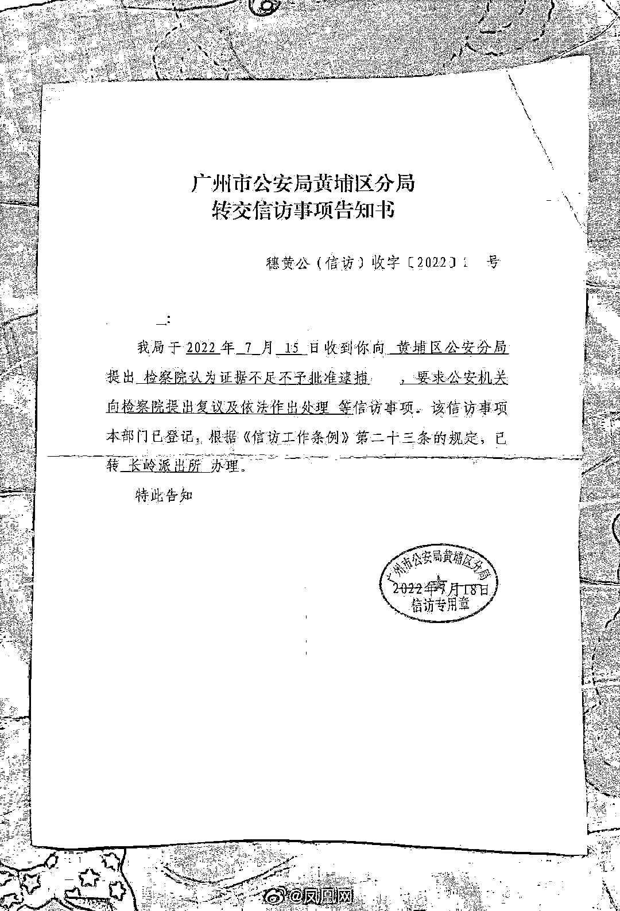

# 禽兽前男友清晨翻墙入室、强奸有夫之妇？事后还发朋友圈炫耀？！这也太猖狂了…

> 原文：[`mp.weixin.qq.com/s?__biz=MzIyMDYwMTk0Mw==&mid=2247543633&idx=2&sn=ef8b885a102b01d5db9634010d3d3748&chksm=97cbe069a0bc697f3c8b080015ca8df25c6ef8f1261d060dbd2006507e188664c08d3e10a6ac&scene=27#wechat_redirect`](http://mp.weixin.qq.com/s?__biz=MzIyMDYwMTk0Mw==&mid=2247543633&idx=2&sn=ef8b885a102b01d5db9634010d3d3748&chksm=97cbe069a0bc697f3c8b080015ca8df25c6ef8f1261d060dbd2006507e188664c08d3e10a6ac&scene=27#wechat_redirect)

关注小号，谨防失联！

刷到这条新闻的时候，有一种被降智的感觉。

**不经同意，强闯民宅**

**加上侵犯有夫之妇，这两条罪名放在一起**

竟然还会逃开法律的制裁

这，也太魔幻了吧？

所以，事情到底是怎么一回事呢？

受害人章女士表示，自己曾和这个前男友惠某交往过，后面在 2020 年，因为发现男方早已结婚，于是分手，可是在分手之后

**惠某却一直对她纠缠不休......**

章女士说，自己搬到增城，不久就发现此男也出现在附近

她从城市搬到农村，越搬越偏

但是就算这样，惠某却还是能一如既往地找到她。

**这不是恐怖情人么？就因为曾经在一起过，人家就变成你的猎物了么？**

不管逃到天涯海角，却还是有一天会被找到，这，这也太吓人了吧...

按照章女士的说法， 惠某很清楚自己现在的家庭情况

他提前踩点，就是趁着早上章女士老公出门送孩子的时间**，****翻墙入门。**

更让人细思极恐的是，章女士说，自己每一次搬家，对方都能精准地找到自己，

不仅如此，他还能找到自己老公的家人，**甚至偷拍跟踪视频，拍她的先生、家人、甚至孩子，她的一切。**

**几乎所有的信息，在惠某看来，几乎就是透明的。**

**朋友们，这不是疯子，是什么啊？**

**在事情发生的那天，趁着章女士老公出门送孩子，惠某就顺着水管，爬进了她的家里。**

**当时，章女士正在厨房，背对着房门洗完，听到声音后，回头就看到他出现在家里，章女士说。**

**当时惠某整个人喘着粗气，开口第一句话就是，我今天终于找到你了，我今天就是来**的，**说完就直接开始掀章女士的睡衣，章女士极力反抗。****

********

**可是拗不过对方气力大，她几乎是被拖着拖到了沙发上。**

**在推搡中，被强行发生了关系。在此之后，临走前。**

**惠某还不忘恐吓对方，**“就算我成为别人的妻子，也一样以后还会来找她”**。**

****这样阴魂不散，真的，太吓人了，****

**你能想吗，就好像你这辈子，都无法脱离某个人的阴影。**

****这难道不是现实版的《不要和陌生人说话》么？****

****

****哦不，电视剧里，两人至少还是夫妻关系，可是现实中呢。****

****惠某不过是章女士曾经的前男友而已啊。****

******这是谈一次恋爱，就要把自己的下辈子都搭进去么？******

****事情的后续，警方介入了调查，后面表示，自己当时也听到了响动，听声音过来，**但是房门，当时是锁住的。******

****也就是说，惠某在进门之后，第一时间已经反锁了房门，为的就是避免任何人破门而入，**即便章女士不断地吓唬对方。******

****说自己老公很快回来，求对方放过自己，可是，惠某人，却丝毫也不为所动。****

********

******由此可见，从前期的踩点、盯梢、算时间，到执行时候的翻墙、爬水管破门而入，再到后面的反锁房门。******

****实施 qiangjian，这一系列的动作，惠某都是提前精心地设计过的，绝非临时起意，这样一个有动机、有预谋，并且真实地实施了犯罪的行凶者，法律是如何看的呢？****

****按照章女士的说法，jiancha 院并未受理该案件，未受理原因呢？检察院说犯罪嫌疑人不是主观意识的 qj，所以对他不予批捕……****

********

****而在章女士询问民警时，民警说的也是，她有 dna 鉴定结论，有口供笔录，有身上的伤痕，****

****还有他私闯民宅后发的朋友圈，这一切的一切，难道都不足以构成犯罪么？****

****这样的人，都不批捕，那么普通老百姓，还能有什么安全感？****

******这太荒谬了吧？******

****看看网友们对这件事的看法：****

********

********

********

****所以，施暴者主动戴 tao 不算 qj；****

****有之前恋爱关系，是“非主观意识”、不予批捕。****

****那么，到底怎样才能算呢？****

****难道非要女方被打的遍体鳞伤，成为一个严格按照法律词条的“完美受害者”才可以么？****

******按照这样的话，恋爱关系，婚姻关系，对女生到底意味着什么？******

****只因为一时眼瞎进入了这段关系，以后这个人渣都要受到法律的保护了么？！****

****凭什么啊……****

******惠某在成功入室 qiangjian 之后，发了一条朋友圈，朋友圈内容是什么呢？******

******真的，看到这些，我汗毛几乎要竖起来。******

******他说，“我不后悔...我真的很想要你”。******

************

******按照章女士的说法，**他对自己有执恋……********

******不好意思，其实我并不太认同这种说法。这种人渣败类，自己明明在婚姻内，却能不断劈腿，**还试图给情人洗脑自己爱她……********

******真的，这种人没有什么恋不恋的，******

******更谈不上什么爱，这样的人，内心全都是欲望。******

********整个人就是一个被欲望驱使的躯壳。********

********什么爱不爱的，不过是试图躲开法律的遮羞布罢了。********

******来源：福尔摩甜 ，大 R 说安全******

************

******欢迎关注灰产圈社群服务号******

************

************