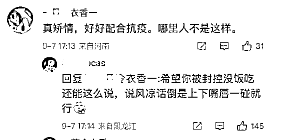
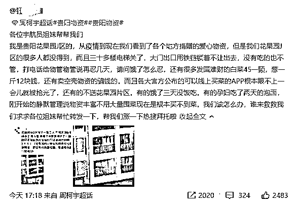

# 青岛一救护车出事 救援人员被“就地静止”

> 原文：[`mp.weixin.qq.com/s?__biz=MzIyMDYwMTk0Mw==&mid=2247543633&idx=3&sn=3f665fb936d576ec6d8c03e6afa0a611&chksm=97cbe069a0bc697f418fd33b17c20f99e9266dc426542544629bee0ca72a0dd998761a53e707&scene=27#wechat_redirect`](http://mp.weixin.qq.com/s?__biz=MzIyMDYwMTk0Mw==&mid=2247543633&idx=3&sn=3f665fb936d576ec6d8c03e6afa0a611&chksm=97cbe069a0bc697f418fd33b17c20f99e9266dc426542544629bee0ca72a0dd998761a53e707&scene=27#wechat_redirect)

关注小号，谨防失联！

大千世界无奇不有，而在超强疫情防控的当下，更是一切皆有可能。你们有听到过作为治病救人为主要任务的救护车，居然会有“就地静止”的骚操作吗？最近这样的事真的发生了。 

山东青岛疫情再度升温，日前青岛一辆救护车发生交通事故，参与救援的市民被“就地静止”，引发热议。

9 月 6 日，青岛城阳区疫情防控指挥部发布寻人通告称，当天晚 8 点 17 分，一辆负压救护车在城阳区春阳路与祥源路交叉路口发生交通事故。通知要求参与救援的市民“就地静止”，与家人保持距离，并立即与当地防疫部门联系，配合后续防控。

（微博图片）

这则通告引发网友热议：“天大的笑话，全世界都在看我们的笑话。”“老实讲，这样的话，有一部分人参与救援会犹豫。”“做好事儿之前先动脑，这跟他人落水救人者却受害类似道理。”“好心没好报，不 ZY 毋宁死。”

还有网友直言：“后续防控措施不知道是核酸还是居家还是集中隔离，通告没说，但通告散发出来的芬芳，是不是告诉大家面对车祸，特别是负压救护车车祸，大家要谨慎救援？”

当地政府第一时间关注的不是感谢热心市民的义举，而是发通告寻人，让参与救援的各位原地静止，配合后续防控措施。简而言之，你救了“不该救的人”，现在要对你进行隔离，请主动配合。

通告看起来彬彬有礼，有理有据，可背后的冷漠却令人不寒而栗。我反复看了好几遍全文，对参与救援的市民一个谢字都没有。反而是一连串的就地、立即、配合……不知道的还以为这些市民做了什么违法犯罪的事情需要主动投案呢。

而且，发出通告的部门似乎根本没有考虑过这些参与救援的市民处境。人家可能在下班路上，出去玩的路上，顺便做了件好事，没有感谢也就罢了，谁知道还成了无妄之灾，要被隔离防控，这搁谁碰到都心里不好受。

更重要的是，大家都有正常的生活秩序，都要养家糊口，因为做好事救人导致被隔离，这损失谁来承担？难道救了人还得倒贴？这于情于理都说不过去。

按照当前的疫情防控规定，如果参与救援的市民真的成了密接、次密接人群，你要找人也好，要隔离也好，没毛病。但这事儿不该这么干，通告不该这么发，不能这么没有人味儿！**一个正常的社会里，做了好事可以没有感谢、没有奖励，但绝不该让好人再承受损失。如果政府带头将寒气传递给热心市民，那以后谁还敢救人？**

“（四川）甘孜州要求救援队参与救援必须持 24 小时核酸，（青岛）城阳要求参与救人的热心市民‘就地静止’，为什么看上去都那么魔幻？”

目前强国至少 74 座城市、3 亿多人处于封控中，各地疫情防控层层加码。青岛即墨区 9 月 5 日仅发现两名患者，立马紧急叫停，即墨中医院发热门诊被紧急封控管理。

当天，即墨区划定 2 个高风险区、4 个中风险区，同时进行全员核酸检测。9 月 10 日是传统中秋佳节，青岛市已提前发布通知，倡导市民就地过节，非必要不跨省出行。青岛各类学校则实行封闭管理。

一张无形的大网已经落下。

# 延伸阅读：贵阳官方公开致歉：经验不足、方法欠妥，深感歉意

1 号时务局 

贵阳官方终于道歉了。

9 月 7 日上午，贵阳市南明区新冠肺炎疫情防控现场指挥部发布《致南明区花果园区域居民朋友的一封信》。

信中提到，“此前的工作，尽管我们努力考虑很多优化方案，发动各方力量，但由于经验不足、方法欠妥，导致有的居民深夜仍在排队等待采样，有的区域生活物资供应不足，给大家带来不便，对此我们深感内疚、深表歉意。”

9 月 8 日，在贵阳贵安新冠肺炎疫情防控新闻发布会上，南明区副区长杜敏说：

“当前南明区花果园区域疫情形势严峻复杂，居民生产生活停滞，生活物资采购困难。此前的工作，尽管我们努力考虑了很多优化方案，发动各方力量，但由于经验不足、方法欠妥，导致有的区域生活物资供应不足，给大家带来不便，对此我们深感歉意。”

贵阳官方为啥道歉？

在社交媒体平台，有贵阳本地博主晒出了花果园里一些楼道的聊天记录，让人心疼和愤怒：

哪些业主家里还有剩饭的，愿意给出一点的，麻烦私聊我一下，这边有好多租户都是饿了一天两天的了，可以的话给他们一口饭吃。 

另一位管家表示已经有人三天没吃饭了，希望邻居可以帮帮他们。

实际上，关于此事，社交媒体铺天盖地的求助。

综合来看，很多人因为封控早已断粮好几天了。

有当地居民向自媒体反映：大小商店超市全部关门，所以线上买不到菜。所有人居家，所以线下也没办法买菜。

央视网 2020 年 11 月的一则报道显示，贵阳市花果园社区，号称“亚洲最大社区”，全国最大的棚户区改造项目。另据 9 月 8 日南明区副区长杜敏介绍，目前，花果园区域约 22 万人、12 万户。

9 月 7 日，贵州省委常委、贵阳市委书记胡忠雄还到了南明区调度花果园疫情防控工作。

在现场，胡忠雄说，采取最坚决最果断最迅速的举措，做到静态管理管到位、生活保障保到位，确保疫情不外溢和民生持续稳定，力争早日实现社会面清零。

“要回应群众关切，及时了解群众最关心、最关注的问题，采取临时性和制度性措施相结合的方式，着力增强配送力量、提高配送效率，用心用情用力做好群众基本生活必需品保供工作。”

南明区副区长杜敏解释说，主要原因包括保供企业在岗员工不足；配送运力不足；志愿服务工作力量紧缺；花果园年轻租户较多、少有做饭习惯，储备较少，租客变动较大，不少人没有在业主群里，对领取物资配送的情况不掌握，导致配送不及时。“下一步将针对花果园片区物资保供工作前期出现的问题和群众关心反馈的意见进行进一步优化提升。”

来源：世相研究所，饮冰室札记

欢迎关注灰产圈社群服务号

