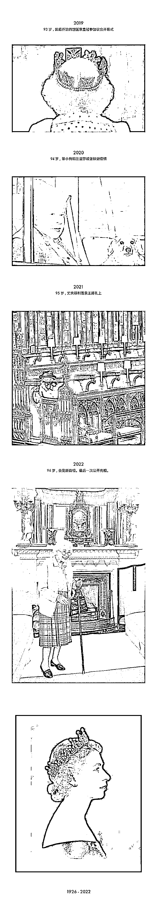
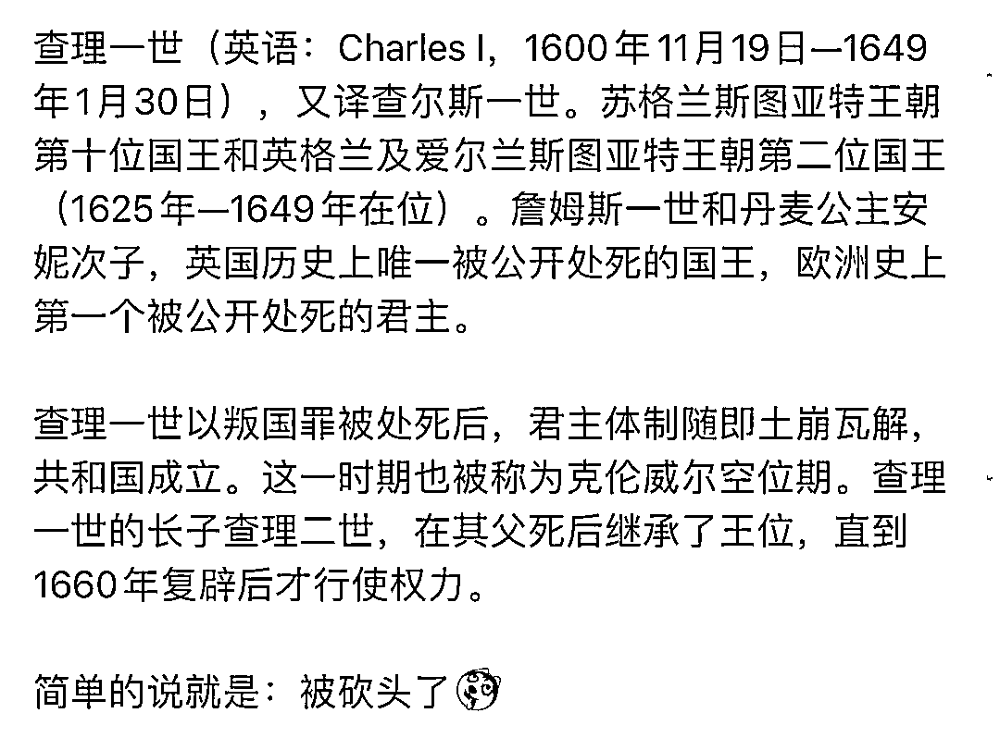

# 见证历史！周一英国：女国王+男首相，周四英国：男国王+女首相

> 原文：[`mp.weixin.qq.com/s?__biz=MzIyMDYwMTk0Mw==&mid=2247543633&idx=4&sn=4afe6fbb5201ece4a6e3d3d36615fc57&chksm=97cbe069a0bc697f44a7f08c4af36351195313abd1283b51b44ef4ba1ea8b5e3be0f216b3cfb&scene=27#wechat_redirect`](http://mp.weixin.qq.com/s?__biz=MzIyMDYwMTk0Mw==&mid=2247543633&idx=4&sn=4afe6fbb5201ece4a6e3d3d36615fc57&chksm=97cbe069a0bc697f44a7f08c4af36351195313abd1283b51b44ef4ba1ea8b5e3be0f216b3cfb&scene=27#wechat_redirect)

关注小号，谨防失联！

一觉醒来，见证历史。

当地时间 9 月 8 日下午，英国女王伊丽莎白二世去世，终年 96 岁，走完了她的传奇一生。

她在父亲乔治六世去世后于 1952 年 2 月 6 日即位，后于 1953 年 6 月 2 日加冕，是英国迄今最长寿、在位最久的君主。

而英女王的一生也串起了主要大国的分分合合。

此刻回顾伊丽莎白二世在镜头下的一生，不禁感慨万千：好神奇，这居然是人的一生……

真切感受到时间在流逝，一个时代落幕了……

“从孩提时代，结婚生子，再到登上王位，青丝变白发… 镜头见证她身边一代人的逝去，又一代人的成长，这是一个女人的史诗。”

***“光影的记载，无需一句旁白，***

***随着时光的流逝而充满着震撼。”***

***▼***

向上滑动阅览

女王去世后，英国迎来下一个时代：73 岁的查尔斯终于继位成为英国国王。

据英媒报道，查尔斯将被称为**查理三世国王。**

不过对此封号，很多网友表示担忧，虽然是坚定的唯物主义，但……查理一世和查理二世可都不太吉利啊，结局都不太好

众所周知，**一世断头王，**被克伦威尔杀了。

**二世诨号快乐王，**但最后走得不太体面，被庸医治死了。

顺便一个冷知识：从查理二世到三世，跨越了四个世纪的时光。

ps：二世的时候，我们这边还是明熹宗（1605 年 12 月 23 日-1627 年 9 月 30 日）。

那么三世……会创造怎样的历史呢……

说起来查尔斯 48 年生人，女王 52 年接位 53 年加冕，58 年他被封为威尔士亲王，确立储君身份。

一直以来，查尔斯被网友调侃为人类历史上待机时间最长的储君，当储君休息了 64 年，没想到一夜之间，70 多岁突然来活了要上班了……

除了国王封号，**英国国歌、英镑、邮箱和邮票也要改了。**

①英国国歌的名字由《天佑女王》（God Save the Queen）变为《天佑国王》（God Save the King）

②新铸造的硬币和新印刷的纸币将出现国王的头像。

原来印有女王头像的硬币和纸币将于 9 月 30 日停止流通。

网友 P 的查理三世英镑现钞，提前感受下氛围。

如果是这样的英镑，真的让人一刻也不想多拿……

③皇家邮政信箱的缩写 ERII（伊丽莎白女王二世），将改为 CRIII（查尔斯三世）

④邮票：英国皇家邮政邮票上的女王头像将改为印有查尔斯王子的头像。

想想还是挺不可思议的，在不到一周的时间里，英国就从**「女国王+男首相」**的组合变成了**「男国王+女首相」**（这组合在英国历史上还是第一次。）

关于**新上任的女首相**，她的过往经历被挖出来后，再和女王去世一联想，大家竟不知用什么表情面对才好

1994 年，一个血气方刚的牛津大学学生发表充满激情的演讲，要求举行公投，废除君主制。

28 年后，她与英国女王握手，接受了她的首相任命，第二天，女王就去世了。 

立志废除君主制人士上任后君主就去世了？？？

附上英国历史上三任女首相见女王时的样子。

第一位：玛格丽特·希尔达·撒切尔——英国首位女首相。

第二位：特雷莎·玛丽·梅——英国保守党首位女主席。

第三位：伊丽莎白·特拉斯——英国首位女性大法官。

网友😰：这就是……入职三天，我治好了王子的精神内耗……吗？？？

等等才意识到 9 月 8 日是星期四吧？？好疯狂的疯狂星期四……

来源：上海全知道

欢迎关注灰产圈社群服务号

