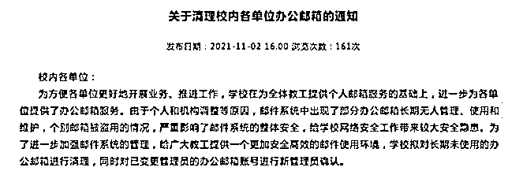

# 中科大发 4 万封“免费送月饼”钓鱼邮件给师生，网友：学校太会“整活”了...

> 原文：[`mp.weixin.qq.com/s?__biz=MzIyMDYwMTk0Mw==&mid=2247543633&idx=5&sn=cb862cb08bc48438b3356248a67881dd&chksm=97cbe069a0bc697f6c09425d195eb93fdec55f1e8149d4f138889418817a00b14083ade8660d&scene=27#wechat_redirect`](http://mp.weixin.qq.com/s?__biz=MzIyMDYwMTk0Mw==&mid=2247543633&idx=5&sn=cb862cb08bc48438b3356248a67881dd&chksm=97cbe069a0bc697f6c09425d195eb93fdec55f1e8149d4f138889418817a00b14083ade8660d&scene=27#wechat_redirect)

关注小号，谨防失联！

临近中秋节，多所高校推出中秋月饼。 

比如每年中秋节，中国科技大学制作的特色月饼都会成为“抢手货”，有时候还买不

到。

传说吃了不挂科

如果这时候收到一封学校发的**点击免费送月饼**邮件，谁会不心动呢？ 

**学校发 4 万多封钓鱼邮件** 

**只为这个**

近日有中国科学技术大学学生在社交媒体发帖称，**收到了学校发的****“中秋免费月饼领取” 的邮件，但填写资料后却没有领到月饼，反倒把自己信息泄露了......**

据上游新闻消息，9 月 8 日上午，中科大网络信息中心程老师表示，**这其实是一次官方“整活”，是“全校首次钓鱼邮件演练。”**

程老师表示：“最近国家网络安全宣传周在合肥举行，我们学校希望借此机会用一种新的方式推广网络安全知识，提高反诈意识，于是选择进行了全校首次钓鱼邮件演练。”

都说“官方整活最为致命”，一名 9 月 7 日收到了钓鱼邮件的中科大学生告诉记者：**“这个邮件一看就是非常了解学校业务，知道中秋节期间一饼难求，所以选择了免费送月饼这个点，果然不少同学中招。”**

据程老师透露：“9 月 7 日下午 5 点半，我们利用大家刚放学思想比较松懈的机会，在一个小时发送了 4 万多封邮件，这些邮件全部针对中科大校内的师生，其中学生有 3 万多人，教职工有 6000 多人。结果中招的人并不少，晚上 6 点半-7 点半的时候，钓鱼网站的访问人数高达 8000 人次，**大大超过了我们的预期**。”

中科大学生小杨（化名）因为没有甄别邮件是否存在钓鱼风险，认真填写了相关资料，结果不幸“中招”，访问了钓鱼页面：“你中‘奖’了，这是由学校开展的钓鱼邮件演练，我们非常不幸地通知您：由于您在本次演练中未能第一时间识别出钓鱼邮件，因此来到了这个页面……”事后他也把这段经历发到了小红书上。

中招”后的页面

后根据学校发的钓鱼邮件复盘：

本次活动模拟黑客向全校师生发送钓鱼邮件，邮件主题为“中秋免费月饼领取”，以免费赠送月饼礼盒为由，诱导用户点击校外链接，在伪造的统一身份认证页面输入个人信息。

此次演练共向全校师生发送模拟钓鱼邮件 45000 余封（其中学生 38000 余封，教工 6000 余封），截止 2022 年 9 月 8 日上午，**共有 3500 余人在伪造的统一身份认证界面提交了信息(其中学生 3100 余人，教工 400 余人)。**

本次钓鱼邮件演练中，我们精心设计了几个常见的钓鱼“漏洞”：

 1.仿冒的发件人地址：“vstc.edu.cn” ；
2.不存在的科大部门：“中科大邮箱管理中心”；
3.伪造的统一身份认证登录页面：非科大域名；
4.错误的联系电话：非 6360 开头。

 对于在本次演习中输入了真实用户信息的师生，我们欢迎您于本月 19 日之后前往东校区、西校区和高新园区的一卡通服务部，**领取网络安全宣传手册。**

 此次演练旨在提升师生的网络安全意识。演练不会记录您的密码，不会对您的系统和设备造成影响。

 为持续提升广大师生的反诈骗能力，今后我校将会不定期开展钓鱼邮件演练。学习更多钓鱼邮件防护技巧，请关注中国科学技术大学网络信息服务公众号。

**还有学生反攻了钓鱼服务器**

虽然中招的师生不少，但也有人保持了清醒，部分清醒学生的应对措施让程老师都直呼内行：“我们在后台看到，部分学生提交了虚假信息，说明他们有了防范意识；**还有学生对我们的钓鱼网站进行了 DDOS 攻击，他们还在 QQ 群分享说免费的靶场来了，不打白不打，当时一度把钓鱼网站整瘫痪了**。不过在这次演练之前，我们向清华大学取经时，他们就提示了肯定会有学生会攻击，因此我们也做了防范措施，所以最后并未造成服务器的损失。”

为了避免钓鱼邮件演练变成“狼来了”，让学校的师生对官方发布的邮件失去信任，程老师表示他们对方案进行了调整，留下了很多“马脚”：“其实我们最初是考虑用提示电脑发现挖矿行为的通知邮件，可这么做可能未来遇到有电脑被劫持挖矿，使用的师生还不信提示了，所以改成了更宽泛的“送月饼”。

其实如果足够细心，是可以看出很多‘马脚’的，首先中科大的邮箱缩写是 USTC，我们的邮箱缩写是 VSTC；中科大邮件管理中心是个虚构部门；最后邮件联系电话 0551-36309527 也是假的，中科大的电话都是 6360 开头的。”

由于本次的钓鱼邮件演练效果很棒，程老师表示下一步的演练计划也在筹划当中：“这次主要针对的是全体师生，后面我们会不定期针对不同人群进行钓鱼邮件演练，提高全校的网络安全防范意识。”

**校园邮箱反诈很重要** 

**不少高校都曾搞过“钓鱼执法”**

前不久，西北工业大学发布《公开声明》称，**该校遭受境外网络攻击。已经查实为美国国家安全局（NSA）“特定入侵行动办公室”所为。**

近年里，美国 NSA 下属 TAO 对中国国内的网络目标实施了上万次的恶意网络攻击，控制了数以万计的网络设备（网络服务器、上网终端、网络交换机、电话交换机、路由器、防火墙等），窃取了超过 140GB 的高价值数据。

因此，像中科大这样通过钓鱼邮件来提高师生反诈意识，就显得尤为重要。 

**大多数科研人都习惯使用校园邮箱来发送学术邮件、投稿、进行学术交流。** 

但在互联网上随便搜搜相关关键词「邮箱 泄密 通知」，可以看到很多大学和政府机构发过有关邮箱的通告，内容一般会包括「接上级 xx 部门通知，近期发现我国大量某重要机关电子邮箱遭渗透攻击，存在失泄密风险」。 

图片来源：吉林大学

如果不提高反诈意识，往小了说会泄露个人信息，往大了说如果校园邮箱被盗用对外大量发送垃圾邮件，会被国际反垃圾邮件机构列入黑名单，影响在校同学、老师的正常对外学术交流，更严重会泄露一些机密。

所以不少高校都会通过一些“钓鱼执法”演练，来让大家提高安全意识。

据知乎答主@钱同学好困表示，自己本来觉得校园邮箱不会收到诈骗邮件之类，但也真的收到过。

当时自己第一反应就是点进去链接修改密码，后来在学校的官微上看到，这也是学校的一次“整活”。 

而这次，有将近快一半的人都提交了账户密码信息，可见诈骗邮件的威力。

网络安全防不胜防，提高反诈意识，还得从不起眼的小事做起啊。

最后，这个吃了不挂科的中科大月饼，到底哪里还能买到啊？

来源：募格学术整理自上游新闻记者 赵映骥 实习生 彭星/文、知乎、募格学术此前报道等

欢迎关注灰产圈社群服务号

