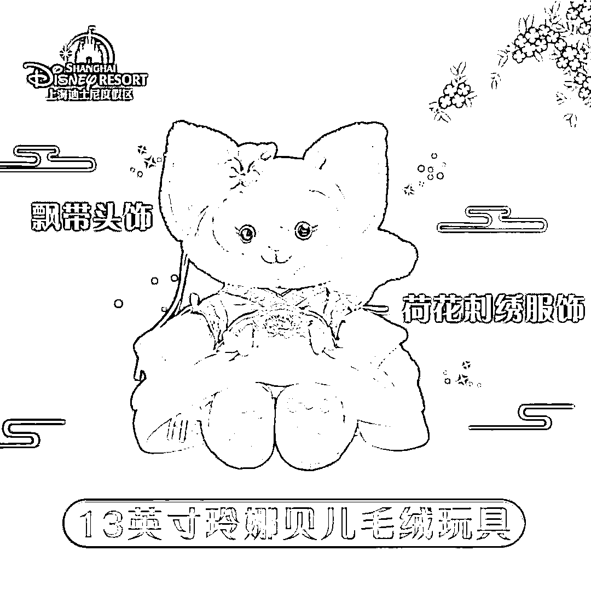

# “人红是非多”！玲娜贝儿又上热搜，“中秋汉服”竟是丧服？业内：严格来说不算汉服

> 原文：[`mp.weixin.qq.com/s?__biz=MzIyMDYwMTk0Mw==&mid=2247543633&idx=6&sn=7ca3d56e8306ba2bb5c052526e6479c0&chksm=97cbe069a0bc697fa822102474b58924bd7d126a57e53a223e70112b81ea8a4a49426c7a5f23&scene=27#wechat_redirect`](http://mp.weixin.qq.com/s?__biz=MzIyMDYwMTk0Mw==&mid=2247543633&idx=6&sn=7ca3d56e8306ba2bb5c052526e6479c0&chksm=97cbe069a0bc697fa822102474b58924bd7d126a57e53a223e70112b81ea8a4a49426c7a5f23&scene=27#wechat_redirect)

关注小号，谨防失联！

“上迪女明星”玲娜贝儿， 

又上热搜了，

**这次是因为一件衣服，**

近日，

上海迪士尼乐园为玲娜贝儿， 

推出了**中秋限定款毛绒玩具，**

**官方旗舰店的商品图显示，** 

**玲娜贝儿身着**“荷花刺绣服饰”，****

****前襟左掩，**** 

****系**“左****衽”**设计，****

****疑似传统服饰中的“丧服”形制，****

****引发了争议。****

********

********

****（玲娜贝儿玩偶商品图，来源：上海迪士尼乐园官方旗舰店）****

# ******“左衽”引争议******

****“左衽”“右衽”，****

****指的是衣领的朝向，****

******前襟左掩，就叫“左衽”。******

****无论是古代还是现代，**** 

****“右衽”的穿法更为常见、普遍。****

********

****（明代容像） 图片来源：央视网****

****从这批中秋限定商品的实物来看，**** 

******毛绒玩具款的玲娜贝儿，****** 

******穿着“左衽”服饰，******

****而同系列钥匙扣款的玲娜贝儿，**** 

****服饰则是正常的“右衽”。****

********

****商品发售后，**** 

****立刻有网友指出，****

****玲娜贝儿**“穿错了”。******

******依照汉族的传统，****** 

********死者的衣服才是“左衽”，********

********而平时穿着汉服，********

********正常应该是“右衽”，********

******这是由传统服饰的形制决定的。******

# ********“左衽”真是死人穿的吗？********

******据相关论文资料介绍，****** 

******左衽与右衽是在服饰发展之初, ******

******人们为了方便自己所从事的活动，******

******而形成了不同朝向。******

********为了右手方便活动，********

********中原地区以右衽者居多；********

******而游牧民族穿左衽,******

******是为了骑射便利。******

************

******（孔子博物馆展出的仿文物交领汉服，为右衽） 图片来源：央视网******

******说左衽是丧葬服饰，******

******多是依据一些文献典籍，******

******例如《礼记·丧大记》中的这句：******

********小敛大敛，祭服不倒，皆左衽，结绞不纽。********

******也有一种说法，****** 

******认为左衽是古时少数民族的穿法，******

******《中国服饰史》一书中，******

********提到过“左衽”是北方少数民族，********

********和西域胡人的衣服款式，********

******与汉族的“右衽”习惯不同。******

******随着时代的发展和民族间的交流，****** 

******“左衽”也曾小范围流行过，****** 

******在一些古画里，****** 

******还能见到它的影子。******

************

******（明代容像）图片来源：央视网******

******业内一名汉服爱好者告诉记者，******

******日常穿着一般都是“右衽”，******

******玲娜贝儿身上这件，****** 

********严格来说也并不算汉服，******** 

********充其量也就是件带“汉元素”的服饰，********

******但“左衽”的穿法，******

******确实不太符合普遍的穿着习惯。******

# ********玩偶也会“人红是非多”********

******自面世以来，******

******玲娜贝儿凭借甜美的外形，******

******和大大咧咧的性格，******

******迅速走红成为“一线女明星”。******

******此次新衣服引起争议，****** 

******有的网友表示不理解，******

******只是一个毛绒玩具，******

********何必针对它上纲上线。********

********************

******也有人认为，******

******作为“文化商品”，******

******其背后站着一批专业的设计团队，******

********一定要对消费者更负责任，********

********拿出更严谨的作品。********

******对此，你怎么看？******

******评论区聊聊↓↓↓******

******来源：每日经济新闻，央视网，极目新闻，潇湘晨报******

************

******欢迎关注灰产圈社群服务号******

************

************