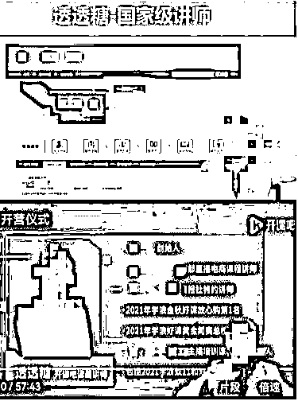
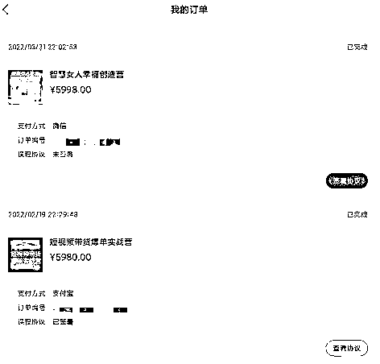
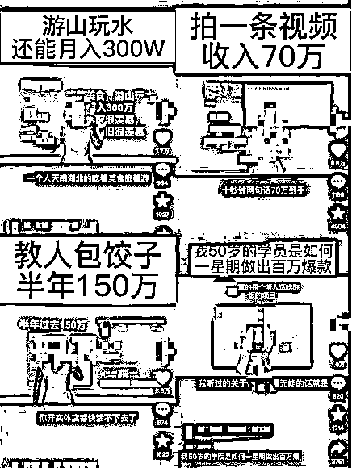

# 副业变负债？短视频培训课程被指“割韭菜”

> 原文：[`mp.weixin.qq.com/s?__biz=MzIyMDYwMTk0Mw==&mid=2247543661&idx=2&sn=997286a51dfb17a8b53c30af4258d99d&chksm=97cbe055a0bc6943ee9a15b478d4a0eed7491539ef0afb987ecaae3574af47ac60a158750a5e&scene=27#wechat_redirect`](http://mp.weixin.qq.com/s?__biz=MzIyMDYwMTk0Mw==&mid=2247543661&idx=2&sn=997286a51dfb17a8b53c30af4258d99d&chksm=97cbe055a0bc6943ee9a15b478d4a0eed7491539ef0afb987ecaae3574af47ac60a158750a5e&scene=27#wechat_redirect)

“有手就能做”“不做就是傻”“早做副业，早赚钱”……致富论、成功学、创业经的视频内容在各大短视频平台悄然兴起，讲授这些内容的主播们被“粉丝”称为“老师”。“有钱”“有赚钱经验”是他们的共同特征，而一旦成为爆款，直播、卖课、开线下私董会，走上“变现之路”成为他们的共同选择。

“短视频带货”“打造个人 IP”“流量变现”，在这群“知识主播”的口中，借助短视频赚钱成为新的风口。他们的课程多以教人如何在短视频平台赚钱为目标，课程费用少则几十元，多则上万元。不少人开始涌动，部分买了课的人感觉自己成了“韭菜”，质疑和争议随之而来。

“教你赚钱的都是赚你钱的”，有人在网上分享“被割”心得，有人开始劝退想要买课入坑的网友，也有人正到处投诉和维权，要求退款。

**“有手就能做”**

“听完那场直播课，我极度焦虑。”李欣然回忆称，在年初那场 1 元直播课里，自称抖音知识付费赛道变现第一的主播“透透糖”分析了多个“网红”账号的成功案例，“都是普通人怎么通过短视频赚钱，比如宝妈怎么干，养狗的又怎么干，有的月入 30 万，有的能赚 100 万。”

在这名主播的口中，短视频带货是“有手就能做”“投入小，机会大，回报高，又轻松又没有风险”的副业。李欣然像打了鸡血一样，“感觉人家都能做，我也能做。”

接着是课程的推销。由主播“透透糖”和在线职业教育平台开课吧独家合作的短视频带货课程原价 9980 元，当晚的前 50 名付款者可获得平台 4000 元奖学金补助。“如果还觉得有压力，给大家申请了分期免息，利息开课吧来补贴。”在学员录下的一段直播视频中，主播卖力讲解着，不时抛出各种优惠和承诺，包括 7 天无理由退款，为每位学员配备“陪跑老师”、一对一辅导等。

更让李欣然等一众学员抱持着“信任”的是，这名主播自称为“国家级讲师”。在相关宣传页面上，“透透糖”的头衔包括某部委直播电商课程讲师、某报社特约讲师和某广电主播培训课程内容负责人等。

主播在售课中自称“国家级讲师”。受访者供图

自嘲“没抵住诱惑”的李欣然最终花了 5980 元成为“透透糖”“短视频带货爆单实战营”的一员。那段时间，她白天上班、带孩子，晚上上课，还要学着拍视频，发视频，常常折腾到凌晨一点，“发了一二十个视频，没有什么播放量，一件也没卖出去。”

李欣然提供的协议内容显示，课程分为录播课和直播互动答疑课，“录播课是透透糖，直播课不是她本人。”

“课程大部分还是讲解别人的成功案例，没有什么实操课。”她几次找到“陪跑老师”，希望对方给予指导，回复总是延迟。“上午发，晚上回（复），晚上发，第二天回，也只是让我继续发。”课程的内容和质量都让李欣然觉得“不值”，有种被“欺骗和忽悠”的感觉。

**“把我屏蔽了”**

对课程的不满很快蔓延开来，李欣然发现，越来越多的学员开始网上投诉，要求退款，她也加入其中。

在某投诉平台以“透透糖”为关键词，共有 800 余条结果，内容多指向其“打着国家级讲师的旗号虚假宣传”“退款难”“诱导贷款买课”等问题，而其合作平台开课吧的投诉结果则达到了上万条。

一名经营实体店的学员告诉记者，其做了十多年的线下生意，本想通过学习这门课程将线上生意也做起来，没想到“踩了大坑”，“课程对我们没有任何用处，承诺的补光灯也没有发货。”听了一节课后，这名学员寻求退款，不料被“陪跑”老师删除微信。看到有人在“透透糖”的直播下留言称“我上头了，我要报课”，她回复道“报了更上头，骗了多少人 5980”，留言很快被删除，再点进主播的短视频账号，已无法看到相关视频作品，“把我屏蔽了。”

就主播“透透糖”相关身份问题，记者电话咨询了所涉报社和广电的工作人员，对方均回复称未授权过该主播相关身份。

在相关投诉中，还有学员称其不仅买了“透透糖”短视频带货课程，还购买了其另一门名为“智慧女人幸福创造营”的课程，售价 5998 元，收款方同样为开课吧。在宣传海报上，这名主播的身份也从“国家级讲师”变成了“两性情感专家”。

王婷购买课程订单截图。受访者供图

“（智慧女人课程）我一秒钟没听。”付完款的第二天，王婷就后悔了，“短视频（课程）我都花了快 6000 块，也没做出个什么来，听完了这个课，我就能幸福了吗？”冷静下来后，王婷甚至没来得及签订课程协议，就赶紧申请了退款，客服称需要等待 30 个工作日，此后客服称已经安排了退款，但还需要等待。从 4 月等到 7 月，直到开课吧传出“裁员”、“欠薪”、被学员维权等消息，王婷意识到，这笔学费可能很难要回来了。

在人民网“领导留言板”，针对网友反映的开课吧退费问题，北京市海淀区人力社保局回复称，网友反映的问题属于预付式消费，警方已介入开课吧问题。已无法通过行政调解解决消费者问题，建议消费者向公安机关报案或通过司法程序维权。

**“从负到亿”？**

主播能否自称“专家”？今年 6 月，国家广播电视总局、文化和旅游部联合发布的《网络主播行为规范》明确要求，对于需要较高专业水平（如医疗卫生、财经金融、法律、教育）的直播内容，主播应取得相应执业资质，并向直播平台进行执业资质报备，直播平台应对主播进行资质审核及备案。

“既然自称专家或学者，起码需要一些权威部门或主管部门颁发的资质和证书去证明身份，否则平台不应该允许这些主播对外宣称有这种名号和头衔。”上海申伦律师事务所律师夏海龙告诉记者，目前的监管偏向严格，对《行为规范》中的条款倾向于从严解释，这类售卖短视频带货课程的主播也可归到“教育”类。

“我 50 岁的学员是如何一星期做出百万爆款”“几个姑娘直播跳操月入 2000 万”“游山玩水还能月入 300 万”教人包饺子半年 150 万” “为什么他能赚到这个钱你不能呢”……“透透糖”在抖音平台的粉丝近百万，据其在短视频中介绍，该账号从去年 4 月开始做，至今粉丝近百万，其发布的短视频内容大多为教人如何赚钱、分析其他“网红”账号如何成为爆款，以及普通人如何通过短视频变现。

就学员对“透透糖”“国家级讲师”等身份的质疑以及课程质量、退款等问题，记者联系该主播未果。

短视频主题多为“教人赚钱”。截图

“教人赚钱”少不了首先要证明自己是“有钱人”，以及自我包装一番，讲述自己的成功故事。短视频中，“透透糖”自称“富婆”，身边也都是“又潇洒又独立的富婆”，而这也是不少知识付费博主惯用的方式。开课吧另一名售卖短视频变现课程的主播“大蓝”，抖音个人认证为“财经自媒体”，自称“白手起家，三次破产东山再起”“有丰富的从身无分文快速搞到 100 万的经验”“分享从负到亿的财富真相”，更是直接在其短视频中表示“搞培训割韭菜”。

针对“知识博主”“创业导师”的争议一直未停止过。有学员买过课程后自认被“割韭菜”，开始发布相关“揭秘”短视频。有主播同行称课程被抄袭，发视频维权。还有主播同行更是公开喊话“提高课程质量”“别再割韭菜”，掀起骂战，而这些在不少网友看来也是为了“红”，为了“流量”。

**“入行有门槛”**

回想起年初花 1 块钱听的那堂课，李欣然依然记得那种脑子嗡嗡的感觉，“整个就像洗脑一样。”

主播那种强大的气场、自信的状态以及各种承诺和爆款案例，让李欣然觉得短视频带货“很简单易上手”，适合作为一份副业发展。主播分享的宝妈成功案例更是精准地抓住了李欣然的心理，“看人家宝妈那么能干，讲得我一度焦虑，她还说这钱是白捡的。”

在行业资深从业者李想看来，不管做短视频带货还是直播带货，都是有门槛的，“看似很低，其实蛮高的。”

他表示，如果纯粹是个人做主播，不仅需要拍摄、剪辑的能力，还要具备文案撰写和选品能力。此外还需要针对用户和粉丝的运营能力。“有些同行老师会故意掩盖学习难度，让普通人认为这是一件超级容易的事情。”李想称，如果不是有相关行业从业背景，或者很强的执行力并且坚持学习持续输出的话，大部分人很难做起来。

干了十多年实体生意的王婷去年离开传统行业后，如今的线上生意正有起色。“现在回过头去看买过的那些上万元课程，其实踩了很多坑，绕了很多弯路。”

在王婷看来，不少知识主播的课程其实在打信息差，“尤其是刚上路的小白什么都不懂”，她告诉记者，开启线上店铺后才知道平台官方都有相应的免费课程，而且课程内容都是最新的，“比那些老师的（课程内容）还新。”

对于如今短视频培训行业引发的争议问题，李想认为，行业内相关培训师的背景和资质参差不齐是乱象频生的原因之一。“这行里很多所谓的‘老师’可能去年还是做微商、做美业、搞营销的，摇身一变成为新媒体导师。大家一跟风，发现什么方式（对招生）有效就会怎么做。”

至于外界质疑的是否有“坑蒙拐骗”的情况，李想坦承，对于从业者而言，如果不夸大宣传，甚至没有存活的可能。“用户喜欢看一些刺激的、冲突性强的内容。”他说，不这么做很难被推荐，很难获得流量，招不到生。

李想提醒想要进入这行的人不要抱有不太现实的幻想，“确实有人做短视频挣了钱，但这些人要么足够努力、付出得足够多，要么天生具备得天独厚的条件。身为一个普通人，如果啥也没有，只是看到人家爆量了，也想爆量，不现实。”

（文中李欣然、王婷、李想为化名） 责编：郭思邈 来源：人民网

欢迎关注灰产圈社群服务号

