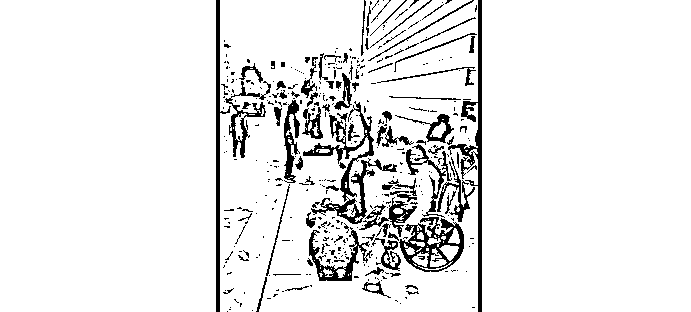
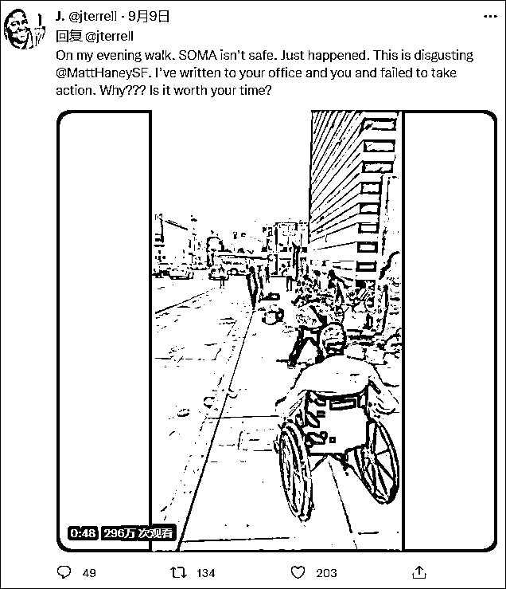
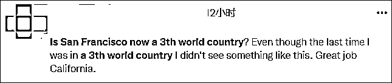
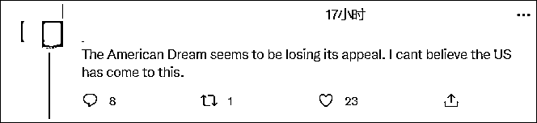
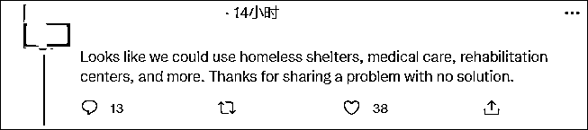
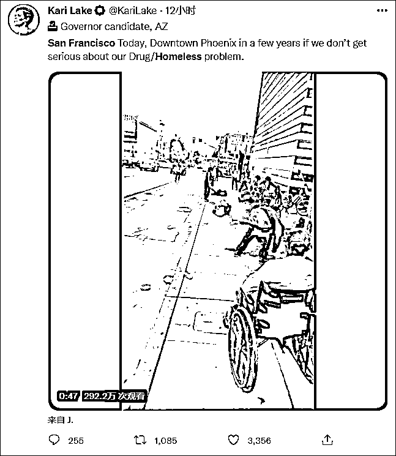
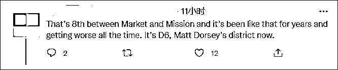
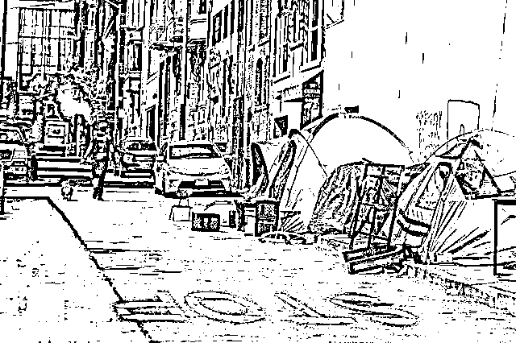
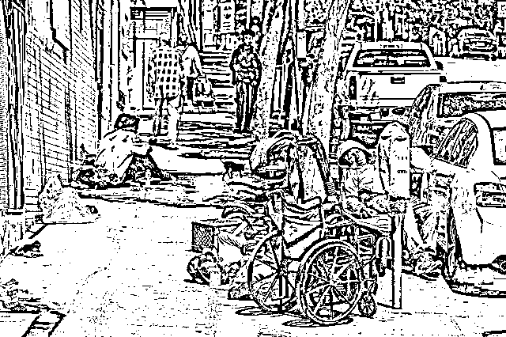

# "不敢相信这是美国"

> 原文：[`mp.weixin.qq.com/s?__biz=MzIyMDYwMTk0Mw==&mid=2247543661&idx=4&sn=31fd7dfd9a1aa116deb6ab0d18308439&chksm=97cbe055a0bc694397171398707eebb1493bb324c616cf6c9297b9db0e6d59b1c4803f7a2ac9&scene=27#wechat_redirect`](http://mp.weixin.qq.com/s?__biz=MzIyMDYwMTk0Mw==&mid=2247543661&idx=4&sn=31fd7dfd9a1aa116deb6ab0d18308439&chksm=97cbe055a0bc694397171398707eebb1493bb324c616cf6c9297b9db0e6d59b1c4803f7a2ac9&scene=27#wechat_redirect)

据《纽约邮报》当地时间 9 月 9 日报道，一段旧金山街头无家可归者斗殴的视频近日在推特热传，播放量逼近 300 万次。

许多美国网民被这一幕震惊，“旧金山现在是第三世界国家了吗？”“无法相信美国到了这种地步”；还有人无奈地说道：“这是一个没办法解决的问题”。

发布这条视频的推特博主名为 J·特雷尔·艾伦（J·Terrell Allen)），根据其个人简介，他是一名畅销书作家，还开发了一个名为“bookworm”的读书 APP。

<mpvideosnap class="js_uneditable custom_select_card channels_iframe videosnap_video_iframe" data-pluginname="videosnap" data-id="export/UzFfAgtgekIEAQAAAAAAOFgEyCuqPgAAAAstQy6ubaLX4KHWvLEZgBPEjIF8JAJiCqyCzNPgMIsVZeAyhbRfgcjvWR2bHevE" data-url="https://findermp.video.qq.com/251/20304/stodownload?encfilekey=S7s6ianIic0ia4PicKJSfB8EjyjpQibPUAXolaLoVatMKseNib055kibVe6vCcYhdQzRsoTUeKAJA89729BEYwOg497Jrv1GQp22Kwz2IoGYoa9aU07OhXLibHibuTA&amp;adaptivelytrans=0&amp;bizid=1023&amp;dotrans=0&amp;hy=SH&amp;idx=1&amp;m=&amp;scene=0&amp;token=AxricY7RBHdX8vw9YjankVCq5agtEM8YQXnwzSE1AHNvmo6J0Bza65xNKvYh9OGN3YUfswCl7Fh8" data-headimgurl="http://wx.qlogo.cn/finderhead/PiajxSqBRaELjPqKX11THZj9d5iaXIWAknNsYiaNsUvgVcpPSQ5Qa96FQ/0" data-username="v2_060000231003b20faec8cae1801dc2dcc901ee32b077ada7c9065f618b976be38be443e5e01a@finder" data-nickname="小凡好摄" data-desc="美媒标题：无家可归者在旧金山街头的肮脏条件下战斗" data-nonceid="18327431256396414073" data-type="video" data-width="800" data-height="1280"></mpvideosnap>该视频号动态不可引用

当地时间 9 月 8 日，他在推特上发布了一条视频，分享了自己傍晚散步时在旧金山索玛（SOMA）社区看到的一幕。

视频中，一群无家可归者聚集在人行街道上，地上满是垃圾。两名男子在街上扭打着，其中一人还赤裸上身，旁边还有一个身穿白色卫衣的男子拿着扫帚殴打其中一名打架者。

旁边的人似乎对这一幕见怪不怪。有人神志不清，裤子掉到膝盖处也不知道提；一名流浪汉在忙着捡垃圾，他把一双鞋放进了自己的袋子里；两名坐在轮椅上的男子停在稍远处，前方的流浪汉挡住了他们的去路；还有一只狗在不停的叫唤，两名围观者死死地拽着它的牵绳。

特雷尔·艾伦配文道：“索玛社区不安全了。（这一幕）就这样发生了。太恶心了。”

他还艾特了旧金山众议员马特·哈尼（Matt Haney），说道：“我已经给你的办公室和你本人写了信，但是你没有采取任何行动。为什么？这不值得你花时间吗？”

特雷尔·艾伦接着再发了一条推特，他继续艾特马特·哈尼，并用讽刺的语气说道：“我喜欢在我的街区里散步，我每天都会路过这里。我喜欢可卡因和大便的味道。美丽的旧金山。”

截至目前，旧金山众议员马特·哈尼（Matt Haney）对此事没有任何回应。

这条视频在推特上广泛传播，播放量目前已经高达近 300 万次。

特雷尔·艾伦推特截图

有网民评论道：“旧金山现在是第三世界国家了吗？我上次去第三世界国家时，都没有看到这样的事。”

“美国梦看起来已经失去了它的吸引力。我不敢相信美国走到了这一步。”

还有人无奈地说道：“我很抱歉让你面对这些，我对那些可以帮助这些人的当权者已经尖叫得精疲力尽了。”

“看来我们需要建设无家可归者收容所、医疗中心、康复中心等等。谢谢你分享了一个没有办法解决的问题。”

亚利桑那州州长候选人卡莉·莱克（Kari Lake）也转发了这条视频，她说道：“如果我们不认真对待毒品和无家可归者的问题，今天的旧金山就是几年后的凤凰城。”

一位旧金山当地居民评论道：“在市场街和 Misson 街之间的第 8 街已经这样好多年了，而且情况越来越差。”

据观察者网此前报道，第 8 街和 Mission 街是旧金山市的主干道，这条街上满是流浪汉和吸毒者。更令人担忧的是，当地的孩子们每天下学回家时，都要经过这条街道。

此外，旧金山的市政厅附近也满是无家可归者，他们的帐篷和家当摆满了街道。

当地时间 2022 年 8 月 29 日，美国旧金山，市政厅附近无家可归的人  图源：IC photo

这些游荡在街上的无家可归者已经成为了旧金山难以解决的顽疾。据《旧金山纪事报》8 月 19 日报道，根据 2020 年的人口普查数据，旧金山市的人口超过 80 万。到今年年底，旧金山露宿街头的无家可归者将超过 2 万人。

来源：观察者网

欢迎关注灰产圈社群服务号

