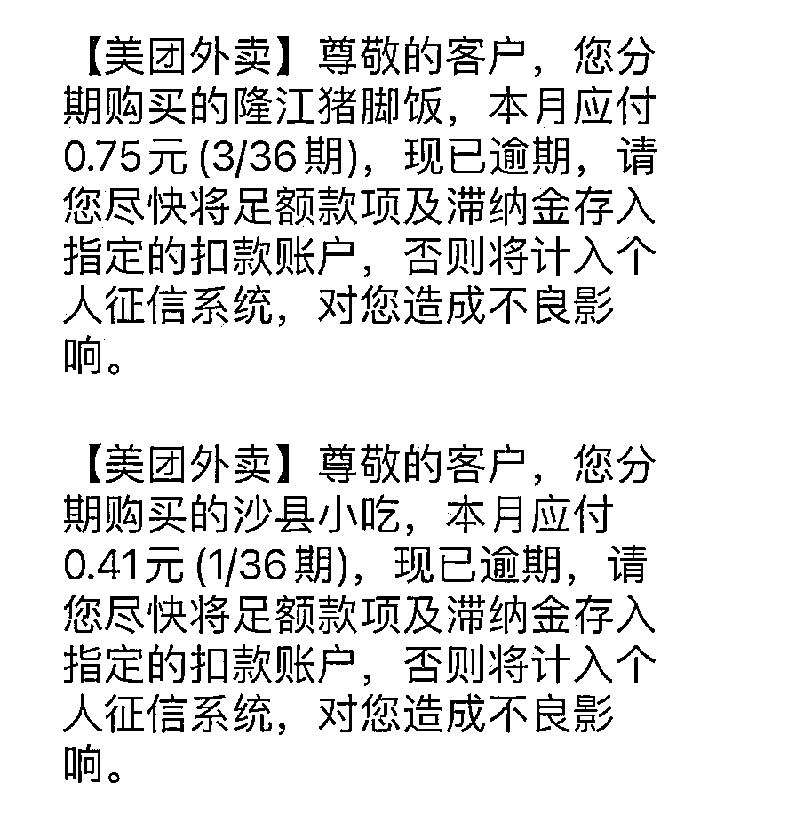

# 200 元电视机买家秀刷爆热搜，原来有那么多人买，几十万的成交量…

> 原文：[`mp.weixin.qq.com/s?__biz=MzIyMDYwMTk0Mw==&mid=2247543661&idx=5&sn=c954a22461b365638d89ea992a098412&chksm=97cbe055a0bc6943d0d332d1eba9335f8af066e31d8532d5d6da4827e365e593bd844fe32771&scene=27#wechat_redirect`](http://mp.weixin.qq.com/s?__biz=MzIyMDYwMTk0Mw==&mid=2247543661&idx=5&sn=c954a22461b365638d89ea992a098412&chksm=97cbe055a0bc6943d0d332d1eba9335f8af066e31d8532d5d6da4827e365e593bd844fe32771&scene=27#wechat_redirect)

这几天有个话题还蛮火的：**被 200 元电视的买家秀整破防了。**

拼夕夕上，100~200 元价位的电视机竟然有几十万的销量……

点开一看，买家秀里的环境几乎全是这样的……

甚至还是 4：3 的屏。

网友感慨：这才是大多数人的生活吧。

喜庆的标识已经斑驳，床上躺满了各种药……

有人说 200 的电视真的能用吗，有人说希望 200 的电视能撑得久一点。

也有人觉得清贫和不整洁是有区别的吧，可是……整洁意味着要付出时间和精力，当人被生活所累的时候，这恰恰是最宝贵的……

抖音上也有网友发图并配文：

**“如果觉得生活过得苦，就去搜搜拼夕夕 200 元液晶电视，看看那些买家秀。如果不是为了返现几块钱，谁会把自己的家晒出来。”**

看多了互联网上动辄年收百万的生活，人们渐渐忘了多数底层普通人的生活……

据国家统计局公布的数据，**2022 年上半年的平均每月可支配收入为 3077 元。**

不要忘记现实：中国有一半人月收入 1000 以下。

这才是人间啊。

评论里果然有专家的这句“谁家没 50 万呢。”

不禁想到前段时间的**分期段子：**

从雅迪电动车分期到猪脚饭、沙县小吃分期、冰红茶分期，再到白粥分期。

那时以为是博人一笑的段子，但笑完了才渐渐意识到，可能真的有人需要这样的分期……

来源：脊梁 in 上海 SH

欢迎关注灰产圈社群服务号

