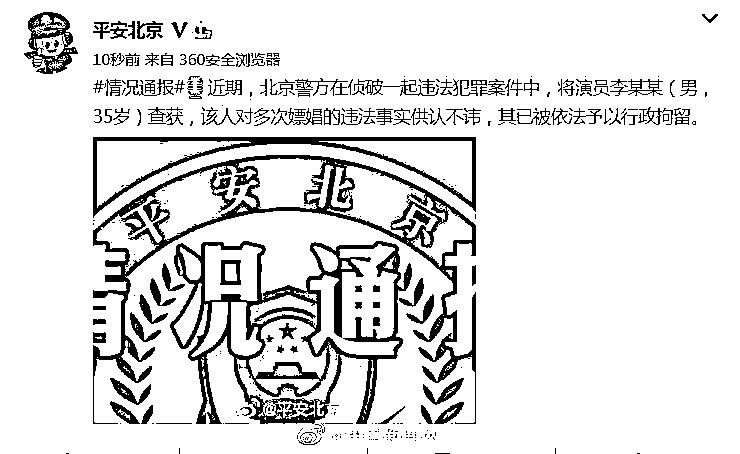
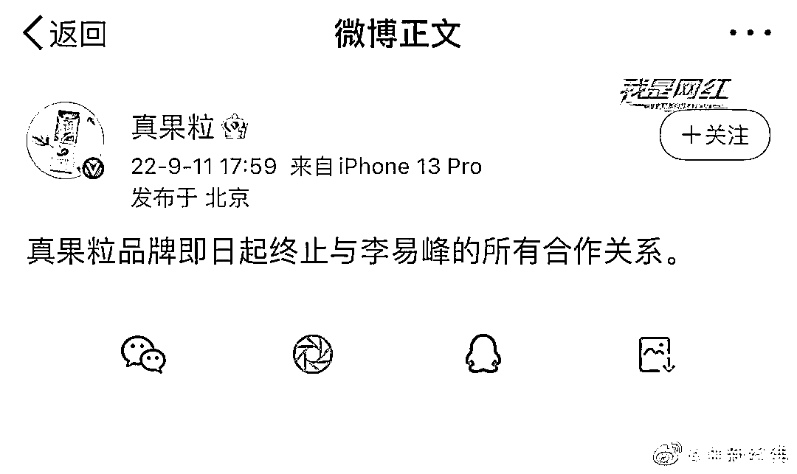
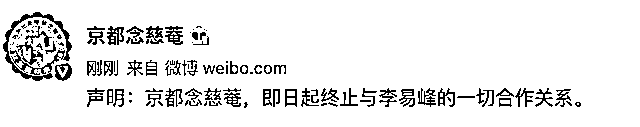
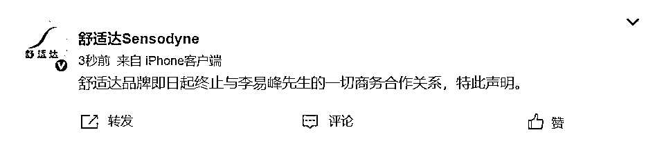
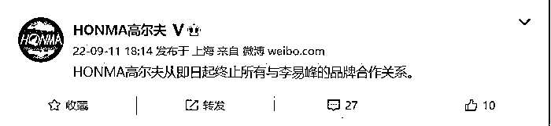
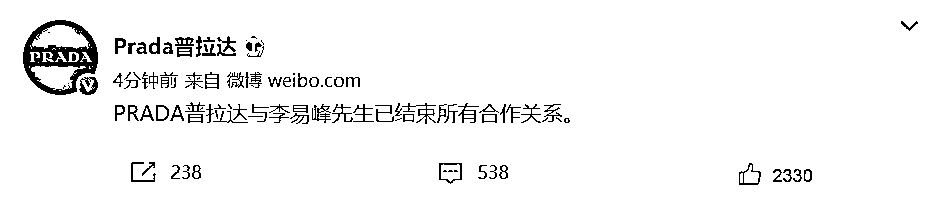
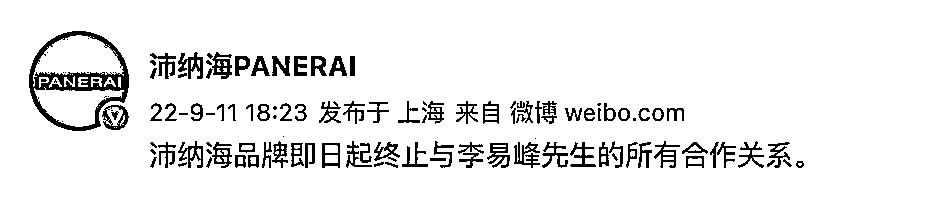
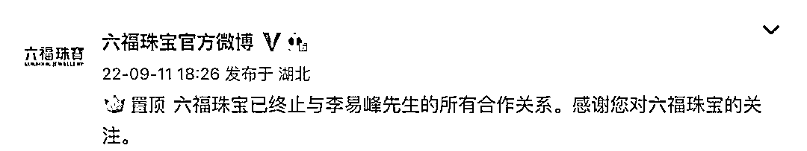
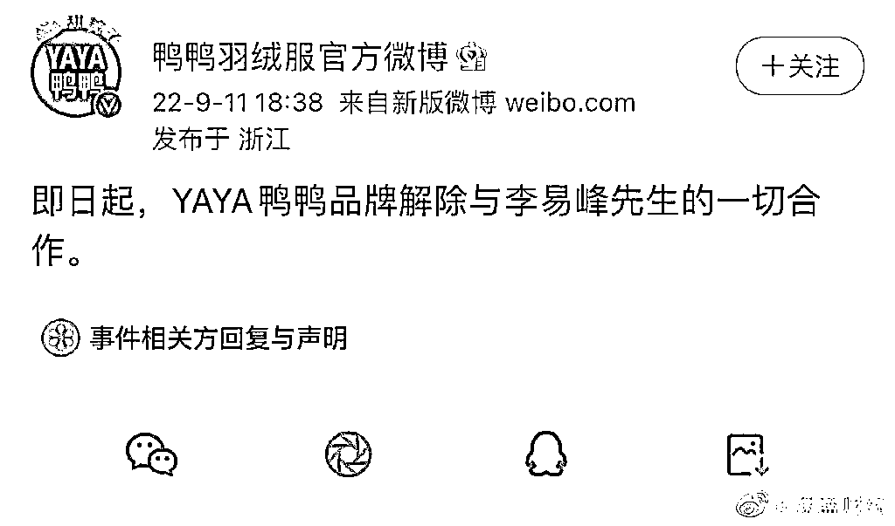
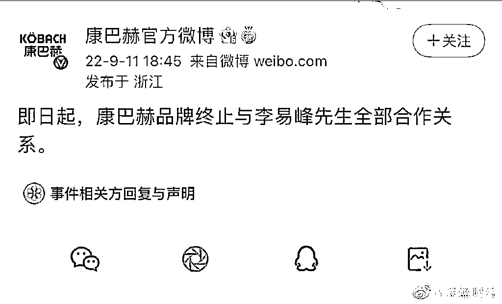

# 多个品牌终止与李易峰合作！

> 原文：[`mp.weixin.qq.com/s?__biz=MzIyMDYwMTk0Mw==&mid=2247543708&idx=2&sn=4b75bef70a1c4faffbecc1dc6114e17d&chksm=97cbe0a4a0bc69b213db3d5b3d5ff0cbbd2b0a9e1e6cbf40c3d589ac2fce70e1a981381327bb&scene=27#wechat_redirect`](http://mp.weixin.qq.com/s?__biz=MzIyMDYwMTk0Mw==&mid=2247543708&idx=2&sn=4b75bef70a1c4faffbecc1dc6114e17d&chksm=97cbe0a4a0bc69b213db3d5b3d5ff0cbbd2b0a9e1e6cbf40c3d589ac2fce70e1a981381327bb&scene=27#wechat_redirect)

近期，北京警方在侦破一起违法犯罪案件中，将演员李某某（男，35 岁）查获，该人对多次嫖娼的违法事实供认不讳，其已被依法予以行政拘留。

经总台央视记者与相关部门核实，演员李某某系李易峰。

**多家品牌终止和李易峰合作关系**

消息出来后，多家品牌宣布与李易峰终止合作：

9 月 11 日晚，认证为内蒙古蒙牛乳业（集团）股份有限公司的@真果粒 发声明称，即日起终止和李易峰所有合作关系。

京都念慈菴也发布声明称，即日起终止与李易峰的一切合作关系。

舒适达品牌：即日起终止与李易峰先生的一切商务合作关系，特此声明。

HONMA 高尔夫官微宣布，即日起终止所有与李易峰的品牌合作关系。

普拉达微博宣布，PRADA 普拉达与李易峰先生已结束所有合作关系。

手表品牌沛纳海：即日起终止与李易峰先生的所有合作关系。

六福珠宝官微博表示，已终止与李易峰先生的所有合作关系。

鸭鸭羽绒服：解除与李易峰先生的一切合作。

康巴赫表示：终止与李易峰先生全部合作关系。

天眼查 App 显示，李易峰共关联 7 家企业，其中 4 家为存续状态，包括上海峰岩文化传媒中心、上海峰路文化传媒中心、上海李易峰影视文化工作室、东阳横店李易峰影视工作室，上述 4 家企业均为李易峰个人独资。

值得一提的是，李易峰 3 家注销状态的企业均注销于今年 3 月、4 月。其中，厦门市千艺晟博文化传媒工作室注销于 3 月 15 日，海南崇德里文化传播工作室、海南崇德里文化传媒合伙企业（有限合伙）于 4 月 12 日同一天注销。此前，李易峰曾投资影视公司欢瑞世纪，不过早于 2016 年退出。

**身为公众人物**

**一而再再而三触碰法律底线**

**除了震惊、唏嘘之外**

**这些法律问题必须了解！**

⬇️⬇️⬇️

**?**

****嫖娼如何处罚？****

**根据治安管理处罚法第六十六条第一款，卖淫、嫖娼的，处 10 日以上 15 日以下拘留，可以并处 5000 元以下罚款；情节较轻的，处 5 日以下拘留或者 500 元以下罚款。**

****?****

****认定嫖娼需要哪些证据？****

**认定嫖娼行为的证据通常包括言词证据和其他证据。**

**言词证据包括嫖娼和卖淫两方行为人的陈述以及办案民警的抓获记录，尤其是现场办案民警的证言。实务中，也经常出现行为人自称恋爱关系而否认卖淫嫖娼的情形，但办案人员可以通过事后分别询问等方式判断双方陈述的真实性。**

**其他证据则主要是指遗留在现场、证明发生了性关系的物证，以及证明存在金钱或财物交易的相关证据，如转账记录、聊天记录等。**

****?****

****哪些嫖娼行为可能构成犯罪？****

**我国刑法对于性交易主要打击的是卖淫一方的行为，在条文上专门设有“组织、强迫、引诱、容留、介绍卖淫罪”一节，对卖淫相关行为有严厉处罚。在我国，嫖娼行为通常不构成犯罪，但是实务中主要有以下情形，存在其他犯罪的可能：**

****第一，**根据刑法第三百六十条规定的传播性病罪，明知自己患有梅毒、淋病等严重性病卖淫、嫖娼的，处五年以下有期徒刑、拘役或者管制，并处罚金。**

****第二，**根据刑法第二百三十六条第一款，以暴力、胁迫或者其他手段强奸妇女的，处三年以上十年以下有期徒刑。尽管卖淫嫖娼是具备自愿性的钱色交易，但不能排除在过程中行为人存在违背妇女意志，使用暴力、胁迫、其他手段侵犯妇女性自主权的行为，则可能构成强奸罪。**

****第三，**根据刑法第二百三十六条第二款，奸淫不满十四周岁的幼女的，以强奸论，从重处罚。**

****第四，**根据刑法第三百零一条，聚众进行淫乱活动的，对首要分子或者多次参加的，处五年以下有期徒刑、拘役或者管制。引诱未成年人参加聚众淫乱活动的，依照前款的规定从重处罚。如果嫖娼行为涉及多人且有未成年人，则可能构成犯罪。**

****第五，**若行为人嫖娼后拒付嫖资，是否构成财产犯罪，则存在较大的理论争议，但我国民法典规定违反法律强制性规定以及违背公序良俗的民事法律行为无效，卖淫嫖娼缔结的“合同行为”自然无效。因此，在我国嫖资不受民法保护，司法实务中也尚未以财产犯罪追究拒付嫖资者的责任。**

****?****

****因嫖娼被行拘，****

****对以后会有什么影响？****

**首先，面对品牌方的解约，明星可能会面临赔偿问题。明星与品牌方双方是合同关系，单方解约需要合同的明确约定，对于约定不明的事项，应当根据合同法定解除情形进行解释。品牌方与明星签订代言合同，通常是看中明星的优质社会形象和社会评价，一旦明星的社会形象坍塌必然会对品牌方的商业利益造成影响，导致合同目的不能实现，品牌方有权单方解除合同，同时要求明星退还佣金、赔偿品牌方为此支付的合理费用与其他损失等。**

**其次，除了治安管理处罚法等法律规定外，对于嫖娼被拘留的人员，在相关行业要求、道德标准方面，也需要承担不良后果。例如，对于演艺人员而言，相较法律制裁，行业抵制及公众道德谴责带来的后果更为严**

**来源：新法治报综合新浪微博、央视新闻、红星新闻、法治日报 编辑：何山**

****

**欢迎关注灰产圈社群服务号**

****

****