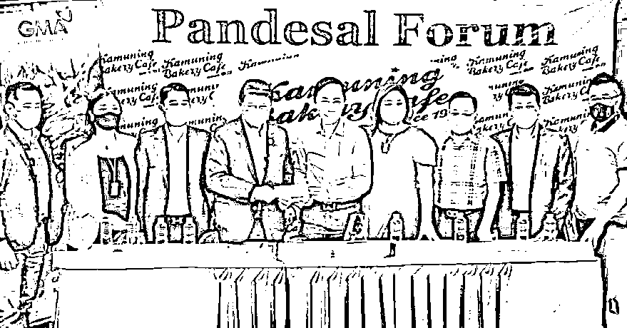

# 中国绑匪炮制人质视频曝光，惨绝人寰的景象让人不寒而栗！

> 原文：[`mp.weixin.qq.com/s?__biz=MzIyMDYwMTk0Mw==&mid=2247543708&idx=4&sn=5bd69ced9e3e80f186f0a8bb14acc6e0&chksm=97cbe0a4a0bc69b2e136e3e9e4542bc3f6adec51e4ef38b85e6dc928a7b4560250666768fbed&scene=27#wechat_redirect`](http://mp.weixin.qq.com/s?__biz=MzIyMDYwMTk0Mw==&mid=2247543708&idx=4&sn=5bd69ced9e3e80f186f0a8bb14acc6e0&chksm=97cbe0a4a0bc69b2e136e3e9e4542bc3f6adec51e4ef38b85e6dc928a7b4560250666768fbed&scene=27#wechat_redirect)

月前马尼拉受虐致死的人质

‍

昨晚，有小伙伴发给小编了两段视频和一张图片，以及几张手机截图。没有意外，视频和图片讲述的是马尼拉一位中国籍人质被丧心病狂的绑匪虐待、炮制的过程。聊天记录显示，事情发生在 8 月初。

第一段视频中毫无人性的畜生炫耀式的砍下了人质的脚趾头，脚上的伤口在流血，附近还有一大滩血迹。绑匪畜生口里念念有词提溜着脚趾头在镜头前展示，脚趾头上的血珠子四溅。被绑的死死人质没有发出任何声音，眼睛和口鼻似乎都被封住了。也许这时的人质已经处于死亡边缘，已经没有力气呼痛了。

第二段视频中畜生绑匪的所作所为丧尽天良的程度与上一段视频也不遑多让。大概是看到人质已经很长时间没有任何反应了，畜生惨无人道地用利刃狠狠地扎了人质的小腿。人质吃痛，很轻微地叫唤了一声“啊！”看得出来人质的生命力已经快要流失殆尽了。

第一段视频中人质被切断脚趾仍在淌血的脚。因为视频太过血腥无法在任何平台发布，只能发布截图。

因为第一段视频中人质的腿上没有血迹，所以可以推断两段视频发生的先后顺序。另外，从人质下身的短裤看，两段视频反映的应该是同一人质的遭遇。到了最后，人质几乎已经是体无完肤了。小编也有一双类似的短裤，等会儿就扔了免得以后穿的时候想起来这些惨绝人寰的场景。

这两段视频应该是绑匪拍摄用于向肉票的亲友勒索赎金。后续消息显示，这位人质已经被绑架团伙撕票。

绑匪提溜着切下来的脚趾头在镜头前血花四溅地展示

今天下午，又有小伙伴发给了小编一段绑匪利用类似老虎椅炮制女人质的视频。在令人触目惊心的马尼拉绑架窝点，一位女人质就像狗一样被绑匪紧紧塞进了一张类似老虎椅的装置中。视频中一个绑匪的声音在说：“二十分钟，一般都得求饶!一般都得崩溃！浑身上下都软，出冷汗，出热汗。哎呀，你是说说你啊！十张… …电击唠… …”丧心病狂的绑匪取出电击枪对准女人质脖子上细皮嫩肉作势电击。看到电击枪靠近的女人质恐惧地发出嘶哑的声音，电击枪接触到皮肤时的火花冒了出来… …此外，一侧的墙上挂着“琳琅满目”令人生畏的一大串手铐子和铁链子。

这三段惨不忍睹的视频，让小编久久不能平静。人迫害人、人奴役人、人虐待人的事情从小到大在电影、电视、书本中看过很多，但像这样真实的片段小编还是第一次看到。

第三段视频中被锁进老虎凳的女人质已经触目惊心的手铐和铁链子

视频中的绑匪们已经完全不能称得上是人了，连称他们是畜生，小编都觉得侮辱了“畜生”这两个字。猫猫狗狗是畜生，猪猪羊羊是畜生，鸡鸡鸭鸭是畜生，可它们绝对干不出上面绑匪的所作所为。甚至狮子老虎豺狼熊罴等猛兽，也只是在饥饿时或者被惊扰伤害时才会伤人。像这种无缘无故就掳人赎金并血虐人质榨油的绑匪，绝对不如畜生。

记得 5 月底宿务发生绑架案后，小编和朋友聊过，绑架其实也是一种手艺，或者说是这些人渣们一种谋生手段。不得不说，这几年以来，菲律宾华人绑匪团伙已经把他们的“绑架手艺”磨练地越来越精深了。部分绑匪被抓被杀破案定罪要把牢底坐穿，可仍然相当数量的现存绑匪团伙就如同大浪淘沙一样，他们的绑架套路和绑架技术已经很少能显露出破绽来。

第二段视频中被封住眼睛的人质

还有一部分绑匪在翻案过程中与菲律宾警方相互勾结勾连，被抓进拘留所就相当于进了旅馆。有位从事律师行业的小伙伴甲曾和小编提起过，马尼拉被警察抓获的绑匪的赎金是 500 万披索。甲曾经为一起绑架案中的人质代理案件，警方解救出人质后的几个月居然通知甲去撤案，原因则是千篇一律的事实不清、证据不足。像这种绑架案，警方在绑匪窝点中解救出人质并将绑匪抓获，一句话叫“人赃并获”，怎么可能出现事实不清证据不足呢？当然是因为绑匪们的幕后老板在警察局使钱的缘故了。只有这样才会出现，绑匪抓了一茬又一茬，却看不见绑架案变少的独特现象。说菲律宾警方和绑匪是“警匪一家”可能有点过了，但不可否认的是两者之间在某种程度上是有钱大家赚的共生关系。这才是最要命的。

8 月 31 日菲警方在帕赛抓获 8 名持枪绑匪嫌疑人

昨天（9 月 3 日），在菲律宾广东、广西、河北、黑龙江、湖南总商会等主办的 2022 国庆中秋联谊晚会上，菲华各界联合会主席杨华鸿在致辞时针对近期菲律宾华人圈猖獗的绑架案件呼吁菲华商联总会（Federation of Filipino-Chinese Chambers of Commerce and Industry, Inc.在菲华人一般简称为商总）高度重视此事，要把这一事件反应到菲律宾主流社会和相关政府部门。杨华鸿还说，必须要严厉打击犯罪分子的气焰，保护侨胞的生命安全。杨华鸿还希望，我国公安部和菲律宾警方加强沟通，对于近期频发的绑架案件要进行严厉打击，不能让绑匪来糟蹋我们菲律宾华人的名声。

昨晚 2022 国庆中秋联谊晚会上商会领袖举杯共庆，中间穿红色 T 恤牛仔裤的这位就是菲华各界联合会主席杨华鸿。演讲视频会在推送列表和视频号发布。

杨华鸿主席上面的发言无疑具有相当的针对性。现在看来，绑架案已经从菠菜圈逐渐泛滥至整个华人圈，甚至有了与菲律宾本土绑架团伙合流的趋势。当这些人渣们的“绑架手艺”达到一定层次时，毫无疑问对身价丰厚老板们的威胁更大。那时的绑匪就不会满足于绑架像小编这样的小鱼小虾，保底是卖给网络诈骗集团当韭菜。当然钱越多的人对人渣越有吸引力。有道是能力越大责任越大，作为华人与菲律宾主流社会沟通主要桥梁的商总无论是从自身还是从全体菲律宾华人华侨的角度出发，都应该施加自身的影响力。

1 月初，商总向台风奥德特灾区捐款时的情形。

首先要做的当然是斩断警匪之间的勾结和勾连。这个也很简单，如果小马科斯总统和警察总长阿祖林（Rodolfo S. Azurin Jr.）像 6 年前的老杜一样颁布命令，警方在办理绑架案时将涉案绑匪一律击毙的话，绝对能够达到釜底抽薪的效果。其实，这一点在 5 月底[《4 中国籍绑匪被击毙，遭绑架的福建房地产商人昨晚获救》](http://mp.weixin.qq.com/s?__biz=MzI3OTMzMzQ4NQ==&mid=2247515244&idx=1&sn=777592043778e0a1599ac1ee7810dfc8&chksm=eb4ba36edc3c2a78eb90e2deea996d154ad2e0fa4684a2fdb6a43b7a51652e9cd33b591160fa&scene=21#wechat_redirect)一案中已经体现出来了。全数击毙，永绝后患。这大概也是近期宿务尚未发生中国人绑架案的原因了。

有道是，千里为官只为财。在菲律宾当警察还是其他执法部门人员，收受贿赂很正常也很常见。腐败不腐败，贪污不贪污是人家菲律宾社会的问题，与华人华侨关系不大。绑匪是菲律宾华人华侨中的毒瘤，只有把这个毒瘤子剜掉了，华社才能正常生存发展。菲律宾社会的问题，菲律宾人民自己会处理解决。

2016 年 10 月，被几名菲律宾警察在天使城绑架杀害的韩国商人池翊周(Jee Ick-Joo)的遗像。

其次则是多读勤读小编总结的[《18 条反绑架指南》](http://mp.weixin.qq.com/s?__biz=MzI3OTMzMzQ4NQ==&mid=2247518731&idx=1&sn=fc2c995f2000ea0be66ad2771ca7328e&chksm=eb4b9509dc3c1c1f421f6cfe8d2a471ea0d29f53e333e7d4626664ed69bd0df5b119af224e56&scene=21#wechat_redirect)，保护好自己和家人不要被绑匪抓了。小编前文提过，绑架是绑匪的谋杀手段，如果他们绑不到人，勒索不到赎金。只有一个结果，就是在饿死之前改行！这个也很容易理解，英语学校招不到学生，就不得不改行成呼叫中心或者倒闭；旅行社和导游接不到游客，就不得不写一点狗屁微信公众号文章或者去死；餐厅没有了食客，就不得不改卖奶茶或者关门… …等等，这个单子还可以列很长很长。

每个被绑架的肉票，每一笔支付出去的赎金，就相当于给绑匪们输血。这条输血管不切断，菲律宾华人圈的绑架案就会永无止尽。本来小编想写，宁可把自己血白白洒掉，也不能给绑匪输血；但再看了一下上面提到的三段视频，小编自问如果真的被绑的话，上面的三种酷刑一秒钟也是挺不过来的。生死都由不着自己了，何况是那一点傍身小钱。所以小伙伴们，一是要自求多福不要遇上这种事，二是参考反绑架指南不要让绑了。

这些报警电话一定要保持好备用

最后一点也是老生常谈了，就是小马科斯 3 个月前挂在嘴边的“团结”二字。孤立个人或者说单一家庭家族的力量总是有限的，就算是孤家寡人心目中也有几个靠谱的人。团结并不是“我们菲律宾华人华侨团结起来打倒绑架团伙！”这样的高调子。而是，无事时和心目中靠谱的人多多联系、多多沟通，遇事了则要多多商量、互惠互助。在绑匪三五成群、四处出没的时候，小伙伴们也必须要团结身边的人形成合力与之对抗。最起码在紧急时刻知道给谁打电话帮你报警。

欢迎关注灰产圈社群服务号

