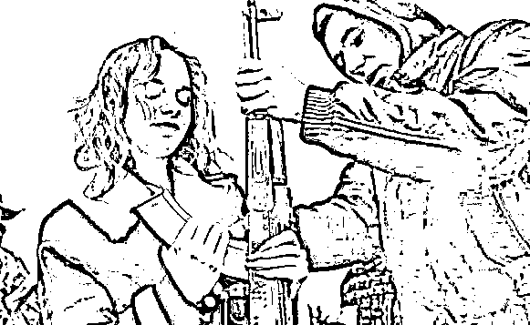

# 乌军黑客美人计，假扮美女网聊俄军送礼物，几天后炸弹上门

> 原文：[`mp.weixin.qq.com/s?__biz=MzIyMDYwMTk0Mw==&mid=2247543708&idx=5&sn=6e52d6d47cb5d2fe9df23f1806fa5491&chksm=97cbe0a4a0bc69b25f4bcd6f737496f04f60f9b93459132a4dbdf587e0315d88a38fd02f627b&scene=27#wechat_redirect`](http://mp.weixin.qq.com/s?__biz=MzIyMDYwMTk0Mw==&mid=2247543708&idx=5&sn=6e52d6d47cb5d2fe9df23f1806fa5491&chksm=97cbe0a4a0bc69b25f4bcd6f737496f04f60f9b93459132a4dbdf587e0315d88a38fd02f627b&scene=27#wechat_redirect)

  乌克兰使出美人计，假扮美女骗俄军网聊送礼物，几天后炸弹上门。我国的三十六计之中，有一个非常“香艳”的计谋，那就是美人计，这个计谋就是利用美女来套取敌军的情报，让敌军毁灭于美女的诱惑之下。乌克兰的一个黑客组织也学会了这一招，在虚拟的网络世界之中把自己伪装成美女，然后利用网聊的方式来诱惑俄军前线士兵，让他们在无意之中泄露前线的情报。乌克兰黑客的这一做法虽然有点像网络诈骗，但是他们的确为乌军获取了许多非常有价值的情报，并给俄军带来了不少麻烦。  

**乌克兰黑客使出美人计**

俄乌冲突爆发之后，乌克兰的一位黑客柯尼什特别想利用自己的黑客技术来帮助乌军，于是他成立了一个叫做“黑你妈妈”的黑客组织，并招募了三十多名黑客加入了该组织，来为乌军服务。这些黑客所采取的操作方式并不复杂，就是在各大社交聊天软件注册账号，并把自己伪装成俄控乌克兰地区的乌克兰美女。这些黑客主动锁定了俄军前线士兵的社交聊天账号，主动与他们搭讪，并有一些比较露骨的话语来挑逗他们。见这些俄军前线士兵上钩后，就不断让他们拍照来证明自己的身份，为了能够获得这些“乌克兰美女”的芳心，这些俄军前线士兵也是照做不误。

**俄士兵照片暴露位置**

在这些俄军前线士兵看来，他们所拍摄的照片似乎没有什么特别的，就只是给那些“乌克兰美女”证明自己的身份而已。但是对于那些专业的黑客来说，只要他照片当中的背景内容足够多，那么黑客就能通过电脑软件分析出俄军前线士兵所处的位置。俄军前线士兵看似无所谓的随手一拍，对于那些专业的黑客们来说，就是一张非常有用的情报，他们能从照片的细节当中分析出非常多的内容。所以每当这些俄军前线士兵把自己的照片发出去之后，要不了多久就会遭受到乌克兰的炮火袭击，让俄军前线部队蒙受巨大的损失，甚至是让发出照片的俄军前线士兵失去生命。

**网络攻击将常态化**

从某种上意义而言，乌克兰黑客利用社交聊天软件来诱骗俄军前线士兵，是一种升级版的网络攻击。这种网络攻击比那种传统网站攻击的方式具有更大的杀伤力，这种方式在一定程度上抓住了人性的弱点，让人们在不知不觉中把重要的情报泄露给了敌军。要想避免此类情况再次发生，俄军前线部队就应该进行内部整顿，禁止俄军前线士兵随意拍照，更不允许把这些照片发送给那些无关紧要的人。

来源：安全圈

欢迎关注灰产圈社群服务号

