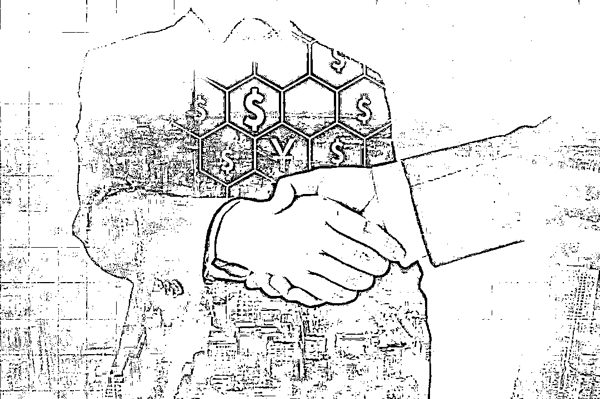
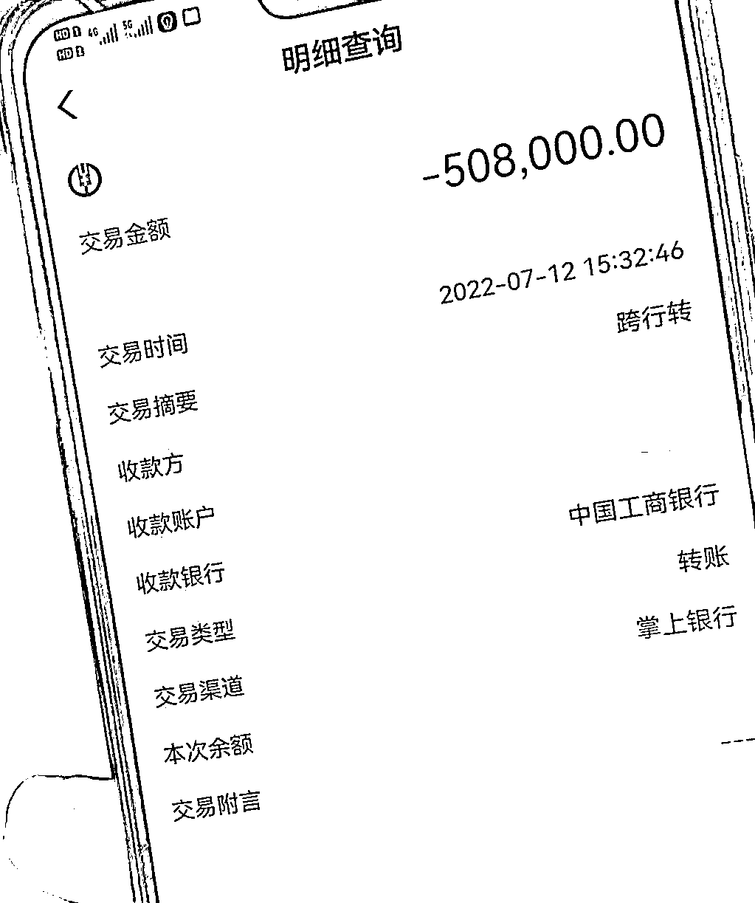
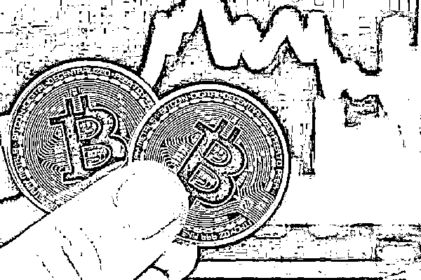

# 当面交易虚拟货币也可能被骗！诈骗新套路出现了…

> 原文：[`mp.weixin.qq.com/s?__biz=MzIyMDYwMTk0Mw==&mid=2247543708&idx=6&sn=9c785781406cdfe4c4aa8a0f7be9ba81&chksm=97cbe0a4a0bc69b2818c8e2b5cde77be98c14d947adb7c7a61483d8ef630a5db210b1af7eed1&scene=27#wechat_redirect`](http://mp.weixin.qq.com/s?__biz=MzIyMDYwMTk0Mw==&mid=2247543708&idx=6&sn=9c785781406cdfe4c4aa8a0f7be9ba81&chksm=97cbe0a4a0bc69b2818c8e2b5cde77be98c14d947adb7c7a61483d8ef630a5db210b1af7eed1&scene=27#wechat_redirect)

# 俗话说 

耳听为虚，眼见为实 

# 不少人在进行买卖时 

会选择线下当面交易 

毕竟“跑得了和尚跑不了庙” 

# 但是你以为这样就不会被骗了吗？

**眼见未必为真**

**当面交易也会翻车**

市民杨先生（化姓）是一位“炒币”老手，7 月初，杨先生听一位炒币朋友说，有人出售虚拟币，而且价格比交易平台上的低一点。心动的杨先生随即让朋友与卖家联系，让对方来乐清详谈。

7 月 12 日中午，杨先生与朋友一起到达“卖家”指定地点见面。正式交易前，杨先生想试下虚拟币是否真能到账，于是提出先交易 5 万元的虚拟币，“卖家”同意后杨先生将钱转入指定账户，很快他的“电子钱包”收到虚拟币。杨先生这时提出交易价值 10 万的虚拟币，但此时“卖家”要求要一次性全部购买。

见对方如此坚持，杨先生只好妥协了。**因为已经试交易过一次，而且是当面交易，杨先生比较放心**，于是一次性将 50.8 万元的钱款转至对方账户，要买下所有虚拟币。转款后杨先生催促“卖家”将对应虚拟币“转移”过来，但此时对方却以各种理由搪塞，迟迟不见行动，意识到不对劲的杨先生赶紧报案，警方一查竟发现，**所谓的“卖家”只是骗子在网上雇佣的“马仔”**。目前，案件正在进一步侦办中。

**骗子作案手法解析**

**第一步：**通过虚拟币投资群或投资网站扩散自己持有虚拟币的信息，以持有大量“虚拟币”引诱投资者上钩。

**第二步：**骗子通过“委托朋友”或雇佣“跑腿”假冒自己与受害人接触，通过当面“验资”增加受害人的信任度，实现受害人转账付款的目的。

**第三步：**付款后骗子通过密钥登录交易“电子钱包”，将验资后的虚拟币全部转移至自己账户或立即修改账户密码。

**第四步：**受害人迟迟等不到“虚拟币”到账信息，或无法登录账号，被拉黑才意识被骗。

近年来

随着境外虚拟货币市场不断波动

国内许多投资者纷纷幻想

通过炒币来赚取高额回报

殊不知骗子已精心策划好骗局

警方提醒 

**虚拟货币相关业务活动属于非法金融活动**

**投资虚拟货币不在法律保护范围内**

**请不要被“高收益”迷惑**

**更要小心交易时的“李鬼”骗局**

来源：乐清公安，巴蜀反诈

欢迎关注灰产圈社群服务号

