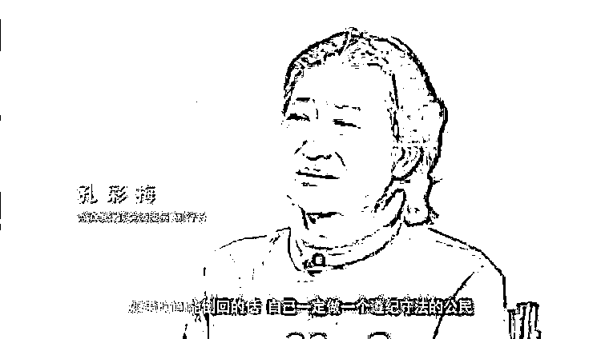
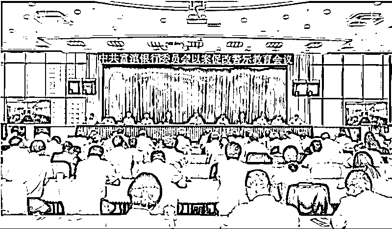

# 女副行长被双开：搞权色、钱色交易，与他人发生不正当性关系

> 原文：[`mp.weixin.qq.com/s?__biz=MzIyMDYwMTk0Mw==&mid=2247543708&idx=7&sn=d091bc84c1af872dde1e156cf78d04a7&chksm=97cbe0a4a0bc69b274d6e51c54b2d633fda81177611848bc6d3fe0adfc1b63326def60167b64&scene=27#wechat_redirect`](http://mp.weixin.qq.com/s?__biz=MzIyMDYwMTk0Mw==&mid=2247543708&idx=7&sn=d091bc84c1af872dde1e156cf78d04a7&chksm=97cbe0a4a0bc69b274d6e51c54b2d633fda81177611848bc6d3fe0adfc1b63326def60167b64&scene=27#wechat_redirect)

被查 7 个多月后，富滇银行原党委委员、副行长曹艳丽昨日（9 月 8 日）被开除党籍和公职。 

59 岁的曹艳丽，长期扎根云南金融系统，2008 年开始担任富滇银行副行长，2021 年 12 月被免职，今年 1 月 25 日被查。

云南省纪委监委 9 月 8 日通报，**曹艳丽被查出违规干预贷款发放，造成富滇银行巨额资金损失；为他人在贷款审批发放等方面谋取利益，收受巨额财物等。**

**此外，她还被查出****大搞权色、钱色交易，与他人发生不正当性关系****。**

曹艳丽。资料图

**担任副行长长达 13 年**

**免职一个月后被查**

公开资料显示，曹艳丽，1963 年 6 月生人，贵州习水人，中共党员，大专学历。

从工作履历来看，曹艳丽长期扎根云南金融系统，早间年曾在建行系统工作，先后在建行昆明市支行、昆明中山城市信用社、昆明城市合作银行、昆明市商业银行工作。

2008 年，曹艳丽获任富滇银行党委委员、副行长、工会主席，期间先后兼任丽江古城富滇村镇银行董事长、曲靖富源富滇村镇银行董事长、老中银行副董事长等职。

据官网介绍，富滇银行品牌创立于 1912 年，是拥有百年历史的老字号银行品牌。2007 年 12 月，富滇银行在原昆明市商业银行基础上重组成立，是云南省唯一的省属城市商业银行。截至 2021 年末，富滇银行资产规模 3174 亿元，171 家营业机构遍布云南省和重庆市，发起设立 4 家村镇银行，与老挝外贸大众银行合资设立老中银行，是全国第一家在境外设立合资银行的城市商业银行。 

2021 年 12 月，担任富滇银行副行长长达 13 年的曹艳丽被免职，时隔 1 个月被查。今年 1 月 25 日，云南省纪委监委发布消息：富滇银行原党委委员、副行长曹艳丽涉嫌严重违纪违法，目前正在接受纪律审查和监察调查。

就在曹艳丽被免职前一个月，富滇银行收了一张大罚单。2021 年 11 月 25 日，银保监会网站披露处罚信息，**因涉七项违法违规事实，富滇银行被云南银保监局罚款 220 万元。**

上述七项违法违规事实包括： 

*   授信管控严重不审慎，以“名单制管理”为由突破授信限额管控；

*   贴现资金管控不严，贴现资金回流出票人用于归还出票人他行贷款；

*   通过发放贷款兑付到期票据掩盖票据业务风险；

*   未经任职资格核准履行高级管理人员职责；

*   违规用表内授信承担资产证券化风险；

*   违规办理未竣工商业用房按揭贷款；

*   贷款支付管理与控制不到位，个人消费贷款流入资本市场、房地产市场。

**搞权色、钱色交易**

**违规干预贷款发放造成巨额资金损失**

时隔 7 个多月，云南省纪委监委公布了对曹艳丽审查调查结果：

*   开除党籍、开除公职处分；

*   收缴其违纪违法所得；

*   将其涉嫌犯罪问题移送检察机关依法审查起诉，所涉财物一并移送。

据通报，

*   **经查，曹艳丽党性原则丧失，宗旨意识全无，伪造、转移证据，对抗组织审查，参加迷信活动；**

*   **违规收受礼品礼金，违规出入私人会所，公车私用，违规接受旅游安排；**

*   隐瞒不报个人事项，在组织进行谈话、函询时不如实说明问题；

*   **违规获取董事经费，徇私情而忘公义，搞权色、钱色交易；**

*   **与他人发生不正当性关系；**

*   擅权妄为，违规干预贷款发放，造成富滇银行巨额资金损失；

*   将公权力当作攫取私利的工具，利用职务便利，为他人在贷款审批发放等方面谋取利益，收受巨额财物。

通报称，曹艳丽严重违反党的政治纪律、中央八项规定精神、组织纪律、廉洁纪律、工作纪律、生活纪律，构成严重职务违法并涉嫌犯罪，且在党的十八大后仍不收敛、不收手，甚至在党的十九大后仍不知止，性质严重，影响恶劣，应予严肃处理。

**共事女同僚涉贿逾三千万**

**老公也是贪官**

曹艳丽被查前，曾与她共事 10 年之久原副行长**孔彩梅**已落马。

孔彩梅。视频截图

孔彩梅出生于 1966 年， 也是长期在云南金融系统任职，2007 入职富滇银行工作，历任正义路支行行长、富滇银行行长助理、营业部总经理，最后升任富滇银行党委委员、副行长，与曹艳丽一个班子共事。2018 年 9 月 4 日在任上被查。

2019 年 6 月 5 日，中央纪委国家监委网站刊文披露了孔彩梅案详情。通报显示，孔彩梅任职期间，违规从事营利活动、违规收受红包礼金、私设“小金库”、违规审批贷款，还将自己筹来的资金进行高息借贷，“白天当银行行长，晚上作钱庄庄主”。

除了肆意侵吞国有资产外，孔彩梅还对家人、下属“飞扬跋扈”、“颐指气使”。**孔彩梅发现丈夫杨崇华出轨后，逼迫杨崇华砍手指发誓、写保证明志。在察觉杨崇华与李某有不正当男女关系后，孔彩梅指使恶势力犯罪人康某组织人员对李某进行人身伤害，以泄私愤。**

**孔彩梅长期将下属当佣人，有无偿提供家政服务的、有帮其购买奢侈品的、有帮助管理账户进行交易的、更有甚者还有代其跪拜做法事的**……许多下属长期被孔彩梅奴役，敢怒不敢言。

与曹艳丽一样，孔彩梅也频频参加迷信活动。为了求得内心宁静，孔彩梅曾去过昆明的真庆观、大理宾川的鸡足山以及青海、西藏等著名宗教景点敬香。2009 年 10 月，某活佛到昆明活动，孔彩梅赶到活佛驻地拜见，皈依到大师名下，取名为“江拥卓玛”。

除此之外，孔彩梅还带风水先生到办公室看风水、设佛龛、挂符咒，用公款非法印制宗教书籍，连鱼缸里鱼的颜色及条数都按大师的“点拨”布局。有时孔彩梅抽不开身，又不愿错过“良辰吉时”，就安排员工轮班到道观代替自己跪拜、做法事。

专案组查出违纪违法所得共计 3180 余万元。2019 年 7 月 ，孔彩梅（副厅级）涉嫌贪污罪、受贿罪、高利转贷罪、骗取贷款罪一案被提起公诉。在云南省纪委监委制作的警示教育片中，孔彩梅哭着表示：“很懊悔，如果时间能够倒回的话，一定做一个好女儿，一定做一个好母亲。”

**值得一提的是，被孔彩梅逼迫砍手指发誓的丈夫杨崇华，曾长期担任昆明农业发展投资有限公司党委书记、董事长，也是一名贪官。2019 年 6 月 12 日，昆明中院公开审理了杨崇华受贿案。昆明市检察院指控杨崇华受贿共计 417 万元。**

今年 6 月 28 日，富滇银行召开以案促改警示教育会议。

**割除毒瘤、清除毒源、肃清流毒　　**

接连两名副行长贪腐落马，引起了富滇银行领导层的高度重视。

今年 6 月 28 日，富滇银行党委聚焦曹艳丽典型案件和身边人身边事，召开以案促改警示教育会议，富滇银行党委班子成员、下辖领导班子成员和纪检条线负责人共计 662 人分别以线上线下方式参加会议。会上，富滇银行党委表示将深刻反思、痛定思痛，知耻后勇，以案促改，以壮士断腕之志和刀刃向内的决心坚决割除毒瘤、清除毒源、肃清流毒，全面修复净化政治生态、建设‘清廉富滇’。

会议通报 ，2019 年至 2021 年，富滇银行共处分问责 393 人次。参加会议的云南省纪委省监委第九审查调查室负责人提出指导意见，“要深刻汲取曹艳丽背离初心、信仰缺失，渎职滥权、任性用权，贪欲膨胀、以权谋私等教训，坚持问题导向，坚持警示教育，坚持从小抓起，聚焦关键环节、关键领域，强化监管，抓实以案促改、以案促治。”

来源：南方都市报（nddaily），世相研究所

欢迎关注灰产圈社群服务号

