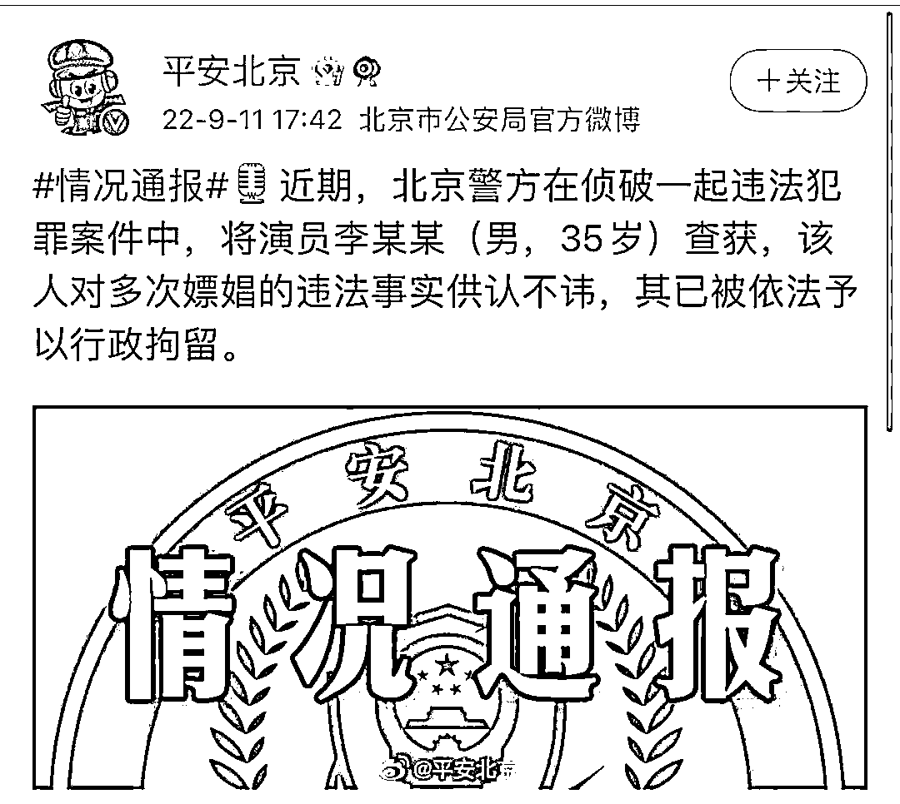

# 明星也缺女人？人大性学教授揭示什么样的男人最容易嫖娼！

> 原文：[`mp.weixin.qq.com/s?__biz=MzIyMDYwMTk0Mw==&mid=2247543761&idx=2&sn=05f19f57095ab17f0da1277d363d1861&chksm=97cbe0e9a0bc69ff3956ac31ebd6f3a9f3526c1e39e4755a1ddc830bab29d8b88bae61754116&scene=27#wechat_redirect`](http://mp.weixin.qq.com/s?__biz=MzIyMDYwMTk0Mw==&mid=2247543761&idx=2&sn=05f19f57095ab17f0da1277d363d1861&chksm=97cbe0e9a0bc69ff3956ac31ebd6f3a9f3526c1e39e4755a1ddc830bab29d8b88bae61754116&scene=27#wechat_redirect)

李易峰嫖娼被抓后，一些言论引起注意

> 微博上 6500 万粉丝，他都是大明星了，身边多少女人投怀送抱啊，为啥还要去嫖呢？
> 
> 网友评论

> 随便找个女朋友不就行了，不冲他这明星身份，就他这长相，女朋友难道还不好找？
> 
> 网友评论

> 你看看王思聪，身边多少个女朋友，一茬一茬的换，李易峰虽说没王思聪那么有钱吧，但这么多年拍戏下来，亿万身家总是有的吧？
> 
> 再加上他这颜值，这名气。
> 
> 如果他真想找女朋友，那能力绝对秒杀王思聪啊。
> 
> 网友评论

今天分享一篇我们曾经发布过的旧文，作者是中国人民大学性社会学研究所所长、社会学系教授、博士生导师，中国社会学会副秘书长潘绥铭。

**中国，究竟有多少“小姐”？**

**文/潘绥铭** 

**（现任中国人民大学性社会学研究所所长、社会学系教授、博士生导师，中国社会学会副秘书长）**

****01   ****男人接受性服务****

******1．发生率******

******在各种多伴侣性交中，收费的性服务（商业化的性交易、嫖娼卖淫）一直被认为是最容易传播艾滋病的。（尽管中国的预防工作在这方面投入得最少。）那么，社会实况究竟如何呢？******

<fieldset style="outline: 0px;max-width: 100%;min-width: 0px;border-width: 0px;border-style: initial;border-color: currentcolor;visibility: visible;box-sizing: border-box !important;overflow-wrap: break-word !important;">

******网络配图网络配图网络配图网络配图网络配图网络配图网络配图网络配图网络配图网络配图网络配图网络配图网络配图网络配图网络配图网络配图网络配图网络配图网络配图网络配图网络配图网络配图网络配图网络配图网络配图网络配图网络配图网络配图网络配图网络配图网络配图网络配图网络配图网络配图网络配图网络配图网络配图网络配图网络配图网络配图网络配图网络配图网络配图网络配图网络配图网络配图网络配图网络配图网络配图网络配图网络配图网络配图网络配图网络配图网络配图网络配图网络配图网络配图网络配图网络配图网络配图网络配图网络配图网络配图网络配图网络配图网络配图网络配图网络配图网络配图网络配图网络配图网络配图网络配图网络配图网络配图网络配图网络配图网络******

</fieldset>

******在 20－64 岁的男性总人口中，承认自己在一生中曾经与“性服务小姐”（暗娼、性工作者，以下简称为小姐）发生过性交合的人占 6.4％。******

******按照年龄组来看：******

******40 岁（含）以上的男人中，只有 1.5％的人这样做过；******

******而 39 岁（含）以下的男人中却达到 11.2％；******

******在 35 岁（含）以上的男人中，只有 3.6％的人这样做过；******

******而 35 岁以下的男人中却达到 11.9％；******

******其中最高的是 25－29 岁的人，高达 12.7％之多。******

******如果只看城市男性的话，那么******

******35 岁（含）以上的人里只有 5.5％接受过性服务；******

******而 35 岁以下的人里却有 12.5 之多，也就是大约 8 个男人里就有一个曾经接受过收费的性服务；******

******其中，25－29 岁的人也是最多，高达 16.5％，也就是大约 6 个男人里就有一个。******

********2．社会意义********

********这意味着什么呢？许多人可能又要大声疾呼“救救青年”或者愤怒声讨“男人有钱就变坏”。********

<fieldset style="outline: 0px;max-width: 100%;min-width: 0px;border-width: 0px;border-style: initial;border-color: currentcolor;box-sizing: border-box !important;overflow-wrap: break-word !important;">

********网络配图网络配图网络配图网络配图网络配图网络配图网络配图网络配图网络配图网络配图网络配图网络配图网络配图网络配图网络配图网络配图网络配图网络配图网络配图网络配图网络配图网络配图网络配图网络配图网络配图网络配图网络配图网络配图网络配图网络配图网络配图网络配图网络配图网络配图网络配图网络配图网络配图网络配图网络配图网络配图网络配图网络配图网络配图网络配图网络配图网络配图网络配图网络配图网络配图网络配图网络配图网络配图网络配图网络配图网络配图网络配图网络配图网络配图网络配图网络配图网络配图网络配图网络配图网络配图网络配图网络配图网络配图网络配图网络配图网络配图网络配图网络配图网络配图网络配图网络配图网络配图网络配图网络配图网络********

</fieldset>

********可是，首先请不要忘记：作为一般女性，男客（找过小姐的男人、男客）的妻子或者女同居者，再次传播给其他男人的可能性只有 5.5％。********

********其次，请不要忘记：男客们不仅可能把艾滋病带回家来，更可能传播给性服务小姐。否则，那些刚刚走出农村的、小到未成年的、往往是在性产业里被“开处”的“小姐”，她们的艾滋病难道是从天上掉下来的？为什么我们总是更容易把她们看是第一传播源，而不是第一受害者？********

********第三，男客里，谁更加危险？是那些“大款”。********

********按照主要职业来分类，在那些形形色色的男性厂长、经理、老板们当中，接受过性服务的比例是最高的。他们这样做的可能性，是城市中的男性体力劳动工人的 10 倍，是各种农村男劳动者的 22 倍！可是，他们肯定会觉得冤枉，因为其中许多情况是为了“应酬”。那么谁被“应酬”了呢？恐怕更多的是那些可以出租权力的人。********

********这些男人之所以更加危险，还不仅仅在于他们“先嫖起来”；更在于他们同时最可能成为性传播的最主要的“桥梁人群”。这是因为，他们更容易倚权杖势地与更多的“二奶”、“小蜜”、“情人”发生性交；甚至可以更容易地和更多地强奸手下的各种女性。这种“性的阶级霸权”表现为：他们平均有过 6.41-6.27 个其他性伴侣，是工人的 1.95-2.60 倍，是农民的 2.87-3.37 倍。********

**********3.接受性服务的详细情况**********

**********在男人们所找过的小姐当中，有 13.7％的女性是“二奶”，而不是标准的性服务小姐。**********

**********调查数据还表明：在那些接受过性服务的男人里，有 39.2％的人是发生在调查之前 3 个月以内，在 6 个月之内的占 50.0％，在一年之内的占 71.6％，在 5 年之内的占 88.5％。**********

**********也就是说，在 1998 年 8 月－2000 年 8 月之内，中国性产业曾经出现了急剧的增长，比此前 5 年之内的规模扩大了 4 倍还多，比自从性产业重现以来的规模也扩大了 2.5 倍。**********

**********从找过几个小姐来看，在男客中，有 23.3％的人只与一个小姐性交过；有 65.8％的人是与两个到五个小姐；还有 10.8％的则是超过五个。此外，在调查之前的 3 个月里，在与小姐性交过的男人里，有 38.8％的人只有过一次；有 34.0 ％的人是有过多次，还有 27.3％的人则是发生在 3 个月之前。**********

**********这说明：一旦男人“开了戒”，与小姐性交过，他们往往不会仅仅一次就罢手，但也不是多多益善，而是倾向于找 2－5 个小姐。他们与小姐性交的频率也并不高，在 3 个月里可能超过一次，但也不会是很多次。这里面的原因再简单不过：小姐是要收费的；小姐也不是随叫随到的；找小姐毕竟还是有风险的；因此再疯狂的男人，也不大可能单靠小姐来解决自己的日常的性需求。**********

**********按照中位数来看，那些与小姐性交过的男人，第一次是发生在自己大约 29 岁的时侯；小姐则是大约 23 岁。这些男人与小姐性交过的总次数大约在 1 次以上 5 次以下。**********

**********那么他们是在什么样的场所里找到小姐的呢？其中：**********

**********31.6％的男客是在歌舞厅里找到小姐的；**********

**********15.4％是在发廊或者按摩场所里；**********

**********14.2％是在各种旅馆里；**********

**********5.3％是在大街上；**********

**********31.1％的人则是在其他类型的地方。**********

**********这与我们一般人对于性产业的感性认识是一致的：歌舞厅、发廊、按摩和旅馆是小姐们最主要的营业场所。**********

**********还有，这些场所是在本地还是在外地呢？在这些男客中：**********

**********26.0％的人是在本市的市区找到小姐的；**********

**********25.1％的人是在本市的郊区；**********

**********40.9％的人是在本省的其他城市；**********

**********8.0％则是在外省。**********

**********也就是说，有一半人是在本市范围之内，在自己的家门口找小姐的。这一点很重要。**********

**********按照社会上的一般看法，女性们往往是在丈夫或者男朋友出远门的时候，尤其是去那些被认为性产业非常发达的地区（例如海南等地），才格外担心他可能找小姐。可是我们发现：其实就在家门口找小姐的并不少；或者说这种事情已经是防不胜防了。**********

**********这当然是因为性产业已经遍地开花了。就这些找过小姐的男人而言，在他们自己居住的城市里，有“红灯区”（公开而且集中的性产业地带）的并不多，只占 37％左右。可是本市就有各种形式的性产业的却高达 98.3％，而且有 71％是中等规模，27％是大规模。这些性产业有 56％是在各种歌舞厅里，有 33％是在发廊或者按摩场所里。**********

**********尤其是，在 57％的城市里，当地男性居民的多数都知道本地的性产业的一般情况；还有 35％的城市则是少数男性居民知道。此外，在我们调查的时候，只有 15％左右的城市目前正在扫黄。也就是说，如果当地的男性居民们，既知道性产业的存在，又知道目前没有扫黄，那么他们找小姐的比例要是不增加那才怪呢。**********

**********根据 logist 回归分析的结果（具体过程从略），我们可以非常清楚地看到：**********

**********所在城市的性产业越发达，当地男人找小姐的也就越多；**********

**********即使在相同年龄的男人中间，如果当地有红灯区，那么男人找小姐的可能性就会增加 8.3 倍；**********

**********如果有性产业存在，则会增加 18.1 倍。**********

************02   ****谁更容易找“小姐”？************

********在一般舆论中，男人找小姐似乎是“本性难移”，甚至有许多人相信：每一个男人都会找小姐的，只不过因为要花钱、有风险和可能的性病，才有些男人不去做。********

********这无疑是片面的。我们通过 logist 回归发现以下一些情况（具体过程从略）。********

**********1．什么样的男人最容易找小姐？**********

********首先，男人是否与小姐性交过，最主要的因素是他是不是经常单独外出（在外面过夜的才算）。与那些从来没有外出过的男人相比，外出 1－3 个月的男人，找小姐的可能性是前者的 6.6 倍；外出超过 6 个月的则是 7.2 倍。********

********与此相类似的是：社会交往越多的男人，找小姐的也就越多。每周社交 2－3 次的男人，与那些从来也不社交的人相比，找小姐的可能性增加 4.5 倍。********

********还有类似的情况：抽烟多的男人，找小姐的也多，是不抽烟的男人的 2.7－2.9 倍。这可能是因为抽烟多少与社交多少直接相关。********

********但是，我们必须把这三个因素综合起来看，才能发现问题的实质。男人找小姐，并不是仅仅是因为他们的机会多（单独外出过夜多），还要看他们的人际交往能力如何（经常社交可以培养这种能力）。这是因为，找小姐并不是像到商店里买东西那么简单，更不那么容易；因为这毕竟是一种人际交往。有些男人是因为“没本事”才没有去做，而不是因为“没胆量”和没机会。********

********其次，我们发现：“近朱者赤，近墨者黑”是第二位的因素。在男人所居住的社区里，找小姐的人越多，他自己也去找小姐的可能性就会越大。具体来说就是：社区里接受过异性按摩的其他男人每增加一个百分点，自己找小姐的可能性也就随之增加 17％；社区里找过小姐的其他人每增加一个百分点，则自己也这样做的可能性就会增加 32％。********

********这也是一个重要的发现。它说明：现在的男人越来越变成一种“社区人”了，既不是以前的“单位人”，也不是真正的“社会人”。********

********第三，我们发现，居住在县城与县级市里的男人，找小姐的可能性最大。就这一点而言，他们是农村男性居民的 6.1 倍。可是地级城市里的男居民却只是他们的 37％，省会以及直辖市的男居民只是他们的 33％。********

********这里面的原因会有很多。我们初步分析觉得，最主要的是因为：县城里的性产业虽然不见得比大城市多（当然也不见得就少），但是扫黄一般却没有大城市里那么厉害。再加上县城的地域比较小，信息流通多而快；因此哪怕是到城市郊区去找小姐，也不会像大城市里那么困难。********

********第四个因素是年龄。从 20 岁往上，男人每老 5 岁，找小姐的可能性就会降低 29％。********

********第五位的因素是：与未婚的男青年相比，那些再婚的男人们，找小姐的可能性增加 4 倍。人们通常认为，未婚男人由于没有地方“发泄”，因此找小姐的就会更多。可是我们的调查推翻了这个说法。********

********第六位的因素是男人自己的文化程度高低。这呈现为一种上下坡的曲线：没上过学的男人只有 0.5％的人找过小姐；小学与初中的男人也只有 4.8％－4.2％；但是高中文化的男人中却高达 17.1％之多；随后，在大专和大学文化的男人里，有下降为 6.3％－5.7％。********

********这可能是因为：文化太低的男人既没有那么开放，也没有那么多奢求；而文化很高的男人，或者是其他机会更多，或者是“洁癖”更重。所以处于两者之间的高中文化的男人就凸现出来了。********

********以上我们说的都是发挥了显著作用的各个因素。还有一些因素没有显著的作用，但是却具有非常重要的意义。********

********例如，人们一般都认为，性欲越强的男人，找小姐的可能性当然也就越大。可是实际上并不是这样的。只有那些从来也不想过性生活的男人们，找小姐的可能性近乎于零。其他的男人，不管他们是每个月一次、每个星期一次、每天一次想性，还是每天想性好几次，找小姐的可能性都相差无几，不能干出显著的差异。********

********这一点与我们前面分析过的社交的作用强大是一样的道理，都说明“找小姐”并不象人们所想象的那样，仅仅是一种生理化的简单行为。它实际上也是一种需要相当大的能力的人际交往活动。********

**********2．什么样的丈夫最可能找小姐？**********

********首先，看来男人结婚不结婚都差不多一样，因为在所有男人中发挥了最大作用的那三大因素――单独外出时间、社区里找小姐的男人的比例、男人自己的社会交往频率；在丈夫里面也同样发挥着第一位、第三位和第四位的作用。具体来说，丈夫如果单独外出 1－3 个月，那么找小姐的可能性就是那些从来也不单独外出的丈夫的 14.8 倍。社区里其他男人找小姐的比例每上升一个百分点，自己的可能性也就增加 30％。那些社交最频繁的丈夫们，找小姐的可能性是从不社交者的 9.3 倍。也就是说，结婚这件事，并不能自然而然地阻止丈夫去找小姐。********

********其次，夫妻之间的爱情才是最可靠的保障。与那些感情已经破裂或者很不好的夫妻相比，如果双方的感情比较深或者很深，那么丈夫找小姐的可能性就只有前者的 6％。老百姓说的“苍蝇不叮没缝的蛋”就是这个道理。********

********第三，人们在讨论已婚的男人为什么还要找小姐的时侯，往往会出现一种性别差异：男人们多半会想到，可能是因为夫妻性生活不好；可是女人们一般不这样想，也很难同意。这是正常现象，因为在目前的中国社会里，性生活，尤其是性技巧，往往是男人们主导的，因此男人会认为它意义重大，而被导的女人们则不大可能这样看待它。********

********但是我们在分析已婚男人找小姐的原因时却发现：夫妻之间的性技巧非常显著地发挥着第三位的作用。********

********第四位的因素是一个人们一般想不到的情况：如果在夫妻性生活里，丈夫觉得自己是勉强在过，那么与那些不觉得勉强的丈夫相比，他们找小姐的可能性就会增加到 3.4 倍。********

********这是一个很容易引起一些人愤怒的发现。他们通常都认为，男人就是一种“性的永动机”，对性永远都是求之不得，哪里有什么勉强可言！可惜，我们的调查表明：在已婚男性中，确实有 30.1％的人认为自己曾经被勉强过；有 23.2％有时被勉强；还有 2.0 是经常被勉强；只有 44.7％的丈夫是“合格的男子汉”，认为自己从来也没有被勉强过。也就是说，多少被勉强过的丈夫一共是 55.3％，超过了半数。********

********我们在这里不打算讨论丈夫为什么会觉得自己被勉强了；因为我们检索文献之后才发现，古今中外的大小学者们几乎都对此三缄其口或者不知所云。我们只想强调一下：这确实是一个问题，而且居然会显著地增加丈夫找小姐的可能性，而且是排列在第四位重要的因素。********

********以上说的是发挥了显著作用的因素，可是请不要忽视了那些没有显著作用的因素，那里面也有许多有意思的情况――许多人们通常认为一定是非常重要的因素，实际上并不是那么回事。例如，夫妻之间的体贴与亲昵是多还是少、做家务谁多、是不是打架和吃醋、夫妻性生活的次数是多还是少、丈夫们自己的性欲是强还是弱、性高潮多不多、性生活是不是满意等等因素，其实都没有对丈夫找不找小姐这件事产生显著的影响。********

********也就是说，在这些事情上，夫妻们不论做得好还是坏，可能影响其他方方面面，却不会显著地增加或者减少丈夫找小姐的可能性。********

********来源：新洞察********

****************

********欢迎关注灰产圈社群服务号********

****************

****************